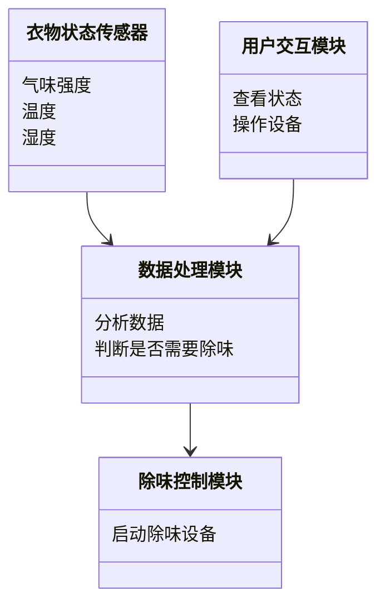
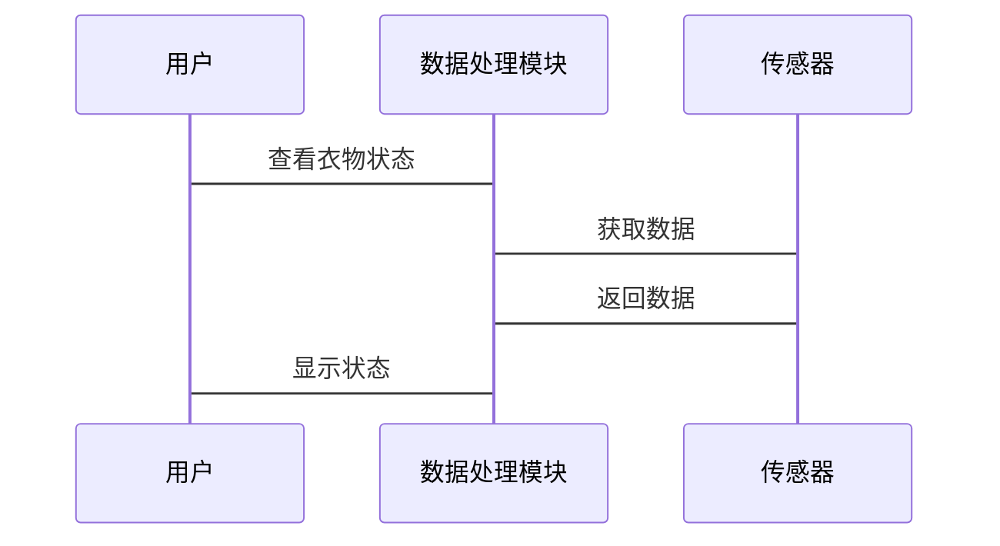

                 


# 智能衣架：AI Agent的衣物除味系统

> 关键词：AI Agent，智能衣架，衣物除味，物联网，智能家居

> 摘要：本文探讨了AI Agent在智能衣架衣物除味系统中的应用，从问题背景到系统设计，再到算法实现和项目实战，详细阐述了如何利用AI技术解决衣物除味问题，构建了一个智能化的衣物管理解决方案。

---

# 第1章: 智能衣架的背景与问题背景

## 1.1 传统衣物除味问题的挑战

### 1.1.1 衣物异味的形成原因
衣物在日常使用中容易吸附空气中的异味，如烟味、汗味等，这些异味不仅影响衣物的清洁度，还可能对人体健康造成潜在影响。传统除味方法包括使用香薰剂、活性炭等，但这些方法存在除味不彻底、效率低下等问题。

### 1.1.2 传统除味方法的局限性
- **除味不彻底**：传统除味方法只能掩盖异味，无法根除。
- **效率低下**：需要长时间放置才能有效，且效果不稳定。
- **用户体验差**：传统方法通常需要手动操作，用户体验较差。

### 1.1.3 消费者对智能除味的需求
随着智能家居的普及，消费者对智能化、自动化的衣物除味系统需求日益增长。消费者希望有一个高效、智能、便捷的除味解决方案。

---

## 1.2 AI Agent技术的引入

### 1.2.1 AI Agent的基本概念
AI Agent（人工智能代理）是一种能够感知环境并采取行动以实现目标的智能体。它能够通过传感器获取信息，利用算法进行决策，并通过执行器与环境交互。

### 1.2.2 AI Agent在智能家居中的应用
AI Agent在智能家居中的应用广泛，包括智能音箱、智能灯泡、智能空调等。AI Agent能够通过学习用户习惯，提供个性化的服务。

### 1.2.3 AI Agent如何解决衣物除味问题
AI Agent可以通过传感器感知衣物状态，结合历史数据和环境信息，智能判断是否需要除味，并启动相应的设备进行除味操作。

---

## 1.3 智能衣架的定义与目标

### 1.3.1 智能衣架的定义
智能衣架是一种结合了AI Agent和物联网技术的智能设备，能够通过传感器感知衣物状态，并利用AI算法实现衣物的智能除味。

### 1.3.2 智能衣架的核心目标
- 提供高效的衣物除味服务。
- 实现智能化、自动化的衣物管理。
- 提升用户体验。

### 1.3.3 智能衣架的市场定位
智能衣架的目标用户是对衣物除味有较高需求的消费者，尤其是在空气质量较差的地区或有特殊需求的用户。

---

## 1.4 本章小结
本章介绍了智能衣架的背景与问题背景，分析了传统衣物除味方法的局限性，并探讨了AI Agent技术在智能衣架中的应用，明确了智能衣架的核心目标和市场定位。

---

# 第2章: AI Agent的基本原理

## 2.1 AI Agent的核心概念

### 2.1.1 AI Agent的定义与分类
AI Agent可以分为简单反射型、基于模型的反应型、目标驱动型和效用驱动型。简单反射型AI Agent通常用于简单的任务，而目标驱动型AI Agent则适用于复杂的任务。

### 2.1.2 AI Agent的基本组成
AI Agent通常由感知模块、决策模块和执行模块组成。感知模块负责获取环境信息，决策模块负责制定行动计划，执行模块负责执行决策。

### 2.1.3 AI Agent与传统AI的区别
AI Agent具有自主性、反应性和社会性，能够根据环境动态调整行为，而传统AI通常是在特定任务下进行静态处理。

---

## 2.2 AI Agent的感知与决策机制

### 2.2.1 感知模块的功能与实现
感知模块通过传感器获取环境信息，如温度、湿度、气味等。AI Agent利用这些信息进行状态判断。

### 2.2.2 决策模块的算法原理
决策模块基于感知到的信息，结合历史数据和环境信息，利用机器学习算法进行决策。常用的算法包括随机森林、支持向量机等。

### 2.2.3 感知与决策的协同工作
感知模块提供环境信息，决策模块根据这些信息制定行动计划，并通过执行模块执行。

---

## 2.3 AI Agent的通信与交互

### 2.3.1 物联网通信协议
智能衣架可以通过Wi-Fi、蓝牙等通信协议与智能家居设备进行交互。

### 2.3.2 AI Agent与设备的交互流程
AI Agent通过传感器获取衣物状态，判断是否需要除味，然后通过通信协议启动除味设备。

### 2.3.3 通信中的数据安全问题
AI Agent在通信过程中需要确保数据的安全性，防止数据泄露和恶意攻击。

---

## 2.4 本章小结
本章详细介绍了AI Agent的基本原理，包括其核心概念、感知与决策机制以及通信与交互。AI Agent在智能衣架中的应用为衣物除味提供了智能化的解决方案。

---

# 第3章: 智能衣架的系统功能设计

## 3.1 系统功能模块划分

### 3.1.1 数据采集模块
数据采集模块负责采集衣物的状态信息，如气味强度、温度、湿度等。

### 3.1.2 数据处理模块
数据处理模块对采集到的数据进行分析和处理，判断是否需要启动除味功能。

### 3.1.3 除味控制模块
除味控制模块根据数据处理模块的判断结果，启动相应的除味设备。

### 3.1.4 用户交互模块
用户交互模块提供人机交互界面，用户可以通过界面查看衣物状态和操作设备。

---

## 3.2 系统功能流程图

### 3.2.1 数据采集流程
1. 传感器采集衣物状态信息。
2. 数据采集模块将数据传输到数据处理模块。

### 3.2.2 数据处理流程
1. 数据处理模块分析数据，判断是否需要除味。
2. 数据处理模块将判断结果传输到除味控制模块。

### 3.2.3 除味控制流程
1. 除味控制模块启动除味设备。
2. 设备执行除味操作。

### 3.2.4 用户交互流程
1. 用户通过界面查看衣物状态。
2. 用户可以手动启动或停止除味功能。

---

## 3.3 系统功能的实现方式

### 3.3.1 数据采集的传感器选择
常用的传感器包括气体传感器、温度传感器和湿度传感器。

### 3.3.2 数据处理的算法实现
数据处理模块可以采用机器学习算法，如支持向量机（SVM）和随机森林（Random Forest）。

### 3.3.3 除味控制的执行机构
除味设备可以采用紫外线灯、臭氧发生器等。

### 3.3.4 用户交互的界面设计
用户交互界面可以通过手机APP或智能家居中枢实现。

---

## 3.4 本章小结
本章详细介绍了智能衣架的系统功能设计，包括功能模块划分、流程设计和实现方式。系统设计为智能衣架的实现提供了理论基础。

---

# 第4章: 智能衣架的算法实现

## 4.1 数据采集与预处理算法

### 4.1.1 传感器数据的采集方法
传感器数据的采集需要确保数据的准确性和实时性。

### 4.1.2 数据预处理的步骤与方法
数据预处理包括数据清洗、归一化和特征提取。

### 4.1.3 数据特征的提取与分析
通过分析数据特征，可以找到影响衣物除味的主要因素。

---

## 4.2 基于AI的除味算法

### 4.2.1 算法的基本原理
除味算法基于机器学习模型，通过训练数据预测衣物是否需要除味。

### 4.2.2 算法的实现步骤
1. 数据采集与预处理。
2. 数据特征提取与选择。
3. 模型训练与优化。
4. 模型部署与应用。

### 4.2.3 算法的优化与改进
通过调整模型参数和优化算法，提高模型的准确性和效率。

---

## 4.3 算法的实现与测试

### 4.3.1 算法的实现流程
1. 确定算法目标。
2. 数据采集与预处理。
3. 模型训练与验证。
4. 模型部署与测试。

### 4.3.2 算法的测试方法
测试方法包括交叉验证和性能评估。

### 4.3.3 算法的性能评估
性能评估指标包括准确率、召回率和F1值。

---

## 4.4 本章小结
本章详细介绍了智能衣架的算法实现，包括数据采集与预处理、除味算法的设计与优化。算法实现为智能衣架的智能化提供了技术支持。

---

# 第5章: 智能衣架的系统架构设计

## 5.1 问题场景介绍
智能衣架需要在复杂的环境中实现衣物的智能化管理，包括传感器数据采集、数据处理、除味控制和用户交互。

---

## 5.2 项目介绍

### 5.2.1 项目目标
本项目旨在开发一种智能化的衣物除味系统，解决传统除味方法的局限性。

### 5.2.2 项目范围
项目范围包括硬件设计、软件开发和系统集成。

---

## 5.3 系统功能设计

### 5.3.1 领域模型（Mermaid类图）


---

## 5.4 系统架构设计（Mermaid架构图）


---

## 5.5 系统接口设计

### 5.5.1 数据接口
数据接口包括传感器数据接口和设备控制接口。

### 5.5.2 用户接口
用户接口包括手机APP和智能家居中枢。

---

## 5.6 系统交互设计（Mermaid序列图）



---

## 5.7 本章小结
本章详细介绍了智能衣架的系统架构设计，包括问题场景、项目介绍、系统功能设计和系统架构设计。系统架构设计为智能衣架的实现提供了技术保障。

---

# 第6章: 智能衣架的项目实战

## 6.1 环境安装

### 6.1.1 硬件环境
硬件环境包括传感器、控制器和通信模块。

### 6.1.2 软件环境
软件环境包括操作系统、开发工具和机器学习框架。

---

## 6.2 系统核心实现源代码

### 6.2.1 数据采集模块
```python
import serial

ser = serial.Serial('COM3', 9600)

def get_sensor_data():
    data = ser.readline().decode().strip()
    return data
```

### 6.2.2 数据处理模块
```python
from sklearn.svm import SVC

model = SVC()
model.fit(X_train, y_train)
```

### 6.2.3 除味控制模块
```python
import RPi.GPIO as GPIO

GPIO.setmode(GPIO.BCM)
GPIO.setup(18, GPIO.OUT)

def activate_uv():
    GPIO.output(18, GPIO.HIGH)
```

---

## 6.3 代码应用解读与分析

### 6.3.1 数据采集模块的实现
数据采集模块通过串口与传感器通信，获取衣物状态数据。

### 6.3.2 数据处理模块的实现
数据处理模块利用机器学习模型对数据进行分类，判断是否需要除味。

### 6.3.3 除味控制模块的实现
除味控制模块通过GPIO控制紫外线灯，启动除味设备。

---

## 6.4 实际案例分析

### 6.4.1 案例背景
某用户使用智能衣架系统，传感器检测到衣物上有烟味，系统启动除味设备。

### 6.4.2 系统执行过程
1. 传感器检测到烟味。
2. 数据处理模块判断需要除味。
3. 除味控制模块启动紫外线灯。
4. 紫外线灯工作，去除异味。

---

## 6.5 本章小结
本章通过项目实战展示了智能衣架的实现过程，包括环境安装、代码实现和案例分析。项目实战验证了智能衣架系统的可行性和有效性。

---

# 第7章: 总结与展望

## 7.1 总结
本章总结了智能衣架系统的实现过程，包括系统设计、算法实现和项目实战。智能衣架通过AI Agent和物联网技术，实现了衣物的智能化管理。

---

## 7.2 注意事项
在实际应用中，需要注意数据安全和设备维护。

---

## 7.3 拓展阅读
读者可以进一步阅读关于AI Agent和物联网技术的书籍，深入学习相关知识。

---

# 作者：AI天才研究院/AI Genius Institute & 禅与计算机程序设计艺术 /Zen And The Art of Computer Programming

---

**本文完。**

