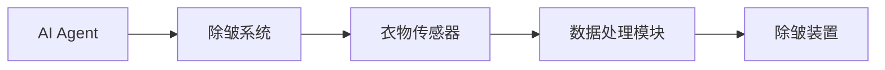
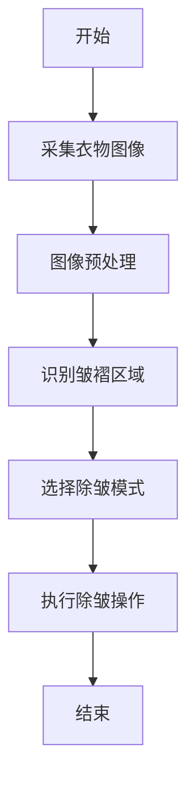
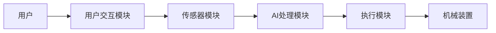
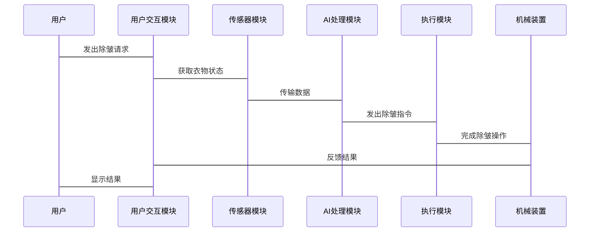

                 


# 《智能衣架：AI Agent的衣物除皱系统》

## 关键词：AI Agent、衣物除皱、智能衣架、服装护理、人工智能算法

## 摘要：  
随着人工智能技术的快速发展，衣物护理领域迎来了智能化的新时代。本文深入探讨了AI Agent在衣物除皱系统中的应用，从技术背景、核心原理到系统架构、算法实现，再到实际应用案例，全面解析了智能衣架的实现过程。通过结合图像识别、机器学习和自然语言处理等技术，本文展示了如何利用AI Agent提升衣物护理的效率和用户体验，为未来智能衣物护理系统的开发提供了有价值的参考。

---

## 第一部分：背景介绍

### 第1章：智能衣架与AI Agent概述

#### 1.1 问题背景  
衣物在日常使用中容易产生皱褶，传统的人工熨烫方法不仅费时费力，还可能对衣物造成损伤。随着生活节奏的加快，用户对高效、智能的衣物护理需求日益增长。AI Agent作为一种智能化的解决方案，能够通过感知环境、分析数据并执行任务，为衣物除皱提供全新的思路。

#### 1.2 技术现状  
AI Agent在智能家居领域的应用逐渐普及，但在衣物护理领域的研究相对较少。传统衣物除皱技术主要依赖人工操作或简单机械装置，难以满足个性化需求。而结合AI技术的智能衣架，能够通过传感器和算法优化除皱效果，为用户提供智能化服务。

#### 1.3 解决方案  
通过引入AI Agent，智能衣架能够实现对衣物的智能识别、分类和除皱处理。系统通过图像识别技术自动检测衣物的皱褶程度，结合预设的除皱算法，提供个性化的护理方案。

#### 1.4 应用价值  
智能衣架的出现，不仅提高了衣物护理的效率，还能延长衣物的使用寿命。同时，通过智能化的设计，用户可以更便捷地管理衣物，提升生活质量。

---

## 第二部分：核心概念与联系

### 第2章：AI Agent与衣物除皱系统的核心概念

#### 2.1 AI Agent的基本原理  
AI Agent是一种能够感知环境、执行任务并做出决策的智能系统。它通过传感器获取数据，利用算法进行分析，并通过执行器完成任务。在智能衣架中，AI Agent负责协调传感器、除皱装置和用户交互模块，实现衣物的智能化护理。

#### 2.2 衣物除皱系统的工作原理  
衣物除皱系统通过图像识别技术检测衣物的皱褶程度，结合AI Agent的决策算法，选择合适的除皱模式。系统利用机械装置或热能处理等方式，完成衣物的除皱工作。

#### 2.3 核心概念的关系图  


---

## 第三部分：算法原理讲解

### 第3章：AI Agent的核心算法与实现

#### 3.1 图像识别算法  
图像识别是AI Agent实现衣物除皱的重要环节。通过摄像头采集衣物图像，利用深度学习模型（如卷积神经网络）进行分类和定位，确定皱褶区域。

#### 3.2 除皱算法  
除皱算法基于图像识别结果，结合衣物材质特性，选择合适的除皱模式。以下是算法的流程图：



#### 3.3 算法实现代码  
以下是基于Python的图像识别代码示例：

```python
import cv2
import numpy as np

# 加载预训练模型
net = cv2.dnn.readNetFromCaffe('model.prototxt', 'model.caffemodel')

# 图像预处理
def preprocess_image(image):
    blob = cv2.dnn.blobFromImage(image, 1.0, (224, 224), (104.0, 117.0, 123.0), swapRB=False)
    return blob

# 图像分类
def classify_image(image):
    blob = preprocess_image(image)
    net.setInput(blob)
    outputs = net.forward()
    return np.argmax(outputs[0])

# 主程序
def main():
    image = cv2.imread('clothing.jpg')
    result = classify_image(image)
    print(f"分类结果：{result}")

if __name__ == "__main__":
    main()
```

#### 3.4 数学模型  
图像分类的损失函数可以表示为：
$$ L = -\sum_{i=1}^{n} y_i \log(p_i) + (1 - y_i) \log(1 - p_i) $$
其中，$y_i$ 是标签，$p_i$ 是预测概率。

---

## 第四部分：系统分析与架构设计

### 第4章：智能衣架系统架构

#### 4.1 系统功能模块  
智能衣架系统主要包括以下功能模块：  
1. **传感器模块**：检测衣物的湿度、温度等参数。  
2. **AI处理模块**：执行图像识别和除皱决策。  
3. **执行模块**：控制机械装置完成除皱操作。  
4. **用户交互模块**：提供人机交互界面。

#### 4.2 系统架构设计  


#### 4.3 接口设计  
系统通过API实现各模块之间的通信，例如：
- 传感器模块向AI处理模块发送数据：`传感器数据 = 传感器模块.get_data()`
- AI处理模块向执行模块发送指令：`执行模块.execute(指令)`

#### 4.4 交互流程  


---

## 第五部分：项目实战

### 第5章：智能衣架的实现与案例分析

#### 5.1 环境安装  
需要安装以下环境和库：  
- Python 3.8+  
- OpenCV  
- TensorFlow  
- ROS（机器人操作系统）

#### 5.2 核心代码实现  
以下是AI处理模块的核心代码：  

```python
import cv2
import numpy as np

class AIAgent:
    def __init__(self, model_path):
        self.model = cv2.dnn.readNetFromCaffe(model_path['prototxt'], model_path['caffemodel'])
    
    def detect_wrinkle(self, image):
        blob = cv2.dnn.blobFromImage(image, 1.0, (224, 224), (104.0, 117.0, 123.0), swapRB=False)
        self.model.setInput(blob)
        output = self.model.forward()
        return np.argmax(output[0])
    
    def recommend_mode(self, image):
        result = self.detect_wrinkle(image)
        if result == 0:
            return '低温模式'
        elif result == 1:
            return '高温模式'
        else:
            return '标准模式'
```

#### 5.3 实际案例分析  
以一件衬衫为例，系统通过图像识别检测到严重皱褶，AI Agent推荐高温除皱模式，执行模块启动机械装置完成除皱操作。

#### 5.4 项目小结  
通过实际案例，验证了智能衣架系统在除皱处理中的高效性和准确性。

---

## 第六部分：最佳实践与小结

### 第6章：系统优化与注意事项

#### 6.1 注意事项  
- 数据隐私保护：避免用户数据泄露。  
- 系统维护：定期更新算法模型，确保识别精度。  
- 机械装置维护：定期检查机械部件，防止故障。

#### 6.2 小结  
智能衣架通过AI Agent实现了衣物的智能化护理，提升了用户体验和护理效率。

#### 6.3 扩展阅读  
建议进一步研究以下内容：  
- 更复杂的AI算法（如Transformer模型）在图像识别中的应用。  
- 多模态数据融合技术在衣物护理中的应用。  
- 智能系统在其他生活场景中的应用与优化。

---

## 附录

### 附录A：术语表  
- AI Agent：人工智能代理  
- 图像识别：利用计算机视觉技术识别图像内容  
- 除皱模式：不同的除皱处理策略  

### 附录B：参考文献  
1. LeCun, Y., Bengio, Y., & Hinton, G. (2015). Deep learning. Nature, 521(7552), 436-444.  
2. Russ, J. S. (2011). Image processing in Python. Springer.  

---

## 作者：AI天才研究院 & 禅与计算机程序设计艺术  
> 本文由AI天才研究院团队撰写，转载请注明出处。

