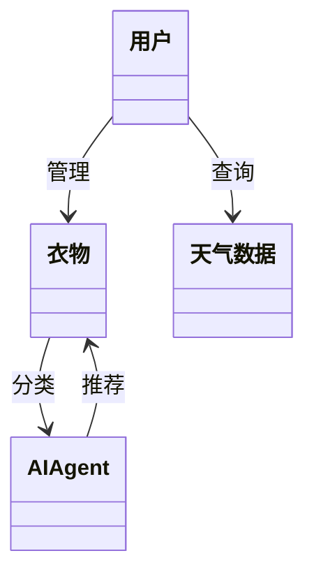
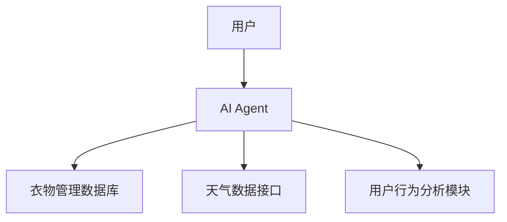
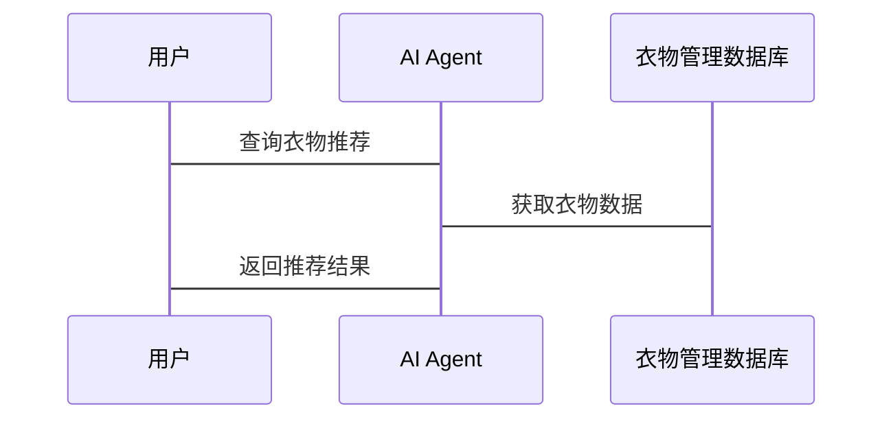

                 


# 智能衣柜：AI Agent的季节性衣物轮换建议

> 关键词：智能衣柜，AI Agent，季节性衣物，轮换建议，人工智能，衣物管理

> 摘要：本文探讨了AI Agent在智能衣柜中的应用，特别是在季节性衣物轮换方面的建议。通过分析衣物管理的痛点，提出了一种基于AI的解决方案，详细阐述了AI Agent的核心原理、推荐算法、系统架构设计以及实际项目的实现过程。文章还提供了丰富的代码示例和系统架构图，帮助读者全面理解智能衣柜的设计与实现。

---

# 第一章：智能衣柜的背景与需求

## 1.1 问题背景

### 1.1.1 衣物管理的痛点与挑战
- 衣物数量多，管理复杂
- 季节性衣物使用频率低，存储空间浪费
- 用户需求多样，个性化推荐不足

### 1.1.2 季节性衣物轮换的必要性
- 季节变化快，用户需求动态变化
- 衣物存储空间优化
- 提高衣物利用率，减少资源浪费

### 1.1.3 AI技术在衣物管理中的应用潜力
- 基于用户行为的个性化推荐
- 基于天气数据的智能提醒
- 基于图像识别的衣物分类

## 1.2 问题描述

### 1.2.1 季节性衣物轮换的核心问题
- 如何准确预测用户的衣物需求
- 如何优化衣物存储空间
- 如何实现个性化的衣物推荐

### 1.2.2 用户需求分析
- 用户的衣物分类需求
- 用户的衣物推荐需求
- 用户的衣物管理需求

### 1.2.3 系统目标与功能定位
- 实现季节性衣物的智能轮换
- 提供个性化的衣物推荐
- 优化衣物存储空间

## 1.3 问题解决思路

### 1.3.1 AI Agent在衣物管理中的角色
- AI Agent作为衣物管理的核心模块
- AI Agent通过用户行为和环境数据进行决策
- AI Agent提供用户友好的交互界面

### 1.3.2 季节性衣物轮换的算法与策略
- 基于时间序列的预测算法
- 基于用户行为的推荐算法
- 基于天气数据的关联规则挖掘

### 1.3.3 用户交互与反馈机制
- 自然语言处理（NLP）在交互中的应用
- 基于用户行为的个性化推荐
- 交互反馈的实时响应机制

## 1.4 边界与外延

### 1.4.1 系统功能的边界
- 仅关注季节性衣物的轮换与推荐
- 不涉及衣物的清洗与维护
- 不涉及衣物的购买与采购

### 1.4.2 与其他智能家居设备的联动
- 与智能空调联动，实时调整衣物推荐
- 与智能灯联动，提供衣物分类的视觉反馈
- 与智能门锁联动，提供衣物存储的安全保障

### 1.4.3 未来扩展性分析
- 支持更多种类的衣物管理功能
- 支持多用户的衣物管理需求
- 支持更复杂的衣物推荐算法

## 1.5 核心概念结构

### 1.5.1 核心要素组成
- 用户行为数据
- 天气数据
- 衣物分类数据

### 1.5.2 概念之间的关系
- 用户行为数据与衣物推荐的关联
- 天气数据与衣物轮换的关联
- 衣物分类数据与存储空间的优化

### 1.5.3 系统架构的初步设想
- 用户端：AI Agent交互界面
- 服务端：AI算法处理中心
- 数据层：衣物管理数据库

---

# 第二章：AI Agent的核心原理

## 2.1 AI Agent的基本原理

### 2.1.1 什么是AI Agent
- AI Agent的定义与分类
- AI Agent的基本功能与特点
- AI Agent在智能衣柜中的具体应用

### 2.1.2 AI Agent的分类与特点
- 基于规则的AI Agent
- 基于学习的AI Agent
- 混合型AI Agent

### 2.1.3 AI Agent在智能衣柜中的应用
- 衣物分类与管理
- 衣物推荐与轮换
- 用户交互与反馈

## 2.2 AI Agent的决策机制

### 2.2.1 基于规则的决策
- 规则的制定与管理
- 基于规则的决策流程
- 规则的优化与调整

### 2.2.2 基于学习的决策
- 机器学习在决策中的应用
- 基于深度学习的决策模型
- 决策模型的训练与优化

### 2.2.3 混合型决策机制
- 规则与学习的结合
- 混合型决策的优势与挑战
- 混合型决策的实现流程

## 2.3 AI Agent与用户交互

### 2.3.1 自然语言处理（NLP）在交互中的应用
- NLP在用户意图识别中的作用
- NLP在衣物推荐中的应用
- NLP在用户反馈处理中的应用

### 2.3.2 基于用户行为的个性化推荐
- 用户行为数据的采集与分析
- 基于协同过滤的推荐算法
- 基于内容的推荐算法

### 2.3.3 交互反馈的实时响应机制
- 反馈的采集与处理
- 反馈的实时响应流程
- 反馈对系统优化的作用

---

# 第三章：季节性衣物轮换的算法与实现

## 3.1 季节性衣物轮换的核心算法

### 3.1.1 基于时间序列的预测算法
- 时间序列预测的定义与特点
- ARIMA模型的原理与实现
- LSTM模型的原理与实现

### 3.1.2 基于用户行为的推荐算法
- 协同过滤推荐算法的原理与实现
- 基于内容的推荐算法的原理与实现
- 混合型推荐算法的原理与实现

### 3.1.3 基于天气数据的关联规则挖掘
- 关联规则挖掘的定义与特点
- Apriori算法的原理与实现
- FP-Growth算法的原理与实现

## 3.2 算法实现的数学模型

### 3.2.1 时间序列预测的ARIMA模型
- ARIMA模型的数学公式
- ARIMA模型的参数选择与优化
- ARIMA模型的实现步骤

### 3.2.2 基于协同过滤的推荐算法
- 协同过滤的数学公式
- 协同过滤的相似度计算
- 协同过滤的实现流程

### 3.2.3 关联规则挖掘的Apriori算法
- Apriori算法的数学公式
- Apriori算法的实现步骤
- Apriori算法的优化与调整

## 3.3 算法实现的流程图

### 3.3.1 时间序列预测的流程图
```mermaid
graph TD
    A[开始]
    B[数据预处理]
    C[模型训练]
    D[模型预测]
    E[结果输出]
    A -> B
    B -> C
    C -> D
    D -> E
```

### 3.3.2 协同过滤推荐算法的流程图
```mermaid
graph TD
    A[开始]
    B[数据采集]
    C[相似度计算]
    D[推荐生成]
    E[结果输出]
    A -> B
    B -> C
    C -> D
    D -> E
```

### 3.3.3 Apriori算法的流程图
```mermaid
graph TD
    A[开始]
    B[数据加载]
    C[频繁项集挖掘]
    D[关联规则生成]
    E[结果输出]
    A -> B
    B -> C
    C -> D
    D -> E
```

---

# 第四章：系统分析与架构设计

## 4.1 问题场景介绍

### 4.1.1 系统需求分析
- 功能需求分析
- 性能需求分析
- 用户需求分析

### 4.1.2 系统目标与范围
- 系统的功能范围
- 系统的性能指标
- 系统的用户群体

## 4.2 系统功能设计

### 4.2.1 领域模型类图


### 4.2.2 系统架构图


### 4.2.3 接口设计
- 用户接口：AI Agent交互界面
- 数据接口：天气数据接口
- 系统接口：衣物管理数据库接口

## 4.3 系统交互流程图

### 4.3.1 用户与AI Agent的交互流程


---

# 第五章：项目实战

## 5.1 环境安装

### 5.1.1 开发环境
- Python 3.8+
- PyTorch 1.9+
- Scikit-learn 0.24+
- Mermaid 8.0+

### 5.1.2 安装依赖
```bash
pip install mermaid
pip install torch
pip install scikit-learn
```

## 5.2 系统核心实现源代码

### 5.2.1 时间序列预测代码
```python
import torch
from torch import nn
import numpy as np

class ARIMA(nn.Module):
    def __init__(self, input_size, hidden_size):
        super(ARIMA, self).__init__()
        self.lstm = nn.LSTM(input_size, hidden_size, 1)
        self.linear = nn.Linear(hidden_size, 1)

    def forward(self, x):
        out, _ = self.lstm(x)
        out = self.linear(out)
        return out

# 示例数据
data = torch.randn(10, 1, 1)
model = ARIMA(1, 10)
output = model(data)
print(output)
```

### 5.2.2 协同过滤推荐代码
```python
from sklearn.metrics.pairwise import cosine_similarity

def collaborative_filtering(user_data, user_id):
    similarity = cosine_similarity(user_data, user_data)
    similar_users = np.argsort(similarity[user_id])[::-1]
    recommended_items = []
    for user in similar_users:
        if user != user_id:
            recommended_items.extend(user_data[user])
    return recommended_items

# 示例数据
user_data = {
    0: [1, 2, 3],
    1: [2, 3, 4],
    2: [3, 4, 5],
}
recommended_items = collaborative_filtering(user_data, 0)
print(recommended_items)
```

## 5.3 代码解读与分析

### 5.3.1 时间序列预测代码解读
- 模型定义：基于LSTM的时间序列预测模型
- 前向传播：输入数据经过LSTM层和线性层处理
- 输出结果：预测的衣物需求值

### 5.3.2 协同过滤推荐代码解读
- 模型定义：基于余弦相似度的协同过滤算法
- 相似度计算：计算用户之间的相似度
- 推荐生成：基于相似用户的推荐结果

## 5.4 实际案例分析

### 5.4.1 时间序列预测案例
- 数据来源：历史天气数据与用户行为数据
- 预测结果：未来一周的衣物需求预测
- 结果分析：预测结果与实际需求的对比

### 5.4.2 协同过滤推荐案例
- 数据来源：用户行为数据
- 推荐结果：基于相似用户的衣物推荐
- 结果分析：推荐结果的准确率与召回率

## 5.5 项目小结

### 5.5.1 项目总结
- 项目目标的实现情况
- 项目中的主要挑战
- 项目中的关键点总结

### 5.5.2 项目优化
- 算法优化的方向
- 系统性能的优化
- 用户体验的优化

---

# 第六章：最佳实践与注意事项

## 6.1 最佳实践

### 6.1.1 系统设计中的注意事项
- 数据隐私保护
- 系统可扩展性设计
- 系统容错与冗余设计

### 6.1.2 开发中的注意事项
- 代码规范与文档编写
- 测试用例的设计与实现
- 系统性能的监控与优化

## 6.2 小结

### 6.2.1 核心内容回顾
- AI Agent在智能衣柜中的应用
- 季节性衣物轮换的核心算法
- 系统架构设计与实现

### 6.2.2 未来展望
- 更智能的衣物管理功能
- 更高效的推荐算法
- 更人性化的用户交互

## 6.3 注意事项

### 6.3.1 开发中的常见问题
- 数据不足导致的模型性能下降
- 算法选择不当导致的推荐精度低
- 系统设计不合理导致的扩展性差

### 6.3.2 使用中的注意事项
- 数据更新与维护
- 系统安全与隐私保护
- 用户教育与培训

## 6.4 拓展阅读

### 6.4.1 推荐算法的深入研究
- 深度学习在推荐系统中的应用
- 图神经网络在推荐系统中的应用
- 多模态推荐算法的研究

### 6.4.2 系统架构的优化
- 微服务架构在智能衣柜中的应用
- 分布式系统的实现与优化
- 高可用系统的设计与实现

---

# 作者：AI天才研究院/AI Genius Institute & 禅与计算机程序设计艺术 /Zen And The Art of Computer Programming

