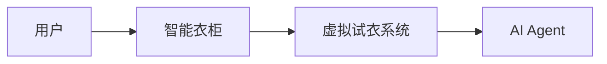

                 


# 智能衣柜：AI Agent的虚拟试衣系统

> 关键词：智能衣柜, AI Agent, 虚拟试衣系统, 人工智能, 计算机视觉, 推荐算法

> 摘要：本文探讨了智能衣柜与AI Agent结合的虚拟试衣系统，分析了其背景、核心概念、算法原理、系统架构、项目实战及最佳实践。通过详细讲解，展示了如何利用AI技术提升衣物试穿体验。

---

# 第一部分: 智能衣柜与AI Agent的背景介绍

## 第1章: 背景与问题背景

### 1.1 智能衣柜的发展现状
- **传统衣柜的局限性**：传统衣柜功能单一，无法提供个性化建议，且缺乏与用户的智能交互。
- **智能衣柜的定义与概念**：智能衣柜是一种结合了物联网和人工智能技术的衣物存储与管理设备，能够根据用户的穿衣需求和身体数据，推荐合适的衣物组合。
- **市场现状与发展趋势**：随着智能家居的普及，智能衣柜市场快速增长，预计未来将与虚拟试衣系统深度融合。

### 1.2 虚拟试衣系统的需求与问题
- **传统试衣的痛点**：用户在实体门店试衣时，常常面临时间长、效率低、无法快速找到合适款式等问题。
- **虚拟试衣系统的概念**：虚拟试衣系统通过计算机视觉和增强现实技术，让用户在线上就能试穿衣物，提升购物体验。
- **智能衣柜与虚拟试衣系统的结合**：智能衣柜通过整合虚拟试衣系统，提供线上试穿和线下存储的无缝体验。

### 1.3 AI Agent在智能衣柜中的应用
- **AI Agent的基本概念**：AI Agent是一种智能体，能够感知环境、自主决策并执行任务。
- **AI Agent在智能衣柜中的作用**：通过AI Agent，智能衣柜可以分析用户的穿衣数据，推荐合适的衣物，并优化存储空间。
- **AI Agent与虚拟试衣系统的结合**：AI Agent能够根据用户的试衣数据，实时调整推荐策略，提升试衣体验。

### 1.4 本章小结
本章介绍了智能衣柜和虚拟试衣系统的背景，分析了传统衣柜和试衣的痛点，以及AI Agent在其中的重要作用。

---

## 第2章: 核心概念与联系

### 2.1 AI Agent的核心原理
- **AI Agent的定义与特点**：AI Agent能够感知环境、自主决策、学习优化。
- **AI Agent的核心算法**：包括推荐算法、计算机视觉、自然语言处理等。
- **AI Agent与智能衣柜的结合**：AI Agent通过分析用户的穿衣数据，优化衣物推荐和存储。

### 2.2 虚拟试衣系统的核心原理
- **虚拟试衣系统的定义与特点**：通过计算机视觉和增强现实技术，让用户在线上试穿衣物。
- **虚拟试衣系统的实现技术**：包括图像处理、人体建模、增强现实等。
- **虚拟试衣系统与智能衣柜的结合**：通过智能衣柜的数据支持，虚拟试衣系统能够提供更精准的试穿体验。

### 2.3 AI Agent与虚拟试衣系统的实体关系
- **实体关系图（ER图）**：

- **属性特征对比表格**：
| 属性 | AI Agent | 虚拟试衣系统 |
|------|-----------|--------------|
| 输入 | 用户数据 | 用户试衣数据 |
| 输出 | 衣物推荐 | 虚拟试穿效果 |
| 核心技术 | 机器学习 | 计算机视觉 |
| 目标 | 优化穿衣体验 | 提供试穿服务 |

### 2.4 本章小结
本章详细讲解了AI Agent和虚拟试衣系统的核心概念，并通过实体关系图和属性对比表，展示了两者之间的联系。

---

## 第3章: 算法原理讲解

### 3.1 AI Agent的推荐算法
- **推荐算法的定义与特点**：推荐算法通过分析用户行为和偏好，推荐相关物品。
- **基于协同过滤的推荐算法**：
  - **算法流程**：
    1. 收集用户行为数据。
    2. 计算用户相似度。
    3. 推荐相似用户的物品。
  - **数学模型**：
    $$相似度 = \frac{\sum (u_i - \bar{u})(v_i - \bar{v})}{\sqrt{\sum (u_i - \bar{u})^2} \cdot \sqrt{\sum (v_i - \bar{v})^2}}$$
  - **Python代码示例**：
    ```python
    import numpy as np
    def cosine_similarity(user_vector, item_vector):
        return np.dot(user_vector, item_vector) / (np.linalg.norm(user_vector) * np.linalg.norm(item_vector))
    ```

---

接下来的内容将涵盖更多算法原理、系统架构设计、项目实战等部分。由于篇幅限制，以上为部分内容的展示。完整文章将详细讲解每个部分，并提供完整的代码示例和系统设计图。

