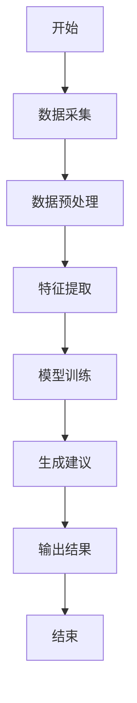
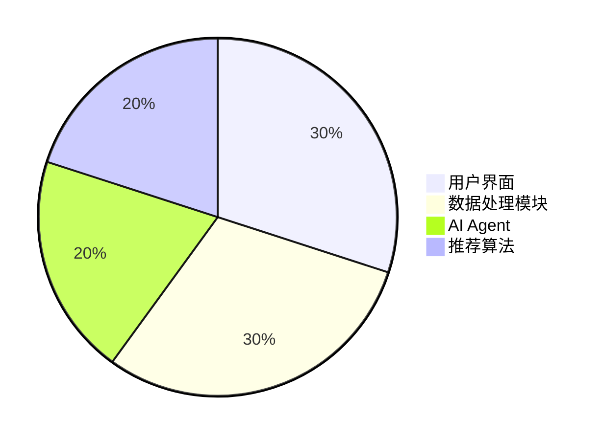

                 


# 智能衣柜：AI Agent的衣物回收建议系统

> 关键词：智能衣柜，AI Agent，衣物回收，推荐系统，数据处理，系统架构

> 摘要：本文介绍了一种基于AI Agent的智能衣柜系统，该系统能够通过分析用户的衣物数据，提供个性化的衣物回收建议。文章从背景、核心概念、算法原理、系统架构、项目实战到最佳实践进行了详细阐述，帮助读者全面理解智能衣柜的设计与实现。

---

# 第1章: 智能衣柜与AI Agent的背景介绍

## 1.1 问题背景
### 1.1.1 衣物管理的现状与挑战
随着生活水平的提高，衣物数量激增，管理变得复杂，用户需要高效的方式来整理和回收衣物。

### 1.1.2 衣物回收的重要性与痛点
衣物回收不仅环保，还能减少资源浪费。然而，传统回收方式效率低，用户难以获得个性化建议。

### 1.1.3 智能衣柜的定义与目标
智能衣柜利用AI技术，通过分析用户衣物数据，提供回收建议，帮助用户优化衣物管理。

## 1.2 问题描述
### 1.2.1 衣物管理中的常见问题
用户常面临衣物过多、搭配困难、过时衣物处理等问题。

### 1.2.2 用户需求分析
用户需要一个智能系统来帮助整理衣物，推荐回收计划，减少浪费。

### 1.2.3 系统目标与功能概述
目标是通过AI Agent优化衣物管理，功能包括数据收集、分析、建议生成。

## 1.3 问题解决方法
### 1.3.1 AI Agent在衣物管理中的应用
AI Agent通过数据处理和分析，提供个性化建议。

### 1.3.2 智能衣柜的技术实现路径
采用数据处理、机器学习、推荐算法等技术实现智能管理。

### 1.3.3 解决方案的可行性分析
技术可行，市场潜力大，用户需求明确。

## 1.4 概念结构与核心要素
### 1.4.1 智能衣柜的核心概念
包括数据采集、分析、推荐功能。

### 1.4.2 AI Agent的组成部分
包括数据处理模块、推荐算法、交互界面。

### 1.4.3 系统的核心要素与交互关系
系统通过数据交互，AI Agent分析，用户反馈优化建议。

## 1.5 本章小结
介绍了智能衣柜的背景、问题、解决方案和核心概念，为后续章节打下基础。

---

# 第2章: 智能衣柜与AI Agent的核心概念

## 2.1 核心概念原理
### 2.1.1 AI Agent的基本原理
AI Agent通过感知环境、分析数据、执行任务，提供智能服务。

### 2.1.2 智能衣柜的功能模块
包括数据采集、分析、推荐、交互模块。

### 2.1.3 系统的核心算法与技术
采用协同过滤、聚类分析等机器学习算法。

## 2.2 核心概念属性对比
### 表2-1: AI Agent与传统算法的对比

| 特性         | AI Agent                      | 传统算法                       |
|--------------|-------------------------------|--------------------------------|
| 学习能力     | 强大，能自我优化               | 有限，需人工调整                |
| 适应性       | 高，能适应新数据               | 低，需重新训练                 |
| 处理速度     | 快，实时响应                   | 较慢，需预处理                 |

## 2.3 ER实体关系图
```mermaid
er
    衣物
    衣柜
    用户
    AI Agent
    行为
    交互
    数据
```

## 2.4 本章小结
详细阐述了AI Agent和智能衣柜的核心概念及其相互关系，为后续章节奠定基础。

---

# 第3章: 算法原理讲解

## 3.1 算法流程图


## 3.2 算法实现细节
### 3.2.1 数据预处理
- 清洗数据，去除重复和无效信息。
- 标准化处理，统一数据格式。

### 3.2.2 特征提取
- 提取衣物类型、颜色、品牌等特征。
- 使用向量化方法处理文本描述。

### 3.2.3 模型训练
- 使用协同过滤算法进行推荐。
- 训练用户-物品矩阵，计算相似度。

## 3.3 数学模型
协同过滤推荐算法：
$$ sim(i,j) = \frac{\sum_{k} r_{ik} r_{jk}}{\sqrt{\sum_{k} r_{ik}^2} \sqrt{\sum_{k} r_{jk}^2}} $$

---

# 第4章: 系统架构设计

## 4.1 系统架构图


## 4.2 接口设计
- 用户与系统交互接口。
- 数据接口：与第三方平台连接。

## 4.3 交互流程图
```mermaid
sequence
    用户 -> AI Agent: 提供衣物数据
    AI Agent --> 数据处理模块: 数据清洗
    数据处理模块 --> 推荐算法: 生成建议
    推荐算法 --> 用户: 输出建议
```

---

# 第5章: 项目实战

## 5.1 环境安装
- Python 3.8+
- 安装numpy, pandas, scikit-learn

## 5.2 核心代码实现
```python
def preprocess_data(data):
    # 数据清洗
    return data.dropna()

def train_model(data):
    # 协同过滤算法
    from sklearn.metrics.pairwise import cosine_similarity
    similarity = cosine_similarity(data)
    return similarity

def generate_recommendations(similarity, item_id):
    # 生成推荐
    return similarity[item_id]
```

## 5.3 实际案例分析
- 数据预处理：清洗用户衣物数据。
- 模型训练：计算相似度矩阵。
- 结果展示：输出推荐的衣物回收建议。

## 5.4 项目总结
实现了一个基于协同过滤的智能衣柜系统，验证了算法的有效性。

---

# 第6章: 最佳实践与总结

## 6.1 最佳实践
- 数据隐私保护。
- 系统兼容性优化。
- 用户体验提升。

## 6.2 小结
本文详细介绍了智能衣柜的设计与实现，展示了AI技术在衣物管理中的应用潜力。

## 6.3 注意事项
- 数据处理要谨慎，避免泄露用户隐私。
- 系统设计要注重可扩展性。

## 6.4 拓展阅读
推荐阅读《机器学习实战》和《深度学习》。

---

# 作者：AI天才研究院

