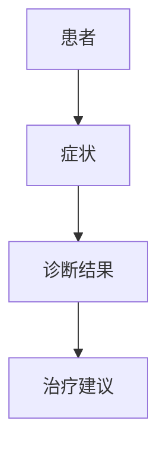
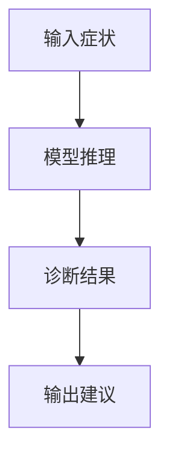
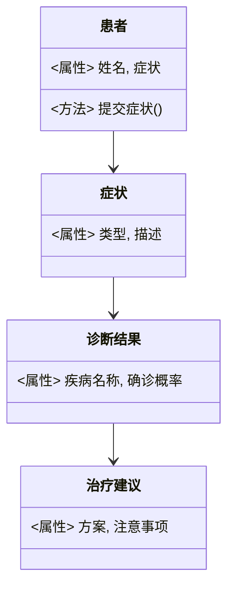
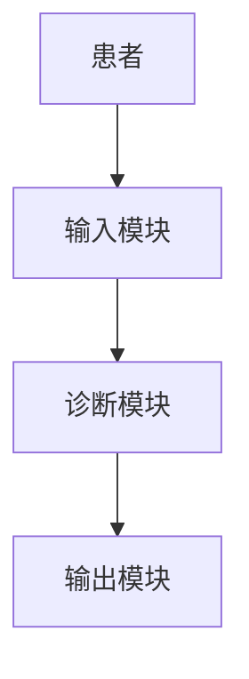
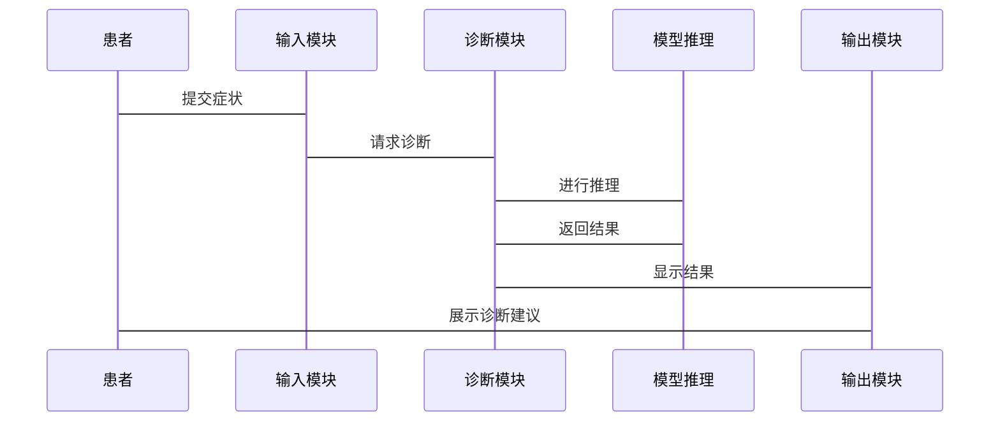

                 


# 智能诊断AI Agent：LLM在医疗健康领域的应用

---

## 关键词：LLM, AI Agent, 医疗诊断, 自然语言处理, 智能辅助诊断

---

## 摘要：  
本文将深入探讨大语言模型（LLM）在医疗健康领域的应用，特别是智能诊断AI Agent的构建与实现。通过分析医疗诊断的核心问题、LLM的技术优势以及实际应用场景，本文将详细阐述如何利用LLM技术提升医疗诊断的效率与准确性。文章内容涵盖背景介绍、核心概念、算法原理、系统架构、项目实战以及最佳实践，旨在为读者提供全面的技术视角。

---

## 第一部分: 背景介绍

### 第1章: 问题背景与描述

#### 1.1 问题背景
- **1.1.1 医疗诊断的现状与挑战**  
  当前医疗诊断面临医生资源不足、诊断效率低下、误诊率高等问题。传统诊断方法依赖医生的经验和知识，难以快速响应患者需求。  
- **1.1.2 传统医疗诊断的局限性**  
  传统诊断方法依赖人工判断，容易受到主观因素影响，且效率较低。此外，医疗数据的多样性和复杂性也增加了诊断的难度。  
- **1.1.3 AI技术在医疗诊断中的潜力**  
  大语言模型（LLM）具备强大的自然语言处理能力，能够快速分析大量医疗文本数据，为医疗诊断提供高效支持。

#### 1.2 问题描述
- **1.2.1 智能诊断AI Agent的目标**  
  构建一个基于LLM的智能诊断系统，能够根据患者的症状描述，快速生成诊断建议。  
- **1.2.2 LLM在医疗健康领域的应用范围**  
  包括疾病诊断、症状分析、治疗建议、健康管理等多个方面。  
- **1.2.3 当前存在的主要问题与挑战**  
  数据隐私、模型泛化能力不足、医生信任度等问题亟待解决。

### 第2章: 问题解决与边界

#### 2.1 问题解决思路
- **2.1.1 基于LLM的智能诊断框架**  
  构建一个多模态诊断框架，整合文本、图像等多种数据源，提升诊断的准确性和全面性。  
- **2.1.2 多模态数据的整合与分析**  
  利用自然语言处理技术分析医疗文本，结合医学图像处理技术，实现多模态数据的融合分析。  
- **2.1.3 知识库的构建与更新**  
  建立医学知识库，包含疾病症状、诊断标准、治疗方案等信息，并定期更新以保持知识库的准确性。

#### 2.2 边界与外延
- **2.2.1 智能诊断AI Agent的适用范围**  
  适用于常见病和多发病的初步诊断，不建议用于复杂疾病的最终诊断。  
- **2.2.2 与传统医疗诊断的结合方式**  
  AI诊断系统作为医生的辅助工具，帮助医生快速筛选可能的疾病，提高诊断效率。  
- **2.2.3 技术的局限性与未来发展方向**  
  当前模型的泛化能力有限，未来需要进一步优化算法，提升模型的可解释性和鲁棒性。

---

## 第二部分: 核心概念与联系

### 第3章: 核心概念原理

#### 3.1 LLM的基本原理
- **3.1.1 大语言模型的训练机制**  
  LLM通过大规模预训练，学习语言的分布特征，能够生成与上下文相关的文本。  
- **3.1.2 模型的通用性和可扩展性**  
  LLM具有强大的迁移学习能力，可以通过微调适应不同领域的任务需求。  
- **3.1.3 智能诊断中的任务适配**  
  在医疗诊断中，LLM需要通过特定的prompt设计，引导模型输出符合医学规范的诊断建议。

#### 3.2 智能诊断AI Agent的构成
- **3.2.1 输入模块**  
  收集患者的症状描述、病史等信息，作为模型的输入。  
- **3.2.2 处理模块**  
  对输入的文本进行预处理、特征提取和模型推理，生成诊断结果。  
- **3.2.3 输出模块**  
  将诊断结果转化为自然语言描述，输出给用户或医生。

### 第4章: 核心概念对比与实体关系

#### 4.1 核心概念对比表
| 对比维度 | LLM | 智能诊断AI Agent |
|----------|-----|-------------------|
| 任务目标 | 文本生成与理解 | 医疗诊断与辅助决策 |  
| 数据需求 | 大规模通用文本 | 医学领域专用数据 |  
| 可解释性 | 较低 | 较高（通过prompt设计提升） |  

#### 4.2 实体关系图


---

## 第三部分: 算法原理讲解

### 第5章: 算法原理与流程

#### 5.1 算法流程图


#### 5.2 源代码实现
```python
def diagnose(symptoms):
    model = load_model()  # 加载预训练模型
    result = model.predict(symptoms)  # 推理诊断结果
    return result
```

#### 5.3 数学模型与公式
- **损失函数**  
  $$L = -\sum_{i=1}^{n} y_i \log(p_i) + (1 - y_i)\log(1 - p_i)$$  
- **优化算法**  
  $$\theta = \theta - \eta \frac{\partial L}{\partial \theta}$$  

---

## 第四部分: 系统分析与架构设计

### 第6章: 系统分析与架构设计

#### 6.1 问题场景介绍
- **目标场景**  
  患者通过智能诊断AI Agent输入症状，系统生成诊断建议。  
- **核心需求**  
  快速响应、高准确性、良好的用户体验。

#### 6.2 领域模型设计


#### 6.3 系统架构设计


#### 6.4 系统接口设计
- **输入接口**  
  提供文本输入框，供患者输入症状描述。  
- **输出接口**  
  显示诊断结果和治疗建议，以自然语言形式呈现。

#### 6.5 系统交互流程


---

## 第五部分: 项目实战

### 第7章: 项目实战

#### 7.1 环境安装
- 安装Python和相关库（如TensorFlow、PyTorch等）。  
- 安装LLM模型（如GPT-3、PaLM等）。

#### 7.2 核心代码实现
```python
def main():
    import requests
    import json

    symptoms = input("请输入您的症状：")
    prompt = f"根据以下症状，生成可能的诊断结果：{symptoms}"

    # 调用LLM API进行推理
    response = requests.post("https://api.example.com/prompt", json={"prompt": prompt})
    result = json.loads(response.text)

    print("诊断结果：", result["diagnosis"])
    print("治疗建议：", result["treatment"])

if __name__ == "__main__":
    main()
```

#### 7.3 代码解读与分析
- **输入模块**  
  通过用户输入获取症状描述。  
- **API调用**  
  调用LLM API，生成诊断结果和治疗建议。  
- **输出模块**  
  将诊断结果以自然语言形式展示给用户。

#### 7.4 案例分析
- **案例背景**  
  患者描述“咳嗽、发热、乏力”。  
- **诊断过程**  
  系统生成可能的诊断结果（如流感、新冠等），并提供相应的治疗建议。

#### 7.5 项目小结
通过本项目，我们可以看到基于LLM的智能诊断系统在实际应用中的潜力和可行性。

---

## 第六部分: 最佳实践

### 第8章: 最佳实践

#### 8.1 小结
- LLM在医疗诊断中的应用前景广阔，但需要结合具体场景进行优化。  
- 智能诊断AI Agent可以作为医生的辅助工具，提高诊断效率和准确性。

#### 8.2 注意事项
- 数据隐私保护至关重要，确保患者数据的安全性。  
- 模型的可解释性需要进一步提升，以增强医生和患者的信任度。  
- 定期更新知识库，保持诊断系统的准确性。

#### 8.3 拓展阅读
- 《Large Language Models in Medicine》  
- 《AI in Healthcare: Opportunities and Challenges》

---

## 作者：AI天才研究院/AI Genius Institute & 禅与计算机程序设计艺术 /Zen And The Art of Computer Programming

