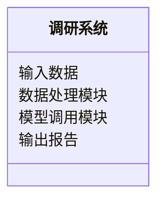
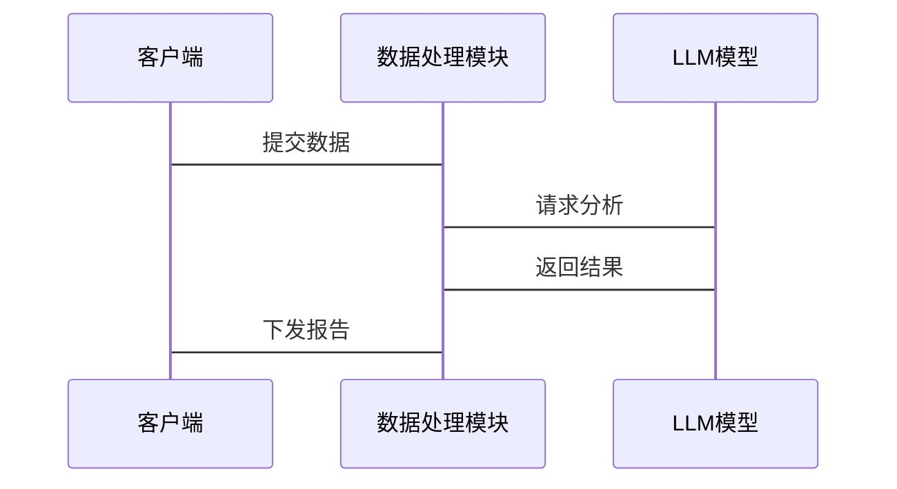

                 


# 智能调研 AI Agent：LLM 辅助市场分析与用户洞察

## 关键词
智能调研, AI Agent, 大语言模型, 市场分析, 用户洞察

## 摘要
本文探讨了大语言模型（LLM）在市场分析和用户洞察中的应用，分析了LLM辅助市场调研的优势，详细讲解了其背后的算法原理和系统架构，并通过实际案例展示了如何利用LLM构建智能调研系统。

---

## 第一部分：智能调研 AI Agent 的背景与核心概念

### 第1章：智能调研 AI Agent 的背景与问题背景

#### 1.1 传统市场调研的局限性
##### 1.1.1 问题背景
传统市场调研依赖人工数据收集和分析，效率低、成本高且难以覆盖大规模数据。

##### 1.1.2 问题描述
市场调研中的数据量庞大且分散，传统方法难以快速提取有效信息，用户洞察不够深入。

##### 1.1.3 问题解决
AI技术，特别是大语言模型（LLM），能够快速处理海量数据，提供实时洞察。

##### 1.1.4 边界与外延
LLM辅助市场调研的应用范围包括数据收集、分析和报告生成，但需要考虑数据隐私和模型准确性。

#### 1.2 AI技术在市场调研中的应用潜力
##### 1.2.1 核心概念术语说明
- **LLM（Large Language Model）**：能够理解并生成人类语言的大模型，如GPT系列。
- **市场分析**：通过对市场数据的分析，了解市场趋势和竞争状况。
- **用户洞察**：深入理解用户需求、行为和偏好。

##### 1.2.2 LLM的核心优势
- **高效性**：快速处理大量非结构化数据。
- **准确性**：通过深度学习优化分析结果。
- **可扩展性**：适用于多种市场调研场景。

#### 1.3 核心要素组成
- 数据来源：文本、问卷、社交媒体等。
- 分析方法：文本挖掘、情感分析、主题建模。
- 输出形式：结构化报告、可视化图表。

### 第2章：LLM 辅助市场分析与用户洞察的核心概念

#### 2.1 LLM 的定义与核心原理
##### 2.1.1 基本概念
LLM 是一种基于深度学习的生成模型，通过大量数据训练，能够理解和生成人类语言。

##### 2.1.2 输入输出机制
- **输入**：文本数据、问题描述。
- **输出**：生成的文本、分析结果。

#### 2.2 市场分析与用户洞察的核心要素
##### 2.2.1 市场分析的关键维度
- 市场趋势、竞争分析、产品定位。

##### 2.2.2 用户洞察的核心指标
- 用户需求、行为习惯、情感倾向。

##### 2.2.3 数据结构化与非结构化的对比
- 结构化数据：表格、数值型数据。
- 非结构化数据：文本、图像。

### 第3章：LLM 辅助市场分析的算法原理

#### 3.1 大语言模型的训练过程
##### 3.1.1 预训练阶段
- 使用大规模通用数据进行无监督学习。
- 目标：理解语言结构和语义。

##### 3.1.2 微调阶段
- 在特定领域数据上进行有监督学习。
- 目标：提升模型在特定任务上的性能。

##### 3.1.3 生成阶段
- 根据输入生成输出文本。

#### 3.2 转换器架构的核心原理
##### 3.2.1 编码器与解码器的结构
- 编码器：将输入文本编码为向量。
- 解码器：根据编码向量生成输出文本。

##### 3.2.2 注意力机制的作用
- 通过权重分配，关注输入中的重要部分。

##### 3.2.3 激活函数与损失函数
- **激活函数**：如ReLU，用于引入非线性。
- **损失函数**：如交叉熵损失，用于优化模型。

#### 3.3 LLM 的数学模型与公式
##### 3.3.1 编码器-解码器模型
$$
\text{编码器} \rightarrow \text{解码器}
$$

##### 3.3.2 注意力机制
$$
\text{注意力权重} = \text{softmax}(\frac{QK^T}{\sqrt{d}})
$$

---

## 第二部分：系统分析与架构设计方案

### 第4章：系统分析与架构设计方案

#### 4.1 问题场景介绍
- 目标：构建一个智能调研系统，利用LLM辅助市场分析和用户洞察。
- 主要功能：数据收集、分析、报告生成。

#### 4.2 系统功能设计
##### 4.2.1 领域模型设计


#### 4.3 系统架构设计
##### 4.3.1 架构图


#### 4.4 系统接口设计
##### 4.4.1 输入接口
- 接口名称：submitSurvey
- 请求参数：surveyData
- 返回结果：taskID

##### 4.4.2 输出接口
- 接口名称：getReport
- 请求参数：taskID
- 返回结果：reportData

#### 4.5 系统交互流程
##### 4.5.1 序列图


---

## 第三部分：项目实战

### 第5章：项目实战

#### 5.1 环境安装
- Python 3.8+
- Transformers库：pip install transformers
- Jupyter Notebook

#### 5.2 系统核心实现源代码
```python
from transformers import pipeline

# 初始化模型
model = pipeline("text-generation", model="gpt2")

# 数据预处理
def preprocess(data):
    return data["text"]

# 模型调用
def analyze(text):
    return model(text)[0]["generated_text"]
```

#### 5.3 代码应用解读与分析
- 预处理函数：将输入文本格式化为模型可接受的形式。
- 分析函数：调用模型生成分析结果。

#### 5.4 实际案例分析
- 输入：市场调研问卷数据。
- 输出：生成的市场分析报告。

---

## 第四部分：总结与展望

### 第6章：总结与展望

#### 6.1 最佳实践 tips
- 数据预处理：确保输入数据的质量和格式。
- 模型选择：根据任务选择合适的模型。
- 结果验证：对比传统方法验证模型的有效性。

#### 6.2 小结
本文详细介绍了LLM在市场调研中的应用，展示了其在提高效率和准确性方面的优势。

#### 6.3 注意事项
- 数据隐私：确保数据安全。
- 模型调优：持续优化模型性能。

#### 6.4 拓展阅读
建议阅读相关论文和文献，深入理解LLM的工作原理。

---

## 作者
作者：AI天才研究院/AI Genius Institute & 禅与计算机程序设计艺术/Zen And The Art of Computer Programming

