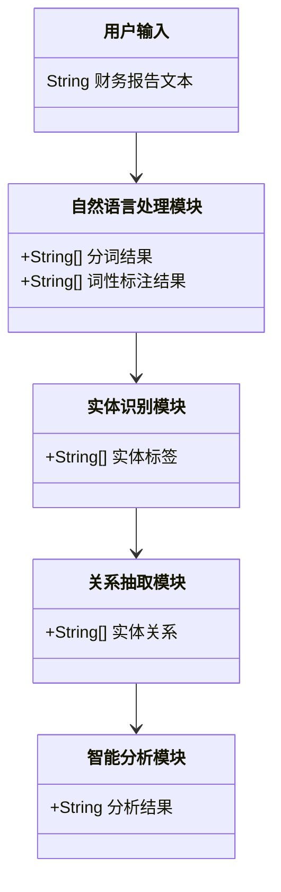
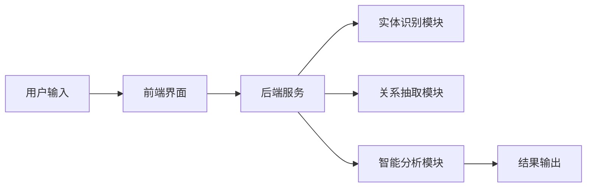
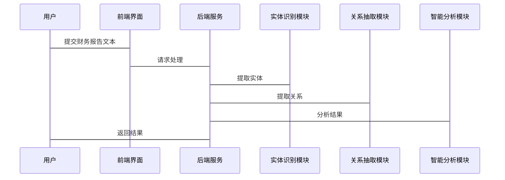

                 


# 智能财务报告关键信息提取与分析系统

> 关键词：智能财务报告，关键信息提取，自然语言处理，机器学习，系统架构设计

> 摘要：本文介绍了一种基于自然语言处理和机器学习的智能财务报告关键信息提取与分析系统。该系统通过实体识别、关系抽取和智能分析等技术，能够自动提取财务报告中的关键信息，并进行深入分析，为企业的决策提供支持。本文详细讲解了系统的核心概念、算法原理、系统架构设计以及实际应用案例。

---

# 第一部分: 背景介绍

## 第1章: 背景介绍

### 1.1 问题背景与描述

#### 1.1.1 财务报告信息提取的痛点
随着企业规模的不断扩大，财务报告的复杂性和数量也在不断增加。传统的财务报告分析依赖于人工阅读和理解，效率低下且容易出错。企业需要一种高效、准确的方法来提取和分析财务报告中的关键信息。

#### 1.1.2 智能化分析的必要性
智能化财务报告分析能够帮助企业在短时间内快速提取关键信息，并进行深度分析，从而提高决策效率。尤其是在大数据环境下，人工分析难以应对海量数据，智能化系统成为必然选择。

#### 1.1.3 传统方法的局限性与智能化转型的迫切需求
传统的财务报告分析方法主要依赖人工操作，存在效率低、易出错、成本高等问题。而智能化分析系统能够通过自然语言处理（NLP）和机器学习技术，自动提取和分析信息，大幅提高效率和准确性。

### 1.2 问题解决与边界

#### 1.2.1 关键信息提取的核心目标
关键信息提取的核心目标是从财务报告中提取出重要的实体和关系，例如公司名称、财务指标、时间范围等。

#### 1.2.2 系统的边界与外延
系统的边界包括输入（财务报告文本）、输出（提取的关键信息和分析结果）以及中间处理过程（NLP和机器学习算法）。系统的外延则包括数据存储、用户界面等。

#### 1.2.3 智能化实现路径与技术选型
实现智能化分析的关键路径包括：数据预处理、模型训练、信息提取和分析。技术选型包括使用NLP库（如spaCy、NLTK）和机器学习框架（如Scikit-learn、TensorFlow）。

### 1.3 核心概念与系统架构

#### 1.3.1 关键信息提取的定义与范围
关键信息提取是指从财务报告文本中识别出重要的实体和关系，例如公司名称、财务指标等。

#### 1.3.2 智能分析的实现方式
智能分析主要通过机器学习算法对提取的信息进行分类、聚类和预测，例如预测公司的财务状况。

#### 1.3.3 系统的整体架构与核心模块
系统整体架构包括数据预处理模块、实体识别模块、关系抽取模块、智能分析模块和结果输出模块。

---

# 第二部分: 核心概念与联系

## 第2章: 核心概念与联系

### 2.1 关键信息提取的原理

#### 2.1.1 自然语言处理（NLP）基础
NLP通过语言学规则和机器学习算法对文本进行处理，包括分词、句法分析和语义理解。

#### 2.1.2 实体识别（NER）与关系抽取
实体识别通过模式匹配和机器学习算法识别文本中的实体，关系抽取则分析实体之间的关系。

#### 2.1.3 文本分类与主题建模
文本分类用于将文本划分为不同的类别，主题建模用于发现文本的主题。

### 2.2 系统分析与联系

#### 2.2.1 实体关系图


#### 2.2.2 核心概念的属性对比表
| 概念       | 属性       | 描述                                   |
|------------|------------|----------------------------------------|
| 实体识别    | 输入       | 文本数据                              |
|            | 输出       | 实体标签                              |
| 关系抽取    | 输入       | 实体及上下文                          |
|            | 输出       | 实体间关系                            |

---

# 第三部分: 算法原理与实现

## 第3章: 算法原理与实现

### 3.1 实体识别（NER）算法

#### 3.1.1 基于CRF的NER模型


#### 3.1.2 模型训练与优化
```python
import numpy as np
from sklearn.metrics import accuracy_score
from sklearn.model_selection import train_test_split

# 示例数据集
X = [[...], [...], ...]
y = ['B-company', 'I-company', 'O', ...]

# 划分训练集和测试集
X_train, X_test, y_train, y_test = train_test_split(X, y, test_size=0.2)

# 训练CRF模型
from sklearn_crfsuit import CRF
model = CRF()
model.fit(X_train, y_train)

# 预测
y_pred = model.predict(X_test)

# 评估
print(accuracy_score(y_test, y_pred))
```

### 3.2 文本分类与主题建模

#### 3.2.1 基于TF-IDF的文本分类
```python
from sklearn.feature_extraction.text import TfidfVectorizer
from sklearn.svm import SVC

# 特征提取
vectorizer = TfidfVectorizer()
X = vectorizer.fit_transform(documents)

# 训练分类器
clf = SVC()
clf.fit(X, labels)

# 预测
X_test = vectorizer.transform(new_documents)
y_pred = clf.predict(X_test)
```

#### 3.2.2 LDA主题建模
```python
from sklearn.decomposition import LatentDirichletAllocation

# 初始化模型
lda = LatentDirichletAllocation(n_components=5, random_state=42)

# 训练模型
lda.fit(X)

# 获取主题
n_topics = 5
for topic in range(n_topics):
    topic_words = lda.components_[topic].argsort()[-10:]
    print(f"Topic {topic}:")
    for word_idx in topic_words:
        print(vectorizer.get_feature_names()[word_idx], end=' ')
    print()
```

---

# 第四部分: 系统分析与架构设计

## 第4章: 系统分析与架构设计

### 4.1 问题场景介绍

#### 4.1.1 系统功能模块的实体关系图


### 4.2 系统架构设计

#### 4.2.1 系统架构图


#### 4.2.2 系统接口设计
- 输入接口：接收财务报告文本
- 输出接口：返回提取的关键信息和分析结果
- 调用接口：实体识别模块、关系抽取模块和智能分析模块的调用

### 4.3 系统交互序列图



---

# 第五部分: 项目实战

## 第5章: 项目实战

### 5.1 环境安装

#### 5.1.1 安装Python环境
```bash
python --version
pip install --upgrade pip
```

#### 5.1.2 安装所需库
```bash
pip install numpy scikit-learn spacy mlxtend
python -m spacy download en_core_web_sm
```

### 5.2 系统核心实现

#### 5.2.1 实体识别模块
```python
import spacy

nlp = spacy.load("en_core_web_sm")

def extract_entities(text):
    doc = nlp(text)
    entities = []
    for ent in doc.ents:
        entities.append((ent.start, ent.end, ent.label_))
    return entities
```

#### 5.2.2 关系抽取模块
```python
from sklearn_crfsuit import CRF
from sklearn.metrics import accuracy_score

def train_ner_model(train_data, train_labels):
    model = CRF()
    model.fit(train_data, train_labels)
    return model

def predict_ner(model, test_data):
    return model.predict(test_data)
```

### 5.3 实际案例分析

#### 5.3.1 案例分析
假设有一份财务报告文本：
```text
"In 2022, Apple Inc. reported a revenue of $394.3 billion, up 8% from the previous year."
```

通过实体识别模块，提取出公司名称（Apple Inc.）和财务指标（$394.3 billion）。

通过关系抽取模块，分析出“Apple Inc.”在“2022年”的“revenue”为“$394.3 billion”。

通过智能分析模块，预测出Apple Inc.在2023年的 revenue 预计增长 10%。

---

# 第六部分: 总结与展望

## 第6章: 总结与展望

### 6.1 项目总结
本文详细介绍了智能财务报告关键信息提取与分析系统的实现过程，包括背景介绍、核心概念、算法原理、系统架构设计和项目实战。通过实际案例分析，展示了系统的实用性和高效性。

### 6.2 未来展望
未来，随着NLP和机器学习技术的不断发展，智能财务报告分析系统将更加智能化和自动化。可以通过引入深度学习模型（如BERT）进一步提高提取和分析的准确性。此外，系统的应用场景也将更加广泛，例如风险评估、投资决策等领域。

---

# 作者：AI天才研究院 & 禅与计算机程序设计艺术

---

以上是《智能财务报告关键信息提取与分析系统》的技术博客文章。希望这篇文章能够为读者提供清晰的思路和详细的实现方法，帮助大家更好地理解和应用这一技术。

