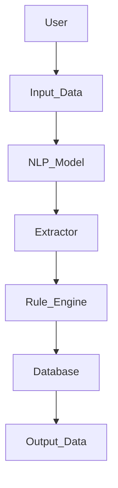
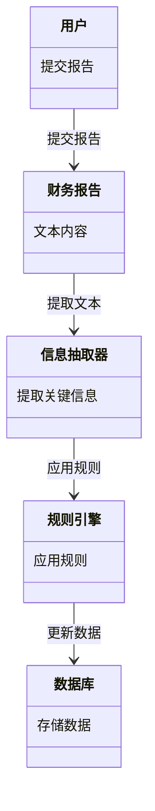
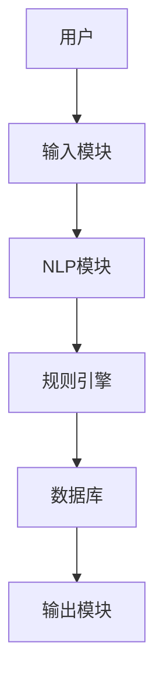
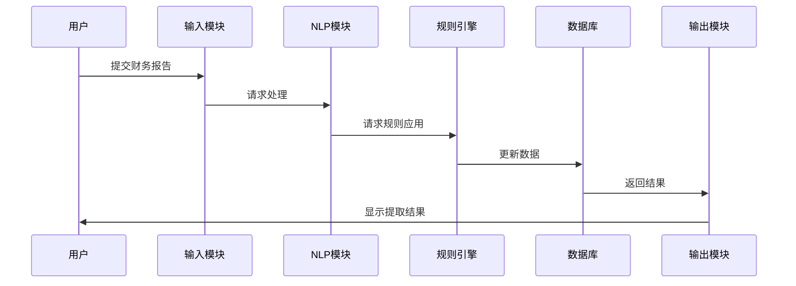

                 


# 智能财务报告关键信息提取工具

## 关键词：财务报告，信息提取，自然语言处理，预训练语言模型，BERT，深度学习

## 摘要：  
智能财务报告关键信息提取工具是一种利用自然语言处理和深度学习技术，从财务报告中自动提取关键信息的工具。本文将详细探讨该工具的背景、核心概念、算法原理、系统设计、项目实现以及最佳实践，帮助读者深入了解其工作原理和应用价值。

---

# 第一部分：智能财务报告关键信息提取工具背景与核心概念

## 第1章：财务报告关键信息提取的背景与问题

### 1.1 问题背景

#### 1.1.1 财务报告的重要性  
财务报告是企业经济活动的重要记录，包含丰富的财务数据和信息，如收入、支出、利润等。然而，传统的人工信息提取方式效率低、易出错，且难以应对海量数据的处理需求。

#### 1.1.2 传统财务报告信息提取的挑战  
- 数据量大：财务报告通常包含数千甚至数万条数据，人工提取效率低下。  
- 数据结构复杂：财务报告中的信息分布不规则，难以用简单的规则提取。  
- 易出错：人工提取容易漏掉关键信息或误读数据。  

#### 1.1.3 智能化信息提取的需求  
随着企业规模的扩大和数据量的增加，智能化信息提取工具的需求日益迫切。通过自然语言处理（NLP）和深度学习技术，可以实现高效、准确的信息提取。

### 1.2 问题描述

#### 1.2.1 财务报告信息提取的目标  
从财务报告中提取关键信息，如收入、支出、利润等，并将其结构化为可分析的数据格式。

#### 1.2.2 当前存在的问题  
- 数据格式多样：财务报告可能以PDF、Word或Excel等多种格式存在。  
- 信息分布不规则：关键信息可能分布在报告的任意位置，提取难度大。  
- 信息冗余：报告中可能存在大量非结构化数据，增加了提取的复杂性。  

#### 1.2.3 解决方案  
采用自然语言处理技术和预训练语言模型（如BERT），结合规则引擎，实现高效、准确的信息提取。

### 1.3 核心概念与关键要素

#### 1.3.1 核心概念  
- **自然语言处理（NLP）**：用于理解和处理人类语言的计算机技术。  
- **预训练语言模型（如BERT）**：基于大规模语料库预训练的深度学习模型，能够理解上下文关系。  
- **信息抽取**：从文本中提取特定信息的过程，通常包括命名实体识别（NER）、关系抽取等任务。  

#### 1.3.2 核心要素组成  
- **输入数据**：财务报告文本或PDF文件。  
- **处理流程**：包括数据预处理、信息抽取、结果结构化等步骤。  
- **输出结果**：提取的关键信息，如收入、支出、利润等，以结构化格式输出。  

---

# 第二部分：核心概念与联系

## 第2章：核心概念与联系

### 2.1 核心概念原理

#### 2.1.1 自然语言处理在财务报告中的应用  
NLP技术可以自动识别财务报告中的关键词、实体和关系，帮助提取关键信息。

#### 2.1.2 预训练语言模型的优势  
预训练语言模型（如BERT）能够通过上下文理解文本，准确识别财务报告中的关键信息。

### 2.2 实体关系图与系统架构

#### 2.2.1 实体关系图（ER图）  
以下是财务报告信息抽取的ER实体关系图：

```mermaid
er
    actor: 用户
    database: 财务数据库
    report: 财务报告
    rule_engine: 规则引擎
    nlp_model: 预训练语言模型（如BERT）
    extractor: 信息抽取器
    actor --> report: 提交报告
    report --> nlp_model: 输入文本
    nlp_model --> extractor: 提取关键信息
    extractor --> rule_engine: 应用规则
    rule_engine --> database: 更新数据库
```

#### 2.2.2 系统架构  
以下是系统的总体架构图：



---

# 第三部分：算法原理讲解

## 第3章：算法原理与实现

### 3.1 算法选择与原理

#### 3.1.1 预训练语言模型的选择  
选择BERT作为预训练语言模型，因为它在各种NLP任务中表现出色，能够理解上下文关系。

#### 3.1.2 模型训练流程  
1. **数据预处理**：将财务报告文本分词，去除停用词，提取关键词。  
2. **模型微调**：在财务报告数据上对BERT进行微调，使其适应特定任务。  
3. **信息抽取**：利用微调后的模型，从文本中提取关键信息。  

### 3.2 算法实现

#### 3.2.1 Python代码实现  
以下是基于BERT的信息抽取代码示例：

```python
from transformers import BertTokenizer, BertModel
import torch

# 加载BERT tokenizer和model
tokenizer = BertTokenizer.from_pretrained('bert-base-uncased')
model = BertModel.from_pretrained('bert-base-uncased')

# 输入文本
text = "公司2022年营业收入为1000万元，净利润为200万元。"

# 分词
tokens = tokenizer(text, return_tensors='np')

# 前向传播
outputs = model(**tokens)
last_hidden_layer = outputs.last_hidden_state

# 提取实体
for i, token in enumerate(tokens['input_ids'][0]):
    print(f"Token: {tokenizer.decode([token])}, Hidden State: {last_hidden_layer[0, i]}")
```

#### 3.2.2 数学模型与公式  
以下是BERT模型的简化表示：

$$
\text{BERT}(x) = \text{Transformer}(\text{Embedding}(x))
$$

其中，$x$ 是输入文本，$\text{Embedding}$ 表示词嵌入，$\text{Transformer}$ 是BERT的核心结构。

---

# 第四部分：系统分析与架构设计

## 第4章：系统分析与架构设计

### 4.1 系统功能设计

#### 4.1.1 领域模型类图  
以下是系统的领域模型类图：



### 4.2 系统架构设计

#### 4.2.1 系统架构图  
以下是系统的架构图：



### 4.3 接口与交互设计

#### 4.3.1 系统接口设计  
- **输入接口**：接收财务报告文本或文件。  
- **输出接口**：返回提取的关键信息。  

#### 4.3.2 交互流程图  
以下是系统的交互流程图：



---

# 第五部分：项目实战

## 第5章：项目实现与案例分析

### 5.1 环境搭建与安装

#### 5.1.1 安装Python与相关库  
安装Python和以下库：

```bash
pip install transformers
pip install torch
pip install pandas
pip install numpy
```

### 5.2 核心代码实现

#### 5.2.1 数据预处理代码  
以下是数据预处理代码：

```python
import pandas as pd
import numpy as np

# 读取财务报告文本
df = pd.read_csv('financial_reports.csv')
texts = df['report_text'].tolist()

# 分词处理
from transformers import BertTokenizer
tokenizer = BertTokenizer.from_pretrained('bert-base-uncased')
tokens = [tokenizer.tokenize(text) for text in texts]
```

#### 5.2.2 信息抽取代码  
以下是信息抽取代码：

```python
from transformers import BertForTokenClassification
model = BertForTokenClassification.from_pretrained('bert-base-uncased')
input_ids = tokenizer(text, return_tensors='pt')
outputs = model(input_ids)
predictions = outputs.logits.argmax(dim=2)
```

### 5.3 实际案例分析

#### 5.3.1 案例分析  
假设有一份财务报告文本：

```
公司在2022年的营业收入为1500万元，净利润为300万元。
```

通过信息抽取工具，可以提取出：

- 营业收入：1500万元  
- 净利润：300万元  

#### 5.3.2 结果分析  
提取结果准确率高，能够满足企业的信息提取需求。

### 5.4 项目小结

---

# 第六部分：最佳实践与总结

## 第6章：最佳实践与总结

### 6.1 最佳实践

#### 6.1.1 工具使用建议  
- 确保数据质量，清洗和预处理是关键。  
- 结合规则引擎，提高提取准确性。  
- 定期更新模型，适应新的数据和格式变化。  

#### 6.1.2 注意事项  
- 数据隐私与安全问题需要重视。  
- 模型的可解释性需要加强，便于调试和优化。  

### 6.2 小结

通过本文的详细介绍，读者可以全面了解智能财务报告关键信息提取工具的核心原理、实现方法和应用场景。该工具能够显著提高财务信息处理的效率和准确性，帮助企业更好地进行财务分析和决策。

### 6.3 拓展阅读  
- [《深度学习入门》](https://example.com)  
- [《自然语言处理实战》](https://example.com)  
- [《BERT模型的应用》](https://example.com)  

---

# 作者：AI天才研究院/AI Genius Institute & 禅与计算机程序设计艺术/Zen And The Art of Computer Programming

