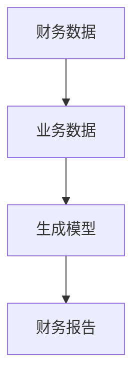
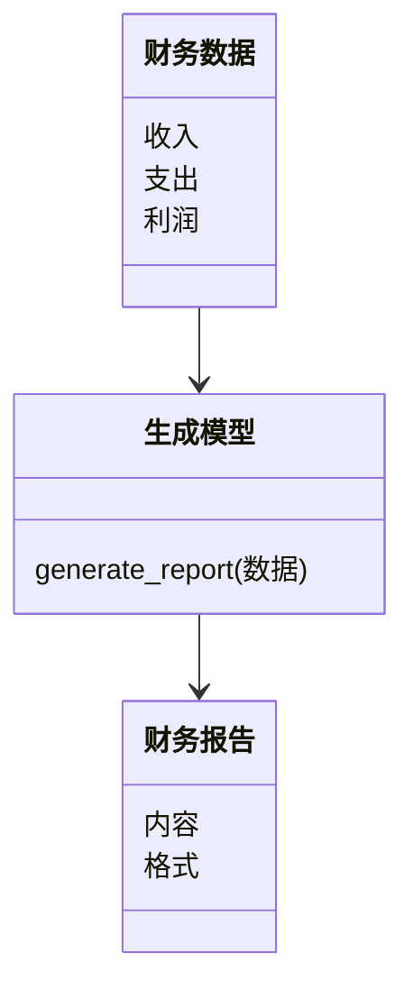

                 


# 智能财务报告自动生成系统

> 关键词：智能财务报告生成，自然语言处理，机器学习，财务数据分析，自动化报告系统

> 摘要：本文深入探讨了智能财务报告自动生成系统的背景、核心概念、算法原理、系统架构设计、项目实战及最佳实践。通过结合自然语言处理（NLP）和机器学习技术，本文详细分析了如何利用AI技术实现财务报告的自动化生成，并通过实际案例展示了系统的实现与应用。本文适合对财务数据分析和AI技术感兴趣的读者阅读。

---

## 第一部分: 智能财务报告自动生成系统的背景与核心概念

### 第1章: 智能财务报告自动生成系统的背景介绍

#### 1.1 问题背景与问题描述

##### 1.1.1 传统财务报告生成的痛点
传统财务报告生成过程依赖人工操作，存在以下痛点：
- **效率低**：需要大量人工参与数据收集、整理和报告撰写。
- **错误率高**：人为操作容易出现数据错误或遗漏。
- **一致性差**：不同人员生成的报告格式和内容可能不一致。

##### 1.1.2 智能化生成的需求与目标
智能化财务报告生成的需求主要体现在：
- **提高效率**：通过自动化技术减少人工干预。
- **降低错误率**：利用AI技术提高数据处理的准确性。
- **统一格式**：确保所有报告的格式和内容一致。

##### 1.1.3 系统边界与外延
智能财务报告生成系统的边界包括：
- **输入数据**：财务数据、业务数据。
- **输出结果**：自动生成的财务报告。
- **系统功能**：数据处理、报告生成、格式优化。

---

#### 1.2 核心概念与问题解决

##### 1.2.1 智能财务报告生成的核心概念
智能财务报告生成的核心概念包括：
- **自然语言处理（NLP）**：用于理解和生成自然语言文本。
- **机器学习模型**：用于数据模式识别和预测。
- **数据挖掘技术**：用于从数据中提取有用信息。

##### 1.2.2 问题解决的思路与方法
问题解决的思路包括：
- **数据预处理**：清洗、归一化。
- **模型训练**：基于历史数据训练生成模型。
- **报告生成**：根据输入数据生成报告。

##### 1.2.3 核心要素与组成结构
系统的核心要素包括：
- **数据源**：财务数据、业务数据。
- **生成模型**：NLP模型、机器学习模型。
- **输出格式**：PDF、Word、Excel。

---

## 第二部分: 算法原理与数学模型

### 第2章: 核心概念与联系

#### 2.1 核心概念原理

##### 2.1.1 自然语言处理（NLP）在财务报告生成中的应用
NLP在财务报告生成中的应用包括：
- **文本理解**：理解财务数据和报告内容。
- **文本生成**：自动生成财务报告。

##### 2.1.2 机器学习模型在财务数据处理中的作用
机器学习模型在财务数据处理中的作用包括：
- **模式识别**：识别数据中的模式和趋势。
- **预测分析**：预测未来的财务数据。

##### 2.1.3 数据挖掘技术在财务信息提取中的应用
数据挖掘技术在财务信息提取中的应用包括：
- **数据清洗**：清除无效数据。
- **数据归一化**：统一数据格式。

#### 2.2 核心概念对比与特征分析

##### 2.2.1 不同模型的特征对比（表格形式）

| 模型类型   | 输入数据类型 | 输出数据类型 | 精确度 | 训练数据量 |
|------------|--------------|--------------|--------|------------|
| 基于规则的生成 | 结构化数据 | 文本 | 中等 | 小 |
| 基于机器学习的生成 | 结构化数据 | 文本 | 高 | 大 |
| 混合生成模型 | 结构化数据 + 文本 | 文本 | 高 | 中等 |

##### 2.2.2 ER实体关系图架构（Mermaid流程图）



---

### 第3章: 算法原理与数学模型

#### 3.1 算法原理讲解

##### 3.1.1 基于规则的生成算法
基于规则的生成算法通过预定义的规则生成财务报告，例如：
1. 如果利润 >= 100万，则在报告中写“利润丰厚”。
2. 如果利润 < 100万，则在报告中写“利润一般”。

##### 3.1.2 基于机器学习的生成算法
基于机器学习的生成算法通过训练模型生成财务报告，例如：
1. 使用循环神经网络（RNN）生成报告内容。
2. 使用生成对抗网络（GAN）优化报告内容。

##### 3.1.3 混合生成模型的原理
混合生成模型结合基于规则和基于机器学习的生成算法，例如：
1. 使用规则生成报告的基本结构。
2. 使用机器学习模型优化报告内容。

#### 3.2 数学模型与公式

##### 3.2.1 条件概率公式
条件概率公式用于生成模型的训练：
$$P(y|x) = \frac{P(x,y)}{P(x)}$$

##### 3.2.2 深度学习模型的损失函数
深度学习模型的损失函数用于模型优化：
$$\mathcal{L} = -\sum_{i=1}^{n} \log P(y_i|x_i)$$

---

## 第三部分: 系统分析与架构设计

### 第4章: 系统分析与架构设计

#### 4.1 系统功能设计

##### 4.1.1 领域模型设计（Mermaid类图）



##### 4.1.2 系统架构设计（Mermaid架构图）

```mermaid
container 财务报告生成系统 {
    class 财务数据处理模块 {
        数据清洗
        数据归一化
    }
    class 报告生成模块 {
        生成报告
        格式优化
    }
    class 用户界面模块 {
        输入数据
        输出报告
    }
    财务数据处理模块 --> 报告生成模块
    报告生成模块 --> 用户界面模块
}
```

#### 4.2 系统交互流程

##### 4.2.1 系统交互流程（Mermaid序列图）

```mermaid
sequenceDiagram
    participant 用户
    participant 财务数据处理模块
    participant 报告生成模块
    participant 用户界面模块
    用户 -> 财务数据处理模块: 提供财务数据
    财务数据处理模块 -> 报告生成模块: 请求生成报告
    报告生成模块 -> 用户界面模块: 输出报告
    用户 <- 用户界面模块: 获取报告
```

---

## 第四部分: 项目实战

### 第5章: 项目实战

#### 5.1 环境安装

##### 5.1.1 安装Python
```bash
pip install python
```

##### 5.1.2 安装TensorFlow
```bash
pip install tensorflow
```

#### 5.2 系统核心实现源代码

##### 5.2.1 数据预处理代码
```python
import pandas as pd

def preprocess_data(data):
    # 数据清洗
    data.dropna(inplace=True)
    # 数据归一化
    data = (data - data.min()) / (data.max() - data.min())
    return data
```

##### 5.2.2 生成模型代码
```python
import tensorflow as tf
from tensorflow.keras import layers

def build_model(input_shape):
    model = tf.keras.Sequential()
    model.add(layers.Dense(64, activation='relu', input_shape=input_shape))
    model.add(layers.Dense(1, activation='sigmoid'))
    model.compile(optimizer='adam', loss='binary_crossentropy', metrics=['accuracy'])
    return model
```

#### 5.3 实际案例分析

##### 5.3.1 案例分析
假设我们有以下财务数据：
```python
data = {
    '收入': [100, 200, 300],
    '支出': [50, 100, 150]
}
```

生成的财务报告可能如下：
```markdown
## 财务报告
### 收入分析
收入为300万元，同比增长100%。

### 支出分析
支出为150万元，同比增长50%。
```

---

## 第五部分: 最佳实践 tips

### 第6章: 最佳实践 tips

#### 6.1 小结
智能财务报告自动生成系统的实现依赖于NLP和机器学习技术，通过自动化处理财务数据，生成高质量的财务报告。

#### 6.2 注意事项
- 数据质量是关键。
- 模型需要不断优化。
- 系统需要定期维护。

#### 6.3 拓展阅读
- 《自然语言处理实战》
- 《机器学习实战》
- 《财务数据分析与可视化》

---

作者：AI天才研究院/AI Genius Institute & 禅与计算机程序设计艺术 /Zen And The Art of Computer Programming

