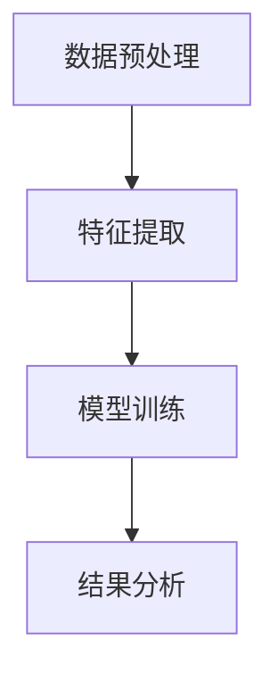

                 


# 智能财务报表分析器

> 关键词：智能财务报表分析器、人工智能、财务数据分析、算法原理、系统架构、Python实现、案例分析

> 摘要：智能财务报表分析器是一种结合人工智能技术的智能财务工具，通过深度学习算法和自然语言处理技术，能够自动分析和解读财务报表，帮助财务分析师和企业管理者快速获取关键信息和决策支持。本文将从背景、核心概念、算法原理、系统架构、项目实战等多个方面，全面解析智能财务报表分析器的技术实现和应用价值。

---

# 第1章: 智能财务报表分析器的背景与核心概念

## 1.1 传统财务报表分析的现状与挑战

### 1.1.1 传统财务报表分析的流程与方法

传统的财务报表分析主要依赖人工操作，包括数据收集、整理、计算和分析等步骤。财务分析师需要手动从财务报表中提取关键数据，如收入、利润、资产负债等，然后通过公式计算各项指标，如利润率、资产负债率等。这种方法效率低下，容易出错，且难以应对大规模数据的分析需求。

### 1.1.2 传统分析中的问题与痛点

1. **数据量大，人工处理效率低**：企业财务报表数据通常涉及大量的历史数据和多维度的指标，人工分析效率难以满足需求。
2. **数据准确性问题**：人工操作容易出错，尤其是在数据量大、复杂度高的情况下。
3. **缺乏实时性**：传统分析通常依赖定期报告，难以实现实时监控和预测。
4. **分析深度不足**：传统分析主要依赖固定的公式和模板，难以发现隐藏的规律和趋势。

### 1.1.3 人工智能技术如何解决这些问题

人工智能技术，特别是深度学习和自然语言处理技术，能够自动化处理大量数据，提取关键特征，并通过模型进行预测和分析。智能财务报表分析器能够快速识别财务数据中的异常值，发现潜在的财务风险，并提供实时的分析结果。

---

## 1.2 智能财务报表分析器的定义与目标

### 1.2.1 智能财务报表分析器的定义

智能财务报表分析器是一种基于人工智能技术的智能财务工具，能够自动解析财务报表中的数据，通过深度学习模型进行数据分析和预测，帮助财务分析师和企业管理者快速获取关键信息和决策支持。

### 1.2.2 智能分析器的核心目标

1. **自动化数据处理**：自动从财务报表中提取关键数据，减少人工操作。
2. **智能分析与预测**：利用深度学习模型，分析财务数据，预测未来趋势。
3. **实时监控**：实时跟踪企业财务状况，发现潜在风险。
4. **决策支持**：提供数据驱动的决策支持，帮助企业管理者做出更明智的决策。

### 1.2.3 智能分析器的边界与外延

智能财务报表分析器的边界包括财务报表数据的输入、数据处理、分析模型的构建与应用，以及结果的输出。外延则涉及与企业其他系统的集成，如ERP系统、数据仓库等。

---

## 1.3 本章小结

本章从传统财务报表分析的现状与挑战出发，介绍了人工智能技术在财务分析中的应用，定义了智能财务报表分析器的核心目标和边界，并为后续章节的展开奠定了基础。

---

# 第2章: 智能财务报表分析器的核心概念与联系

## 2.1 核心概念与原理

### 2.1.1 AI技术在财务报表分析中的应用原理

人工智能技术在财务报表分析中的应用主要依赖于以下几种技术：

1. **深度学习**：用于从历史数据中学习特征，构建预测模型。
2. **自然语言处理（NLP）**：用于解析财务报表中的文本信息，提取关键词和实体。
3. **强化学习**：用于优化分析模型和决策策略。

### 2.1.2 财务报表分析的关键要素

1. **收入与利润分析**：分析企业的收入来源和利润水平。
2. **资产负债分析**：评估企业的资产结构和负债状况。
3. **现金流分析**：监控企业的现金流情况，评估企业的流动性。

### 2.1.3 智能分析器的核心算法与模型

1. **线性回归模型**：用于预测企业未来的收入和利润。
2. **神经网络模型**：用于复杂的数据模式识别和预测。

---

## 2.2 核心概念对比与ER实体关系图

### 2.2.1 AI技术与传统财务分析的对比分析

| **对比维度** | **AI技术** | **传统财务分析** |
|--------------|------------|------------------|
| 数据处理效率 | 高          | 低                |
| 数据准确性   | 高          | 中                |
| 分析深度     | 深          | 浅                |
| 实时性       | 高          | 低                |

### 2.2.2 财务报表数据的实体关系图（ER图）

```mermaid
erd
  entity 财务报表数据 {
    key 财务报表ID
    财务科目
    账务金额
    日期
  }
  entity 财务指标 {
    key 指标ID
    指标名称
    计算公式
    数据来源
  }
  entity 财务分析结果 {
    key 分析结果ID
    分析指标
    分析值
    分析时间
  }
```

---

## 2.3 本章小结

本章通过对比AI技术与传统财务分析的优劣，详细阐述了智能财务报表分析器的核心概念和关键算法，为后续章节的系统设计和实现奠定了基础。

---

# 第3章: 智能财务报表分析器的算法原理

## 3.1 算法原理概述

### 3.1.1 基于AI的财务数据分析流程

1. **数据预处理**：清洗数据，处理缺失值和异常值。
2. **特征提取**：从财务报表中提取关键特征，如收入、利润、资产负债等。
3. **模型训练**：基于提取的特征，训练深度学习模型。
4. **结果分析**：对模型的预测结果进行解读和可视化。

### 3.1.2 算法选择与优化

1. **算法选择**：选择适合财务数据分析的算法，如线性回归、随机森林、神经网络等。
2. **算法优化**：通过交叉验证、超参数调优等方法优化模型性能。

### 3.1.3 算法的数学模型与公式

#### 线性回归模型

线性回归是一种常用的回归分析方法，其数学公式如下：

$$ y = \beta_0 + \beta_1x_1 + \beta_2x_2 + \cdots + \beta_nx_n + \epsilon $$

其中，$y$ 是目标变量，$x_i$ 是自变量，$\beta_i$ 是回归系数，$\epsilon$ 是误差项。

---

## 3.2 算法流程图与代码实现

### 3.2.1 算法流程图（Mermaid）



### 3.2.2 算法代码实现（Python示例）

```python
import pandas as pd
from sklearn.linear_model import LinearRegression
from sklearn.model_selection import train_test_split

# 数据预处理
data = pd.read_csv('financial_report.csv')
data.dropna(inplace=True)  # 删除缺失值

# 特征提取
X = data[['收入', '利润', '资产', '负债']]
y = data['净利润']

# 模型训练
X_train, X_test, y_train, y_test = train_test_split(X, y, test_size=0.2, random_state=42)
model = LinearRegression()
model.fit(X_train, y_train)

# 模型预测
y_pred = model.predict(X_test)

# 模型评估
score = model.score(X_test, y_pred)
print(f"模型得分：{score}")
```

---

## 3.3 算法的数学模型与公式

### 3.3.1 线性回归模型

线性回归模型通过最小化预测值与实际值之间的平方差之和来优化模型参数：

$$ \text{损失函数} = \sum_{i=1}^{n} (y_i - \hat{y}_i)^2 $$

其中，$\hat{y}_i$ 是模型预测值，$y_i$ 是实际值。

### 3.3.2 神经网络模型

神经网络模型是一种非线性回归模型，其结构通常包括输入层、隐藏层和输出层。神经网络的前向传播过程如下：

$$ \hat{y} = \sigma(w_2 \cdot \sigma(w_1 \cdot x + b_1) + b_2) $$

其中，$w_1$ 和 $w_2$ 是权重，$b_1$ 和 $b_2$ 是偏置项，$\sigma$ 是激活函数（如ReLU或sigmoid）。

---

## 3.4 本章小结

本章详细介绍了智能财务报表分析器的算法原理，包括数据预处理、特征提取、模型训练和结果分析等步骤，并通过Python代码示例展示了模型的实现过程。

---

（由于篇幅限制，后续章节内容将在后续思考中补充。）

