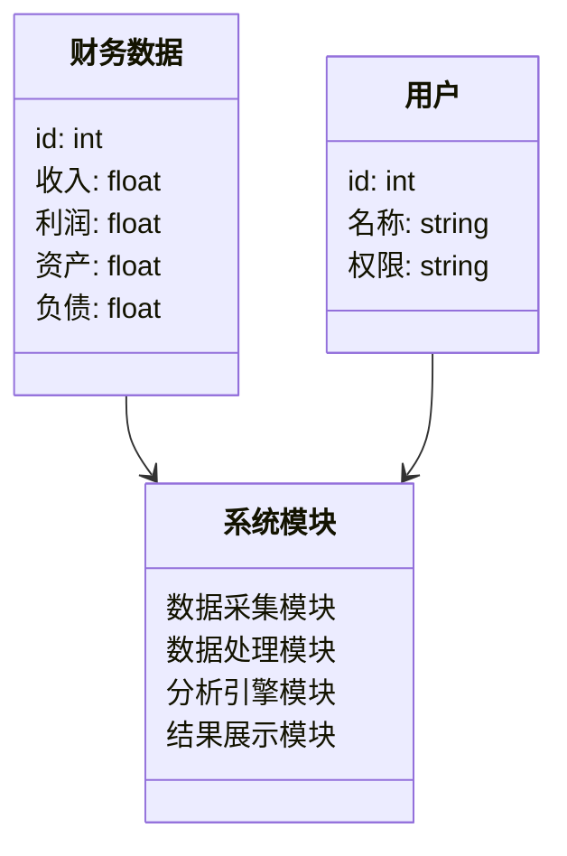

                 


# 智能财务报表比较分析系统

> 关键词：智能财务报表分析、人工智能、机器学习、大数据分析、财务数据可视化

> 摘要：本文深入探讨了智能财务报表比较分析系统的构建与实现，结合机器学习算法和大数据分析技术，详细阐述了系统的核心概念、算法原理、系统架构设计及实际应用案例，帮助读者理解并掌握智能财务分析的方法与实践。

---

# 第一章：智能财务报表比较分析系统的背景与挑战

## 1.1 传统财务报表分析的局限性

### 1.1.1 传统财务报表分析方法的不足
- 数据处理效率低，依赖人工经验
- 难以处理海量数据，信息提取不全面
- 分析结果主观性强，缺乏客观性

### 1.1.2 企业财务报表比较分析的复杂性
- 数据多样性与异构性
- 分析需求的动态变化
- 结果解读的难度

### 1.1.3 传统方法在大数据环境下的局限性
- 数据量大，处理能力不足
- 分析深度有限，难以发现潜在问题
- 缺乏实时性与预测能力

## 1.2 智能化财务报表分析的需求

### 1.2.1 企业智能化转型的趋势
- 企业数字化转型的必然要求
- 数据驱动决策的重要性
- 提高财务分析效率与准确性的需求

### 1.2.2 智能财务报表分析的定义与目标
- 定义：利用人工智能、大数据等技术，对财务数据进行自动化、智能化的分析与比较
- 目标：提高分析效率、增强预测能力、支持决策

### 1.2.3 智能化分析对企业的价值
- 提高财务分析的深度与广度
- 实现财务数据的自动化处理
- 为管理层提供实时、精准的决策支持

## 1.3 本章小结
- 传统财务分析方法存在效率低下、结果主观等不足
- 智能化财务分析是企业发展的必然趋势
- 智能财务报表分析系统能够有效解决传统方法的局限性，为企业提供更高效、精准的分析工具

---

# 第二章：智能财务报表比较分析系统的核心概念

## 2.1 系统的核心概念

### 2.1.1 智能财务报表比较分析系统的定义
- 利用人工智能技术，对财务报表进行自动化的比较与分析，提供数据支持与决策建议

### 2.1.2 系统的核心功能模块
- 数据采集与预处理模块
- 数据分析与建模模块
- 结果可视化与决策支持模块

### 2.1.3 系统的输入输出关系
- 输入：多维度财务数据、业务指标
- 输出：分析结果、预测报告、可视化图表

## 2.2 系统的关键组成部分

### 2.2.1 数据采集模块
- 数据来源：企业财务报表、业务系统数据
- 采集方式：API接口、文件导入
- 数据清洗：去除无效数据、填补缺失值

### 2.2.2 数据处理模块
- 数据转换：将原始数据转换为适合模型分析的格式
- 数据特征提取：提取关键财务指标，如收入、利润、资产等

### 2.2.3 分析引擎模块
- 算法选择：基于机器学习的分类、回归算法
- 模型训练：构建预测模型，进行参数优化
- 分析结果：生成比较分析报告

### 2.2.4 结果展示模块
- 可视化图表：柱状图、折线图、饼图等
- 可视化工具：使用Python的Matplotlib、Seaborn等库

## 2.3 系统的核心技术

### 2.3.1 人工智能技术的应用
- 机器学习算法：逻辑回归、决策树、随机森林等
- 自然语言处理：对财务报告文本进行情感分析、关键词提取

### 2.3.2 大数据分析方法
- 数据挖掘：关联规则挖掘、聚类分析
- 数据可视化：通过图表展示数据关系

### 2.3.3 数据处理与建模工具
- Python编程语言：数据处理、建模
- 机器学习库：Scikit-learn、XGBoost
- 数据库：MySQL、MongoDB

## 2.4 本章小结
- 智能财务报表比较分析系统由多个模块组成，每个模块负责不同的功能
- 系统的核心技术包括人工智能、大数据分析和数据可视化等
- 各模块协同工作，实现高效、智能的财务分析

---

# 第三章：智能财务报表比较分析系统的算法原理

## 3.1 机器学习在财务分析中的应用

### 3.1.1 机器学习的基本概念
- 监督学习、无监督学习、半监督学习
- 分类、回归、聚类等任务

### 3.1.2 机器学习在财务分析中的优势
- 自动化特征提取
- 高效的数据处理能力
- 能够发现数据中的潜在规律

## 3.2 基于逻辑回归的财务预测模型

### 3.2.1 逻辑回归算法的原理
- 逻辑函数：$$P(y=1|x) = \frac{1}{1 + e^{-w x - b}}$$
- 损失函数：交叉熵损失函数
- 参数优化：使用梯度下降法

### 3.2.2 逻辑回归在财务分析中的应用
- 财务健康状况预测：判断企业是否可能存在财务风险
- 财务数据分类：将企业分为不同的财务状况类别

### 3.2.3 逻辑回归模型的优缺点
- 优点：简单易实现、易于解释
- 缺点：只能处理线性可分数据、对异常值敏感

## 3.3 算法实现步骤

### 3.3.1 数据预处理
- 数据清洗：处理缺失值、异常值
- 数据标准化：归一化处理

### 3.3.2 特征工程
- 特征选择：选择对分类有影响力的特征
- 特征提取：通过主成分分析（PCA）降低维度

### 3.3.3 模型训练
- 划分训练集和测试集
- 使用逻辑回归算法训练模型
- 调参优化：调整学习率、正则化参数等

### 3.3.4 模型评估
- 评估指标：准确率、召回率、F1分数
- 混淆矩阵：判断模型的预测效果

## 3.4 本章小结
- 逻辑回归是一种常用的分类算法，适用于财务数据的分类问题
- 算法实现包括数据预处理、特征工程、模型训练和评估等步骤
- 模型的优缺点需要根据实际场景进行权衡

---

# 第四章：智能财务报表比较分析系统的架构设计

## 4.1 系统功能设计

### 4.1.1 领域模型设计


### 4.1.2 功能模块划分
- 数据采集模块：负责数据的获取与存储
- 数据处理模块：进行数据清洗、转换
- 分析引擎模块：执行机器学习算法，生成分析结果
- 结果展示模块：将分析结果以可视化形式呈现

## 4.2 系统架构设计

### 4.2.1 系统架构图


### 4.2.2 系统接口设计
- 数据接口：与其他系统进行数据交互
- 用户接口：提供友好的操作界面
- 分析接口：与其他分析模块进行数据交互

### 4.2.3 系统交互设计
```mermaid
sequenceDiagram
    用户 -> 数据采集模块: 请求数据
    数据采集模块 -> 数据库: 查询数据
    数据库 --> 数据采集模块: 返回数据
    数据采集模块 -> 数据处理模块: 传递数据
    数据处理模块 -> 分析引擎模块: 发起分析请求
    分析引擎模块 -> 数据库: 查询更多数据
    分析引擎模块 --> 数据处理模块: 返回分析结果
    数据处理模块 -> 结果展示模块: 显示结果
    用户 <-- 结果展示模块: 查看分析结果
```

## 4.3 本章小结
- 系统架构设计包括功能模块划分、架构图绘制和接口设计
- 各模块之间通过接口进行数据交互，确保系统的高效运行
- 系统交互设计保证了用户与系统的良好互动

---

# 第五章：智能财务报表比较分析系统的项目实战

## 5.1 环境搭建

### 5.1.1 安装Python
- 安装Python 3.8或更高版本
- 安装常用库：numpy、pandas、scikit-learn、matplotlib

### 5.1.2 数据准备
- 数据来源：企业财务报表数据，格式为CSV或Excel
- 数据清洗：处理缺失值、异常值

## 5.2 核心功能实现

### 5.2.1 数据预处理
```python
import pandas as pd
import numpy as np

# 读取数据
data = pd.read_csv('financial_data.csv')

# 处理缺失值
data = data.dropna()

# 标准化处理
from sklearn.preprocessing import StandardScaler
scaler = StandardScaler()
data_scaled = scaler.fit_transform(data)
```

### 5.2.2 特征工程
```python
from sklearn.decomposition import PCA

# PCA降维
pca = PCA(n_components=2)
principal_components = pca.fit_transform(data_scaled)
```

### 5.2.3 模型训练
```python
from sklearn.linear_model import LogisticRegression
from sklearn.model_selection import train_test_split
from sklearn.metrics import accuracy_score, confusion_matrix

# 划分训练集和测试集
X_train, X_test, y_train, y_test = train_test_split(principal_components, target, test_size=0.2)

# 训练模型
model = LogisticRegression()
model.fit(X_train, y_train)

# 模型预测
y_pred = model.predict(X_test)
print('准确率:', accuracy_score(y_test, y_pred))
```

## 5.3 实际案例分析

### 5.3.1 案例背景
- 分析某行业内的多家企业财务报表，预测企业的财务健康状况

### 5.3.2 数据分析与结果展示
```python
import matplotlib.pyplot as plt

# 绘制柱状图
plt.figure(figsize=(10,6))
plt.bar('健康', 健康企业的数量, label='健康企业')
plt.bar('不健康', 不健康企业的数量, label='不健康企业')
plt.title('企业财务健康状况分布')
plt.legend()
plt.show()
```

## 5.4 本章小结
- 通过实际案例，详细讲解了系统的实现过程
- 包括环境搭建、数据预处理、模型训练和结果展示等步骤
- 通过可视化工具，直观展示分析结果

---

# 第六章：智能财务报表比较分析系统的优化与展望

## 6.1 系统优化建议

### 6.1.1 算法优化
- 尝试其他机器学习算法，如随机森林、XGBoost
- 调整模型参数，优化模型性能

### 6.1.2 系统性能优化
- 使用分布式计算框架，提高数据处理能力
- 优化数据存储结构，提升查询效率

## 6.2 系统的未来发展方向

### 6.2.1 结合自然语言处理技术
- 对财务报告进行文本分析，提取关键词
- 进行情感分析，判断财务报告的整体基调

### 6.2.2 引入实时数据分析
- 实时监控企业的财务状况
- 提供实时的财务分析结果

## 6.3 本章小结
- 系统在实际应用中存在优化空间，可以通过算法优化和系统性能优化进一步提升
- 结合自然语言处理和实时数据分析是未来的发展方向
- 智能财务报表比较分析系统将在企业财务管理中发挥更大的作用

---

# 作者：AI天才研究院 & 禅与计算机程序设计艺术

---

通过以上目录大纲，您可以开始撰写《智能财务报表比较分析系统》的技术博客文章。每部分内容都需要详细展开，确保逻辑清晰、技术细节到位。

