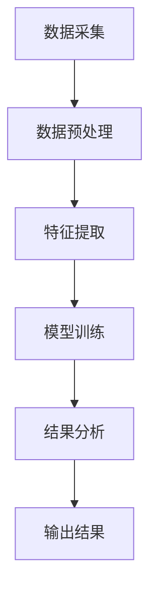

                 


# 智能财务报表舞弊检测系统

> 关键词：智能财务报表、舞弊检测、人工智能、机器学习、数据挖掘

> 摘要：本文深入探讨了智能财务报表舞弊检测系统的核心概念、算法原理、系统架构及实际应用。通过详细分析财务报表舞弊的背景、现状及检测技术，结合深度学习和自然语言处理等人工智能技术，构建了一套高效的智能财务舞弊检测系统。文章内容涵盖系统设计、算法实现、项目实战等多方面，为读者提供全面的技术指导。

---

# 第一部分: 智能财务报表舞弊检测系统背景介绍

## 第1章: 智能财务报表舞弊检测系统概述

### 1.1 财务报表舞弊的背景与现状

#### 1.1.1 财务报表舞弊的定义与类型
- **定义**：财务报表舞弊是指企业通过虚构、隐瞒、虚增、虚减等手段，故意提供虚假财务信息的行为。
- **类型**：
  - 虚增收入：通过夸大收入或提前确认收入。
  - 虚减成本：通过减少成本支出或延迟确认成本。
  - 虚增资产：通过虚增资产价值或隐瞒资产损失。
  - 虚减负债：通过隐藏负债或推迟负债确认。

#### 1.1.2 财务报表舞弊的常见手段
- **虚构交易**：通过编造交易记录，虚增收入或资产。
- **调节会计科目**：通过调整会计科目余额，掩盖真实的财务状况。
- **隐瞒信息**：故意隐瞒重大信息或关联交易。
- **财务造假**：通过伪造财务报表数据，骗取投资者信任。

#### 1.1.3 财务报表舞弊对企业的影响
- **误导投资者**：虚假的财务报表会误导投资者做出错误的决策。
- **损害企业声誉**：财务舞弊行为会严重损害企业的信誉。
- **面临法律风险**：企业可能因财务舞弊而面临法律诉讼和罚款。

### 1.2 智能财务报表舞弊检测的必要性

#### 1.2.1 传统财务报表审核的局限性
- **人工审核效率低**：传统财务报表审核主要依赖人工检查，效率低下，且容易受到主观因素影响。
- **复杂性高**：财务报表涉及复杂的会计科目和交易，人工审核难以全面覆盖。
- **成本高**：人工审核需要大量时间和资源，企业需要投入大量成本。

#### 1.2.2 人工智能在财务舞弊检测中的优势
- **高效性**：人工智能技术可以快速处理大量数据，提高审核效率。
- **准确性**：通过机器学习模型，可以发现隐藏在数据中的异常模式，提高检测准确性。
- **实时性**：智能系统可以实时监控财务数据，及时发现潜在的舞弊行为。

#### 1.2.3 智能财务报表舞弊检测的行业需求
- **监管要求**：随着监管力度的加大，企业需要更加透明和准确的财务报表。
- **市场需求**：投资者和债权人越来越依赖财务报表做出决策，对财务信息的准确性要求不断提高。
- **技术进步**：人工智能技术的发展为智能财务舞弊检测提供了技术支持。

### 1.3 智能财务报表舞弊检测系统的核心概念

#### 1.3.1 系统的目标与功能
- **目标**：通过智能技术，自动识别财务报表中的异常数据和舞弊行为。
- **功能**：
  - 数据采集：从财务系统中获取原始数据。
  - 数据预处理：清洗数据，提取特征。
  - 模型训练：利用机器学习算法训练舞弊检测模型。
  - 结果分析：输出检测结果，并提供改进建议。

#### 1.3.2 系统的输入与输出
- **输入**：财务报表数据，包括收入、成本、资产、负债等。
- **输出**：检测结果，包括正常交易和异常交易的分类，以及可能的舞弊行为的预警。

#### 1.3.3 系统的边界与外延
- **边界**：系统仅处理财务报表数据，不涉及其他业务数据。
- **外延**：系统可以与其他财务管理系统集成，提供更全面的财务监控。

## 1.4 本章小结

### 1.4.1 财务报表舞弊的背景与现状
- 财务报表舞弊对企业声誉和法律风险有严重影响。
- 传统审核方式效率低下，难以应对复杂情况。

### 1.4.2 智能检测的必要性
- 人工智能技术的应用可以提高审核效率和准确性。
- 满足监管和市场需求，推动企业财务管理的智能化。

### 1.4.3 系统的核心概念与目标
- 系统通过智能技术实现财务报表的自动审核，帮助企业和监管机构及时发现和预防财务舞弊行为。

---

# 第2章: 智能财务报表舞弊检测系统的核心概念与联系

## 2.1 财务报表舞弊检测的核心原理

### 2.1.1 数据预处理与特征提取
- **数据清洗**：去除无效数据，处理缺失值。
- **特征提取**：从财务数据中提取关键特征，如收入增长率、毛利率、资产周转率等。

### 2.1.2 模型训练与结果分析
- **模型选择**：选择适合的机器学习算法，如随机森林、支持向量机（SVM）等。
- **结果分析**：分析模型输出的结果，判断是否存在舞弊行为。

### 2.1.3 系统优化与性能提升
- **优化算法**：通过调整模型参数，提高检测准确率。
- **数据增强**：增加训练数据，避免过拟合。

## 2.2 核心概念对比分析

### 2.2.1 不同技术的优缺点对比
| 技术 | 优点 | 缺点 |
|------|------|------|
| 传统审核 | 人工审核细致 | 效率低，成本高 |
| 机器学习 | 高效准确 | 需要大量数据训练 |
| 深度学习 | 能处理复杂模式 | 计算资源需求高 |

### 2.2.2 系统实体关系图（ER图）

```mermaid
erDiagram
    customer[CUSTOMER] {
        code : string
        name : string
        transaction : string
        date : date
    }
    transaction[TRANSACTION] {
        id : integer
        amount : float
        type : string
        status : string
    }
    fraud_detection[FRAUD_DETECTION] {
        id : integer
        result : boolean
        confidence : float
    }
    CUSTOMER "1--N" TRANSACTIONS
    TRANSACTIONS "N--N" FRAUD_DETECTION
```

## 2.3 算法原理与流程

### 2.3.1 数据流与算法流程图



## 2.4 本章小结

### 2.4.1 核心概念与原理
- 系统通过数据预处理、特征提取和模型训练，实现财务报表舞弊的智能检测。
- 不同技术有其优缺点，需要根据实际情况选择合适的方案。

### 2.4.2 系统实体关系与流程
- 系统通过数据流和算法流程图展示从数据采集到结果输出的完整流程。
- 实体关系图展示了系统中各实体之间的关联关系。

---

## 总结

以上是《智能财务报表舞弊检测系统》的目录大纲，内容涵盖了从背景介绍到系统设计的各个方面。每一章都详细展开，确保读者能够全面理解智能财务报表舞弊检测系统的原理和应用。接下来，我将继续按照这一结构，逐步撰写完整的技术博客文章。

