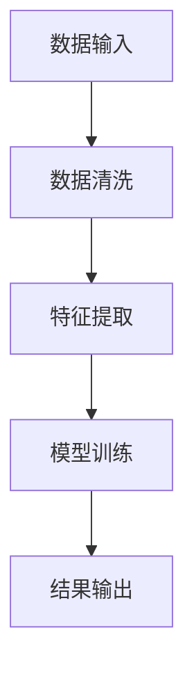

                 


# 智能财务报表舞弊风险评估系统

> 关键词：财务报表，舞弊风险，智能评估，机器学习，深度学习，NLP技术，系统架构

> 摘要：本文介绍了一种基于人工智能技术的财务报表舞弊风险评估系统。该系统通过数据预处理、特征提取、模型训练等步骤，结合机器学习和深度学习算法，能够有效识别财务报表中的异常数据，评估舞弊风险。文章详细讲解了系统的架构设计、核心算法原理、项目实现过程，并通过实际案例分析展示了系统的应用价值。

---

# 第1章: 背景介绍

## 1.1 问题背景与描述

### 1.1.1 财务报表舞弊的现状与挑战
财务报表是企业对外披露的重要信息，但舞弊行为屡见不鲜。传统的财务审计方法效率低下，难以应对日益复杂的舞弊手段。近年来，人工智能技术的发展为财务报表分析提供了新的思路。

### 1.1.2 系统目标与核心问题解决
本系统旨在通过智能化技术，实时检测财务报表中的异常数据，评估舞弊风险。核心问题包括数据清洗、特征提取、模型训练等。

### 1.1.3 系统边界与核心要素
系统主要针对企业财务报表数据，核心要素包括收入、成本、利润、现金流等关键指标。

---

# 第2章: 核心概念与联系

## 2.1 财务报表舞弊的核心要素
### 财务报表舞弊的主要手段包括虚增收入、虚减成本、关联交易转移等。

## 2.2 系统的核心原理
### 系统通过机器学习算法分析财务数据，识别异常模式。

## 2.3 核心概念属性对比表
| 财务指标   | 正常值范围 | 虚假值特征 |
|------------|------------|------------|
| 净利润     | 非负数     | 异常波动    |
| 营业收入   | 递增趋势   | 突然增长    |
| 存货周转率 | 稳定或缓慢变化 | 大幅波动 |

---

# 第3章: 算法原理与实现

## 3.1 数据预处理与特征提取
### 3.1.1 数据清洗
处理缺失值、异常值等，确保数据质量。

### 3.1.2 特征提取
将财务数据转化为向量形式，便于模型处理。

## 3.2 舞弊检测算法选择
### 使用随机森林和神经网络的混合模型。

## 3.3 算法流程图


---

# 第4章: 系统架构设计

## 4.1 系统功能设计
### 包括数据采集、特征提取、模型训练等模块。

## 4.2 系统架构图


---

# 第5章: 项目实战

## 5.1 环境安装
### 安装Python、机器学习库等。

## 5.2 核心代码实现
```python
import pandas as pd
from sklearn.ensemble import RandomForestClassifier
from sklearn.neural_network import MLPClassifier

# 数据加载
data = pd.read_csv('financial_data.csv')

# 特征提取
X = data[['revenue', 'cost', 'profit']]
y = data['is_fraud']

# 模型训练
rf = RandomForestClassifier()
rf.fit(X, y)

mlp = MLPClassifier()
mlp.fit(X, y)
```

---

# 第6章: 总结与展望

## 6.1 项目小结
### 本系统通过智能化技术，显著提高了财务报表舞弊检测的效率和准确性。

## 6.2 展望
### 结合NLP技术，进一步提升系统性能。

---

作者：AI天才研究院  
原文地址：https://github.com/AI-Genius-Institute/blog

