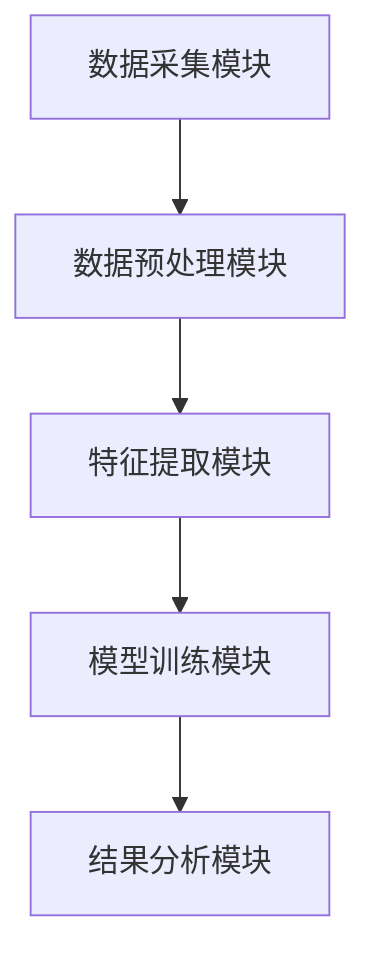
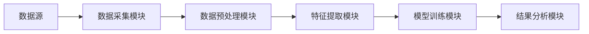
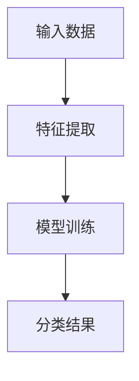
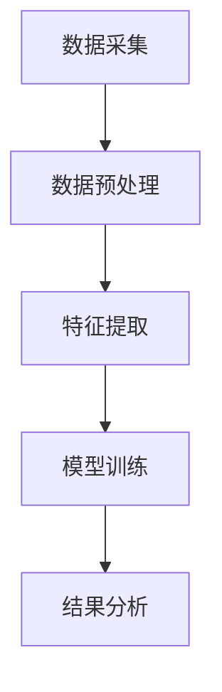

                 


# 智能财务舞弊模式识别系统

> **关键词**：智能财务、舞弊模式识别、人工智能、数据挖掘、系统架构

> **摘要**：本文详细探讨了智能财务舞弊模式识别系统的设计与实现。通过结合人工智能和大数据分析技术，提出了一种高效的财务舞弊检测方法。文章从背景介绍、核心概念、算法原理、系统架构、项目实战等多个方面展开，旨在为读者提供一个全面的视角，帮助理解如何利用先进技术有效识别财务舞弊模式。

---

## 第1章：智能财务舞弊模式识别系统背景与意义

### 1.1 财务舞弊的现状与挑战

财务舞弊是企业在经营过程中常见的问题，严重破坏了市场经济的健康发展。传统财务舞弊识别方法依赖人工审查，效率低且容易受到主观因素的影响。随着企业规模的扩大和数据量的激增，传统的识别方法已难以满足需求。因此，引入智能技术成为必然趋势。

#### 1.1.1 财务舞弊的定义与类型
财务舞弊是指企业在财务报表或交易记录中故意提供虚假信息的行为。常见的舞弊类型包括虚构交易、虚增收入、隐瞒支出、虚减负债等。

#### 1.1.2 传统财务舞弊识别的局限性
- 人工审查效率低下，难以处理大量数据。
- 依赖经验判断，主观性强，容易遗漏复杂的舞弊模式。
- 对新兴的舞弊手法缺乏敏感性。

#### 1.1.3 智能化识别的必要性
智能化识别系统能够快速处理大量数据，利用机器学习算法发现隐藏的模式和异常，显著提高了识别效率和准确性。

### 1.2 智能财务舞弊模式识别系统的概念

#### 1.2.1 系统的定义与核心目标
智能财务舞弊模式识别系统通过收集和分析企业的财务数据，利用人工智能技术识别潜在的舞弊行为，辅助企业进行财务风险管理。

#### 1.2.2 系统的关键特征与优势
- **数据驱动**：基于大量财务数据进行分析。
- **实时监控**：能够实时检测异常交易。
- **高准确性**：利用机器学习算法提高识别的准确性。

#### 1.2.3 系统的应用场景与边界
应用场景包括企业财务审计、银行交易监控、税务申报等。边界在于仅识别潜在的舞弊信号，需结合人工审查进行最终判断。

---

## 第2章：智能财务舞弊模式识别系统的核心概念

### 2.1 财务舞弊模式识别的原理

#### 2.1.1 数据驱动的识别方法
系统通过收集企业的财务数据，提取关键特征，利用机器学习算法进行分类和预测。

#### 2.1.2 智能算法的应用原理
智能算法能够从数据中学习，发现隐藏的模式，从而识别异常行为。

#### 2.1.3 模式识别的数学基础
模式识别涉及分类、聚类等数学方法，用于将数据分为正常和异常两类。

### 2.2 核心概念与联系

#### 2.2.1 实体关系图（ER图）
```mermaid
erd
  entity 财务数据 {
    key 交易日期 Date
    key 交易金额 numeric
    状态 Status
  }
  entity 异常行为 {
    关联 财务数据.交易日期 Date
    关联 财务数据.交易金额 numeric
  }
```

#### 2.2.2 模块间的关系与依赖


#### 2.2.3 系统功能与数据流图


---

## 第3章：数据采集与预处理

### 3.1 数据来源与采集方法

#### 3.1.1 财务报表数据的采集
从企业的财务系统中获取资产负债表、利润表等数据。

#### 3.1.2 交易流水数据的获取
从企业的交易记录中获取每一笔交易的详细信息。

#### 3.1.3 其他相关数据的整合
整合企业的人事数据、供应链数据等，以提供更全面的分析视角。

### 3.2 数据清洗与预处理

#### 3.2.1 数据去重与缺失值处理
利用数据清洗工具（如Pandas）处理重复数据和缺失值。

#### 3.2.2 数据标准化与归一化
对数据进行标准化处理，使其具有可比性。

#### 3.2.3 数据增强与特征提取
通过特征工程提取有助于模型识别的关键特征。

---

## 第4章：算法原理与实现

### 4.1 监督学习算法

#### 4.1.1 支持向量机（SVM）


#### 4.1.2 随机森林（Random Forest）
随机森林是一种基于决策树的集成学习算法，通过多棵树的投票结果进行分类。

#### 4.1.3 神经网络模型（如CNN、RNN）
神经网络模型能够处理复杂的非线性关系，适用于高维数据的分析。

### 4.2 无监督学习算法

#### 4.2.1 K-means聚类
K-means算法将数据分成K个簇，用于发现数据中的自然分组。

#### 4.2.2 层次聚类
层次聚类算法通过构建树状结构，将数据分成不同的层次。

#### 4.2.3 主成分分析（PCA）
PCA用于降维，提取数据的主要特征。

---

## 第5章：系统架构设计

### 5.1 系统模块划分

#### 5.1.1 模块划分
系统主要模块包括数据采集模块、数据预处理模块、特征提取模块、模型训练模块和结果分析模块。

#### 5.1.2 模块关系


#### 5.1.3 系统架构图


---

## 第6章：项目实战

### 6.1 环境配置

#### 6.1.1 安装Python环境
使用Anaconda安装Python 3.8及以上版本。

#### 6.1.2 安装相关库
安装Pandas、Scikit-learn、XGBoost等库。

### 6.2 核心实现

#### 6.2.1 数据采集与预处理
```python
import pandas as pd

# 数据采集
data = pd.read_csv('financial_data.csv')

# 数据清洗
data.dropna(inplace=True)
data = data[~data.duplicated()]
```

#### 6.2.2 特征提取与建模
```python
from sklearn.ensemble import RandomForestClassifier
from sklearn.model_selection import train_test_split

# 特征提取
features = data[['amount', 'date', 'status']]
label = data['is_fraud']

# 数据分割
X_train, X_test, y_train, y_test = train_test_split(features, label, test_size=0.2)

# 模型训练
model = RandomForestClassifier()
model.fit(X_train, y_train)
```

### 6.3 案例分析

#### 6.3.1 数据分析与可视化
使用Matplotlib对数据进行可视化分析，识别异常交易模式。

#### 6.3.2 结果解读与优化
根据模型输出的结果，分析误判和漏判的情况，优化模型参数。

---

## 第7章：总结与展望

### 7.1 总结
智能财务舞弊模式识别系统通过结合人工智能和大数据技术，显著提高了财务舞弊识别的效率和准确性。系统设计合理，功能完善，能够满足企业的需求。

### 7.2 展望
未来，随着技术的发展，系统可以进一步优化，例如引入深度学习模型、实时监控功能等，以应对更复杂的舞弊手法。

---

## 作者：AI天才研究院 & 禅与计算机程序设计艺术

---

**声明**：本文内容为AI天才研究院原创，未经授权不得转载。

