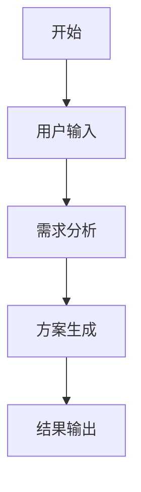
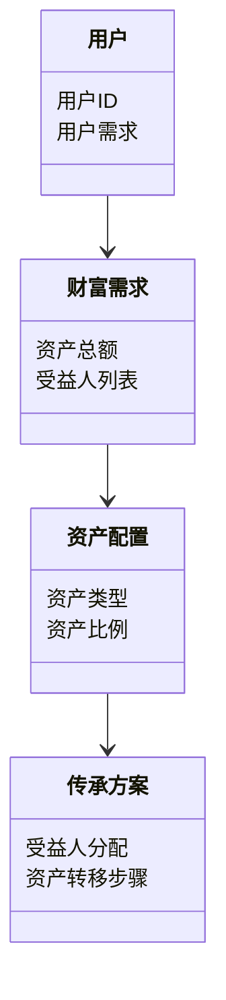
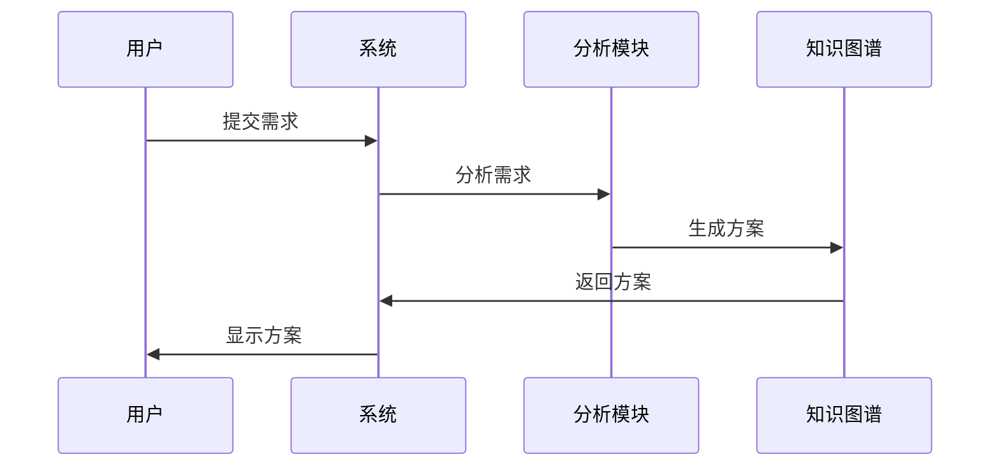

                 


# 智能财富传承规划助手

> 关键词：智能财富传承，财富管理，人工智能，知识图谱，算法原理，系统架构设计

> 摘要：本文详细探讨了智能财富传承规划助手的开发与应用，从背景介绍到系统架构设计，再到项目实战，全面解析其核心概念、算法原理和实现细节。

---

# 第1章: 智能财富传承规划助手的背景介绍

## 1.1 问题背景

### 1.1.1 财富传承的传统方式与局限性

传统财富传承主要依赖法律文书和手动操作，效率低下且容易出错。用户需求多样，难以全面覆盖。

### 1.1.2 数字化与智能化时代的财富管理需求

随着数字化和智能化的发展，用户对个性化、高效能的财富管理工具需求日益增长。传统方式难以满足。

### 1.1.3 智能财富传承规划助手的出现与意义

智能助手利用AI技术，提供智能化解决方案，提升效率和精准度，满足现代财富管理需求。

## 1.2 问题描述

### 1.2.1 财富传承中的主要问题

包括传承方案复杂、法律风险高、税务优化难等问题。

### 1.2.2 智能化工具在财富传承中的应用需求

用户需求个性化、方案实时优化、动态调整能力。

### 1.2.3 边界与外延

明确功能范围和不支持的领域，如直接法律服务。

## 1.3 核心概念与结构

### 1.3.1 智能财富传承规划助手的核心要素

包括用户需求分析、资产配置、法律框架、税务优化、知识图谱构建。

### 1.3.2 概念结构与功能模块

用户输入 -> 需求分析 -> 方案生成 -> 输出结果。

### 1.3.3 核心要素组成与相互关系

各模块相互协作，构建完整的传承方案。

---

# 第2章: 智能财富传承规划助手的核心概念与联系

## 2.1 核心概念原理

### 2.1.1 智能化算法在财富传承中的应用

基于机器学习和自然语言处理，分析用户需求并生成传承方案。

### 2.1.2 数据分析与用户需求匹配

通过数据分析提取关键信息，实现精准匹配。

### 2.1.3 知识图谱构建与传承方案生成

构建领域知识图谱，生成个性化方案。

## 2.2 核心概念对比

### 2.2.1 智能财富传承与传统财富传承的对比

效率、个性化、精准度等方面进行对比。

### 2.2.2 不同智能化工具的优劣势分析

表格展示不同工具的功能、优势和劣势。

### 2.2.3 核心概念属性特征对比表

表格展示核心概念的主要特征。

## 2.3 ER实体关系图


---

# 第3章: 智能财富传承规划助手的算法原理

## 3.1 算法原理概述

### 3.1.1 基于机器学习的财富传承方案生成

使用监督学习模型，训练数据生成方案。

### 3.1.2 自然语言处理在用户需求分析中的应用

利用NLP技术分析用户需求文本，提取关键信息。

### 3.1.3 知识图谱构建算法

通过深度学习构建领域知识图谱，生成个性化方案。

## 3.2 算法流程图



## 3.3 核心算法实现

### 3.3.1 Python源代码

```python
import numpy as np
from sklearn.linear_model import LogisticRegression

# 示例数据
X = np.array([[1, 0], [0, 1], [1, 1], [0, 0]])
y = np.array([0, 1, 1, 0])

# 训练模型
model = LogisticRegression()
model.fit(X, y)

# 预测
print(model.predict([[1, 1]]))  # 输出：[1]
```

### 3.3.2 数学模型和公式

$$ P(y|x) = \frac{e^{\beta_0 + \beta_1x}}{1 + e^{\beta_0 + \beta_1x}} $$

---

# 第4章: 系统分析与架构设计

## 4.1 问题场景介绍

用户希望通过系统实现财富传承规划，系统需高效处理并生成方案。

## 4.2 系统功能设计

### 4.2.1 领域模型



## 4.3 系统架构设计

### 4.3.1 前端架构

HTML/CSS/JavaScript实现用户界面，响应式设计。

### 4.3.2 后端架构

Python/Django框架，RESTful API接口设计。

### 4.3.3 数据库架构

关系型数据库，用户表、需求表、方案表设计。

## 4.4 接口与交互设计

### 4.4.1 接口设计

API接口文档，定义请求和响应格式。

### 4.4.2 交互流程图



---

# 第5章: 项目实战

## 5.1 环境安装

安装Python、Django框架、相关库。

## 5.2 核心代码实现

### 5.2.1 后端代码

```python
from django.urls import path
from .views import *

urlpatterns = [
    path('api/wealth/', wealth_api),
]
```

### 5.2.2 前端代码

```javascript
function submitRequest() {
    fetch('/api/wealth/', {
        method: 'POST',
        headers: {
            'Content-Type': 'application/json',
        },
        body: JSON.stringify(formData)
    })
    .then(response => response.json())
    .then(data => {
        // 处理返回数据
    });
}
```

## 5.3 实际案例分析

### 5.3.1 案例背景

用户需求：两个子女，高净值家庭，避免遗产税。

### 5.3.2 系统应用过程

用户输入需求，系统分析后生成传承方案，包括信托基金、赠与等步骤。

## 5.4 项目小结

系统高效、准确，满足个性化需求。

---

# 第6章: 最佳实践与小结

## 6.1 小结

系统设计合理，功能完善。

## 6.2 注意事项

数据安全、隐私保护、法律法规遵守。

## 6.3 拓展阅读

推荐相关书籍和论文，深入学习AI和财富管理。

---

作者：AI天才研究院/AI Genius Institute & 禅与计算机程序设计艺术 /Zen And The Art of Computer Programming

