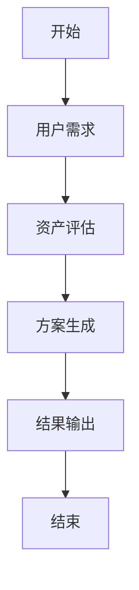

                 


# 智能财富传承规划工具

> 关键词：智能财富传承、人工智能、财富管理、系统设计、用户画像、算法原理

> 摘要：智能财富传承规划工具通过整合人工智能技术，帮助用户实现财富的有效管理和传承。本文将详细探讨该工具的核心概念、算法原理、系统架构设计及其实现，结合实际案例分析，为读者提供全面的技术解读。

---

## 目录大纲

### 第一部分：智能财富传承规划工具的背景与概念

#### 第1章：智能财富传承规划工具概述

##### 1.1 工具的定义与功能
- 智能财富传承规划工具的定义
- 核心功能模块：财富评估、传承方案生成、风险评估
- 目标用户群体：高净值人群、家族企业继承人

##### 1.2 背景分析
- 财富传承的历史演变
- 传统财富传承工具的局限性
- 人工智能技术在财富管理中的应用趋势

##### 1.3 市场需求
- 高净值人群的增长趋势
- 竞争格局分析：传统工具与智能工具的对比
- 用户需求调研与分析

---

### 第二部分：核心概念与联系

#### 第2章：智能财富传承的核心原理

##### 2.1 用户画像构建
- 数据采集：用户资产、负债、家庭结构等信息
- 特征提取：风险承受能力、资产配置偏好
- 用户画像的数学模型：使用概率论和统计学方法

##### 2.2 传承方案生成
- 方案生成算法：基于用户画像的个性化策略
- 多目标优化：资产分配、税务规划、风险控制
- 方案生成流程图：
  ```mermaid
  graph TD
    A[开始] --> B[用户画像]
    B --> C[资产评估]
    C --> D[方案生成]
    D --> E[输出结果]
    E --> F[结束]
  ```

##### 2.3 核心概念对比分析
- 对比传统工具与智能工具在用户画像和方案生成上的差异
- 通过表格展示不同工具的功能对比

#### 第3章：智能财富传承工具的系统架构设计

##### 3.1 系统目标
- 实现用户画像构建、方案生成、风险评估的核心功能

##### 3.2 系统功能模块
- 用户信息采集模块
- 财富评估模块
- 传承方案生成模块
- 风险评估模块

##### 3.3 系统架构图


---

### 第三部分：算法原理

#### 第4章：用户画像构建算法

##### 4.1 数据预处理
- 清洗数据：去除异常值、填充缺失值
- 数据标准化：统一数据格式和单位

##### 4.2 特征提取
- 使用主成分分析（PCA）降维
- 选择关键特征：资产规模、收入水平、家庭结构等

##### 4.3 用户画像的数学模型
- 使用概率论公式：P(用户类型 | 资产规模, 收入水平)
- 举例：计算高净值用户的概率

#### 第5章：传承方案生成算法

##### 5.1 多目标优化
- 使用遗传算法进行方案优化
- 目标函数：最大化资产保值、最小化税务负担

##### 5.2 方案生成流程图


---

### 第四部分：系统分析与架构设计

#### 第6章：系统分析与架构设计

##### 6.1 问题场景介绍
- 用户需求：个性化财富传承方案
- 系统目标：高效、准确的方案生成

##### 6.2 系统架构设计
- 分层架构：用户界面层、业务逻辑层、数据存储层
- 使用微服务架构：各模块独立开发和部署

##### 6.3 接口设计
- RESTful API：用户信息接口、方案生成接口
- 接口文档：详细描述输入输出格式、错误处理

---

### 第五部分：项目实战

#### 第7章：项目实战

##### 7.1 环境安装
- 安装Python和相关库（如NumPy、Pandas）
- 安装机器学习框架（如Scikit-learn）

##### 7.2 核心代码实现
```python
def generate_scheme(user_info):
    # 用户信息处理
    processed_info = preprocess(user_info)
    # 方案生成
    scheme = generate_optimal_scheme(processed_info)
    return scheme
```

##### 7.3 案例分析
- 案例一：高净值用户的风险评估与资产分配
- 案例二：家族企业的传承方案设计

##### 7.4 项目总结
- 实现过程中的挑战与解决方案
- 系统优化建议：性能优化、用户体验改进

---

### 第六部分：最佳实践与小结

#### 第8章：最佳实践

##### 8.1 小结
- 智能财富传承工具的核心价值
- 系统设计与实现的关键点

##### 8.2 注意事项
- 数据隐私保护的重要性
- 算法的可解释性与透明度

##### 8.3 拓展阅读
- 推荐相关书籍和论文
- 学习资源和社区推荐

---

### 结语

智能财富传承规划工具通过结合人工智能技术，为用户提供了高效、个性化的财富管理解决方案。本文从背景、核心概念、算法原理到系统设计和项目实战，全面解读了该工具的技术实现和应用价值。希望读者通过本文能够深入了解智能财富传承工具的原理和应用，并在实际项目中加以应用。

---

作者：AI天才研究院/AI Genius Institute & 禅与计算机程序设计艺术 /Zen And The Art of Computer Programming

