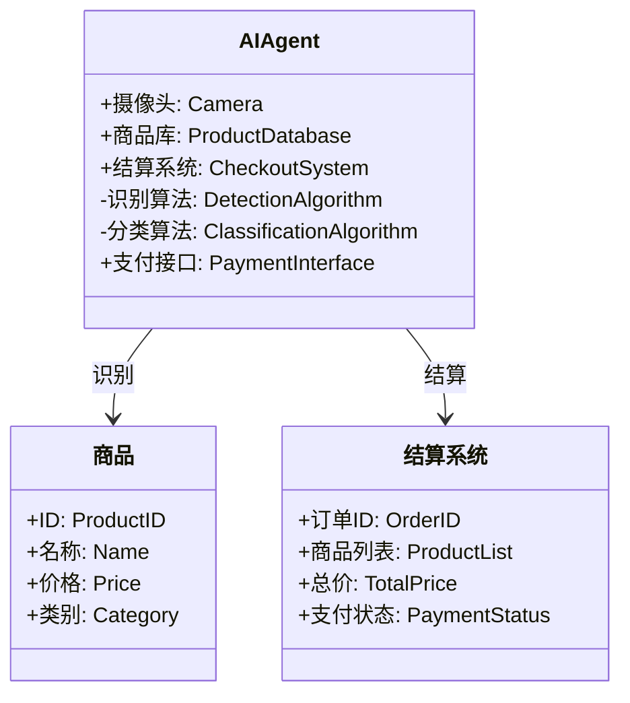
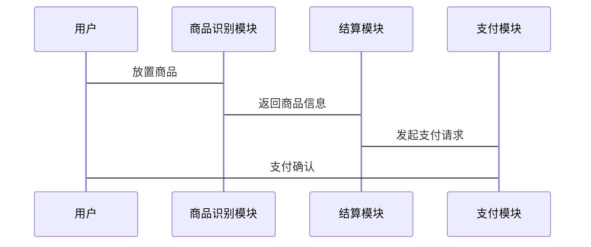
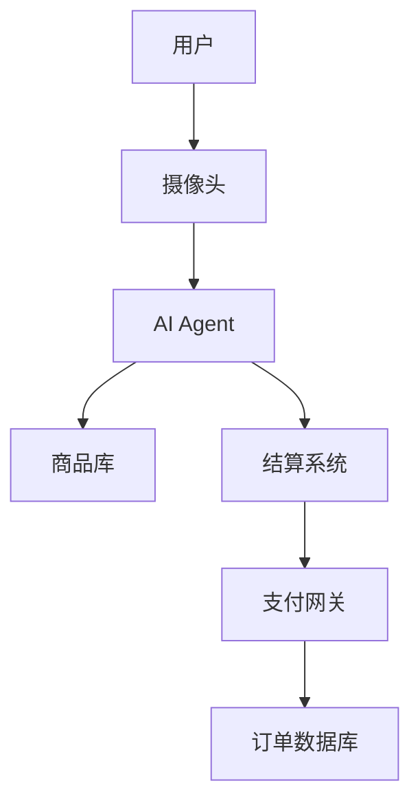

                 


# 智能购物车：AI Agent的商品识别与结算

## 关键词：
智能购物车，AI Agent，商品识别，结算系统，目标检测，图像识别，计算机视觉

## 摘要：
本文详细探讨了AI Agent在智能购物车中的应用，重点分析了商品识别与结算的算法原理和系统设计。文章从背景介绍、核心概念、算法实现、系统架构到项目实战，全面解析了智能购物车的实现过程，为读者提供了深入的技术见解。

---

## 第1章: 背景与问题背景

### 1.1 智能购物车的背景与现状
#### 1.1.1 传统购物车的局限性
传统购物车依赖人工扫描商品条码，存在效率低、误操作率高、用户体验差等问题。特别是在超市等场景中，消费者需要手动将商品放入购物车并逐一扫描，这不仅浪费时间，还容易出错。

#### 1.1.2 AI技术在购物车中的应用潜力
AI技术，尤其是计算机视觉和目标检测技术的快速发展，为购物车的智能化提供了可能。通过摄像头实时捕捉商品信息，AI Agent能够自动识别商品并完成结算，极大地提升了购物效率和用户体验。

#### 1.1.3 智能购物车的市场现状与发展趋势
目前，智能购物车技术在全球范围内逐渐普及，尤其是在无人值守的零售店中。随着AI和计算机视觉技术的不断进步，未来的智能购物车将更加智能化、便捷化，甚至能够实现完全无人化购物体验。

### 1.2 问题背景与目标
#### 1.2.1 商品识别与结算的核心问题
商品识别是智能购物车的关键技术，核心问题包括如何准确识别不同形状、大小和品牌的商品，如何处理光照、角度等外界干扰因素，以及如何实现高效、准确的结算。

#### 1.2.2 智能购物车的痛点分析
传统购物车的痛点包括效率低、人工成本高、用户体验差等。而智能购物车的痛点则集中在技术实现难度大、系统稳定性要求高、用户隐私保护等问题上。

#### 1.2.3 问题解决的目标与边界
智能购物车的目标是实现商品的自动识别和结算，减少人工干预，提升购物效率和用户体验。系统的边界包括商品识别的范围、环境适应性、系统的安全性与稳定性等。

### 1.3 智能购物车的核心概念
#### 1.3.1 AI Agent的基本定义
AI Agent是一种智能体，能够感知环境、自主决策并执行任务。在智能购物车中，AI Agent负责商品识别、结算等任务。

#### 1.3.2 商品识别与结算的实现方式
通过摄像头采集商品图像，利用计算机视觉技术进行目标检测和图像识别，AI Agent能够自动识别商品并完成结算。

#### 1.3.3 智能购物车的系统架构
智能购物车的系统架构包括硬件部分（摄像头、传感器等）和软件部分（AI算法、结算系统等），两者协同工作以实现智能化功能。

---

## 第2章: AI Agent与计算机视觉的核心概念

### 2.1 AI Agent的基本原理
#### 2.1.1 AI Agent的定义与分类
AI Agent可以分为简单反射Agent和基于模型的Agent。简单反射Agent通过预定义规则响应输入，而基于模型的Agent则通过内部模型进行推理和决策。

#### 2.1.2 AI Agent的核心功能与特点
AI Agent的核心功能包括感知、决策、执行和自适应学习。其特点在于高效性、智能性和可扩展性。

#### 2.1.3 AI Agent在智能购物车中的应用
在智能购物车中，AI Agent负责实时感知商品信息、识别商品并完成结算，大大提升了购物效率。

### 2.2 计算机视觉的基础原理
#### 2.2.1 计算机视觉的基本概念
计算机视觉是利用计算机模拟人类视觉系统，通过图像处理和分析实现对视觉信息的理解。

#### 2.2.2 图像处理与目标检测的关键技术
目标检测技术包括定位和识别两个步骤，常用算法有YOLO、Faster R-CNN等。

#### 2.2.3 商品识别的挑战与解决方案
商品识别的挑战包括光照变化、商品相似性、背景干扰等。解决方案包括数据增强、模型优化和多任务学习等。

### 2.3 AI Agent与计算机视觉的结合
#### 2.3.1 AI Agent在商品识别中的作用
AI Agent通过计算机视觉技术实现商品识别，能够准确识别多种商品并进行分类。

#### 2.3.2 计算机视觉在结算系统中的应用
通过图像识别技术，结算系统能够自动计算商品总价并生成账单。

#### 2.3.3 两者的协同工作原理
AI Agent通过计算机视觉技术获取商品信息，结合决策系统完成商品识别和结算。

---

## 第3章: 商品识别与结算的算法原理

### 3.1 目标检测算法
#### 3.1.1 YOLO算法的原理与流程
YOLO算法通过将图像分成网格，预测每个网格中的目标及其位置和类别概率。

#### 3.1.2 Faster R-CNN的实现细节
Faster R-CNN通过区域建议网络生成候选框，再通过RoI Pooling和全连接层进行分类和回归。

#### 3.1.3 目标检测的评价指标与优化方法
常用的评价指标包括精确率、召回率和F1分数。优化方法包括数据增强、模型调整和损失函数优化。

### 3.2 图像识别算法
#### 3.2.1 CNN网络的基本结构
CNN通过卷积层提取图像特征，再通过池化层降低计算量，最后通过全连接层进行分类。

#### 3.2.2 商品图像分类的实现流程
商品图像分类的流程包括图像预处理、特征提取、分类器训练和预测。

#### 3.2.3 图像识别的误差分析与改进
常见误差包括过拟合和欠拟合，可以通过数据增强、正则化和优化器调整来改进。

### 3.3 商品识别的数学模型
#### 3.3.1 深度学习模型的数学基础
深度学习模型基于矩阵运算和激活函数，通过多层神经网络实现特征提取和分类。

#### 3.3.2 目标检测的损失函数与优化目标
常用的损失函数包括分类损失和回归损失，优化目标是最小化损失函数。

#### 3.3.3 商品分类的决策边界与概率计算
决策边界是分类器在特征空间中的分界线，概率计算基于似然函数和先验概率。

---

## 第4章: 智能购物车系统的分析与架构设计

### 4.1 问题场景分析
#### 4.1.1 用户需求与功能分析
用户需求包括商品识别、结算、支付等功能，功能分析包括需求优先级和可行性评估。

#### 4.1.2 系统的性能需求与约束条件
系统需要满足高吞吐量、低延迟和高可用性，约束条件包括硬件资源和数据隐私。

#### 4.1.3 系统的可用性与安全性要求
系统需要具备容错能力和安全性，防止数据泄露和恶意攻击。

### 4.2 系统功能设计
#### 4.2.1 领域模型设计（Mermaid类图）


#### 4.2.2 系统功能模块划分
系统功能模块包括商品识别模块、结算模块、支付模块和用户界面模块。

#### 4.2.3 功能模块之间的交互关系


### 4.3 系统架构设计
#### 4.3.1 系统架构的分层设计
系统架构分为感知层、决策层和执行层，每层负责不同的功能。

#### 4.3.2 系统架构的组件与交互（Mermaid架构图）


#### 4.3.3 系统接口设计和交互流程
系统接口包括商品识别接口、结算接口和支付接口，交互流程通过API进行。

---

## 第5章: 项目实战

### 5.1 环境安装
安装Python、TensorFlow、OpenCV等依赖库，配置开发环境。

### 5.2 核心代码实现
#### 5.2.1 目标检测代码
```python
import tensorflow as tf
from tensorflow.keras.models import Model
from tensorflow.keras.layers import Input, Conv2D, MaxPooling2D, Flatten, Dense

# 定义模型
input_tensor = Input(shape=(224, 224, 3))
x = Conv2D(32, (3, 3), activation='relu')(input_tensor)
x = MaxPooling2D((2, 2))(x)
x = Conv2D(64, (3, 3), activation='relu')(x)
x = MaxPooling2D((2, 2))(x)
x = Flatten()(x)
x = Dense(128, activation='relu')(x)
output = Dense(num_classes, activation='softmax')(x)
model = Model(inputs=input_tensor, outputs=output)
```

#### 5.2.2 结算系统代码
```python
import requests

def initiate_payment(amount):
    data = {
        "amount": amount,
        "currency": "CNY"
    }
    response = requests.post("http://paymentservice/api/checkout", json=data)
    return response.json()
```

### 5.3 案例分析与代码解读
通过实际案例分析，解读代码实现和系统运行流程。

### 5.4 项目小结
总结项目实现的关键点和经验教训，提出改进建议。

---

## 第6章: 最佳实践与小结

### 6.1 最佳实践 tips
- 数据预处理是关键，需注重数据多样性和均衡性。
- 模型优化需结合实际场景，选择合适的算法和参数。
- 系统设计需注重模块化和可扩展性。

### 6.2 小结
智能购物车通过AI Agent和计算机视觉技术的结合，实现了商品识别与结算的自动化，极大地提升了购物效率和用户体验。

### 6.3 注意事项
- 数据隐私保护需高度重视。
- 系统稳定性直接影响用户体验，需做好容错和异常处理。
- 模型的泛化能力需通过持续学习和优化来提升。

### 6.4 拓展阅读
建议读者深入学习目标检测和图像识别的前沿技术，关注智能购物车领域的最新动态。

---

## 作者：AI天才研究院 & 禅与计算机程序设计艺术

---

本文通过系统化的分析和详细的代码实现，全面介绍了智能购物车的实现过程和关键技术。希望读者能够通过本文，深入了解AI Agent和计算机视觉在商品识别与结算中的应用，为实际项目提供参考和启发。

