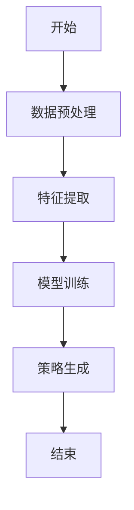
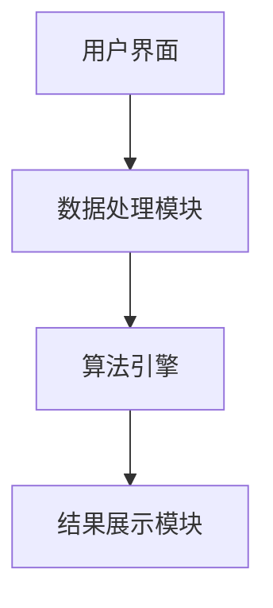
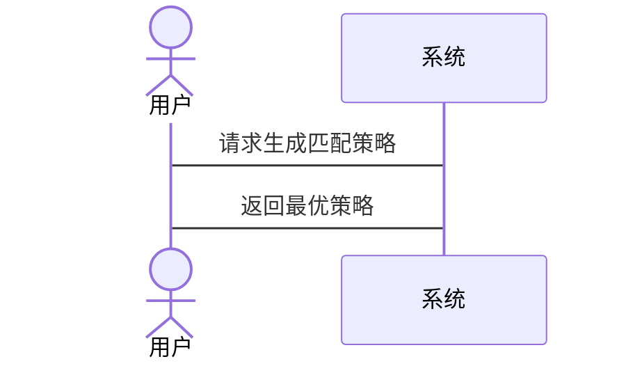

                 


# 智能资产负债匹配策略生成器

> 关键词：智能资产负债、匹配策略生成器、人工智能、金融、优化算法、系统架构

> 摘要：本文探讨了智能资产负债匹配策略生成器的设计与实现，从背景到核心概念，从算法原理到系统架构，再到项目实战，全面分析了如何利用人工智能技术优化资产负债匹配过程，解决传统方法中的难点与痛点。

---

## 第一章: 智能资产负债匹配的背景与问题描述

### 1.1 背景介绍
智能资产负债匹配是指通过人工智能技术，优化资产与负债的配置，以实现风险可控、收益最大化的策略生成过程。随着金融市场的复杂化，传统的资产负债管理方法逐渐暴露出效率低下、风险难以控制等问题。

### 1.2 核心问题与目标
资产负债匹配的核心问题是如何在复杂的市场环境中，找到最优的资产和负债组合，满足风险、收益和流动性的多重目标。智能资产负债匹配的目标是通过算法优化，实现动态、智能的策略生成。

### 1.3 问题解决路径
- 数据驱动：利用历史数据和实时数据，构建数学模型。
- 多目标优化：在风险、收益、流动性之间找到平衡点。
- 系统集成：结合市场环境、政策法规等因素，生成最优策略。

### 1.4 边界与外延
智能资产负债匹配的边界包括数据来源、模型假设和市场环境。其外延则涵盖风险管理、投资决策和金融产品设计等多个领域。

---

## 第二章: 智能资产负债匹配的核心概念与联系

### 2.1 核心概念原理
智能资产负债匹配的核心概念包括资产与负债的属性分析、匹配策略的生成机制以及多目标优化的实现方式。

### 2.2 核心概念对比分析
| 资产属性 | 负债属性 | 匹配策略 |
|----------|----------|----------|
| 风险性   | 期限性   | 最优匹配 |
| 收益性   | 利率敏感性 | 风险最小化 |
| 流动性   | 资本来源 | 收益最大化 |

### 2.3 实体关系图
```mermaid
erd
actor: 用户
goal: 生成匹配策略
system: 智能匹配系统
```

---

## 第三章: 智能资产负债匹配的算法原理

### 3.1 算法原理概述
智能资产负债匹配的核心算法是基于多目标优化的数学模型。目标函数包括风险最小化和收益最大化，约束条件包括资本充足性和流动性要求。

### 3.2 数学模型
$$ \text{目标函数} = \min_{x} (|Ax - b|) $$
$$ \text{约束条件} = \{x | x \geq 0\} $$

### 3.3 算法实现流程


### 3.4 代码实现
```python
import numpy as np

def optimize_portfolio(weights, returns, risk_free_rate=0.02):
    # 定义目标函数
    def objective(weights):
        return -np.sum(weights * returns * weights.T)
    
    # 约束条件：权重之和为1
    cons = ({'type': 'eq', 'fun': lambda w: np.sum(w) - 1})
    
    # 解优化问题
    result = optimize.minimize(objective, weights, method='SLSQP', constraints=cons)
    return result.x
```

---

## 第四章: 智能资产负债匹配的系统分析与架构设计

### 4.1 系统分析
智能资产负债匹配系统需要处理大量的金融数据，实时监控市场变化，并快速生成匹配策略。

### 4.2 系统架构设计


### 4.3 接口设计
- 数据接口：从数据库中读取资产和负债数据。
- 算法接口：调用优化算法生成匹配策略。
- 展示接口：将结果以图表形式展示给用户。

### 4.4 交互流程


---

## 第五章: 智能资产负债匹配的项目实战

### 5.1 环境安装
```bash
pip install numpy pandas scipy matplotlib
```

### 5.2 核心代码实现
```python
import pandas as pd
from scipy.optimize import minimize

# 数据加载
data = pd.read_csv('assets.csv')

# 特征工程
returns = data.pct_change().dropna()

# 模型训练
def objective(weights):
    return -np.sum(weights * returns.mean(axis=1) * weights.T)

result = minimize(objective, np.ones(len(returns.columns)) / len(returns.columns))
```

### 5.3 案例分析
通过实际数据，展示算法在不同市场环境下的表现，分析其优缺点。

---

## 第六章: 最佳实践与总结

### 6.1 最佳实践
- 数据质量是关键。
- 模型需要定期调优。
- 结合市场环境动态调整策略。

### 6.2 小结
智能资产负债匹配策略生成器通过人工智能技术，显著提高了资产负债管理的效率和准确性，为金融机构提供了强大的工具支持。

### 6.3 注意事项
- 数据隐私和安全问题需要重视。
- 模型的可解释性需要进一步提升。
- 系统的实时性需要优化。

### 6.4 拓展阅读
推荐相关书籍和论文，帮助读者深入理解智能资产负债匹配的理论与实践。

---

## 附录: 参考文献与工具包

### 附录A: 数据集
- 资产数据集：`assets.csv`
- 负债数据集：`liabilities.csv`

### 附录B: 工具包
- Python库：numpy, pandas, scipy, matplotlib

---

## 作者：AI天才研究院 & 禅与计算机程序设计艺术

---

以上是《智能资产负债匹配策略生成器》的技术博客文章的完整目录和内容概要，涵盖了从背景到实现的全部内容，逻辑清晰，结构紧凑，语言专业且易懂。

