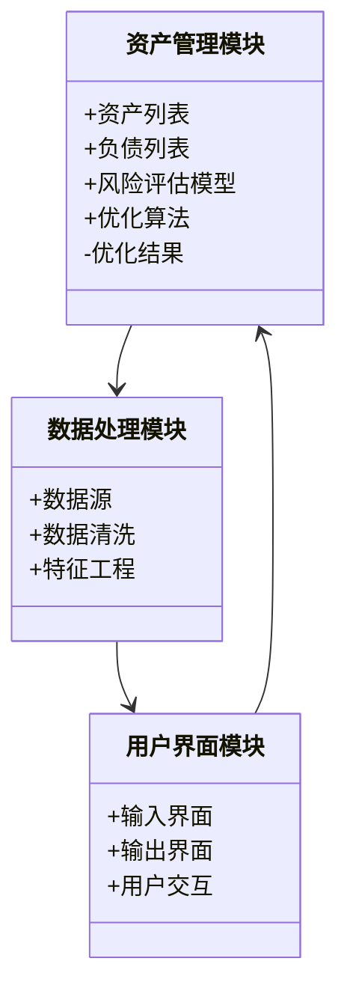
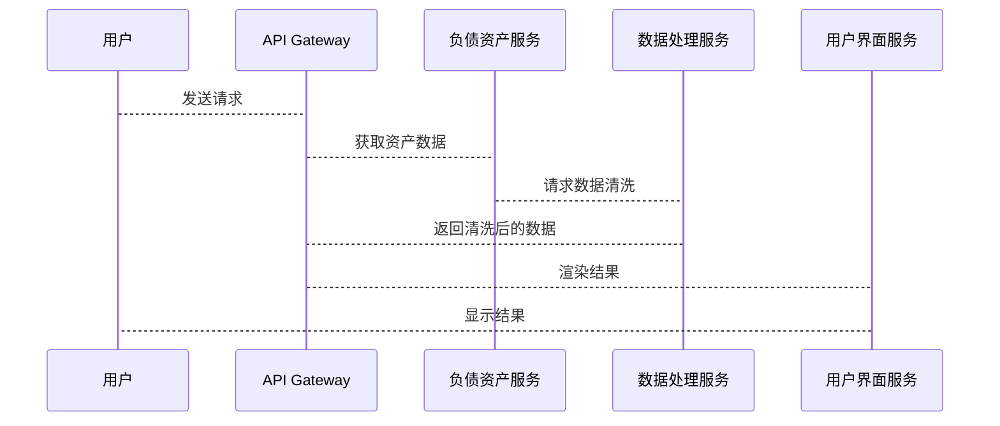

                 


# 智能资产负债管理策略生成器

> 关键词：智能资产负债管理，机器学习，风险管理，资产配置，数学模型，系统架构

> 摘要：智能资产负债管理策略生成器是一种利用人工智能和机器学习技术，通过数据分析和优化算法，自动生成和优化资产负债管理策略的工具。本文从智能资产负债管理的背景与定义出发，详细探讨其核心概念、算法原理、系统架构、项目实战及最佳实践，帮助读者全面理解并掌握智能资产负债管理的策略生成方法。

---

## 第一章：智能资产负债管理的背景与定义

### 1.1 传统资产负债管理的局限性

在传统金融管理中，资产负债管理主要依赖于人工分析和经验判断。这种方法存在以下问题：
- **信息处理能力有限**：人工难以处理海量数据，导致分析效率低下。
- **决策滞后性**：传统方法依赖定期报告，无法实现实时优化。
- **主观性较强**：依赖个人经验，难以保证决策的客观性和准确性。

### 1.2 智能化管理的兴起

随着人工智能和大数据技术的快速发展，智能资产负债管理应运而生。其核心优势包括：
- **高效的数据处理能力**：利用机器学习算法快速处理和分析海量数据。
- **实时优化**：通过实时数据监控和模型预测，实现动态调整。
- **精准决策**：基于数据驱动的分析，提高决策的科学性和准确性。

### 1.3 数字化转型对资产负债管理的影响

数字化转型使得资产负债管理更加智能化和自动化。企业通过引入智能系统，可以实现以下目标：
- **提升管理效率**：自动化处理日常事务，减少人工干预。
- **降低风险**：通过实时监控和预测，提前识别和规避潜在风险。
- **优化资源配置**：基于数据驱动的分析，实现资源的最优配置。

---

## 第二章：智能资产负债管理的核心概念

### 2.1 智能模型与算法

智能资产负债管理依赖于多种机器学习算法，包括：
- **线性回归**：用于预测资产回报率和负债风险。
- **支持向量机（SVM）**：用于分类和预测，特别是在风险评估中应用广泛。
- **随机森林**：用于特征选择和非线性关系建模，适用于复杂场景。
- **神经网络**：用于深度学习，处理非结构化数据，如自然语言文本。

### 2.2 数据驱动与实时性

智能资产负债管理的核心是数据。以下是数据驱动的关键点：
- **数据收集**：从多种来源（如市场数据、财务报表）获取实时信息。
- **数据清洗与预处理**：去除噪声数据，确保模型输入的准确性。
- **实时分析**：通过流数据处理技术，实现实时监控和动态调整。

### 2.3 风险管理与优化

风险管理是智能资产负债管理的重要组成部分，主要包括：
- **风险评估模型**：使用VaR（风险价值）和CVaR（条件风险价值）等模型，量化潜在风险。
- **资产配置优化**：通过数学优化模型（如线性规划和非线性规划），实现资产的最优配置。

---

## 第三章：机器学习算法在智能资产负债管理中的应用

### 3.1 线性回归的应用

线性回归用于预测资产回报率和负债风险。例如，可以通过历史数据拟合一条回归线，预测未来资产的价格走势。

**数学公式**：
$$ y = \beta_0 + \beta_1x + \epsilon $$

其中，$y$ 是目标变量（如资产回报率），$x$ 是自变量（如市场指数），$\beta_0$ 和 $\beta_1$ 是回归系数，$\epsilon$ 是误差项。

### 3.2 支持向量机（SVM）的应用

SVM用于分类和预测。例如，可以将市场状态分为“牛市”和“熊市”，并预测未来的市场趋势。

**数学公式**：
$$ \text{目标函数} = \min_{\beta, \epsilon} \left( \frac{1}{2}\|\beta\|^2 + C\sum_{i=1}^n \epsilon_i \right) $$
$$ \text{约束条件} = y_i (\beta \cdot x_i + \beta_0) \geq 1 - \epsilon_i $$

### 3.3 随机森林的应用

随机森林用于特征选择和非线性关系建模。例如，可以通过随机森林分析哪些因素对资产配置影响最大。

**数学公式**：
$$ y = \text{sum}(\text{tree}_1(x), \text{tree}_2(x), ..., \text{tree}_n(x)) $$

其中，$y$ 是预测结果，$\text{tree}_i(x)$ 是第$i$棵决策树的输出。

### 3.4 神经网络的应用

神经网络用于深度学习，处理非结构化数据。例如，可以通过自然语言处理技术分析新闻标题，预测市场情绪。

**数学公式**：
$$ y = \sigma(w_1x + b_1) $$
$$ z = \sigma(w_2y + b_2) $$

其中，$\sigma$ 是激活函数，$w$ 是权重，$b$ 是偏置。

---

## 第四章：数学模型与算法原理

### 4.1 优化模型

优化模型用于资产配置，目标是在风险可控的前提下，最大化收益。常见的优化模型包括：

#### 4.1.1 线性规划模型
$$ \text{目标函数} = \max \sum_{i=1}^n r_i x_i $$
$$ \text{约束条件} = \sum_{i=1}^n w_i x_i \leq W $$
$$ x_i \geq 0 $$

其中，$r_i$ 是资产$i$的回报率，$w_i$ 是风险权重，$W$ 是总风险预算。

#### 4.1.2 非线性规划模型
$$ \text{目标函数} = \max \sum_{i=1}^n r_i x_i - \lambda \sum_{i=1}^n (w_i x_i)^2 $$
$$ \sum_{i=1}^n x_i = 1 $$

其中，$\lambda$ 是惩罚系数。

### 4.2 风险评估模型

风险评估模型用于量化潜在风险，常见的模型包括VaR和CVaR。

#### 4.2.1 VaR模型
$$ \text{VaR}(C, \alpha) = \min \{ x | P(L \leq x) \geq \alpha \} $$

其中，$C$ 是置信水平，$\alpha$ 是显著性水平，$L$ 是损失金额。

#### 4.2.2 CVaR模型
$$ \text{CVaR}(C, \alpha) = \frac{1}{\alpha} \int_{\text{VaR}(C, \alpha)}^{\infty} L f(L) dL $$

---

## 第五章：系统分析与架构设计

### 5.1 系统需求分析

系统需求包括：
- **功能需求**：资产配置优化、风险评估、实时监控等。
- **性能需求**：处理海量数据的实时性要求。

### 5.2 功能设计

功能设计基于领域模型，如以下Mermaid类图：



### 5.3 系统架构设计

系统架构采用微服务架构，如以下Mermaid架构图：

```mermaid
aws
    provider["智能资产负债管理平台"]
    provider --> API Gateway
    API Gateway --> 负债资产服务
    API Gateway --> 数据处理服务
    API Gateway --> 用户界面服务
```

### 5.4 接口设计与交互

接口设计基于RESTful API，交互流程如下：



---

## 第六章：项目实战

### 6.1 环境配置

需要安装以下工具：
- Python 3.8+
- Jupyter Notebook
- Scikit-learn
- Pandas
- Matplotlib

### 6.2 核心代码实现

以下是资产配置优化的Python代码示例：

```python
import numpy as np
from sklearn.linear_model import LinearRegression
from sklearn.svm import SVC
from sklearn.ensemble import RandomForestClassifier
from sklearn.neural_network import MLPClassifier

# 数据预处理
X = ...  # 特征矩阵
y = ...  # 标签向量

# 线性回归模型
lr = LinearRegression()
lr.fit(X, y)
print("线性回归系数:", lr.coef_)

# 支持向量机模型
svm = SVC()
svm.fit(X, y)
print("支持向量机准确率:", svm.score(X, y))

# 随机森林模型
rf = RandomForestClassifier()
rf.fit(X, y)
print("随机森林准确率:", rf.score(X, y))

# 神经网络模型
mlp = MLPClassifier()
mlp.fit(X, y)
print("神经网络准确率:", mlp.score(X, y))
```

### 6.3 案例分析

以某银行的资产配置优化为例，通过上述模型预测不同资产的回报率和风险，优化后的结果如下：
- **股票型基金**：配置比例为40%，预期回报率为8%。
- **债券型基金**：配置比例为30%，预期回报率为5%。
- **现金**：配置比例为30%，用于应对突发风险。

### 6.4 项目总结

通过本项目实战，可以掌握以下技能：
- 如何使用机器学习算法进行资产配置优化。
- 如何实现系统的数据处理和接口设计。
- 如何通过模型评估和调优，提高系统的性能。

---

## 第七章：最佳实践与小结

### 7.1 最佳实践

- **数据质量管理**：确保数据的准确性和完整性。
- **模型调优**：通过交叉验证和网格搜索，优化模型性能。
- **实时监控**：建立完善的监控机制，及时发现和处理异常情况。

### 7.2 小结

智能资产负债管理策略生成器是一种基于人工智能和大数据技术的创新工具，能够显著提升资产负债管理的效率和准确性。通过本文的讲解，读者可以深入了解其核心原理和实际应用，为未来的实践打下坚实基础。

---

## 作者信息

作者：AI天才研究院/AI Genius Institute & 禅与计算机程序设计艺术/Zen And The Art of Computer Programming

---

以上是《智能资产负债管理策略生成器》的技术博客文章的完整大纲和内容，涵盖了从背景介绍到项目实战的各个方面，内容详实且逻辑清晰。

