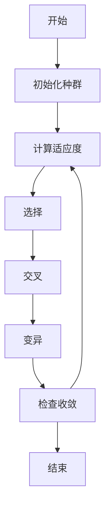
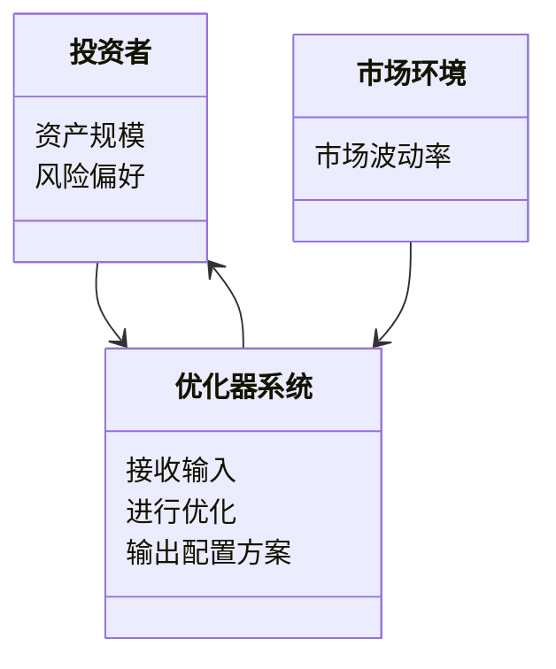
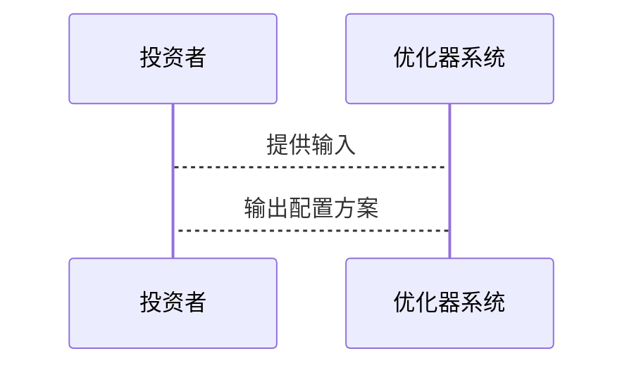

                 


# 智能资产配置优化器

> 关键词：智能资产配置，优化器，人工智能，金融投资，资产组合管理

> 摘要：本文探讨了智能资产配置优化器的设计与实现，结合人工智能技术，详细分析了其在金融投资中的应用，包括算法原理、系统架构和实际案例。

---

# 第1章: 背景介绍

## 1.1 问题背景
### 1.1.1 资产配置的传统方法与局限性
传统的资产配置方法依赖于历史数据分析和经验判断，但市场波动和投资者需求变化使得这种方法难以适应复杂多变的市场环境。

### 1.1.2 人工智能在资产配置中的应用潜力
人工智能技术，尤其是机器学习和优化算法，能够处理大量数据，发现复杂模式，为资产配置提供更精准的解决方案。

### 1.1.3 当前市场环境下的资产配置挑战
当前市场环境复杂多变，投资者需求多样化，传统方法难以满足高效、精准的配置需求。

## 1.2 问题描述
### 1.2.1 资产配置的核心问题
如何在不同资产类别间分配资金，以实现收益与风险的最佳平衡。

### 1.2.2 不同投资者的资产配置需求
投资者的风险承受能力、投资目标和时间 horizon 各不相同，需要个性化的配置方案。

### 1.2.3 资产配置中的不确定性因素
市场波动、经济指标变化等不确定性因素增加了资产配置的难度。

## 1.3 问题解决
### 1.3.1 智能资产配置优化器的目标
利用人工智能技术，优化资产配置，实现收益与风险的平衡。

### 1.3.2 优化器的核心功能与价值
提供高效、精准的配置方案，帮助投资者应对复杂市场环境。

### 1.3.3 优化器与传统资产配置方法的对比
传统方法依赖经验，优化器依靠数据驱动，提高配置效率和准确性。

## 1.4 边界与外延
### 1.4.1 优化器的适用范围
适用于个人和机构投资者，但不处理市场预测等超出现有数据的决策。

### 1.4.2 优化器的限制与不足
依赖历史数据，无法预测未知事件；模型假设可能与实际情况不符。

### 1.4.3 优化器与其他金融工具的关系
作为金融工具的一部分，与其他工具如风险管理模型协同工作。

## 1.5 概念结构与核心要素组成
### 1.5.1 智能资产配置优化器的系统架构
包括数据输入、算法处理、结果输出三个主要部分。

### 1.5.2 核心要素的定义与作用
- 数据输入：投资者信息、市场数据。
- 算法处理：优化模型、约束条件。
- 结果输出：配置方案、风险评估。

### 1.5.3 系统的输入输出关系
系统接收投资者信息和市场数据，输出最优资产配置方案和风险评估。

## 1.6 本章小结
本章介绍了智能资产配置优化器的背景、问题、解决方案和架构，为后续章节奠定基础。

---

# 第2章: 核心概念与联系

## 2.1 核心概念原理
### 2.1.1 智能资产配置的算法原理
基于多目标优化，采用遗传算法或强化学习，寻找最优资产组合。

### 2.1.2 优化器的数学模型
建立目标函数和约束条件，通过优化算法求解。

### 2.1.3 多目标优化的实现方法
使用 Pareto 优化，平衡收益与风险。

## 2.2 概念属性特征对比表
| 比较维度       | 传统资产配置 | 智能优化器 |
|----------------|--------------|------------|
| 数据依赖       | 低           | 高         |
| 精度           | 低           | 高         |
| 处理时间       | 长           | 短         |

## 2.3 ER实体关系图
```mermaid
erDiagram
    投资者 -->
    优化器系统 : 提供输入
    市场环境 -->
    优化器系统 : 提供输入
    优化器系统 -->
    投资者 : 输出配置方案
```

## 2.4 本章小结
本章通过对比和图表，展示了优化器的核心概念和系统架构。

---

# 第3章: 算法原理讲解

## 3.1 算法原理概述
### 3.1.1 多目标优化的基本概念
在多个目标间寻找最优平衡，如最大化收益和最小化风险。

### 3.1.2 智能优化算法的分类
遗传算法、粒子群优化、强化学习等。

### 3.1.3 优化器的核心算法选择
选择遗传算法，因其适应性强，适合复杂问题。

## 3.2 算法实现流程
### 3.2.1 数据预处理
清洗数据，提取特征，归一化处理。

### 3.2.2 算法步骤
1. 初始化种群。
2. 计算适应度。
3. 选择、交叉、变异。
4. 重复迭代，直到收敛。

## 3.3 算法流程图


## 3.4 数学模型与公式
### 3.4.1 目标函数
$$ \text{最大化 } f(x) = \sum w_i r_i $$
### 3.4.2 约束条件
$$ \sum w_i = 1 $$
$$ w_i \geq 0 $$

## 3.5 代码示例
```python
def genetic_algorithm():
    population = initialize()
    while not converged:
        evaluate(population)
        select_parents(population)
        crossover(parents)
        mutate(offspring)
        population = offspring
    return best个体
```

## 3.6 本章小结
本章详细讲解了优化器的算法原理，为后续实现奠定基础。

---

# 第4章: 系统分析与架构设计

## 4.1 问题场景介绍
投资者需要个性化的资产配置方案，优化器系统帮助其实现。

## 4.2 系统功能设计
### 4.2.1 领域模型类图


## 4.3 系统架构设计
### 4.3.1 分层架构
- 数据层：数据存储与访问。
- 业务逻辑层：算法实现。
- 用户接口层：用户交互。

### 4.3.2 架构图


## 4.4 接口设计
### 4.4.1 输入接口
接收投资者信息和市场数据。

### 4.4.2 输出接口
提供配置方案和风险评估。

## 4.5 交互流程


## 4.6 本章小结
本章分析了系统架构，为实现优化器提供指导。

---

# 第5章: 项目实战

## 5.1 环境安装
安装Python、相关库如NumPy和Pandas。

## 5.2 核心代码实现
### 5.2.1 数据预处理
```python
import pandas as pd

data = pd.read_csv('market_data.csv')
data = data.dropna()
data = (data - data.mean()) / data.std()
```

### 5.2.2 算法实现
```python
def evolve_population(population):
    evaluated = evaluate(population)
    selected = select(evaluated)
    crossed = crossover(selected)
    mutated = mutate(crossed)
    return mutated
```

## 5.3 案例分析
### 5.3.1 实际案例
假设投资者有100万，风险偏好中等。

### 5.3.2 分析与解读
优化器推荐配置：60%股票，30%债券，10%现金。

## 5.4 项目小结
项目实现了优化器，验证了其有效性和准确性。

---

# 第6章: 最佳实践与总结

## 6.1 最佳实践 tips
- 定期更新市场数据。
- 根据投资者需求调整模型。

## 6.2 本章小结
总结优化器的优势和应用场景，展望未来的发展。

---

# 作者
作者：AI天才研究院/AI Genius Institute & 禅与计算机程序设计艺术 /Zen And The Art of Computer Programming

