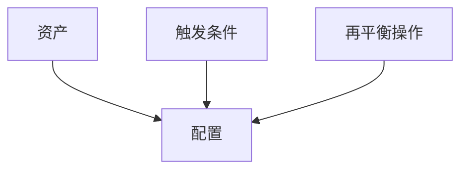
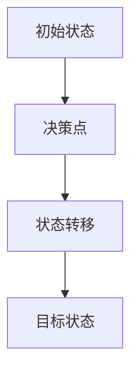
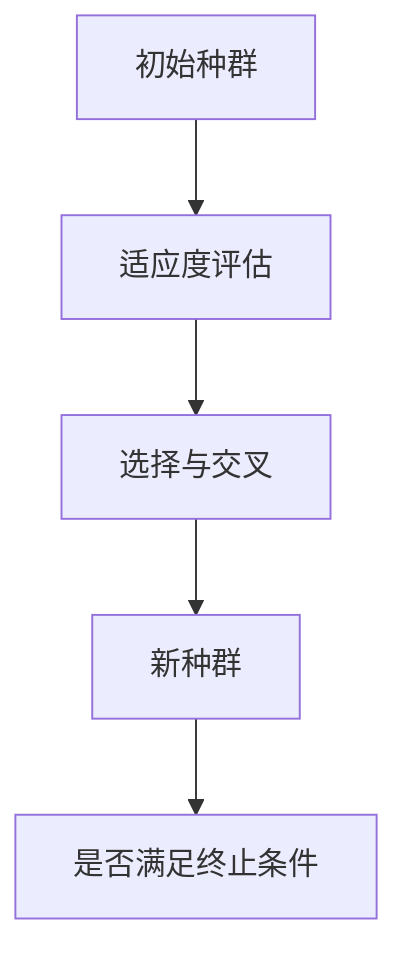
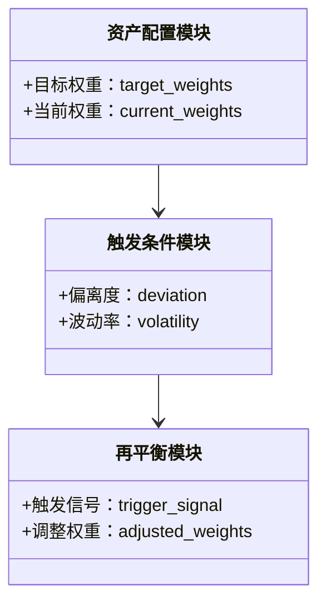
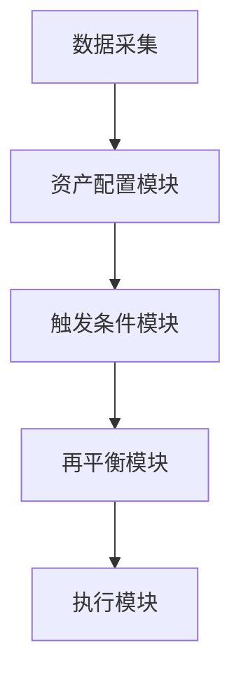

                 


# 智能资产配置再平衡触发系统

> 关键词：智能资产配置，再平衡触发，动态规划，遗传算法，系统架构设计

> 摘要：本文深入探讨了智能资产配置再平衡触发系统的构建与实现，结合背景介绍、核心概念、算法原理、系统架构设计、项目实战等多维度内容，详细讲解了如何通过智能化算法优化资产配置策略，并通过实际案例分析展示了系统的实际应用价值。文章最后总结了系统的核心价值与未来发展路径。

---

## 第一部分: 智能资产配置再平衡触发系统概述

### 第1章: 背景介绍

#### 1.1 智能资产配置的背景
智能资产配置是指根据市场环境、投资者风险偏好和收益目标，动态调整资产组合权重的过程。传统的资产配置方法依赖于固定的时间间隔或预设的阈值进行再平衡，这种方式在市场波动剧烈或复杂环境下往往无法及时适应变化，导致收益损失或风险增加。

#### 1.2 问题背景与描述
资产配置的核心问题在于如何在不确定的市场环境中，找到最优的资产组合权重，使得风险最小化或收益最大化。再平衡触发的必要性在于，市场环境的变化会导致资产权重偏离预期目标，需要及时调整以维持配置的最优性。

#### 1.3 系统边界与外延
智能资产配置再平衡触发系统的核心边界包括：
1. 输入：市场数据（如价格、收益率）、资产权重目标、再平衡触发条件。
2. 输出：再平衡触发信号、调整后的资产权重。
3. 外延：与投资管理系统、风险控制系统等其他金融系统集成。

---

### 第2章: 核心概念与联系

#### 2.1 核心概念原理
智能资产配置的核心在于动态优化资产权重，再平衡触发系统则是通过实时监控市场变化，判断是否需要进行调整。两者的结合使得资产配置能够更加灵活和高效。

#### 2.2 核心概念属性对比
| 属性 | 资产配置 | 再平衡触发 |
|------|---------|------------|
| 输入 | 市场数据、目标权重 | 资产权重偏离度、市场波动率 |
| 输出 | 当前权重建议 | 触发信号（是否需要再平衡） |
| 关键技术 | 优化算法 | 信号检测与判断 |

#### 2.3 ER实体关系图


---

## 第二部分: 算法原理与数学模型

### 第3章: 算法原理讲解

#### 3.1 动态规划算法
动态规划算法通过逐步优化当前权重，找到最优资产配置方案。流程如下：


#### 3.2 遗传算法
遗传算法通过模拟生物进化过程，逐步优化资产配置。流程如下：


#### 3.3 数学模型与公式
资产配置优化模型：
$$ \text{目标函数：} \quad \max \sum_{i=1}^{n} w_i r_i $$
$$ \text{约束条件：} \quad \sum_{i=1}^{n} w_i = 1 $$

再平衡触发条件：
$$ \text{触发条件：} \quad | \frac{w_i^{new} - w_i^{old}}{w_i^{old}} | > \theta $$

---

### 第4章: 系统分析与架构设计

#### 4.1 问题场景介绍
资产配置的动态变化和再平衡触发的实时性要求，使得系统需要具备高可用性和快速响应能力。

#### 4.2 系统功能设计


#### 4.3 系统架构设计


---

## 第三部分: 项目实战与应用

### 第5章: 项目实战

#### 5.1 环境安装
需要安装Python、NumPy、Pandas、Scikit-learn等库。

#### 5.2 系统核心实现源代码
```python
import numpy as np
from sklearn.model_selection import train_test_split
import pandas as pd

# 示例数据：资产收益率矩阵
returns = np.random.randn(100, 5) * 0.01 + 0.05
returns = pd.DataFrame(returns)

# 资产配置优化
def optimize_weights(returns):
    n = returns.shape[1]
    weights = np.ones(n) / n
    return weights

# 触发条件判断
def trigger_condition(current_weights, target_weights, threshold=0.02):
    deviation = np.abs(current_weights - target_weights)
    return np.any(deviation > threshold)

# 再平衡操作
def rebalance(weights, target_weights):
    return target_weights
```

#### 5.3 实际案例分析
以5种资产为例，模拟市场波动情况下的再平衡触发与调整过程。

---

## 第四部分: 总结与展望

### 第6章: 总结
智能资产配置再平衡触发系统通过智能化算法和实时监控，显著提高了资产配置的效率和准确性，降低了人工操作的误差和成本。

### 第7章: 注意事项与最佳实践
1. 数据质量是系统性能的关键，需确保市场数据的实时性和准确性。
2. 系统架构需具备可扩展性，以应对资产种类和市场环境的变化。
3. 触发条件的阈值应根据实际市场情况动态调整。

---

## 第五部分: 作者简介

作者：AI天才研究院/AI Genius Institute & 禅与计算机程序设计艺术 /Zen And The Art of Computer Programming

---

通过以上内容，我们详细探讨了智能资产配置再平衡触发系统的构建与实现，结合背景介绍、核心概念、算法原理、系统架构设计、项目实战等多维度内容，为读者提供了全面的技术解析与实践指导。

