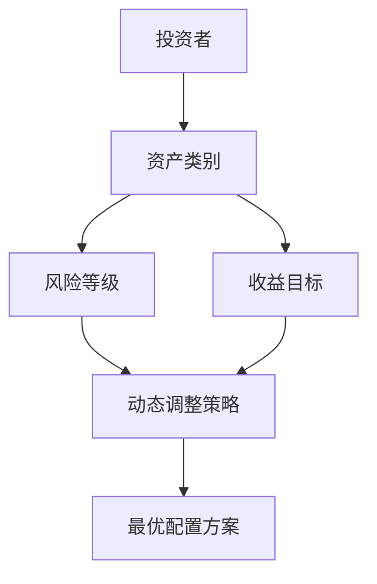
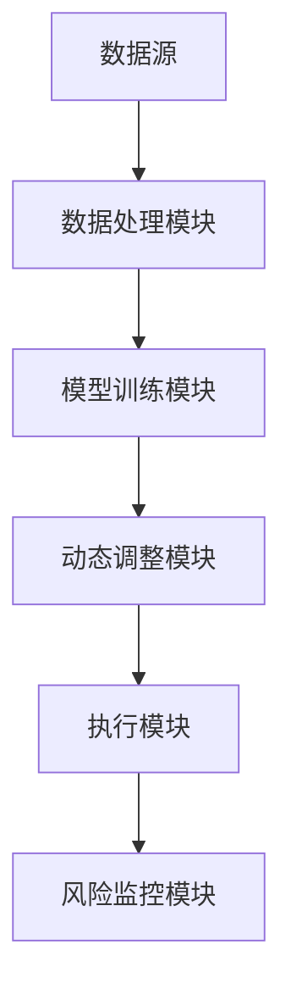

                 


# 智能资产配置动态调整机制

> 关键词：智能资产配置、动态调整、优化算法、金融投资、风险管理

> 摘要：智能资产配置动态调整机制是一种基于数据驱动和算法优化的投资策略，旨在根据市场变化和投资者需求实时调整资产配置，以实现最优收益与风险平衡。本文将深入分析其背景、原理、算法实现及系统设计，并通过实际案例展示其应用价值。

---

# 第一部分: 智能资产配置动态调整机制的背景与概念

## 第1章: 问题背景与定义

### 1.1 问题背景
在金融市场中，投资者面临多样化的资产选择和复杂的市场波动。传统的资产配置方法依赖于静态分析和主观判断，难以应对市场环境的快速变化。随着大数据和人工智能技术的发展，基于动态调整的智能资产配置成为可能。

### 1.2 核心定义
智能资产配置动态调整机制是指通过实时数据分析和算法优化，根据市场环境和投资者需求的变化，动态调整资产配置比例，以实现收益最大化和风险最小化的过程。

### 1.3 应用的必要性
1. **应对市场波动**：传统静态配置难以适应市场环境的变化。
2. **提升投资收益**：通过动态调整捕捉市场机会，规避潜在风险。
3. **个性化需求满足**：根据投资者风险偏好和财务目标动态调整。

---

## 第2章: 核心概念与原理

### 2.1 核心概念
1. **资产类别**：股票、债券、基金、房地产等不同类型的资产。
2. **风险收益平衡**：在动态调整中寻找收益与风险的最优平衡点。
3. **动态优化模型**：基于数学模型的优化算法。

### 2.2 优化算法
智能资产配置动态调整机制的核心是基于数学优化的算法，包括动态规划、遗传算法等。

### 2.3 实体关系图
通过ER实体关系图可以清晰地理解各要素之间的关系：



---

# 第二部分: 智能资产配置动态调整机制的算法与实现

## 第3章: 基于动态规划的优化算法

### 3.1 算法原理
动态规划是一种通过分解问题并利用子问题的最优解来构建整体最优解的算法。在资产配置中，动态规划用于在不同时间段内优化资产分配。

### 3.2 数学模型
目标函数：
$$ \text{目标函数} = \max_{w} \left( \sum_{i=1}^{n} w_i r_i - \lambda \sum_{i=1}^{n} w_i^2 \right) $$
约束条件：
$$ \sum_{i=1}^{n} w_i = 1 $$
$$ w_i \geq 0 \quad \forall i $$

### 3.3 算法实现
```python
def dynamic_planning(asset_returns, risk_aversion):
    n = len(asset_returns)
    # 初始化状态
    states = [0] * (n + 1)
    states[0] = 1  # 初始资金

    for i in range(1, n + 1):
        max_return = -float('inf')
        best_allocation = 0
        for a in range(i):
            current_allocation = asset_returns[a]
            new_return = states[a] * current_allocation
            if new_return > max_return:
                max_return = new_return
                best_allocation = a
        states[i] = states[best_allocation] * asset_returns[best_allocation]

    return states[n]
```

---

## 第4章: 遗传算法的应用

### 4.1 算法流程
1. 初始化种群。
2. 计算适应度。
3. 选择与交叉。
4. 变异与优化。
5. 保留最优解。

### 4.2 适应度函数
适应度函数用于评估每个个体的优劣，通常基于收益与风险的平衡。

### 4.3 算法实现
```python
def genetic_algorithm(population_size, generations):
    for _ in range(generations):
        # 计算适应度
        fitness = [evaluate(individual) for individual in population]
        # 选择与交叉
        selected = select(fitness, population_size // 2)
        offspring = crossover(selected)
        # 变异与优化
        mutated = mutate(offspring)
        population = mutated
    return best_individual(population, fitness)
```

---

# 第三部分: 智能资产配置动态调整机制的系统设计

## 第5章: 系统架构设计

### 5.1 系统功能模块
1. 数据采集与处理。
2. 模型训练与优化。
3. 动态调整与执行。
4. 风险监控与预警。

### 5.2 系统架构图


---

## 第6章: 项目实战与案例分析

### 6.1 环境安装
安装必要的Python库，如`numpy`、`pandas`、`scipy`等。

### 6.2 核心代码实现
```python
import numpy as np
from scipy.optimize import minimize

def optimize_portfolio(weights, returns, risk_free_rate=0.01):
    # 定义目标函数
    def objective(x):
        return - (x.T @ returns @ x)  # 最大化收益方差

    # 约束条件
    constraints = [
        {'type': 'eq', 'fun': lambda x: np.sum(x) - 1},  # 权重和为1
        {'type': 'ineq', 'fun': lambda x: x - 0}  # 权重非负
    ]

    result = minimize(objective, weights, constraints=constraints)
    return result.x
```

### 6.3 案例分析
通过实际案例分析动态调整机制的应用效果，对比动态调整与静态配置的收益与风险表现。

---

# 第四部分: 总结与展望

## 第7章: 总结与未来展望

### 7.1 本章小结
智能资产配置动态调整机制通过算法优化和实时调整，显著提升了投资收益与风险控制的效果。

### 7.2 未来展望
随着人工智能和大数据技术的进一步发展，智能资产配置将更加智能化和个性化。

---

作者：AI天才研究院/AI Genius Institute & 禅与计算机程序设计艺术 /Zen And The Art of Computer Programming

