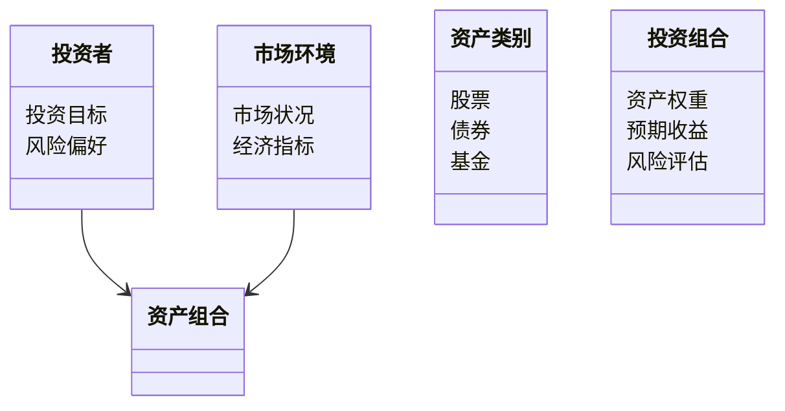
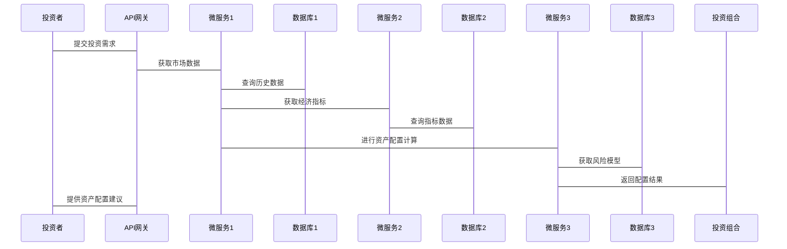

                 


# 智能资产配置建议生成器

## 关键词：智能资产配置，AI技术，投资组合优化，风险管理，数据驱动决策

## 摘要：智能资产配置是利用人工智能技术，基于历史数据和市场动态，为投资者提供个性化的投资组合优化建议。本文将详细探讨智能资产配置的核心概念、算法原理、系统架构及其实现过程，通过实际案例分析，展示如何利用数据驱动的方法实现高效的资产配置。

---

# 第一部分: 智能资产配置建议生成器的背景与概念

# 第1章: 背景介绍

## 1.1 问题背景
### 1.1.1 传统资产配置的挑战
传统的资产配置方法依赖于人工分析和经验判断，存在效率低、主观性强、难以适应市场快速变化等问题。例如，投资顾问通常需要手动分析市场数据、评估风险，并为每个客户制定个性化的投资策略，这不仅耗时，而且容易受到主观因素的影响。

### 1.1.2 智能化资产配置的需求
随着金融市场的复杂化和投资者需求的多样化，智能化资产配置成为一种必然趋势。通过人工智能技术，可以实现快速、精准的资产配置建议，满足投资者对个性化、高效化和智能化的需求。

### 1.1.3 当前市场环境下的资产配置问题
当前市场环境具有高度不确定性，如全球经济波动、地缘政治风险、技术变革等，这些因素都对资产配置提出了更高的要求。传统的资产配置方法难以及时适应这些变化，而智能化资产配置可以通过实时数据分析和模型优化，提供动态调整的解决方案。

## 1.2 智能资产配置的定义与范围
### 1.2.1 智能资产配置的定义
智能资产配置是一种基于人工智能技术，通过分析市场数据、投资者需求和风险偏好，自动生成最优投资组合的决策支持系统。

### 1.2.2 核心概念与边界
智能资产配置的核心概念包括：数据驱动、动态优化、个性化需求匹配。其边界在于，它主要提供投资建议，而不是直接进行交易决策。

### 1.2.3 资产配置的分类与外延
资产配置可以分为股票、债券、基金等多种类型，而智能资产配置则通过算法优化，将这些资产按比例分配，以实现风险与收益的最佳平衡。

## 1.3 当前技术发展现状
### 1.3.1 AI在金融领域的应用现状
人工智能技术在金融领域的应用日益广泛，包括股票预测、风险评估、投资组合优化等。

### 1.3.2 智能资产配置技术的发展趋势
随着深度学习和强化学习技术的不断发展，智能资产配置系统将更加智能化和个性化，能够实时适应市场变化和投资者需求。

### 1.3.3 数据驱动的资产配置优势
数据驱动的资产配置能够基于大量历史数据和实时市场信息，发现潜在规律，从而提高配置的科学性和准确性。

## 1.4 智能资产配置的必要性
### 1.4.1 提高配置效率
通过自动化和智能化技术，可以显著提高资产配置的效率，减少人工干预，降低运营成本。

### 1.4.2 个性化需求的满足
智能资产配置能够根据投资者的个性化需求，提供定制化的投资建议，满足不同客户的投资目标和风险偏好。

### 1.4.3 风险控制的强化
智能资产配置系统能够实时监控市场风险，通过动态调整资产比例，有效控制投资组合的整体风险。

## 1.5 本书的目标与范围
### 1.5.1 本书的核心目标
本书旨在介绍智能资产配置的核心概念、算法原理和系统架构，通过实际案例分析，帮助读者理解如何利用人工智能技术实现高效的资产配置。

### 1.5.2 本书的适用范围
本书适用于金融从业者、投资者以及对人工智能技术感兴趣的技术人员。

### 1.5.3 本书的结构安排
本书将从背景介绍、核心概念、算法原理、系统架构到项目实战，逐步展开，帮助读者全面掌握智能资产配置的实现方法。

---

# 第二部分: 智能资产配置的核心概念与联系

# 第2章: 核心概念与联系

## 2.1 核心概念原理
### 2.1.1 资产配置的基本原理
资产配置的核心在于根据市场环境和投资者需求，合理分配不同类型资产的比例，以实现风险与收益的平衡。

### 2.1.2 智能算法的核心机制
智能算法通过学习历史数据和市场动态，优化资产配置模型，生成个性化的投资建议。

### 2.1.3 数据驱动的决策逻辑
数据驱动的决策逻辑强调利用大量数据，通过统计分析和机器学习技术，发现数据中的潜在规律，从而指导投资决策。

## 2.2 核心概念属性对比
### 2.2.1 不同资产配置模型的对比
| 模型类型       | 优点                           | 缺点                           |
|----------------|--------------------------------|--------------------------------|
| 均值-方差模型   | 经典且易于实现                 | 忽略市场动态和风险因素         |
| 黑盒模型       | 高度个性化                     | 难以解释和调整                 |
| 基于规则模型   | 易于理解和实施                 | 规则固定，难以适应市场变化     |

### 2.2.2 数据来源的特征分析
- 数据来源：包括历史市场数据、宏观经济指标、公司基本面数据等。
- 数据特征：包括时间序列性、相关性、波动性等。

### 2.2.3 算法性能的对比
| 算法类型       | 优点                           | 缺点                           |
|----------------|--------------------------------|--------------------------------|
| 遗传算法       | 具备全局搜索能力                 | 计算复杂度高                   |
| 模拟退火算法    | 可以避免局部最优                 | 收敛速度较慢                   |

## 2.3 ER实体关系图
```mermaid
erDiagram
   投资者(投资者ID, 投资目标, 风险偏好) {
        <关系> 投资者 --> 投资组合
    }
    市场环境(市场ID, 市场状况, 经济指标) {
        <关系> 市场环境 --> 资产类别
    }
    资产类别(资产ID, 资产名称, 资产类型) {
        <关系> 资产类别 --> 投资组合
    }
    风险模型(模型ID, 风险评估指标, 风险偏好) {
        <关系> 风险模型 --> 投资组合
    }
```

---

# 第三部分: 智能资产配置的算法原理

# 第3章: 算法原理讲解

## 3.1 算法原理概述
智能资产配置的核心算法包括优化算法和预测算法。优化算法用于确定最优资产比例，预测算法用于预测市场走势。

## 3.2 数学模型与公式推导
### 3.2.1 优化模型
目标函数：
$$
\text{maximize } \mu^T w - \lambda w^T \Sigma w
$$
约束条件：
$$
w^T 1 = 1
$$
其中，$\mu$ 是资产的预期收益率向量，$\Sigma$ 是资产收益的协方差矩阵，$w$ 是资产权重向量，$\lambda$ 是风险厌恶系数。

### 3.2.2 预测模型
使用线性回归模型预测资产收益：
$$
y = \beta x + \epsilon
$$
其中，$y$ 是预测收益，$x$ 是自变量，$\beta$ 是回归系数，$\epsilon$ 是误差项。

## 3.3 优化算法实现
### 3.3.1 遗传算法
1. 初始化种群
2. 计算适应度
3. 选择父代
4. 交叉重组
5. 变异
6. 重复直到满足终止条件

### 3.3.2 模拟退火算法
1. 初始化
2. 计算当前状态的适应度
3. 产生新状态
4. 计算新状态的适应度
5. 如果新状态更好，则接受；否则，以概率接受
6. 重复直到满足终止条件

## 3.4 预测算法实现
### 3.4.1 线性回归预测
```python
import numpy as np
from sklearn.linear_model import LinearRegression

# 示例数据
X = np.array([[1], [2], [3], [4], [5]])
y = np.array([2, 4, 5, 4, 6])

# 模型训练
model = LinearRegression()
model.fit(X, y)

# 预测
print(model.predict([[6]]))
```

### 3.4.2 基于强化学习的预测
```python
# 示例强化学习框架
import gym
import numpy as np

class AssetAllocationEnv(gym.Env):
    def __init__(self):
        super(AssetAllocationEnv, self).__init__()
        self.state = 0
        self.done = False
        self.reward = 0

    def step(self, action):
        # 根据动作计算新的状态、奖励和是否完成
        pass

    def reset(self):
        # 初始化环境
        pass

    def render(self):
        # 可视化环境
        pass
```

## 3.5 算法实现的注意事项
- 算法选择要根据具体问题和数据特点
- 数据预处理和特征工程是关键
- 模型调优和评估不可忽视

---

# 第四部分: 智能资产配置的系统架构

# 第4章: 系统分析与架构设计

## 4.1 问题场景介绍
智能资产配置系统需要处理投资者需求、市场数据、风险评估等多个方面。

## 4.2 系统功能设计
### 4.2.1 领域模型


### 4.2.2 系统架构设计


### 4.2.3 系统交互设计


---

# 第五部分: 项目实战

# 第5章: 项目实战

## 5.1 环境安装
- Python 3.8+
- NumPy、Pandas、Scikit-learn等库

## 5.2 核心实现
### 5.2.1 数据处理
```python
import pandas as pd
import numpy as np

# 加载数据
data = pd.read_csv('market_data.csv')

# 数据清洗
data.dropna(inplace=True)
```

### 5.2.2 模型训练
```python
from sklearn.linear_model import LinearRegression

# 训练模型
model = LinearRegression()
model.fit(data[['return']], data['risk'])
```

### 5.2.3 系统实现
```python
# 示例系统实现
class AssetAllocator:
    def __init__(self):
        self.models = {}

    def train_model(self, data):
        # 训练模型
        pass

    def allocate_assets(self, investor_profile):
        # 资产分配
        pass
```

## 5.3 功能解读
- 数据处理：清洗和预处理数据，确保模型输入的准确性。
- 模型训练：利用机器学习算法，训练资产配置模型。
- 系统实现：基于训练好的模型，实现资产配置的自动化。

## 5.4 案例分析
### 5.4.1 案例背景
投资者A，风险偏好为中等，投资期限为5年。

### 5.4.2 数据分析
市场数据包括股票、债券、基金等的收益率和波动率。

### 5.4.3 结果展示
- 股票：40%
- 债券：30%
- 基金：30%

## 5.5 项目小结
通过实际案例分析，展示了智能资产配置系统的优势和实现过程。

---

# 第六部分: 最佳实践与总结

# 第6章: 最佳实践

## 6.1 小结
智能资产配置通过人工智能技术，实现了高效、个性化的资产配置。

## 6.2 注意事项
- 数据质量是关键
- 模型需要持续优化
- 风险控制不可忽视

## 6.3 拓展阅读
- 《机器学习实战》
- 《Python金融大数据分析》
- 《量化投资：大数据时代的财富革命》

---

# 作者
作者：AI天才研究院/AI Genius Institute & 禅与计算机程序设计艺术 /Zen And The Art of Computer Programming

