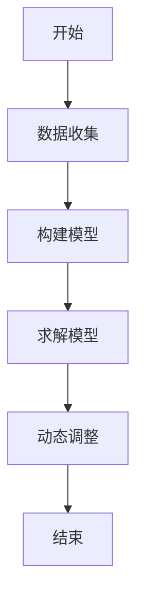
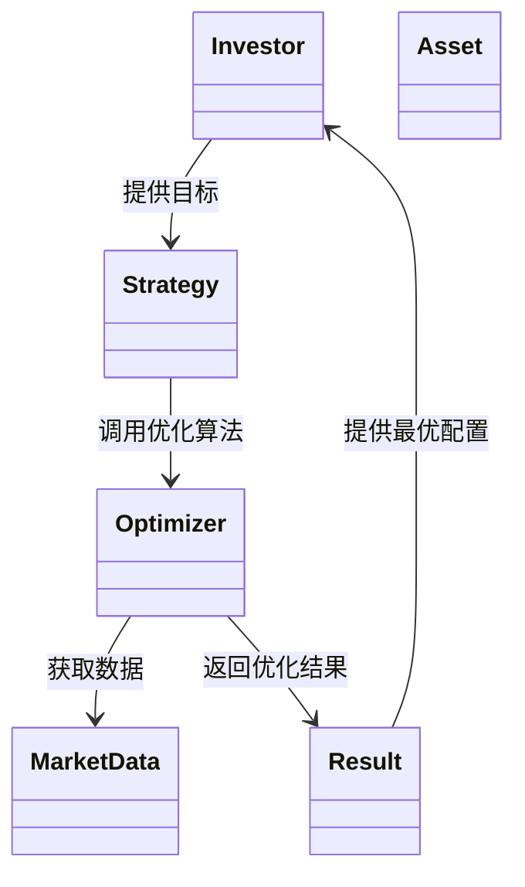
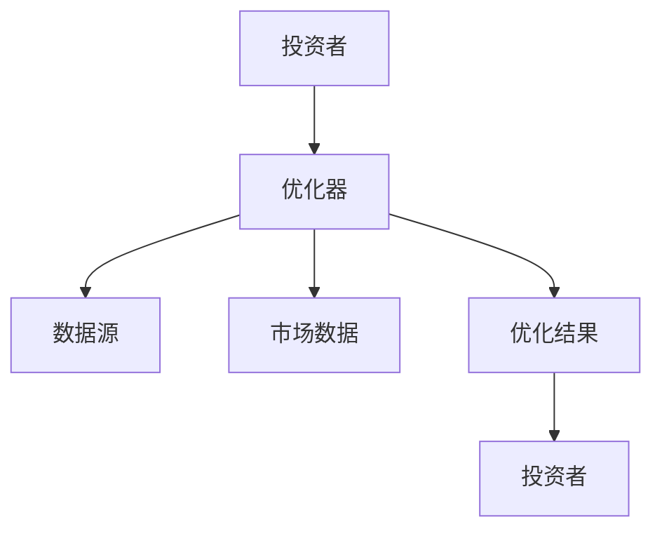
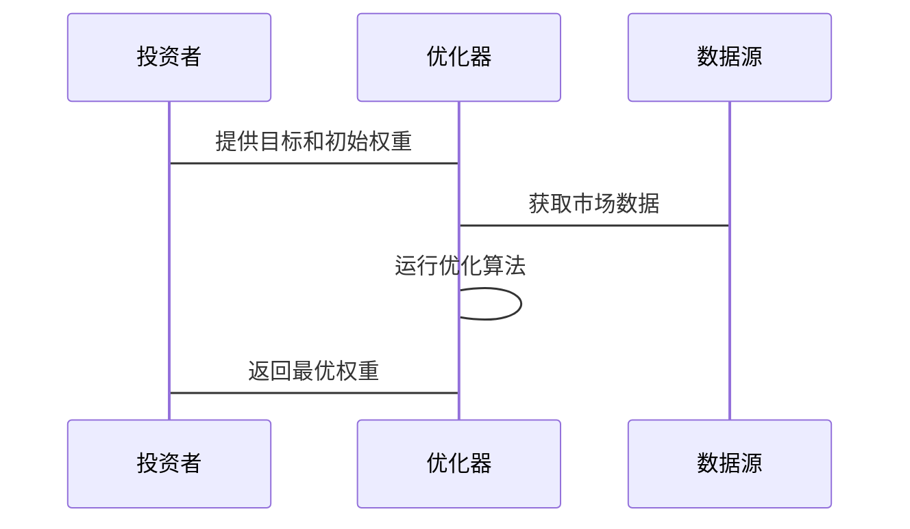

                 


# 智能资产配置策略动态优化器

> 关键词：智能资产配置，动态优化，投资组合，数学模型，机器学习

> 摘要：本文详细探讨了智能资产配置策略动态优化器的背景、核心概念、算法原理、系统架构及项目实战。通过分析传统资产配置的局限性，引出智能优化的必要性，并结合数学模型、机器学习技术，提出了一种高效的优化算法。文章最后通过实际案例展示了优化器的应用效果，并总结了最佳实践。

---

# 第一部分：智能资产配置策略动态优化器背景介绍

## 第1章：智能资产配置概述

### 1.1 智能资产配置的核心概念

#### 1.1.1 资产配置的定义与作用
资产配置是指将资金分配到不同资产类别（如股票、债券、房地产等）中，以实现投资目标的过程。其作用在于分散风险、平衡收益与风险，并优化投资组合的表现。

#### 1.1.2 智能资产配置的定义
智能资产配置是指利用人工智能、大数据和机器学习等技术，动态调整资产分配比例，以适应市场变化和投资者需求的一种现代投资策略。

#### 1.1.3 智能资产配置与传统资产配置的区别
- **数据驱动 vs. 经验驱动**：传统资产配置依赖经验判断，而智能配置依赖数据和模型。
- **动态调整 vs. 静态调整**：智能配置能够实时优化，而传统配置通常是定期调整。
- **个性化 vs. 标准化**：智能配置可以根据投资者的个性化需求调整，而传统配置往往基于固定策略。

### 1.2 智能资产配置的必要性

#### 1.2.1 传统资产配置的局限性
- 市场波动性大，传统策略难以适应。
- 无法实时捕捉市场变化，导致收益损失或风险增加。
- 个性化需求难以满足，投资者体验较差。

#### 1.2.2 动态优化的必要性
市场环境不断变化，静态的资产配置策略难以应对复杂的投资环境，动态优化能够及时调整，捕捉市场机会。

#### 1.2.3 智能化配置的优势
- 提高投资效率，降低风险。
- 实现个性化投资，满足不同投资者的需求。
- 通过机器学习和大数据分析，提供更精准的决策支持。

### 1.3 智能资产配置的实现路径

#### 1.3.1 数据驱动的优化方法
通过收集和分析大量市场数据，利用统计学和机器学习算法，构建优化模型。

#### 1.3.2 模型驱动的优化方法
基于数学模型（如均值-方差模型）进行优化，结合市场预测进行调整。

#### 1.3.3 数据与模型结合的优化方法
将数据驱动和模型驱动相结合，利用数据验证模型假设，动态调整优化策略。

---

## 第2章：智能资产配置的背景与趋势

### 2.1 当前资产管理行业的挑战

#### 2.1.1 市场波动性增加
近年来，全球经济不确定性增加，市场波动性加剧，传统的资产配置策略难以应对。

#### 2.1.2 投资者需求多样化
投资者对个性化、透明化和实时性的需求日益增加，传统资产配置难以满足。

#### 2.1.3 传统投资策略的局限性
传统策略依赖历史数据和经验判断，难以适应快速变化的市场环境。

### 2.2 智能化技术在资产管理中的应用

#### 2.2.1 人工智能技术的发展
机器学习、深度学习等技术在金融领域的应用越来越广泛，为智能资产配置提供了技术支持。

#### 2.2.2 大数据技术的应用
通过大数据分析，可以提取更多市场信息，帮助优化投资决策。

#### 2.2.3 云计算与分布式计算的优势
云计算提供了强大的计算能力和数据存储能力，支持实时数据分析和优化。

### 2.3 智能资产配置的未来趋势

#### 2.3.1 技术驱动的创新
人工智能和大数据技术将继续推动资产管理行业的创新，智能优化将成为主流。

#### 2.3.2 个性化投资服务的发展
通过智能技术，投资者可以根据自身需求获得定制化的投资建议。

#### 2.3.3 全球化与本地化结合的趋势
智能资产配置将更加注重全球化视角，同时结合本地市场特点进行优化。

---

# 第二部分：智能资产配置策略动态优化器的核心概念与联系

## 第3章：智能资产配置的优化目标与约束

### 3.1 优化目标

#### 3.1.1 最大化收益
在风险可控的前提下，尽可能提高投资组合的收益。

#### 3.1.2 最小化风险
通过分散投资和动态调整，降低投资组合的整体风险。

#### 3.1.3 综合收益与风险的优化
在收益与风险之间找到最佳平衡点，实现最优的投资效果。

### 3.2 约束条件

#### 3.2.1 资金规模限制
投资组合的规模不能超过投资者的可用资金。

#### 3.2.2 投资期限要求
根据投资目标的时间 horizon，调整资产配置比例。

#### 3.2.3 风险承受能力
根据投资者的风险偏好，设定可接受的风险水平。

### 3.3 优化评价指标

#### 3.3.1 凸性
衡量投资组合的收益与风险之间的关系，凸性越低，组合越稳健。

#### 3.3.2 风险调整后收益
通过夏普比率等指标，衡量收益与风险的关系。

#### 3.3.3 稳定性与可解释性
优化后的投资组合应具有较高的稳定性，且优化过程应具有可解释性。

---

## 第4章：智能资产配置的核心概念对比

### 4.1 传统资产配置与智能资产配置的对比

#### 4.1.1 概念对比
| 比较维度 | 传统资产配置 | 智能资产配置 |
|----------|--------------|--------------|
| 数据来源 | 主要依赖历史数据 | 结合实时数据和预测模型 |
| 调整频率 | 定期调整 | 实时动态调整 |
| 个性化 | 较低 | 较高 |

#### 4.1.2 方法对比
传统资产配置依赖经验判断和固定模型，而智能资产配置结合机器学习和实时数据，能够动态优化。

#### 4.1.3 优缺点对比
| 优点 | 缺点 |
|------|------|
| 稳定性高 | 灵活性差 |
| 易操作 | 适应性差 |
| 成本低 | 需要大量数据支持 |

---

### 4.2 动态优化与静态配置的对比

#### 4.2.1 动态优化的优势
- 实时调整，捕捉市场机会。
- 更好地应对市场波动。
- 提高投资组合的收益与风险比。

#### 4.2.2 静态配置的局限性
- 无法适应市场变化。
- 可能导致较大损失或错失收益。

---

# 第三部分：算法原理

## 第5章：优化算法原理

### 5.1 数学模型

#### 5.1.1 均值-方差模型
数学公式：
$$ \text{目标：} \min \sigma^2 \quad \text{在约束条件下} \quad E(r) \geq r_{\text{target}} $$
其中，\( \sigma^2 \) 是投资组合的方差，\( E(r) \) 是期望收益。

#### 5.1.2 优化步骤
1. **数据收集**：获取各资产的历史收益和风险数据。
2. **构建模型**：建立数学模型，设定目标和约束。
3. **求解模型**：使用优化算法求解最优解。
4. **动态调整**：根据市场变化实时更新优化结果。

### 5.2 算法流程图


### 5.3 Python代码实现

```python
import numpy as np
from scipy.optimize import minimize

def portfolio_optimization(returns, weights):
    # 定义目标函数：最小化方差
    n = len(weights)
    objective = {'type': 'min', 'fun': lambda w: np.dot(w.T, np.dot(returns, w))}
    # 约束条件：权重之和为1，且权重非负
    constraints = [
        {'type': 'eq', 'fun': lambda w: np.sum(w) - 1},
        {'type': 'ineq', 'fun': lambda w: w[i] >= 0 for i in range(n)}
    ]
    result = minimize(objective, weights, constraints)
    return result.x

# 示例数据
returns = np.array([[0.1, 0.2], [0.3, 0.1]])
weights = np.array([0.5, 0.5])
optimal_weights = portfolio_optimization(returns, weights)
print("最优权重：", optimal_weights)
```

---

# 第四部分：系统分析与架构设计

## 第6章：系统分析与架构设计

### 6.1 问题场景介绍
投资者希望通过智能资产配置优化器动态调整其投资组合，以实现收益最大化和风险最小化。

### 6.2 系统功能设计

#### 6.2.1 领域模型类图


### 6.3 系统架构图


### 6.4 接口设计
- **输入接口**：接收投资者的目标和数据。
- **输出接口**：返回优化后的资产配置。

### 6.5 交互流程图


---

# 第五部分：项目实战

## 第7章：项目实战

### 7.1 环境安装
- 安装Python和相关库（numpy、scipy、pandas）。

### 7.2 核心代码实现

```python
import numpy as np
from scipy.optimize import minimize

def portfolio_optimization(returns, weights):
    # 定义目标函数：最小化方差
    n = len(weights)
    objective = {'type': 'min', 'fun': lambda w: np.dot(w.T, np.dot(returns, w))}
    # 约束条件：权重之和为1，且权重非负
    constraints = [
        {'type': 'eq', 'fun': lambda w: np.sum(w) - 1},
        {'type': 'ineq', 'fun': lambda w: w[i] >= 0 for i in range(n)}
    ]
    result = minimize(objective, weights, constraints)
    return result.x

# 示例数据
returns = np.array([[0.1, 0.2], [0.3, 0.1]])
weights = np.array([0.5, 0.5])
optimal_weights = portfolio_optimization(returns, weights)
print("最优权重：", optimal_weights)
```

### 7.3 实际案例分析

#### 7.3.1 数据准备
收集两只股票的历史收益率数据，计算协方差矩阵。

#### 7.3.2 模型优化
使用均值-方差模型，优化投资组合的权重。

#### 7.3.3 结果分析
计算优化后的投资组合的收益和风险，与初始组合对比。

---

# 第六部分：最佳实践

## 第8章：最佳实践

### 8.1 小结
智能资产配置策略动态优化器通过实时数据分析和动态调整，能够有效提高投资效率和收益。

### 8.2 注意事项
- 确保数据质量，避免偏差。
- 定期更新模型，适应市场变化。
- 考虑投资者的个性化需求。

### 8.3 拓展阅读
- 《投资学》：了解更多资产配置的基本理论。
- 《机器学习在金融中的应用》：学习更多智能优化技术。

---

# 作者信息

作者：AI天才研究院/AI Genius Institute & 禅与计算机程序设计艺术/Zen And The Art of Computer Programming

---

这篇文章详细介绍了智能资产配置策略动态优化器的背景、核心概念、算法原理、系统架构及项目实战。通过理论与实践相结合的方式，帮助读者全面理解智能优化的核心思想和应用方法。

