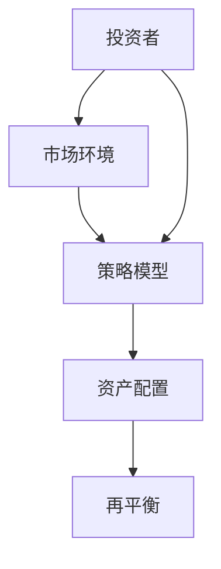
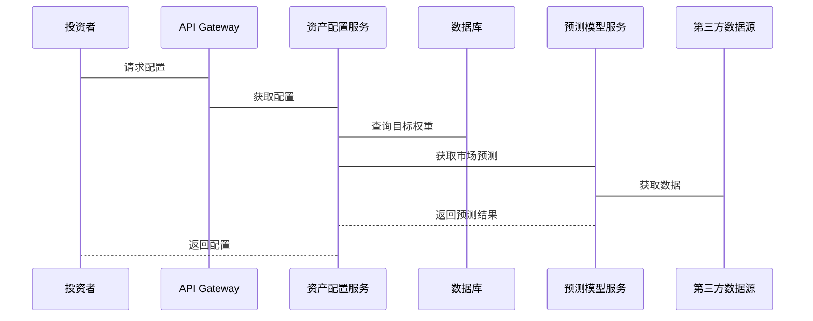

                 


# 智能资产配置策略动态调整与再平衡系统

> 关键词：智能资产配置，动态调整，再平衡系统，机器学习，优化算法

> 摘要：本文详细探讨了智能资产配置策略动态调整与再平衡系统的实现方法。通过分析传统资产配置的局限性，提出基于机器学习和优化算法的智能配置方案，阐述了动态调整和再平衡的核心原理，并通过实际案例展示了系统的实现过程。文章最后总结了最佳实践和注意事项，为读者提供全面的指导。

---

## 第一部分: 智能资产配置策略动态调整与再平衡系统的背景与核心概念

### 第1章: 智能资产配置的背景与问题背景

#### 1.1 传统资产配置的局限性
##### 1.1.1 传统资产配置的定义与特点
传统资产配置是指根据投资者的风险承受能力、投资目标和市场状况，将资金分配到不同资产类别（如股票、债券、房地产等）中，以实现收益最大化和风险最小化。其特点是静态、固定，通常基于历史数据和经验判断。

##### 1.1.2 传统资产配置中的问题与挑战
- **市场环境变化快**：传统配置难以及时适应市场波动。
- **投资者需求多样化**：不同投资者的风险偏好和收益目标不同。
- **人为因素干扰**：人为判断可能导致决策失误。

##### 1.1.3 智能化资产配置的必要性
随着金融市场复杂化和投资者需求多样化，智能化资产配置成为必然趋势。通过机器学习和大数据分析，可以实现动态调整和个性化配置。

#### 1.2 动态调整与再平衡的定义
##### 1.2.1 动态调整的定义与作用
动态调整是指根据市场变化和投资者需求，实时优化资产配置比例，以适应市场波动和投资目标的变化。其作用在于提高资产配置的灵活性和适应性。

##### 1.2.2 再平衡的定义与意义
再平衡是指在市场变化后，调整资产比例以恢复目标配置。其意义在于降低风险，优化收益。

##### 1.2.3 动态调整与再平衡的关系
动态调整是主动适应市场变化，而再平衡是被动恢复目标配置。两者相辅相成，共同实现最优配置。

#### 1.3 智能资产配置的核心目标
##### 1.3.1 最大化投资收益
通过动态调整和再平衡，优化资产组合，提高收益。

##### 1.3.2 控制投资风险
通过分散投资和风险对冲，降低整体风险。

##### 1.3.3 提高资产配置的灵活性与适应性
通过智能化系统，实时调整配置，适应市场变化。

### 第2章: 智能资产配置的核心概念与联系

#### 2.1 核心概念原理
##### 2.1.1 资产配置的数学模型
资产配置可以通过数学模型进行优化，例如马科维茨的有效组合模型：
$$
\text{目标函数: } \min_{w} \left( w^T \Sigma w \right)
$$
$$
\text{约束条件: } \sum_{i=1}^{n} w_i = 1, \quad w_i \geq 0
$$

##### 2.1.2 动态调整的算法原理
动态调整基于市场预测和风险评估，实时优化资产比例。常用算法包括遗传算法和粒子群优化。

##### 2.1.3 再平衡的优化策略
再平衡可以通过最小化调整成本和最大化收益来实现，常用策略包括比例再平衡和风险调整再平衡。

#### 2.2 核心概念属性对比
| 概念       | 定义                                                                 | 优势                                                                 |
|------------|----------------------------------------------------------------------|----------------------------------------------------------------------|
| 资产配置   | 根据目标分配资产比例                                                 | 提高收益，分散风险                                                 |
| 动态调整   | 根据市场变化实时调整配置                                           | 提高灵活性，适应性强                                             |
| 再平衡     | 恢复目标配置                                                       | 控制风险，优化收益                                             |

#### 2.3 ER实体关系图架构


---

## 第二部分: 智能资产配置策略动态调整与再平衡的算法原理

### 第3章: 动态调整算法的实现原理

#### 3.1 动态调整算法的核心思想
##### 3.1.1 基于市场变化的反馈机制
通过实时市场数据反馈，调整资产配置。

##### 3.1.2 基于风险收益的优化目标
在风险可控的前提下，最大化收益。

##### 3.1.3 基于机器学习的预测模型
使用机器学习算法预测市场趋势，指导调整。

#### 3.2 动态调整算法的实现步骤
##### 3.2.1 数据采集与预处理
采集市场数据（如价格、成交量），清洗和标准化。

##### 3.2.2 市场环境分析与预测
使用时间序列模型（如ARIMA）预测市场趋势。

##### 3.2.3 策略模型的构建与优化
基于预测结果，构建优化模型，选择最优资产组合。

##### 3.2.4 资产权重的动态调整
根据优化结果，调整各资产权重。

#### 3.3 动态调整算法的数学模型
$$
\text{目标函数: } \min_{w} \left( w^T \Sigma w \right)
$$
$$
\text{约束条件: } \sum_{i=1}^{n} w_i = 1, \quad w_i \geq 0
$$

### 第4章: 再平衡算法的实现原理

#### 4.1 再平衡算法的核心思想
##### 4.1.1 基于目标权重的偏差纠正
计算当前权重与目标权重的偏差，进行调整。

##### 4.1.2 基于成本最小化的优化目标
最小化交易成本，最大化收益。

##### 4.1.3 基于市场流动性的执行策略
考虑市场流动性，避免大额交易冲击。

#### 4.2 再平衡算法的实现步骤
##### 4.2.1 计算当前资产权重与目标权重的偏差
$$
\text{偏差} = \text{当前权重} - \text{目标权重}
$$

##### 4.2.2 确定需要调整的资产和比例
根据偏差，确定调整方向和比例。

##### 4.2.3 执行交易并记录调整结果
按照调整方案执行交易，记录调整结果。

##### 4.2.4 更新系统状态
将调整结果反馈到系统，更新配置。

---

## 第三部分: 智能资产配置策略动态调整与再平衡系统的系统架构设计

### 第5章: 系统分析与架构设计方案

#### 5.1 问题场景介绍
市场波动、投资者需求变化、数据实时性等挑战。

#### 5.2 项目介绍
一个智能化资产配置系统，提供动态调整和再平衡功能。

#### 5.3 系统功能设计
##### 5.3.1 领域模型类图
```mermaid
classDiagram
class 投资者 {
    投资目标
    风险偏好
}
class 市场环境 {
    股票指数
    债券收益率
}
class 策略模型 {
    预测模型
    优化模型
}
class 资产配置 {
    资产权重
    调整策略
}
class 再平衡 {
    调整指令
    调整结果
}
investor -> 市场环境
市场环境 -> 策略模型
investor -> 策略模型
策略模型 -> 资产配置
资产配置 -> 再平衡
```

#### 5.4 系统架构设计
##### 5.4.1 系统架构图


#### 5.5 系统接口设计
##### 5.5.1 API接口
- `/api/config`：获取当前配置
- `/api/rebalance`：触发再平衡
- `/api/predict`：获取市场预测

#### 5.6 系统交互设计
##### 5.6.1 交互流程图


---

## 第四部分: 智能资产配置策略动态调整与再平衡系统的项目实战

### 第6章: 项目实战

#### 6.1 环境安装
安装Python、Pandas、NumPy、Scikit-learn等库。

#### 6.2 系统核心实现源代码
##### 6.2.1 动态调整算法实现
```python
import numpy as np
from sklearn import linear_model

def dynamic_adjustment(current_weights, target_weights, market_data):
    # 计算偏差
    deviation = current_weights - target_weights
    # 使用线性回归预测市场趋势
    model = linear_model.LinearRegression()
    model.fit(market_data[['price', 'volume']], market_data['return'])
    # 基于预测结果调整权重
    predicted_return = model.predict(new_market_data)
    adjusted_weights = current_weights + predicted_return * deviation
    return adjusted_weights
```

##### 6.2.2 再平衡算法实现
```python
def rebalancing(current_weights, target_weights, transaction_cost):
    # 计算偏差
    deviation = current_weights - target_weights
    # 计算调整比例
    adjustment_ratio = (target_weights - current_weights) / np.sum(abs(deviation))
    # 执行交易
    new_weights = current_weights + adjustment_ratio * (target_weights - current_weights)
    return new_weights
```

#### 6.3 案例分析
假设投资者目标配置为60%股票、30%债券、10%现金。当前配置为65%股票、25%债券、10%现金。市场预测股票将上涨，债券持平。系统将调整股票权重至55%，债券至35%，现金至10%。

#### 6.4 项目小结
通过代码实现，展示了动态调整和再平衡的具体操作步骤和方法。

---

## 第五部分: 智能资产配置策略动态调整与再平衡系统的最佳实践

### 第7章: 最佳实践

#### 7.1 小结
智能化资产配置系统通过动态调整和再平衡，优化资产配置，提升收益，控制风险。

#### 7.2 注意事项
- 数据质量：确保数据准确及时。
- 算法选择：根据需求选择合适算法。
- 风险控制：设置止损机制。

#### 7.3 扩展阅读
- 《机器学习在金融中的应用》
- 《优化算法与投资组合管理》

---

## 作者信息

作者：AI天才研究院/AI Genius Institute & 禅与计算机程序设计艺术 /Zen And The Art of Computer Programming

