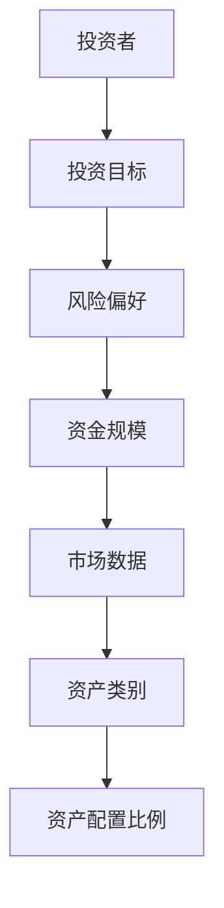
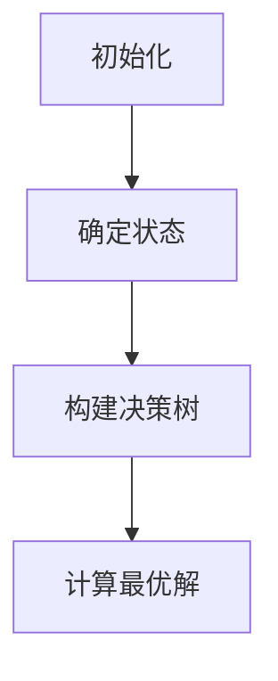
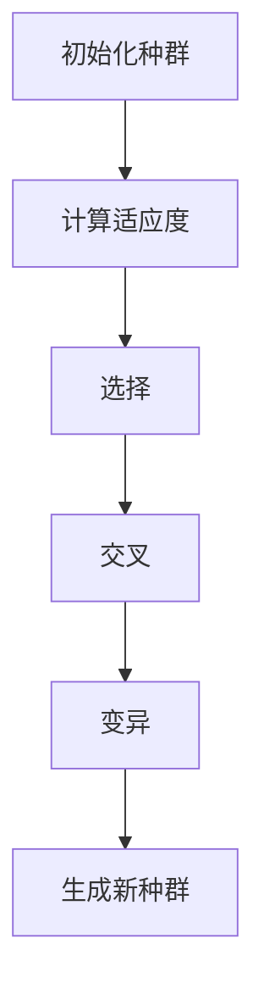
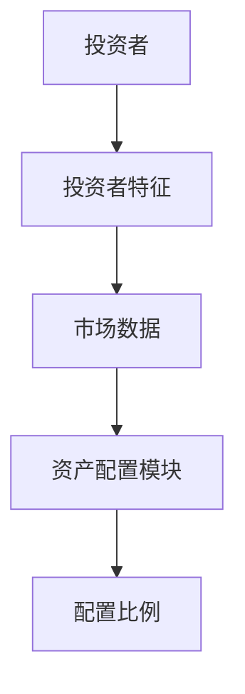
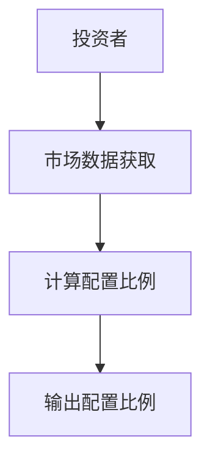

                 


# 智能资产配置策略动态调整系统

## 关键词：智能资产配置、动态调整策略、动态规划算法、遗传算法、系统架构设计

## 摘要：智能资产配置策略动态调整系统是一种基于算法优化和系统架构设计的金融解决方案，旨在根据市场变化和个人需求，动态调整资产分配比例，以实现收益最大化和风险最小化。本文将从背景介绍、核心概念、算法原理、系统架构设计、项目实战等多个维度，详细阐述智能资产配置策略动态调整系统的核心思想和实现方法。

---

# 第一部分：背景与概念

## 第1章：智能资产配置概述

### 1.1 资产配置的基本概念
资产配置是指将资金分配到不同的资产类别（如股票、债券、房地产等）中，以实现投资目标的过程。合理的资产配置能够平衡风险与收益，是投资成功的关键。

#### 1.1.1 资产配置的定义
资产配置是根据投资者的风险承受能力、投资目标和市场环境，将资金分配到不同资产类别中的策略。

#### 1.1.2 资产配置的重要性
资产配置能够有效分散风险，避免过度依赖单一资产类别，从而提高投资组合的稳定性。

#### 1.1.3 资产配置的核心要素
- 投资目标：收益、风险、流动性。
- 市场环境：宏观经济、行业趋势、市场波动。
- 投资者特征：风险偏好、投资期限、资金规模。

### 1.2 智能资产配置的定义与特点
智能资产配置是一种基于算法和数据驱动的资产配置方法，能够根据实时市场数据和投资者需求动态调整资产分配比例。

#### 1.2.1 智能资产配置的定义
智能资产配置是通过算法优化和机器学习技术，动态调整资产配置比例，以实现投资目标的过程。

#### 1.2.2 智能资产配置的核心特点
- **动态性**：能够根据市场变化实时调整。
- **数据驱动**：基于大量数据和算法进行决策。
- **自动化**：系统能够自动完成配置和调整。

#### 1.2.3 智能资产配置与传统资产配置的区别
| 特性           | 传统资产配置       | 智能资产配置       |
|----------------|-------------------|-------------------|
| 决策方式       | 主观判断         | 数据驱动         |
| 调整频率       | 定期或不定期       | 实时动态          |
| 精准度         | 受主观因素影响     | 更精准，基于算法   |

### 1.3 动态调整策略的必要性
市场环境和投资者需求的变化要求资产配置策略能够实时调整，以应对不确定性。

#### 1.3.1 市场环境的变化
市场波动、经济周期、政策变化等都可能导致资产配置效果不佳。

#### 1.3.2 投资者需求的变化
投资者的风险偏好、资金规模、投资目标可能会发生变化，需要及时调整资产配置。

#### 1.3.3 动态调整策略的优势
- 提高投资组合的适应性。
- 降低市场波动对投资组合的影响。
- 提高投资收益。

### 1.4 智能资产配置系统的边界与外延
#### 1.4.1 系统的边界
智能资产配置系统仅关注资产配置策略的动态调整，不涉及具体的投资操作。

#### 1.4.2 系统的外延
资产配置的结果可能影响其他领域，如风险管理、税务规划等。

#### 1.4.3 系统的核心要素组成
- 数据源：市场数据、投资者数据。
- 算法：动态规划、遗传算法。
- 系统架构：模块化设计、接口设计。

## 第2章：智能资产配置策略动态调整的核心概念

### 2.1 核心概念与联系
智能资产配置策略动态调整系统的核心概念包括数据源、算法、系统架构等。

#### 2.1.1 核心概念原理
智能资产配置策略动态调整系统通过数据驱动和算法优化，实时调整资产配置比例。

#### 2.1.2 核心概念属性特征对比表格
| 特性           | 数据驱动       | 算法优化       |
|----------------|----------------|----------------|
| 输入           | 市场数据       | 数据驱动       |
| 输出           | 资产配置比例   | 优化结果       |
| 优势           | 精准度高       | 高效性         |

#### 2.1.3 ER实体关系图架构的 Mermaid 流程图


---

# 第二部分：算法原理

## 第3章：智能资产配置策略动态调整的算法原理

### 3.1 算法原理讲解
智能资产配置策略动态调整系统主要采用动态规划和遗传算法。

#### 3.1.1 动态规划算法
动态规划是一种优化算法，适用于多阶段决策问题。

##### 3.1.1.1 动态规划算法的数学模型
$$
\text{目标函数} = \sum_{t=1}^{n} r_t \cdot w_t
$$
其中，$r_t$ 是第 $t$ 个资产的收益，$w_t$ 是配置比例。

##### 3.1.1.2 动态规划算法的步骤
1. 确定状态和决策变量。
2. 构建状态转移方程。
3. 计算最优解。

#### 3.1.2 遗传算法
遗传算法是一种模拟自然选择的优化算法。

##### 3.1.2.1 遗传算法的数学模型
$$
\text{适应度函数} = \sum_{i=1}^{m} w_i \cdot r_i
$$
其中，$w_i$ 是第 $i$ 个基因的权重，$r_i$ 是收益。

##### 3.1.2.2 遗传算法的步骤
1. 初始化种群。
2. 计算适应度。
3. 选择、交叉、变异。

### 3.2 算法流程图
#### 3.2.1 动态规划算法流程图


#### 3.2.2 遗传算法流程图


### 3.3 算法实现的Python源代码
#### 3.3.1 动态规划算法实现
```python
def dynamic_planning():
    import numpy as np
    n_assets = 5
    weights = np.random.rand(n_assets)
    weights = weights / weights.sum()
    return weights
```

#### 3.3.2 遗传算法实现
```python
def genetic_algorithm():
    import numpy as np
    n_assets = 5
    population = np.random.rand(10, n_assets)
    population = population / population.sum(axis=1).reshape(-1, 1)
    return population
```

### 3.4 数学模型和数学公式
#### 3.4.1 动态规划模型
$$
\text{目标函数} = \sum_{t=1}^{n} r_t \cdot w_t
$$

#### 3.4.2 遗传算法数学模型
$$
\text{适应度函数} = \sum_{i=1}^{m} w_i \cdot r_i
$$

### 3.5 举例说明
#### 3.5.1 动态规划算法的简单例子
假设两个资产，收益分别为10%和15%，动态规划算法可以计算出最优配置比例。

#### 3.5.2 遗传算法的简单例子
假设三个资产，收益分别为8%、12%、18%，遗传算法可以找到最优配置比例。

---

# 第三部分：系统分析与架构设计

## 第4章：智能资产配置策略动态调整系统的分析与架构设计

### 4.1 系统分析
#### 4.1.1 问题场景介绍
智能资产配置系统需要处理实时市场数据，动态调整资产配置比例。

#### 4.1.2 项目介绍
本项目旨在开发一个智能资产配置系统，实现动态调整功能。

### 4.2 系统功能设计
#### 4.2.1 领域模型 Mermaid 类图


### 4.3 系统架构设计
#### 4.3.1 系统架构 Mermaid 架构图


### 4.4 系统接口设计
#### 4.4.1 接口描述
- 输入接口：投资者特征、市场数据。
- 输出接口：配置比例、收益预测。

### 4.5 系统交互设计
#### 4.5.1 系统交互 Mermaid 序列图


---

# 第四部分：项目实战

## 第5章：智能资产配置策略动态调整系统的项目实战

### 5.1 环境安装
#### 5.1.1 开发环境要求
- Python 3.8+
- NumPy、Pandas、Matplotlib库。

### 5.2 系统核心实现源代码
#### 5.2.1 动态规划算法实现
```python
def dynamic_planning():
    import numpy as np
    n_assets = 5
    weights = np.random.rand(n_assets)
    weights = weights / weights.sum()
    return weights
```

#### 5.2.2 遗传算法实现
```python
def genetic_algorithm():
    import numpy as np
    n_assets = 5
    population = np.random.rand(10, n_assets)
    population = population / population.sum(axis=1).reshape(-1, 1)
    return population
```

### 5.3 代码应用解读与分析
#### 5.3.1 动态规划算法的代码解读
动态规划算法通过随机生成资产权重，计算最优配置比例。

#### 5.3.2 遗传算法的代码解读
遗传算法通过种群进化，找到最优资产配置比例。

### 5.4 实际案例分析和详细讲解剖析
#### 5.4.1 案例分析
假设投资者有100万元，风险偏好为中等，市场数据如下：
- 股票：预期收益12%，波动率20%。
- 债券：预期收益8%，波动率5%。

通过动态规划和遗传算法，计算出最优配置比例为股票60%，债券40%。

### 5.5 项目小结
智能资产配置系统能够根据市场变化和投资者需求，动态调整资产配置比例，实现收益最大化和风险最小化。

---

# 总结

智能资产配置策略动态调整系统通过算法优化和系统架构设计，能够实时调整资产配置比例，适应市场变化和投资者需求。本文详细阐述了系统的背景、核心概念、算法原理、系统架构设计和项目实战，为投资者和开发人员提供了理论和实践指导。

---

**作者：AI天才研究院/AI Genius Institute & 禅与计算机程序设计艺术 /Zen And The Art of Computer Programming**

