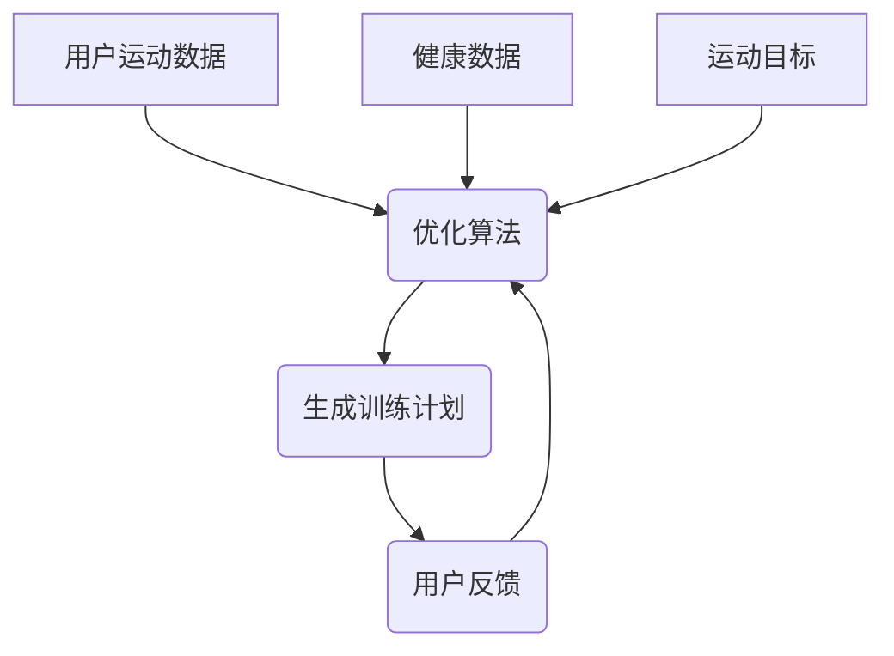
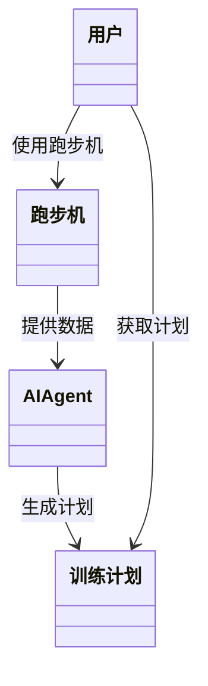
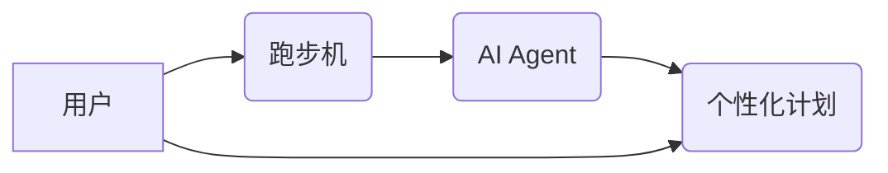
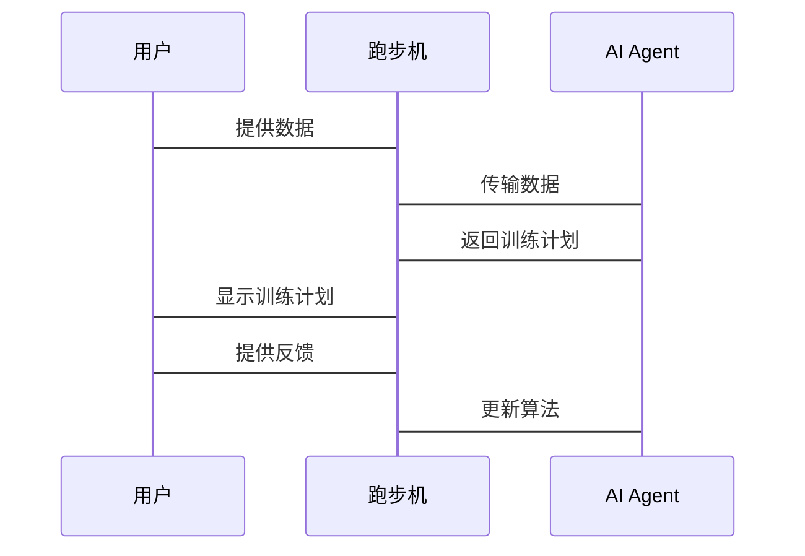

                 


# 智能跑步机：AI Agent的个性化训练计划生成器

> **关键词**：智能跑步机，AI Agent，个性化训练计划，机器学习，强化学习，数据驱动

> **摘要**：  
本文深入探讨了智能跑步机结合AI Agent技术，如何通过个性化训练计划生成器为用户提供科学、高效的运动方案。从AI Agent的核心原理到系统架构设计，从算法实现到实际案例分析，全面解析智能跑步机的智能化变革，为健身爱好者和科技爱好者提供深度的技术洞察。

---

## 第一部分：背景介绍

### 第1章：智能跑步机与AI Agent概述

#### 1.1 问题背景
- **1.1.1 运动健康管理的重要性**  
  随着生活节奏的加快，健康问题日益凸显。运动是保持身体健康的重要方式，但很多人由于缺乏专业指导或动力不足，难以坚持科学的锻炼计划。

- **1.1.2 传统跑步机的局限性**  
  传统跑步机仅提供固定的速度和模式，无法根据用户的实际需求动态调整训练计划。

- **1.1.3 AI技术在运动领域的应用潜力**  
  AI技术能够通过数据分析和机器学习，为用户提供个性化的运动建议，帮助用户更科学地锻炼。

#### 1.2 问题描述
- **1.2.1 用户个性化需求的多样性**  
  不同用户有不同的健康状况、运动目标和时间安排，需要个性化的训练计划。

- **1.2.2 现有训练计划的不足**  
  现有的训练计划通常基于固定模板，难以满足用户的个性化需求。

- **1.2.3 如何通过AI实现个性化服务**  
  AI Agent可以通过分析用户数据，动态生成适合用户的训练计划，帮助用户实现运动目标。

#### 1.3 问题解决
- **1.3.1 AI Agent的核心作用**  
  AI Agent通过收集和分析用户数据，实时调整训练计划，提供个性化的运动建议。

- **1.3.2 数据驱动的个性化训练计划**  
  利用用户的历史运动数据和健康数据，AI Agent可以预测用户的运动表现，并制定科学的训练计划。

- **1.3.3 智能跑步机的创新设计**  
  智能跑步机结合AI技术，实现了从被动锻炼到主动指导的转变。

#### 1.4 边界与外延
- **1.4.1 智能跑步机的功能边界**  
  智能跑步机主要关注用户的运动数据和训练计划，不涉及医疗诊断等专业领域。

- **1.4.2 AI Agent的应用范围**  
  AI Agent不仅适用于跑步机，还可以扩展到其他健身设备和健康管理领域。

- **1.4.3 与传统健身设备的区别**  
  传统健身设备仅提供机械功能，而智能跑步机通过AI技术实现了智能化和个性化。

#### 1.5 概念结构与核心要素
- **1.5.1 核心要素**  
  - 用户数据：运动数据、健康数据  
  - AI算法：机器学习模型、强化学习模型  
  - 训练计划：个性化运动方案  

- **1.5.2 数据流**  
  - 输入：用户数据、反馈  
  - 处理：AI算法生成训练计划  
  - 输出：个性化训练计划  

- **1.5.3 系统架构**  
  - 硬件：智能跑步机、传感器  
  - 软件：AI Agent、数据处理模块  
  - 用户界面：跑步机屏幕、手机App  

---

## 第二部分：核心概念与联系

### 第2章：AI Agent的核心原理

#### 2.1 AI Agent的基本原理
- **2.1.1 什么是AI Agent**  
  AI Agent是一种能够感知环境并采取行动以实现目标的智能体。在智能跑步机中，AI Agent通过分析用户数据，实时调整训练计划。

- **2.1.2 AI Agent的分类**  
  - 简单反射型：基于规则的响应  
  - 复杂推理型：基于机器学习的决策  
  - 学习增强型：通过强化学习优化行为  

- **2.1.3 AI Agent在智能跑步机中的应用**  
  AI Agent通过收集用户的运动数据，分析用户的健康状况和运动目标，动态生成个性化训练计划。

#### 2.2 实体关系分析
- **2.2.1 用户与跑步机的关系**  
  用户通过跑步机产生运动数据，跑步机通过AI Agent为用户提供个性化的训练计划。

- **2.2.2 AI Agent与数据的关系**  
  AI Agent通过分析用户的运动数据和健康数据，优化训练计划。

- **2.2.3 训练计划与用户反馈的关系**  
  用户反馈（如完成情况、感受）用于优化AI Agent的算法，提升训练计划的科学性。

#### 2.3 核心概念对比表

| 概念       | 属性           | 描述                               |
|------------|----------------|------------------------------------|
| AI Agent   | 输入数据       | 用户运动数据、健康数据             |
|            | 输出结果       | 个性化训练计划                     |
|            | 学习方式       | 基于用户反馈的强化学习             |

---

## 第三部分：算法原理讲解

### 第3章：个性化训练计划生成算法

#### 3.1 算法原理概述
- AI Agent通过强化学习优化训练计划，根据用户的反馈调整算法参数，实现个性化训练。

#### 3.2 算法流程图



#### 3.3 强化学习模型
- **状态空间**：用户的运动数据、健康数据  
- **动作空间**：训练计划的调整（如速度、时间）  
- **奖励函数**：用户完成训练计划的满意度  

#### 3.4 数学模型

训练计划生成的强化学习模型可以表示为：

$$
Q(s, a) = r + \gamma \max_{a'} Q(s', a')
$$

其中：
- \( Q(s, a) \) 表示状态 \( s \) 下采取动作 \( a \) 的价值
- \( r \) 表示奖励
- \( \gamma \) 表示折扣因子
- \( s' \) 表示下一个状态

---

## 第四部分：系统分析与架构设计方案

### 第4章：系统架构设计

#### 4.1 问题场景介绍
- 用户使用智能跑步机时，系统实时收集用户的运动数据（如心率、步频）和健康数据（如体重、BMI）。
- AI Agent根据数据生成个性化训练计划，并通过跑步机屏幕或手机App反馈给用户。

#### 4.2 项目介绍
- **项目目标**：实现智能跑步机的个性化训练计划生成功能。
- **项目范围**：基于用户数据，利用AI技术生成训练计划。

#### 4.3 系统功能设计
- **领域模型图**



#### 4.4 系统架构设计
- **架构图**



#### 4.5 接口设计
- **输入接口**：用户数据接口  
- **输出接口**：训练计划接口  
- **交互接口**：用户反馈接口  

#### 4.6 交互流程图



---

## 第五部分：项目实战

### 第5章：智能跑步机的实现

#### 5.1 环境安装
- **硬件**：智能跑步机、传感器  
- **软件**：Python、机器学习库（如TensorFlow、Scikit-learn）  

#### 5.2 核心代码实现
```python
# 强化学习模型代码示例
import numpy as np
import random

class AIAgent:
    def __init__(self, state_space, action_space):
        self.state_space = state_space
        self.action_space = action_space
        self.Q = np.zeros((state_space, action_space))

    def get_action(self, state, epsilon=0.1):
        if random.random() < epsilon:
            return random.randint(0, self.action_space-1)
        else:
            return np.argmax(self.Q[state])

    def update_Q(self, state, action, reward, next_state):
        alpha = 0.1
        self.Q[state][action] = (1 - alpha) * self.Q[state][action] + alpha * (reward + np.max(self.Q[next_state]))
```

#### 5.3 代码应用解读
- **AI Agent类**：实现强化学习算法，根据用户数据生成训练计划。
- **get_action方法**：根据当前状态选择动作。
- **update_Q方法**：根据反馈更新Q值矩阵，优化训练计划。

#### 5.4 实际案例分析
- 用户A：体重超重，目标减脂  
  AI Agent根据用户数据生成低强度长时训练计划，逐步增加强度，帮助用户燃烧脂肪。

---

## 第六部分：最佳实践

### 第6章：小结与注意事项

#### 6.1 小结
- AI Agent通过强化学习优化训练计划，为用户提供个性化的运动方案。
- 智能跑步机结合AI技术，实现从被动锻炼到主动指导的转变。

#### 6.2 注意事项
- 数据隐私：用户数据需加密处理，确保隐私安全。
- 算法优化：根据用户反馈不断优化AI算法，提升训练计划的科学性。

#### 6.3 拓展阅读
- 《强化学习：原理与应用》
- 《机器学习在运动健康中的应用》

---

## 作者信息

作者：AI天才研究院/AI Genius Institute & 禅与计算机程序设计艺术/Zen And The Art of Computer Programming

---

通过以上内容，我们详细探讨了智能跑步机结合AI Agent技术的核心原理、系统架构和实际应用。希望本文能为读者提供深入的技术洞察，帮助用户更好地理解和应用AI技术在运动健康管理中的潜力。

