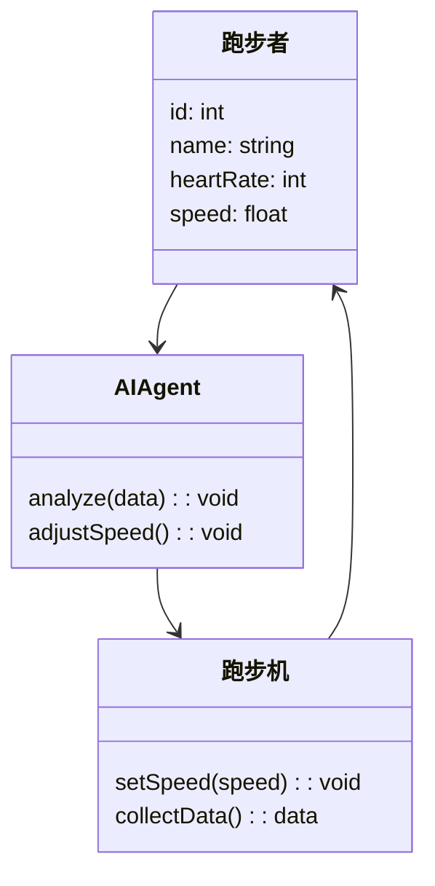
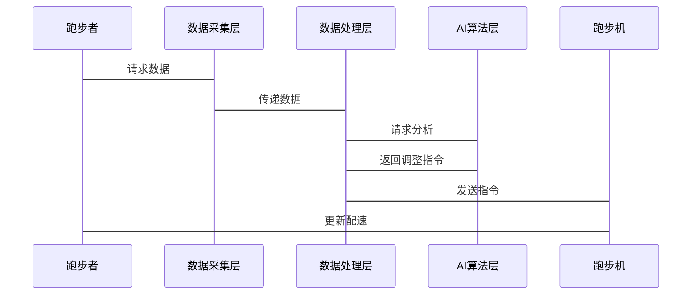

                 


# 智能跑步机：AI Agent的实时配速与体能管理

> 关键词：智能跑步机、AI Agent、实时配速、体能管理、强化学习、机器学习、系统架构

> 摘要：本文深入探讨了智能跑步机中AI Agent在实时配速与体能管理中的应用，从背景分析、核心概念、算法原理到系统架构和项目实战，全面解析了如何通过AI技术优化跑步训练过程。

---

## 第1章: 问题背景与需求分析

### 1.1 跑步运动的智能化趋势

#### 1.1.1 跑步运动的历史演变
跑步作为一项最原始且普遍的运动形式，经历了从单纯的身体锻炼到科学化、数据化训练的演变。早期的跑步训练依赖经验与感觉，而现代跑步者则追求更科学、个性化的训练方法。

#### 1.1.2 现代跑步者的需求变化
现代跑步者对训练的科学性、个性化和实时反馈提出了更高的要求。他们不仅需要记录跑步数据，还需要基于数据的实时反馈进行动态调整。

#### 1.1.3 智能化跑步设备的出现背景
随着人工智能和物联网技术的快速发展，智能化设备逐渐渗透到运动领域，智能跑步机应运而生，成为跑步训练的重要工具。

---

### 1.2 当前跑步训练中的痛点

#### 1.2.1 传统跑步训练的局限性
传统跑步训练依赖教练的经验和运动员的自我感知，存在数据采集不全面、训练计划不够个性化等问题。

#### 1.2.2 跑步者个性化需求的多样性
不同跑步者有不同的体能水平、训练目标和健康状况，统一的训练计划难以满足个性化需求。

#### 1.2.3 数据驱动的训练趋势
现代运动科学强调数据驱动的训练方法，通过实时数据反馈优化训练计划，但传统方法难以实现这一点。

---

### 1.3 AI Agent在跑步训练中的应用价值

#### 1.3.1 实时配速优化的意义
AI Agent能够根据跑步者的实时数据，动态调整配速，确保训练效果的同时避免运动损伤。

#### 1.3.2 体能管理的智能化需求
通过AI技术，跑步者可以实时了解自身的体能状态，并根据反馈进行科学的训练调整。

#### 1.3.3 AI Agent的核心作用
AI Agent作为智能跑步机的核心，能够实现数据采集、分析、决策和执行的闭环，为跑步者提供智能化的训练支持。

---

## 第2章: 智能跑步机的核心概念

### 2.1 AI Agent的基本定义

#### 2.1.1 AI Agent的定义与特征
AI Agent是一种能够感知环境、自主决策并执行任务的智能体。在智能跑步机中，AI Agent负责采集跑步者数据、分析并优化训练计划。

#### 2.1.2 AI Agent在跑步机中的具体应用
AI Agent可以实时调整跑步机的配速、坡度和阻力，为跑步者提供个性化的训练体验。

---

### 2.2 实时配速与体能管理的实现原理

#### 2.2.1 配速的定义与影响因素
配速是跑步者每单位距离所用的时间，受体能、技术、环境等多种因素影响。

#### 2.2.2 体能管理的指标体系
体能管理包括心率、步频、步幅、能量消耗等多个指标，AI Agent通过这些指标综合评估跑步者的体能状态。

#### 2.2.3 AI Agent如何实现配速与体能的动态平衡
AI Agent通过实时采集跑步者数据，结合预设的训练目标，动态调整配速，确保训练强度既不过度疲劳也不过于轻松。

---

### 2.3 智能跑步机的系统架构

#### 2.3.1 硬件部分：传感器与执行机构
智能跑步机配备心率传感器、加速度计、陀螺仪等硬件设备，用于采集跑步者的实时数据。

#### 2.3.2 软件部分：AI算法与数据处理
AI Agent通过机器学习算法对数据进行分析，生成个性化的训练计划。

#### 2.3.3 用户界面：交互设计与反馈机制
智能跑步机提供友好的用户界面，实时显示数据和反馈信息，帮助跑步者更好地理解和调整训练计划。

---

## 第3章: AI Agent的算法原理

### 3.1 基于强化学习的配速优化

#### 3.1.1 强化学习的基本原理
强化学习是一种通过试错机制优化决策的算法，适用于动态调整配速的场景。

#### 3.1.2 在配速优化中的应用
AI Agent通过强化学习算法，根据跑步者的实时反馈调整配速，确保训练效果最大化。

#### 3.1.3 算法实现的数学模型
强化学习的核心是Q-learning算法，通过状态-动作-奖励的三元组优化决策过程：

$$ Q(s,a) = Q(s,a) + \alpha (r + \gamma \max Q(s',a') - Q(s,a)) $$

---

### 3.2 基于机器学习的体能评估

#### 3.2.1 体能评估的特征提取
通过心率、步频、步幅等特征，构建跑步者的体能评估模型。

#### 3.2.2 机器学习模型的训练与优化
使用支持向量机（SVM）或随机森林（Random Forest）等算法，训练体能评估模型。

#### 3.2.3 模型评估与调优
通过交叉验证和网格搜索等方法，优化模型的性能。

---

## 第4章: 系统分析与架构设计方案

### 4.1 系统功能设计

#### 4.1.1 领域模型（Mermaid类图）


#### 4.1.2 系统架构设计（Mermaid架构图）


#### 4.1.3 系统接口设计
- 数据采集接口：采集跑步者的实时数据。
- AI算法接口：调用AI算法进行数据处理和决策。
- 用户界面接口：显示数据和反馈信息。

#### 4.1.4 系统交互设计（Mermaid序列图）


---

## 第5章: 项目实战

### 5.1 环境安装与配置

```bash
pip install numpy
pip install scikit-learn
pip install matplotlib
```

### 5.2 系统核心实现

#### 5.2.1 数据采集与预处理
```python
import numpy as np

# 采集心率和速度数据
heart_rate = np.array([70, 72, 75, 78, 80])
speed = np.array([10, 11, 12, 13, 14])
```

#### 5.2.2 AI算法实现
```python
from sklearn.model_selection import train_test_split
from sklearn.svm import SVC

# 训练体能评估模型
model = SVC()
X = np.column_stack((heart_rate, speed))
y = np.array([0, 1, 0, 1, 0])
X_train, X_test, y_train, y_test = train_test_split(X, y, test_size=0.2)
model.fit(X_train, y_train)
```

#### 5.2.3 系统交互实现
```python
def adjust_speed(current_speed, target_speed):
    # 动态调整配速
    return target_speed

# 示例调用
current_speed = 10
target_speed = 12
new_speed = adjust_speed(current_speed, target_speed)
print(new_speed)  # 输出：12
```

### 5.3 实际案例分析

#### 5.3.1 案例背景
一位初级跑步者，目标是通过6周的训练提升耐力。

#### 5.3.2 训练计划
- 第1周：慢跑配速，心率控制在最大心率的70%。
- 第2周：间歇跑，配速交替调整。
- 第3周：长跑，配速逐步提升。

#### 5.3.3 数据分析与反馈
通过AI Agent实时调整配速，跑步者的心率和速度数据被持续优化，最终实现训练目标。

---

## 第6章: 总结与展望

### 6.1 最佳实践 tips
- 定期更新AI算法模型，确保训练计划的有效性。
- 结合专业教练的建议，优化AI Agent的决策逻辑。

### 6.2 小结
智能跑步机通过AI Agent实现了跑步训练的科学化与个性化，为跑步者提供了全新的运动体验。

### 6.3 注意事项
- 跑步者应根据自身情况调整训练计划，避免过度训练。
- 系统维护人员需定期校准传感器，确保数据采集的准确性。

### 6.4 拓展阅读
- 《机器学习实战》
- 《强化学习原理与应用》

---

作者：AI天才研究院 & 禅与计算机程序设计艺术

