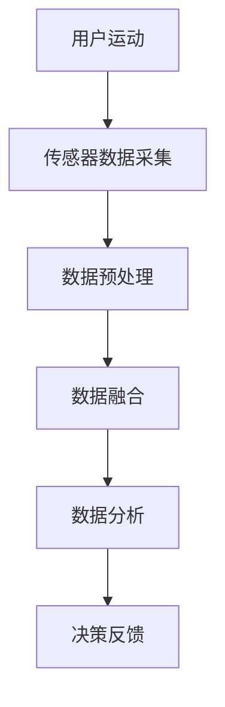

                 


# 智能跑鞋：AI Agent的运动数据收集

> **关键词**：智能跑鞋、AI Agent、运动数据收集、传感器技术、机器学习、数据融合、边缘计算

> **摘要**：  
智能跑鞋通过集成AI Agent技术，能够实时收集和分析运动数据，为用户提供个性化的运动建议和健康评估。本文从背景、原理、算法、系统设计、项目实战等多方面深入探讨智能跑鞋中的AI Agent运动数据收集技术，涵盖传感器数据融合、机器学习模型构建、系统架构设计等内容，最后结合实际案例分析，总结经验并展望未来发展趋势。

---

## 第一部分: 智能跑鞋与AI Agent概述

### 第1章: 智能跑鞋与AI Agent的基本概念

#### 1.1 智能跑鞋的定义与特点

##### 1.1.1 智能跑鞋的定义
智能跑鞋是一种结合了物联网（IoT）和人工智能（AI）技术的运动鞋，能够实时收集用户的运动数据，并通过AI算法进行分析，为用户提供个性化的运动建议和健康评估。

##### 1.1.2 智能跑鞋的核心特点
- **数据采集**：内置多种传感器，如加速度计、陀螺仪、心率监测器、温度传感器等，能够实时采集用户的运动数据。
- **AI分析**：通过AI算法对数据进行分析，识别用户的运动模式、步频、步幅、姿态等关键指标。
- **个性化反馈**：根据分析结果，为用户提供实时反馈，如运动建议、健康报告等。

##### 1.1.3 智能跑鞋与传统跑鞋的区别
- **传统跑鞋**：仅提供基本的运动功能，如缓冲、支撑等。
- **智能跑鞋**：具备数据采集和AI分析功能，能够提供智能化的运动反馈。

#### 1.2 AI Agent的基本概念

##### 1.2.1 AI Agent的定义
AI Agent（智能体）是指能够感知环境、自主决策并执行任务的智能系统。在智能跑鞋中，AI Agent负责收集和分析运动数据，并根据数据结果提供反馈。

##### 1.2.2 AI Agent的核心特点
- **感知能力**：通过传感器获取环境和用户数据。
- **决策能力**：基于数据进行分析和决策。
- **执行能力**：根据决策结果执行相应的动作，如调整运动模式、提供反馈等。

##### 1.2.3 AI Agent与传统算法的区别
传统算法通常需要人工设定规则，而AI Agent能够通过机器学习模型不断优化自身的决策能力。

#### 1.3 智能跑鞋与AI Agent的结合

##### 1.3.1 智能跑鞋中AI Agent的作用
AI Agent在智能跑鞋中的作用包括数据采集、数据分析、决策反馈等。

##### 1.3.2 AI Agent在运动数据收集中的应用
AI Agent通过传感器获取用户的运动数据，并通过算法进行分析，识别用户的运动模式和健康状况。

##### 1.3.3 智能跑鞋与AI Agent的未来发展趋势
未来，智能跑鞋的AI Agent将更加智能化，能够实现更精准的运动数据分析和个性化反馈。

---

### 第2章: 智能跑鞋的运动数据收集技术

#### 2.1 运动数据收集的背景与意义

##### 2.1.1 运动数据收集的重要性
运动数据收集能够帮助用户了解自己的运动状况，优化运动计划，预防运动损伤。

##### 2.1.2 智能跑鞋在运动数据收集中的优势
- **实时性**：能够实时采集用户的运动数据。
- **准确性**：通过多种传感器的融合，提高数据的准确性。
- **个性化**：根据用户的运动数据，提供个性化的反馈。

##### 2.1.3 数据收集的边界与外延
数据收集的边界包括用户的基本信息、运动数据等，外延则包括数据的存储、分析和应用。

#### 2.2 运动数据的种类与特征

##### 2.2.1 运动数据的分类
- **步频**：每分钟的步数。
- **步幅**：每步的长度。
- **姿态**：用户的运动姿态，如跑步姿势、步态等。
- **心率**：用户的心率数据。

##### 2.2.2 各类数据的特征对比
通过对比不同数据的特征，可以更好地理解它们在运动分析中的作用。

| 数据类型 | 特征                  | 应用场景               |
|----------|-----------------------|------------------------|
| 步频     | 高频采集，反映运动强度 | 跑步速度分析           |
| 步幅     | 反映步长              | 步长优化建议           |
| 姿态     | 反映运动姿势          | 改善跑步姿势           |
| 心率     | 反映身体状况          | 运动强度监控           |

##### 2.2.3 数据特征的表格对比
通过表格对比，可以更清晰地理解各类数据的特征和应用。

---

### 第3章: AI Agent在运动数据收集中的核心概念与联系

#### 3.1 AI Agent的核心概念原理

##### 3.1.1 AI Agent的基本原理
AI Agent通过感知环境、分析数据、做出决策并执行动作来实现运动数据的收集和分析。

##### 3.1.2 AI Agent的核心要素
- **感知层**：通过传感器获取数据。
- **决策层**：通过算法分析数据，做出决策。
- **执行层**：根据决策结果执行相应的动作。

##### 3.1.3 AI Agent与运动数据收集的关系
AI Agent通过感知环境和用户数据，实现对运动数据的实时收集和分析。

#### 3.2 AI Agent与运动数据的关系

##### 3.2.1 AI Agent如何感知运动数据
通过内置的传感器，AI Agent能够实时采集用户的运动数据，如步频、步幅、姿态等。

##### 3.2.2 AI Agent如何处理运动数据
AI Agent通过算法对数据进行分析和融合，识别用户的运动模式和健康状况。

##### 3.2.3 AI Agent如何优化运动数据收集
通过机器学习模型的优化，AI Agent能够提高数据收集的准确性和实时性。

#### 3.3 实体关系图与流程图

##### 3.3.1 实体关系图（ER图）
以下是智能跑鞋运动数据收集的ER图：

```mermaid
erd
    跑步数据
        id: int
        步频: int
        步幅: float
        姿态: varchar
        时间戳: datetime
    用户
        id: int
        用户名: varchar
        性别: varchar
        年龄: int
    智能跑鞋
        id: int
        用户id: int
        数据id: int
```

##### 3.3.2 数据流流程图（Mermaid）
以下是数据流的流程图：



---

## 第二部分: AI Agent运动数据收集的算法原理

### 第4章: AI Agent的运动数据融合算法

#### 4.1 数据融合的背景与意义
数据融合是将多个传感器的数据进行整合，以提高数据的准确性和鲁棒性。

#### 4.2 数据融合的算法原理
通过加权平均的方法，对多个传感器的数据进行融合，得到更准确的结果。

#### 4.3 数据融合的数学模型

##### 4.3.1 加权平均模型
$$ y = \sum_{i=1}^{n} w_i x_i $$
其中，$w_i$ 是传感器 $i$ 的权重，$x_i$ 是传感器 $i$ 的数据，$y$ 是融合后的数据。

#### 4.4 数据融合的代码实现

##### 4.4.1 代码示例
```python
import numpy as np

# 传感器数据
sensor_data = [100, 105, 98]

# 权重
weights = [0.4, 0.3, 0.3]

# 数据融合
fused_data = np.dot(sensor_data, weights)
print("Fused Data:", fused_data)
```

#### 4.5 数据融合的优化与扩展
通过调整权重和引入更多的传感器数据，可以进一步优化数据融合的效果。

---

### 第5章: AI Agent的运动数据分析算法

#### 5.1 数据分析的背景与意义
数据分析是通过对运动数据的挖掘，识别用户的运动模式和健康状况。

#### 5.2 数据分析的算法原理
通过机器学习算法，对运动数据进行分类和回归分析，预测用户的运动表现和健康状况。

#### 5.3 数据分析的数学模型

##### 5.3.1 分类算法
使用随机森林算法对运动数据进行分类，识别用户的运动模式。

##### 5.3.2 回归算法
使用线性回归算法对运动数据进行回归分析，预测用户的运动表现。

#### 5.4 数据分析的代码实现

##### 5.4.1 代码示例
```python
from sklearn.ensemble import RandomForestClassifier
from sklearn.model_selection import train_test_split

# 数据集
X = [[100, 105, 98], [110, 115, 108], [90, 95, 88]]
y = [0, 1, 2]  # 标签

# 划分训练集和测试集
X_train, X_test, y_train, y_test = train_test_split(X, y, test_size=0.3)

# 训练模型
model = RandomForestClassifier(n_estimators=100)
model.fit(X_train, y_train)

# 预测
predictions = model.predict(X_test)
print("预测结果:", predictions)
```

#### 5.5 数据分析的优化与扩展
通过优化算法参数和引入更多的数据特征，可以进一步提高数据分析的准确性和效果。

---

### 第6章: AI Agent运动数据收集的系统架构设计

#### 6.1 系统架构的背景与意义
系统架构设计是实现智能跑鞋运动数据收集的核心部分。

#### 6.2 系统架构的设计原理
通过分层设计，将系统划分为感知层、数据层、分析层和应用层。

#### 6.3 系统架构的Mermaid图


---

## 第三部分: 项目实战与优化

### 第7章: 项目实战

#### 7.1 项目背景与目标
本项目旨在通过AI Agent技术，实现智能跑鞋的运动数据收集和分析。

#### 7.2 环境搭建
- **硬件环境**：智能跑鞋、传感器、计算机。
- **软件环境**：Python、机器学习库（如Scikit-learn、XGBoost）。

#### 7.3 核心代码实现

##### 7.3.1 数据采集代码
```python
import serial

# 串口通信
ser = serial.Serial('COM3', 9600)
data = ser.readline().decode().strip()
print("采集数据:", data)
```

##### 7.3.2 数据分析代码
```python
from sklearn.ensemble import RandomForestClassifier

# 数据预处理
data_processed = data_cleaning(data)

# 模型训练
model = RandomForestClassifier(n_estimators=100)
model.fit(X_train, y_train)

# 预测
predictions = model.predict(X_test)
print("预测结果:", predictions)
```

#### 7.4 项目小结
通过项目实战，我们能够更好地理解智能跑鞋运动数据收集的实现过程，并掌握AI Agent技术的应用方法。

---

### 第8章: 优化与扩展

#### 8.1 系统优化
- **数据存储**：通过数据库优化，提高数据存储和查询效率。
- **算法优化**：通过参数调整和模型优化，提高数据分析的准确性和效率。

#### 8.2 系统扩展
- **功能扩展**：增加更多的运动数据收集和分析功能，如心率监测、运动轨迹分析等。
- **场景扩展**：将智能跑鞋的应用场景扩展到更多领域，如运动训练、健康管理等。

#### 8.3 未来发展趋势
未来，智能跑鞋的AI Agent技术将更加智能化和个性化，能够实现更精准的运动数据分析和更智能的反馈。

---

## 作者信息

作者：AI天才研究院/AI Genius Institute & 禅与计算机程序设计艺术 /Zen And The Art of Computer Programming

---

以上是《智能跑鞋：AI Agent的运动数据收集》的技术博客文章的完整内容，涵盖了从背景到实战的各个方面，结合了理论和实践，帮助读者深入理解智能跑鞋中的AI Agent运动数据收集技术。

