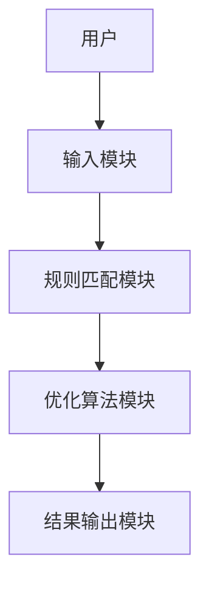

                 


# 文章标题：智能跨国税收筹划方案生成器

> 关键词：智能税收筹划，跨国税务，规则引擎，机器学习，系统架构

> 摘要：本文详细探讨了智能跨国税收筹划方案生成器的设计与实现，从背景介绍到核心概念，从算法原理到系统架构，从项目实战到最佳实践，全面解析了如何利用智能化技术优化跨国税务管理。

---

# 目录大纲：《智能跨国税收筹划方案生成器》

---

# 第一部分: 背景介绍与核心概念

## 第1章: 跨国税收筹划的背景与问题

### 1.1 跨国税收筹划的背景

#### 1.1.1 全球化背景下的跨国企业税务挑战

- 全球化背景下跨国企业的税务管理复杂性
- 数字化时代对企业税务管理的影响
- 税收筹划的合法合规性原则

#### 1.1.2 数字化时代对企业税务管理的影响

- 税收政策的数字化转型
- 数据驱动的税务分析
- 税务风险管理的智能化

#### 1.1.3 税收筹划的合法合规性原则

- 税收筹划的合法性
- 税收筹划的合规性
- 税收筹划的道德性

### 1.2 跨国税收筹划的核心问题

#### 1.2.1 跨国经营中的税务风险

- 税收差异对企业利润的影响
- 税收筹划中的法律风险
- 税务合规性对企业运营的影响

#### 1.2.2 税收筹划的目标与边界

- 税收筹划的核心目标
- 税收筹划的边界与外延
- 税收筹划与企业战略的关系

#### 1.2.3 税收筹划的实现路径

- 税收筹划的规则化
- 税收筹划的智能化
- 税收筹划的全球化

## 第2章: 智能跨国税收筹划生成器的核心概念

### 2.1 智能税收筹划生成器的定义

#### 2.1.1 什么是智能税收筹划生成器

- 智能税收筹划生成器的定义
- 智能税收筹划生成器的核心功能
- 智能税收筹划生成器与传统税收筹划的区别

#### 2.1.2 智能税收筹划生成器的核心特征

- 数据驱动
- 智能优化
- 实时反馈

### 2.2 智能税收筹划生成器的原理

#### 2.2.1 数据采集与处理

- 数据来源
- 数据清洗
- 数据分析

#### 2.2.2 税收规则匹配

- 税收规则的定义
- 规则匹配的实现方式
- 规则匹配的优化策略

#### 2.2.3 优化算法与结果生成

- 优化算法的选择
- 算法实现的步骤
- 结果生成的规则

## 第3章: 智能税收筹划生成器的数学模型与算法

### 3.1 税收规则的数学表示

#### 3.1.1 税收规则的特征

- 税收规则的多样性
- 税收规则的复杂性
- 税收规则的动态性

#### 3.1.2 税收规则的数学模型

- 税收规则的逻辑表达
- 税收规则的权重计算
- 税收规则的相似度度量

### 3.2 基于机器学习的税收优化算法

#### 3.2.1 机器学习在税收优化中的应用

- 机器学习算法的选择
- 机器学习模型的训练
- 机器学习模型的评估

#### 3.2.2 优化算法的数学模型

- 优化算法的目标函数
- 优化算法的约束条件
- 优化算法的求解步骤

## 第4章: 智能税收筹划生成器的系统架构

### 4.1 系统功能模块设计

#### 4.1.1 用户输入模块

- 输入数据的格式
- 输入数据的处理
- 输入数据的验证

#### 4.1.2 规则匹配模块

- 规则匹配的流程
- 规则匹配的实现方式
- 规则匹配的优化策略

#### 4.1.3 优化算法模块

- 优化算法的选择
- 优化算法的实现
- 优化算法的调优

### 4.2 系统架构设计

#### 4.2.1 系统架构图

- 系统架构的整体设计
- 系统架构的模块划分
- 系统架构的交互流程

#### 4.2.2 系统接口设计

- 系统接口的定义
- 系统接口的实现
- 系统接口的测试

### 4.3 系统实现的注意事项

#### 4.3.1 系统实现的关键点

- 系统实现的核心技术
- 系统实现的难点
- 系统实现的解决方案

#### 4.3.2 系统实现的优化策略

- 系统实现的性能优化
- 系统实现的可扩展性
- 系统实现的可维护性

---

# 第二部分: 项目实战与最佳实践

## 第5章: 项目实战

### 5.1 环境安装与配置

#### 5.1.1 开发环境的搭建

- 开发工具的安装
- 开发环境的配置
- 开发环境的测试

#### 5.1.2 依赖库的安装

- Python库的安装
- Java库的安装
- 其他工具的安装

### 5.2 系统核心代码实现

#### 5.2.1 数据预处理代码

- 数据清洗的实现
- 数据分析的实现
- 数据转换的实现

#### 5.2.2 规则引擎代码

- 规则匹配的实现
- 规则引擎的优化
- 规则引擎的测试

#### 5.2.3 机器学习模型代码

- 模型训练的实现
- 模型预测的实现
- 模型评估的实现

### 5.3 代码解读与分析

#### 5.3.1 代码结构分析

- 代码的整体结构
- 代码模块的划分
- 代码的可扩展性

#### 5.3.2 代码实现的关键点

- 代码实现的核心技术
- 代码实现的难点
- 代码实现的解决方案

## 第6章: 最佳实践与注意事项

### 6.1 最佳实践

#### 6.1.1 数据管理的最佳实践

- 数据管理的规范
- 数据管理的优化策略
- 数据管理的注意事项

#### 6.1.2 系统优化的最佳实践

- 系统优化的技术选择
- 系统优化的实施步骤
- 系统优化的注意事项

### 6.2 小结

#### 6.2.1 项目总结

- 项目实现的核心成果
- 项目实施的关键经验
- 项目实施的教训与改进方向

#### 6.2.2 未来展望

- 智能税收筹划生成器的发展方向
- 智能税收筹划生成器的未来应用
- 智能税收筹划生成器的创新空间

---

# 第三部分: 数学模型与算法分析

## 第7章: 数学模型与算法分析

### 7.1 税收规则的数学模型

#### 7.1.1 税收规则的特征表示

- 税收规则的多样性
- 税收规则的复杂性
- 税收规则的动态性

#### 7.1.2 税收规则的相似度度量

- 税收规则的相似度计算
- 税收规则的聚类分析
- 税收规则的分类分析

### 7.2 基于机器学习的优化算法

#### 7.2.1 机器学习算法的选择

- 机器学习算法的比较
- 机器学习算法的优缺点
- 机器学习算法的适用场景

#### 7.2.2 优化算法的数学模型

- 优化算法的目标函数
- 优化算法的约束条件
- 优化算法的求解步骤

## 第8章: 算法实现与优化

### 8.1 算法实现的步骤

#### 8.1.1 数据预处理

- 数据清洗
- 数据转换
- 数据分析

#### 8.1.2 算法选择与实现

- 算法选择的依据
- 算法实现的步骤
- 算法实现的代码示例

#### 8.1.3 算法优化策略

- 算法优化的技术选择
- 算法优化的实施步骤
- 算法优化的注意事项

### 8.2 算法优化的数学模型

#### 8.2.1 优化算法的数学表示

- 优化算法的目标函数
- 优化算法的约束条件
- 优化算法的求解步骤

#### 8.2.2 算法优化的数学推导

- 算法优化的数学推导
- 算法优化的代码实现
- 算法优化的测试与验证

---

# 第四部分: 系统架构与实现细节

## 第9章: 系统架构与实现细节

### 9.1 系统架构设计

#### 9.1.1 系统架构的整体设计

- 系统架构的模块划分
- 系统架构的交互流程
- 系统架构的优化策略

#### 9.1.2 系统接口设计

- 系统接口的定义
- 系统接口的实现
- 系统接口的测试

### 9.2 系统实现细节

#### 9.2.1 数据库设计

- 数据库的表结构设计
- 数据库的索引设计
- 数据库的优化策略

#### 9.2.2 系统功能实现

- 系统功能的实现步骤
- 系统功能的实现代码
- 系统功能的测试与验证

---

# 附录

## 附录A: 代码示例

### 附录A.1 数据预处理代码

```python
import pandas as pd
from sklearn.preprocessing import StandardScaler

# 数据加载
data = pd.read_csv('tax_data.csv')

# 数据清洗
data.dropna(inplace=True)

# 数据转换
scaled_data = StandardScaler().fit_transform(data)
```

### 附录A.2 规则引擎代码

```python
from simple_rule_engine import RuleEngine

engine = RuleEngine()
engine.add_rule('rule1', lambda x: x['income'] > 100000)
engine.add_rule('rule2', lambda x: x['expenses'] < 50000)
result = engine.evaluate(data)
```

## 附录B: 算法优化代码

### 附录B.1 优化算法实现

```python
import numpy as np
from sklearn.ensemble import RandomForestClassifier

model = RandomForestClassifier(n_estimators=100, random_state=42)
model.fit(X_train, y_train)
 predictions = model.predict(X_test)
```

## 附录C: 系统架构图



---

# 参考文献

- [1] 税收筹划相关书籍
- [2] 机器学习相关书籍
- [3] 系统架构设计相关书籍
- [4] 其他参考资料

---

# 作者

作者：AI天才研究院/AI Genius Institute & 禅与计算机程序设计艺术/Zen And The Art of Computer Programming

