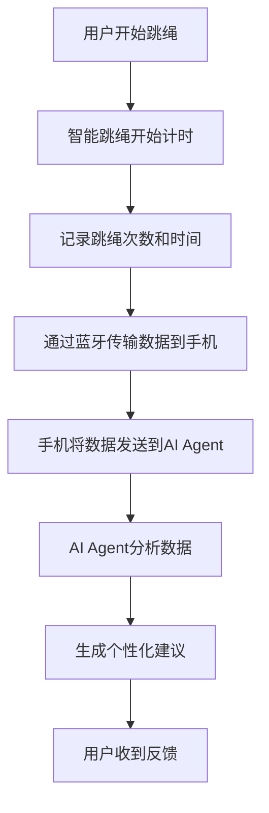
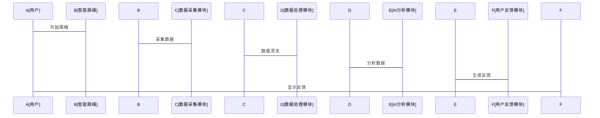

                 


# 第四章: 实体关系与流程图

## 4.1 实体关系分析

在智能跳绳与AI Agent的结合系统中，主要涉及三个实体：用户、智能跳绳和AI Agent。以下是它们之间的关系：

1. **用户（User）**
   - 用户是系统的直接使用者，通过智能跳绳进行运动，并接收AI Agent的反馈。
   - 属性：用户ID、姓名、年龄、性别、体重、目标。

2. **智能跳绳（Smart Rope）**
   - 负责采集用户的运动数据，如跳绳次数、时间、速度等。
   - 属性：设备ID、传感器类型、电池状态、连接状态。

3. **AI Agent**
   - 负责接收和处理数据，提供个性化的运动建议。
   - 属性：系统ID、算法版本、数据处理能力、反馈能力。

### ER实体关系图

```mermaid
erDiagram
    user}o{ smart_rop
    user}o{ ai_agent
    smart_rop}o{ ai_agent
```

解释：用户操作智能跳绳，智能跳绳将数据传输给AI Agent，AI Agent根据数据提供反馈给用户。

## 4.2 业务流程分析

为了更好地理解系统的工作流程，我们绘制了以下流程图，展示了AI Agent如何分析用户的跳绳数据并提供反馈。

### 业务流程图



解释：用户开始跳绳后，智能跳绳记录数据并传输给AI Agent进行分析，最后生成反馈供用户参考。

## 第五章: 系统架构设计

## 5.1 系统架构概述

本章将详细描述智能跳绳与AI Agent结合系统的架构设计，包括功能模块划分、架构图、接口设计和交互流程。

### 5.2 功能模块划分

系统主要分为以下几个功能模块：

1. **数据采集模块**
   - 负责收集用户的跳绳数据，如跳绳次数、时间、速度等。

2. **数据处理模块**
   - 对采集到的数据进行清洗和初步分析，确保数据的准确性和完整性。

3. **AI分析模块**
   - 应用算法对数据进行深度分析，生成个性化的运动建议。

4. **用户反馈模块**
   - 将分析结果以用户友好的方式展示，可能包括图形、文本或语音反馈。

### 5.3 系统架构图

系统架构图展示了各功能模块之间的关系和数据流。

```mermaid
subgraph 数据流
    A[用户] --> B[智能跳绳]
    B --> C[数据采集模块]
    C --> D[数据处理模块]
    D --> E[AI分析模块]
    E --> F[用户反馈模块]
    F --> A[用户]
end

subgraph 组件关系
    C[数据采集模块] --> D[数据处理模块]
    D --> E[AI分析模块]
    E --> F[用户反馈模块]
end
```

解释：用户通过智能跳绳触发数据采集，数据被处理后由AI分析模块生成反馈，最后反馈给用户。

### 5.4 接口设计

系统中涉及多个接口，以下是主要接口的描述：

1. **智能跳绳与手机之间的接口**
   - 使用蓝牙或Wi-Fi进行数据传输。

2. **数据处理模块与AI分析模块之间的接口**
   - 通过API进行数据交换。

3. **用户反馈模块与用户之间的接口**
   - 通过手机应用程序展示反馈信息。

### 5.5 交互流程

交互流程描述了用户与系统之间的交互步骤。



解释：用户开始跳绳，智能跳绳采集数据，数据经过处理和分析后，生成反馈并展示给用户。

## 总结

通过以上章节的详细分析，我们全面了解了智能跳绳与AI Agent结合系统的架构设计、实体关系和业务流程。接下来，我们可以继续探讨系统的实现细节，包括算法原理、数学模型和实际案例分析，以进一步验证和优化系统性能。

---

作者：AI天才研究院/AI Genius Institute & 禅与计算机程序设计艺术 /Zen And The Art of Computer Programming

