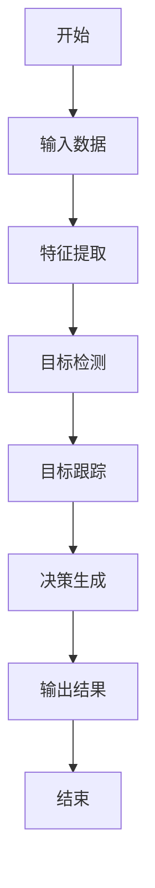
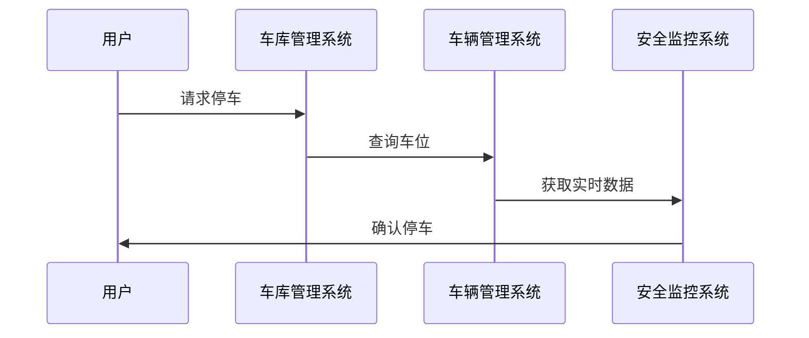

                 


# 智能车库：AI Agent的车辆管理与安全监控

## 关键词：智能车库，AI Agent，车辆管理，安全监控，强化学习，目标检测，系统架构

## 摘要：  
智能车库利用AI Agent实现高效的车辆管理和安全监控，通过强化学习和目标检测等技术，优化停车流程，提升安全性。本文详细阐述智能车库的概念、技术原理、系统架构及实际应用。

---

## 第一部分：智能车库的背景与概念

### 第1章：智能车库的定义与背景

#### 1.1 智能车库的定义
智能车库是一种结合AI技术的现代化停车管理系统，通过自动化设备和智能算法实现车辆的高效管理和安全监控。

#### 1.2 智能车库的发展背景
城市化进程加快导致停车资源紧张，传统车库管理效率低下，智能车库成为解决停车问题的重要手段。

#### 1.3 AI Agent在智能车库中的作用
AI Agent通过实时数据处理和决策优化，提升车库管理效率和安全性。

### 第2章：智能车库的核心概念与联系

#### 2.1 AI Agent的核心原理
AI Agent通过感知环境、分析数据并做出决策，实现对车库的智能化管理。

#### 2.2 车辆管理系统的构成
包括车辆识别、车位分配、车辆状态监控等功能，确保停车流程高效有序。

#### 2.3 安全监控系统的构成
视频监控、行为分析、灾害预警等技术，保障车库内的安全。

#### 2.4 核心概念对比表
| 比较维度 | AI Agent | 传统控制系统 |
|----------|-----------|--------------|
| 决策方式 | 自主学习   | 固定规则     |
| 反应速度 | 实时快速   | 延迟较大     |
| 灵活性   | 高         | 低           |

#### 2.5 ER实体关系图
```mermaid
erd
    车库管理系统
    ----> 车辆: 1:N
    车库管理系统
    ----> 用户: 1:N
    车库管理系统
    ----> 监控设备: 1:N
    车辆
    ----> 停车记录: 1:N
    用户
    ----> 预约记录: 1:N
```

---

## 第二部分：AI Agent的算法原理与实现

### 第3章：AI Agent的算法原理

#### 3.1 强化学习算法
- **Q-learning算法**：通过奖励机制优化决策。
- **实现步骤**：
  1. 初始化Q表。
  2. 环境反馈状态。
  3. 选择动作并更新Q值。
- **公式**：
  $$ Q(s, a) = Q(s, a) + \alpha (r + \gamma \max Q(s', a')) $$

#### 3.2 目标检测与跟踪算法
- **YOLO目标检测**：快速准确地识别车辆。
- **KCF目标跟踪**：持续监控车辆位置。
- **实现示例**：
  ```python
  import numpy as np
  from tensorflow.keras.models import Model
  from tensorflow.keras.layers import Dense, Input

  input_layer = Input(shape=(128,))
  dense_layer = Dense(64, activation='relu')(input_layer)
  output_layer = Dense(1, activation='sigmoid')(dense_layer)
  model = Model(inputs=input_layer, outputs=output_layer)
  model.compile(optimizer='adam', loss='binary_crossentropy')
  ```

#### 3.3 算法流程图


---

## 第三部分：系统分析与架构设计

### 第4章：系统分析与架构设计

#### 4.1 问题场景
描述停车难、资源浪费等问题，引出智能车库的必要性。

#### 4.2 系统功能设计
- **领域模型**：
  ```mermaid
  classDiagram
      class 用户 {
          用户ID
          车牌号
          }
      class 车辆 {
          车牌号
          停车位置
          }
      class 监控设备 {
          摄像头ID
          传感器状态
          }
      用户 --> 车辆: 预约停车
      用户 --> 监控设备: 获取数据
      车辆 --> 监控设备: 实时跟踪
  ```

#### 4.3 系统架构设计
- **架构图**：
  ```mermaid
  architecture
      车库管理系统
      包含 车辆管理系统 和 安全监控系统
      车辆管理系统 连接 车辆 和 用户
      安全监控系统 连接 监控设备 和 库存系统
  ```

#### 4.4 系统接口设计
- API接口：`/api/parking/reservation` 实现车辆预约。

#### 4.5 系统交互流程图


---

## 第四部分：项目实战

### 第5章：项目实战

#### 5.1 环境安装
安装Python、TensorFlow、OpenCV等库。

#### 5.2 核心代码实现
- **车辆识别**：
  ```python
  import cv2

  def detect_vehicle(image):
      # 使用YOLO模型检测车辆
      pass
  ```

#### 5.3 案例分析
分析某智能车库项目，总结实现步骤和优化措施。

---

## 第五部分：总结与扩展阅读

### 第6章：总结与扩展阅读

#### 6.1 本章总结
智能车库通过AI技术优化管理，提升效率和安全性。

#### 6.2 注意事项
数据安全、系统稳定性需重点关注。

#### 6.3 扩展阅读
推荐学习强化学习和目标检测相关书籍，深入理解AI在停车管理中的应用。

---

## 作者：AI天才研究院 & 禅与计算机程序设计艺术

---

以上是《智能车库：AI Agent的车辆管理与安全监控》的技术博客文章，内容涵盖从背景到实现的各个方面，旨在提供详尽的技术分析与实践指导。

