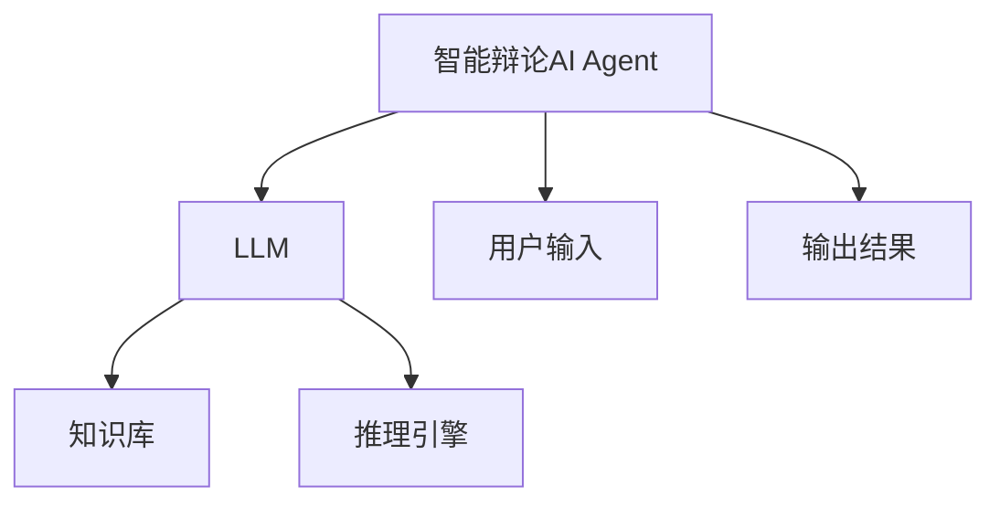
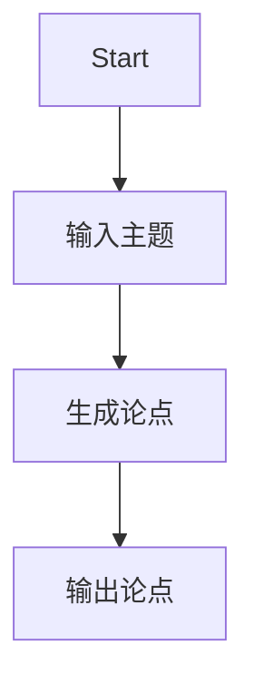
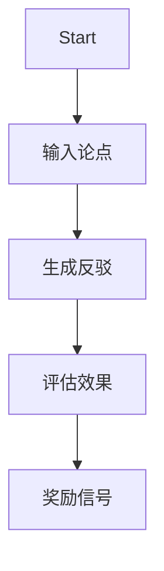
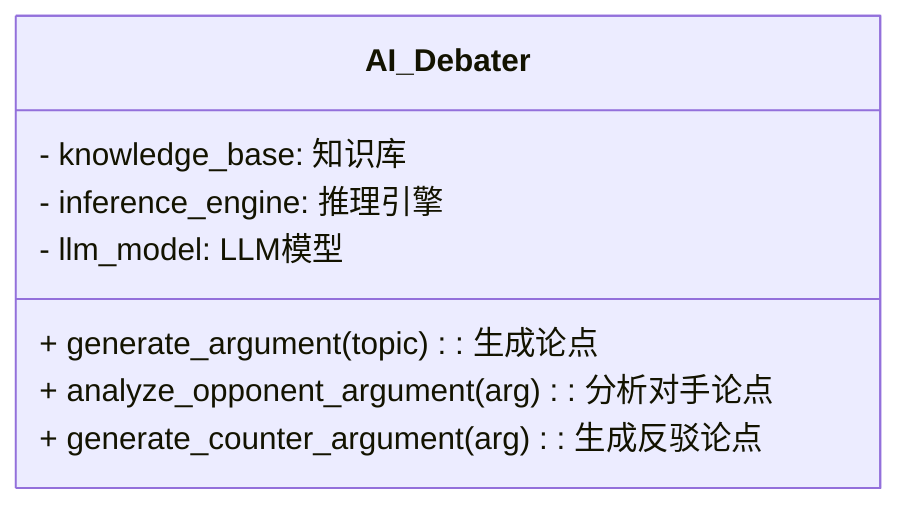
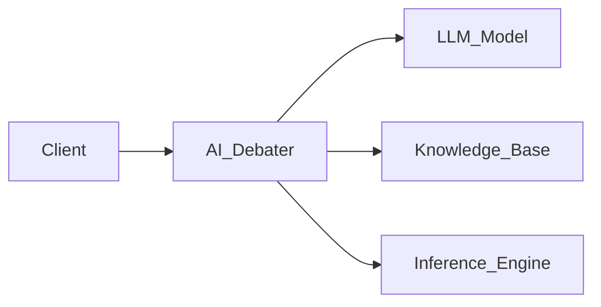
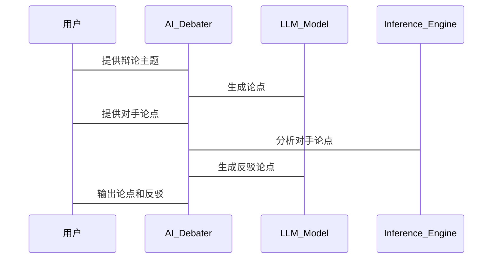

                 


# 智能辩论AI Agent：LLM驱动的论证与反驳系统

## 关键词：
智能辩论，AI Agent，LLM，大语言模型，论证，反驳，自然语言处理

## 摘要：
本文深入探讨了智能辩论AI Agent的构建与实现，基于大语言模型（LLM）的论证与反驳系统。文章从背景介绍、核心概念、算法原理、系统架构到项目实战，详细阐述了智能辩论AI Agent的设计与实现过程。通过理论分析与实践结合，本文揭示了LLM在智能辩论中的应用潜力，并展示了如何利用自然语言处理技术构建高效的论证与反驳系统。

---

# 第1章：智能辩论AI Agent的背景介绍

## 1.1 智能辩论的背景与现状

### 1.1.1 传统辩论的定义与特点
辩论是一种通过逻辑推理和语言表达来论证观点、反驳对手的高级思维活动。传统辩论的特点包括：
- **逻辑性**：依赖严密的逻辑推理。
- **知识性**：要求广泛的知识储备。
- **语言表达**：强调语言的组织和表达能力。

### 1.1.2 AI在辩论中的应用现状
随着AI技术的发展，AI在辩论中的应用逐渐从辅助工具向智能主体转变。目前的应用场景包括：
- **AI辅助辩论**：提供论点生成、资料查找等支持。
- **AI自动辩论**：通过自然语言处理技术实现自动化辩论。
- **教育领域**：AI作为教学工具，帮助学生提升辩论能力。

### 1.1.3 智能辩论AI Agent的定义与目标
智能辩论AI Agent是一种基于LLM的智能系统，能够自动生成论点、反驳对手观点，并与人类或AI进行实时辩论。其目标是通过自然语言处理技术，实现类似人类的辩论能力。

---

## 1.2 大语言模型（LLM）的基本概念

### 1.2.1 LLM的定义与特点
大语言模型是一种基于深度学习的自然语言处理模型，具有以下特点：
- **大规模训练**：基于海量文本数据进行预训练。
- **上下文理解**：能够理解上下文关系，生成连贯的文本。
- **多任务能力**：支持多种自然语言处理任务，如文本生成、问答等。

### 1.2.2 LLM在智能辩论中的作用
LLM在智能辩论中的作用主要体现在：
- **论点生成**：根据输入主题生成相关论点。
- **论点分析**：分析对手观点，寻找反驳点。
- **动态推理**：根据辩论进展实时调整策略。

---

## 1.3 智能辩论AI Agent的核心要素

### 1.3.1 论证与反驳机制
智能辩论AI Agent需要具备以下核心要素：
- **论点生成**：自动生成支持己方观点的论点。
- **论点分析**：分析对手论点，寻找逻辑漏洞。
- **反驳生成**：根据分析结果，生成有效的反驳论点。

### 1.3.2 知识库与推理引擎
智能辩论AI Agent需要依赖知识库和推理引擎：
- **知识库**：存储广泛的知识，支持论点生成。
- **推理引擎**：通过逻辑推理生成论点和反驳。

---

# 第2章：智能辩论AI Agent的核心概念与联系

## 2.1 论证与反驳的逻辑框架

### 2.1.1 论证的基本结构
论证的基本结构包括：
- **前提**：支持结论的论据。
- **结论**：论证的目标。
- **推理**：从前提到结论的逻辑推理过程。

### 2.1.2 反驳的基本策略
反驳的基本策略包括：
- **直接反驳**：直接否定对方的论点。
- **间接反驳**：通过削弱论点的支持证据来间接反驳。

---

## 2.2 LLM在智能辩论中的作用机制

### 2.2.1 LLM的文本生成能力
LLM通过生成模型生成文本，支持论点生成和反驳。

### 2.2.2 LLM的对话能力
LLM通过对话模型实现与人类的实时互动，支持辩论过程中的动态推理。

---

## 2.3 智能辩论系统的架构图



---

# 第3章：智能辩论AI Agent的算法原理

## 3.1 基于LLM的论点生成算法

### 3.1.1 论点生成流程



### 3.1.2 基于监督微调的训练方法
监督微调是一种常用的训练方法，具体流程如下：

```python
def supervised_finetuning(data):
    for batch in data:
        inputs, labels = batch
        outputs = model.generate(inputs)
        loss = calculate_loss(outputs, labels)
        optimizer.zero_grad()
        loss.backward()
        optimizer.step()
```

---

## 3.2 基于强化学习的反驳生成算法

### 3.2.1 强化学习的基本原理
强化学习通过奖励机制优化模型的生成结果：



### 3.2.2 基于政策梯度的优化方法
政策梯度是一种常用的强化学习方法，具体实现如下：

```python
def policy_gradient优化(data):
    for episode in data:
        inputs, actions, rewards = episode
        probabilities = model.predict(inputs)
        loss = -torch.mean(torch.log(probabilities) * rewards)
        optimizer.zero_grad()
        loss.backward()
        optimizer.step()
```

---

## 3.3 训练目标函数的数学模型

### 3.3.1 交叉熵损失函数
交叉熵损失函数用于衡量生成结果与真实标签的差异：

$$ \text{loss} = -\sum_{i=1}^{n} y_i \log(p_i) + (1-y_i)\log(1-p_i) $$

### 3.3.2 奖励函数的设计
奖励函数用于评估生成结果的质量：

$$ \text{reward} = \alpha \cdot \text{相关性} + \beta \cdot \text{逻辑性} + \gamma \cdot \text{语言表达能力} $$

---

# 第4章：智能辩论AI Agent的系统分析与架构设计

## 4.1 系统应用场景

### 4.1.1 教育领域
- **教学辅助**：帮助学生学习辩论技巧。
- **在线辩论平台**：支持学生进行在线辩论练习。

### 4.1.2 商业应用
- **市场营销**：用于产品推广和客户说服。
- **法律咨询**：辅助律师进行法律辩论。

---

## 4.2 系统功能设计

### 4.2.1 系统功能模型



---

## 4.3 系统架构设计

### 4.3.1 系统架构图



---

## 4.4 系统接口设计

### 4.4.1 输入接口
- **用户输入接口**：接收用户的输入主题和对手论点。
- **API接口**：供外部系统调用。

### 4.4.2 输出接口
- **输出论点接口**：输出生成的论点。
- **输出反驳接口**：输出生成的反驳论点。

---

## 4.5 系统交互流程

### 4.5.1 交互流程图



---

# 第5章：智能辩论AI Agent的项目实战

## 5.1 环境安装与配置

### 5.1.1 安装依赖
```bash
pip install torch transformers mermaid4jupyter
```

### 5.1.2 配置LLM模型
```python
from transformers import AutoModelForCausalLM, AutoTokenizer

model = AutoModelForCausalLM.from_pretrained('gpt2')
tokenizer = AutoTokenizer.from_pretrained('gpt2')
```

---

## 5.2 核心代码实现

### 5.2.1 论点生成函数

```python
def generate_argument(model, tokenizer, topic):
    inputs = tokenizer(topic, return_tensors='pt')
    outputs = model.generate(**inputs, max_length=100)
    return tokenizer.decode(outputs[0], skip_special_tokens=True)
```

### 5.2.2 反驳生成函数

```python
def generate_counter_argument(model, tokenizer, argument):
    inputs = tokenizer(argument, return_tensors='pt')
    outputs = model.generate(**inputs, max_length=100)
    return tokenizer.decode(outputs[0], skip_special_tokens=True)
```

---

## 5.3 代码解读与分析

### 5.3.1 论点生成代码
上述代码通过LLM生成支持主题的论点，具体步骤包括：
1. **输入处理**：将主题转换为模型可接受的输入格式。
2. **模型生成**：调用模型生成论点。
3. **结果解码**：将生成的token序列解码为可读文本。

### 5.3.2 反驳生成代码
上述代码通过LLM生成反驳对手论点，具体步骤包括：
1. **输入处理**：将对手论点转换为模型可接受的输入格式。
2. **模型生成**：调用模型生成反驳论点。
3. **结果解码**：将生成的token序列解码为可读文本。

---

## 5.4 实际案例分析

### 5.4.1 案例主题：环境保护的重要性

1. **论点生成**：AI生成论点“环境保护是全球性的紧迫任务，因为气候变化已经威胁到地球生态系统的稳定。”
2. **反驳生成**：AI生成反驳“虽然环境保护重要，但经济发展同样不可或缺，我们需要在两者之间找到平衡点。”

---

## 5.5 项目小结

智能辩论AI Agent的实现展示了LLM在自然语言处理领域的强大能力。通过本项目的实践，我们验证了基于LLM的智能辩论系统的可行性，并为未来的优化方向提供了参考。

---

# 第6章：智能辩论AI Agent的最佳实践与小结

## 6.1 最佳实践 Tips

### 6.1.1 模型选择
- 根据具体任务选择合适的LLM模型。
- 考虑模型的训练成本和性能需求。

### 6.1.2 知识库构建
- 确保知识库的全面性和准确性。
- 定期更新知识库内容。

### 6.1.3 系统优化
- 优化模型推理速度。
- 提高系统的容错能力。

---

## 6.2 小结

本文系统地介绍了智能辩论AI Agent的构建与实现过程，从理论分析到实践应用，详细探讨了LLM在智能辩论中的应用潜力。通过本文的阐述，我们相信基于LLM的智能辩论系统将在未来具有广泛的应用前景。

---

## 6.3 注意事项

- **数据隐私**：注意保护用户数据隐私。
- **模型调优**：根据实际需求对模型进行调优。
- **用户体验**：注重系统的易用性和交互体验。

---

## 6.4 拓展阅读

- **相关论文**：阅读相关领域的最新论文。
- **技术博客**：关注技术博客，获取最新动态。

---

# 作者：AI天才研究院 & 禅与计算机程序设计艺术

---

通过以上目录结构和内容，我们构建了一个完整的智能辩论AI Agent系统，涵盖了从理论到实践的各个方面。希望本文能为读者提供有价值的参考和启发。

