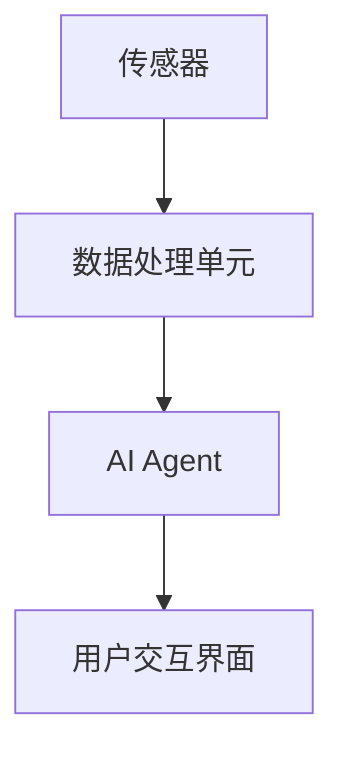

                 


# 智能运动服：AI Agent的实时生理指标监测

---

## 关键词：智能运动服，AI Agent，生理指标监测，实时数据处理，传感器技术，运动健康管理

---

## 摘要

本文深入探讨了智能运动服在实时生理指标监测中的应用，结合AI Agent技术，详细分析了其技术原理、系统架构和实际应用场景。文章从背景介绍、核心概念、算法原理、系统设计到项目实战，全面解析了智能运动服如何通过先进的传感器技术和AI算法实现对人体生理指标的实时监测与健康分析。通过本文，读者可以全面理解智能运动服的技术优势及其在运动健康管理中的重要价值。

---

## 第一部分: 智能运动服的背景与核心概念

### 第1章: 智能运动服的背景介绍

#### 1.1 问题背景

随着运动健康的关注度不断提升，人们对运动过程中的生理指标监测提出了更高的要求。传统的生理指标监测设备（如心率带、体温计等）存在以下问题：

1. **佩戴不便**：传统设备通常需要额外佩戴，增加了运动时的负担。
2. **数据滞后**：部分设备无法实现实时监测，数据采集存在延迟。
3. **功能单一**：传统设备仅能监测单一指标，无法提供全面的健康分析。

#### 1.2 问题解决

智能运动服通过将传感器技术与AI Agent相结合，解决了传统设备的痛点。它能够实时监测多项生理指标（如心率、体温、运动轨迹等），并将数据通过AI算法进行分析，为用户提供个性化的运动健康建议。

#### 1.3 核心概念与组成

智能运动服的核心组成包括：

- **传感器网络**：用于采集生理指标数据（如心率、体温、运动轨迹）。
- **AI Agent**：负责实时数据处理、健康分析和决策支持。
- **用户交互界面**：提供数据可视化和健康建议的展示。

---

### 第2章: 核心概念与联系

#### 2.1 AI Agent与实时监测的原理

AI Agent在智能运动服中的作用是实时处理和分析生理数据。其工作流程如下：

1. **数据采集**：传感器采集生理指标数据。
2. **数据传输**：通过无线通信技术（如蓝牙、Wi-Fi）将数据传输到AI Agent。
3. **数据处理**：AI Agent利用算法对数据进行分析，识别异常情况并提供健康建议。

#### 2.2 核心概念对比表

| 概念       | 描述                                                                 |
|------------|-------------------------------------------------------------------|
| AI Agent   | 一种能够自主决策和执行任务的智能体，用于实时处理和分析数据。|
| 传感器     | 用于采集生理指标数据的装置，如心率传感器、温度传感器等。       |
| 数据处理  | 对采集到的生理数据进行清洗、转换和分析的过程。                 |

#### 2.3 实体关系图

```mermaid
er
actor 用户
actor 运动数据
actor 健康建议
entity 智能运动服
entity 传感器
entity AI Agent
}
```

---

## 第二部分: 算法原理

### 第3章: 数据采集与特征提取

#### 3.1 数据采集

智能运动服中的传感器负责采集以下数据：

- **心率**：通过光电传感器测量心率变化。
- **体温**：通过温度传感器测量体表温度。
- **运动轨迹**：通过加速度传感器测量运动轨迹。

#### 3.2 特征提取

数据采集后，需要进行特征提取。例如，心率信号可以通过傅里叶变换提取频域特征。

$$ X(f) = \sum_{n=-\infty}^{\infty} x[n] e^{-j2\pi f n} $$

其中，$X(f)$ 是频域信号，$x[n]$ 是时域信号。

---

### 第4章: 模式识别与健康分析

#### 4.1 模式识别

AI Agent利用机器学习算法对生理数据进行模式识别，例如：

- **分类任务**：判断运动强度（低、中、高）。
- **回归任务**：预测心率变化趋势。

#### 4.2 健康分析

AI Agent根据分析结果提供健康建议，例如：

- 运动强度过高时，建议降低运动量。
- 心率异常时，提醒用户休息。

---

## 第三部分: 系统分析与架构设计

### 第5章: 系统架构设计

#### 5.1 系统架构图



#### 5.2 系统功能设计

- **数据采集**：传感器采集生理数据。
- **数据处理**：数据处理单元清洗和转换数据。
- **健康分析**：AI Agent分析数据并生成健康建议。
- **用户交互**：用户通过界面查看数据和建议。

---

## 第四部分: 项目实战

### 第6章: 环境安装与代码实现

#### 6.1 环境安装

需要安装以下工具：

- **Python**：用于数据分析和算法实现。
- **TensorFlow**：用于机器学习模型训练。
- **Bluetooth library**：用于传感器数据传输。

#### 6.2 核心代码实现

以下是AI Agent的核心代码示例：

```python
import numpy as np
from tensorflow import keras

# 数据预处理
def preprocess(data):
    # 数据标准化
    data_normalized = (data - np.mean(data)) / np.std(data)
    return data_normalized

# AI模型训练
def train_model(X_train, y_train):
    model = keras.Sequential([
        keras.layers.Dense(64, activation='relu'),
        keras.layers.Dense(1)
    ])
    model.compile(optimizer='adam', loss='mse')
    model.fit(X_train, y_train, epochs=100, batch_size=32)
    return model

# 模型预测
def predict_health(model, data):
    normalized_data = preprocess(data)
    prediction = model.predict(normalized_data)
    return prediction
```

---

### 第7章: 实际案例分析

#### 7.1 案例分析

假设一位运动员在跑步过程中，心率异常升高。AI Agent会通过传感器数据识别异常，并建议降低运动强度。

#### 7.2 代码应用解读

通过代码实现AI Agent对心率数据的分析和预测，展示模型如何实时处理数据并提供健康建议。

---

## 第五部分: 最佳实践与总结

### 第8章: 最佳实践

#### 8.1 小结

智能运动服通过AI Agent和传感器技术，实现了生理指标的实时监测和健康分析，为运动健康管理提供了有力支持。

#### 8.2 注意事项

- 传感器的精度和稳定性直接影响监测结果。
- 数据隐私保护至关重要，需确保数据传输的安全性。

#### 8.3 拓展阅读

- 推荐阅读《人工智能在医疗健康中的应用》和《运动生理学》。

---

## 作者：AI天才研究院 & 禅与计算机程序设计艺术

---

通过以上内容，我们可以看到智能运动服在实时生理指标监测中的巨大潜力。结合AI Agent技术，智能运动服不仅能够实时监测生理数据，还能为用户提供个性化的健康建议，真正实现了运动健康管理的智能化和便捷化。

