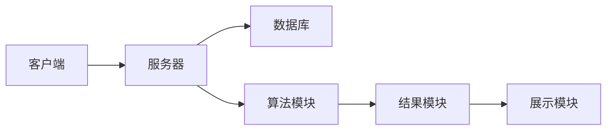

                 


# 智能退休收入规划助手

> 关键词：智能退休规划、人工智能、财务数据分析、机器学习、风险管理

> 摘要：智能退休收入规划助手利用人工智能和大数据技术，帮助用户制定个性化的退休收入计划，优化资产配置，降低风险，实现财务自由。本文详细探讨了智能退休规划的核心概念、算法原理、系统架构，并通过实际案例展示了如何利用这些技术手段实现高效的退休规划。

---

# 目录大纲

## 第一章：智能退休收入规划助手的背景与意义

### 1.1 退休收入规划的重要性
- 1.1.1 退休规划的基本概念
- 1.1.2 退休收入规划的必要性
- 1.1.3 智能技术在退休规划中的作用

### 1.2 当前退休规划面临的挑战
- 1.2.1 传统退休规划的局限性
- 1.2.2 经济环境变化对退休规划的影响
- 1.2.3 技术如何解决这些问题

### 1.3 智能退休收入规划助手的优势
- 1.3.1 提高规划效率
- 1.3.2 个性化定制方案
- 1.3.3 实时数据更新与调整

### 1.4 本章小结

---

## 第二章：智能退休收入规划的核心概念与联系

### 2.1 数据采集与分析
- 2.1.1 用户数据的收集
- 2.1.2 数据分析方法
- 2.1.3 数据可视化

### 2.2 AI算法与预测模型
- 2.2.1 机器学习算法
- 2.2.2 时间序列分析
- 2.2.3 风险评估模型

### 2.3 结果展示与优化
- 2.3.1 多维度结果展示
- 2.3.2 方案优化策略
- 2.3.3 用户反馈机制

### 2.4 核心概念对比表
- 2.4.1 数据类型对比
- 2.4.2 算法性能对比
- 2.4.3 用户体验对比

### 2.5 ER实体关系图


### 2.6 本章小结

---

## 第三章：智能退休收入规划的算法原理

### 3.1 基于机器学习的退休规划算法
- 3.1.1 算法选择与优化
  - 3.1.1.1 线性回归模型
  - 3.1.1.2 支持向量机
  - 3.1.1.3 随机森林

- 3.1.2 算法实现步骤
  - 3.1.2.1 数据预处理
  - 3.1.2.2 模型训练
  - 3.1.2.3 模型评估

### 3.2 算法流程图


### 3.3 算法实现代码示例
```python
import pandas as pd
from sklearn.model import LinearRegression

# 数据预处理
data = pd.read_csv('retirement_data.csv')
data_cleaned = data.dropna()

# 特征选择
features = ['age', 'income', 'expenses']
target = 'savings'

# 模型训练
model = LinearRegression()
model.fit(data_cleaned[features], data_cleaned[target])

# 模型评估
print(model.score(data_cleaned[features], data_cleaned[target]))
```

### 3.4 数学模型与公式
- 线性回归模型：
  $$ y = \beta_0 + \beta_1x_1 + \beta_2x_2 + \ldots + \beta_nx_n $$
- 风险评估模型：
  $$ R = \sqrt{\sum_{i=1}^{n} (y_i - \hat{y}_i)^2} $$

### 3.5 本章小结

---

## 第四章：智能退休收入规划系统的架构设计

### 4.1 系统功能设计
- 4.1.1 用户需求分析
- 4.1.2 功能模块划分
  - 数据采集模块
  - 算法处理模块
  - 结果展示模块

### 4.2 系统架构设计


### 4.3 接口设计
- API接口定义
- 接口调用流程

### 4.4 交互流程图


### 4.5 本章小结

---

## 第五章：智能退休收入规划的项目实战

### 5.1 环境安装与配置
- 安装Python
- 安装相关库（pandas, scikit-learn）

### 5.2 核心代码实现
```python
import pandas as pd
from sklearn.model import LinearRegression

# 数据加载与预处理
data = pd.read_csv('retirement_data.csv')
data_cleaned = data.dropna()

# 特征选择与模型训练
features = ['age', 'income', 'expenses']
target = 'savings'

model = LinearRegression()
model.fit(data_cleaned[features], data_cleaned[target])

# 模型预测与评估
predictions = model.predict(data_cleaned[features])
print(model.score(data_cleaned[features], data_cleaned[target]))
```

### 5.3 实际案例分析
- 案例背景
- 数据分析
- 模型应用
- 结果解读

### 5.4 项目小结

---

## 第六章：智能退休收入规划的最佳实践与注意事项

### 6.1 最佳实践 tips
- 数据质量的重要性
- 算法选择的注意事项
- 用户反馈的利用

### 6.2 风险提示与注意事项
- 数据隐私保护
- 算法的局限性
- 系统维护与更新

### 6.3 拓展阅读
- 机器学习在金融领域的应用
- 大数据分析与退休规划

### 6.4 本章小结

---

## 作者：AI天才研究院 & 禅与计算机程序设计艺术

---

通过以上大纲，文章将系统地介绍智能退休收入规划助手的核心概念、算法原理、系统架构，并通过实际案例展示其应用与优势，帮助读者深入了解如何利用智能技术优化退休收入规划。

