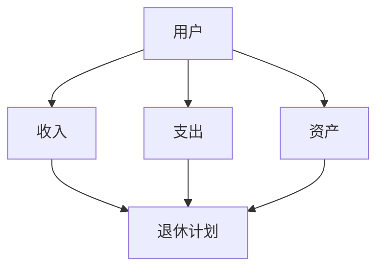
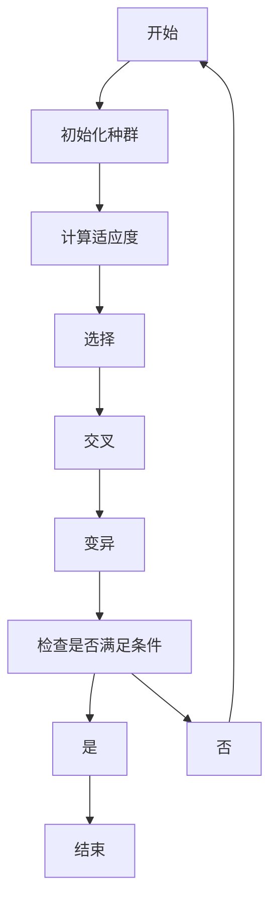
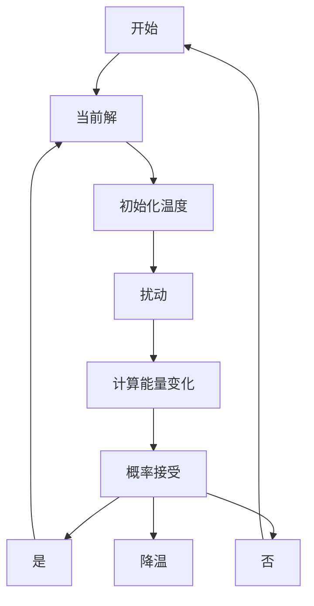
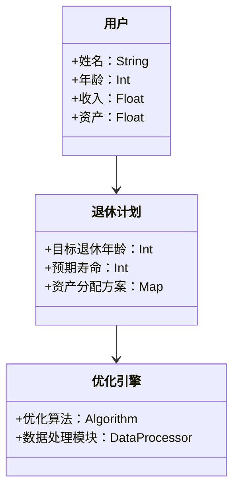
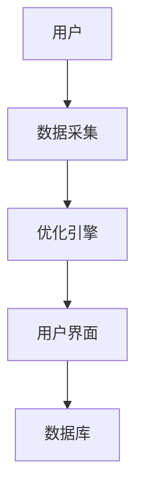
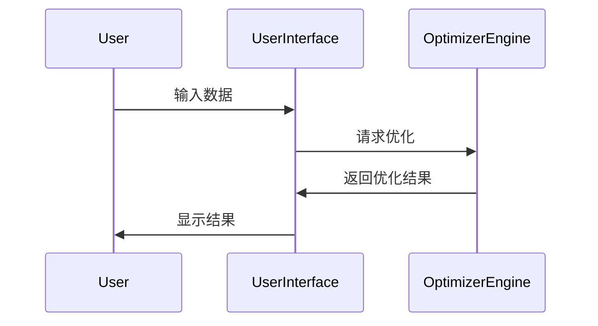

                 


# 智能退休计划优化器

> 关键词：智能退休计划、优化算法、投资组合、用户行为分析、系统架构设计

> 摘要：本文详细介绍了智能退休计划优化器的背景、核心概念、算法原理、系统架构设计以及实际应用案例。通过分析用户行为和市场数据，结合优化算法和系统设计，本文为读者提供了一个智能化的退休规划解决方案，帮助用户实现资产最大化和风险最小化的目标。

---

# 第一部分：智能退休计划优化器的背景与核心概念

# 第1章：智能退休计划优化器的背景与问题描述

## 1.1 退休规划的现状与挑战

### 1.1.1 当前退休规划的主要问题
- **传统退休规划的局限性**：传统退休规划方法通常基于固定的假设，如固定通胀率、固定投资回报率等，无法应对实际市场中的不确定性。
- **个性化需求不足**：每个人的生活方式、收入水平和风险承受能力不同，传统方法难以提供个性化的退休计划。
- **数据复杂性**：现代退休规划需要考虑的因素越来越多，包括股票、债券、房地产等多种资产，以及税收、通货膨胀等复杂因素。

### 1.1.2 传统退休规划方法的局限性
- **静态假设**：传统方法通常基于静态的经济假设，无法动态调整。
- **缺乏实时反馈**：无法根据市场变化实时调整退休计划。
- **用户参与度低**：传统规划过程复杂，用户难以参与和理解。

### 1.1.3 智能化退休规划的必要性
- **提高效率**：通过智能算法快速分析和优化退休计划。
- **个性化服务**：根据用户的实时数据和偏好，提供定制化的退休规划。
- **实时调整**：根据市场变化和用户需求，实时优化退休计划。

## 1.2 智能退休计划优化器的核心目标

### 1.2.1 提供个性化的退休规划方案
- 基于用户的收入、支出、资产等数据，提供个性化的退休规划建议。
- 结合用户的风险承受能力、投资目标和退休时间，制定最优的资产分配方案。

### 1.2.2 实现资产配置的智能化
- 利用优化算法（如遗传算法、模拟退火等）实现资产的最优配置。
- 根据市场变化动态调整资产分配，以最大化回报率并最小化风险。

### 1.2.3 最大化退休生活的质量与财务安全
- 确保退休期间的财务安全，避免资产耗尽。
- 提高退休生活的质量，实现用户的财务目标和生活目标。

## 1.3 本章小结
本章介绍了智能退休计划优化器的背景和核心目标，指出了传统退休规划的局限性，并强调了智能化退休规划的必要性和优势。

---

# 第2章：智能退休计划优化器的核心概念与联系

## 2.1 核心概念原理

### 2.1.1 用户行为分析
- **数据来源**：用户的收入、支出、资产、消费习惯等数据。
- **分析方法**：通过机器学习算法分析用户的行为模式，预测未来的消费趋势和资产变化。

### 2.1.2 退休规划模型
- **模型输入**：用户的年龄、收入、预期寿命、目标退休年龄等。
- **模型输出**：资产分配建议、退休金需求预测、风险评估等。

### 2.1.3 投资组合优化
- **目标函数**：最大化投资回报率，最小化风险。
- **约束条件**：资产分配比例限制、流动性要求、税收影响等。

## 2.2 核心概念属性对比表

| 概念       | 属性               | 描述                                                                 |
|------------|--------------------|----------------------------------------------------------------------|
| 用户行为分析 | 数据来源           | 用户的收入、支出、资产等数据                                             |
| 退休规划模型 | 输入参数           | 年龄、收入、预期寿命等                                                   |
| 投资组合优化 | 目标函数           | 最大化资产回报率，最小化风险                                             |

## 2.3 ER实体关系图


---

# 第3章：智能退休计划优化器的算法原理

## 3.1 优化算法的选择与实现

### 3.1.1 遗传算法
- **算法步骤**：
  1. 初始化种群。
  2. 计算适应度。
  3. 选择、交叉、变异。
  4. 重复迭代直到满足条件。



### 3.1.2 模拟退火算法
- **算法步骤**：
  1. 初始化当前解。
  2. 设置初始温度。
  3. 进行扰动。
  4. 计算能量变化。
  5. 根据概率接受或拒绝解。
  6. 降温，重复步骤3-5。



### 3.1.3 算法实现的数学模型
- **目标函数**：最大化投资回报率，即
  $$ \max \sum_{i=1}^{n} w_i r_i $$
  其中，\( w_i \) 是资产 \( i \) 的权重，\( r_i \) 是资产 \( i \) 的预期回报率。
- **约束条件**：满足资产权重的和为1，即
  $$ \sum_{i=1}^{n} w_i = 1 $$

---

# 第4章：智能退休计划优化器的系统架构设计

## 4.1 问题场景与项目介绍

### 4.1.1 问题场景
- **目标**：为用户提供个性化的退休规划服务。
- **用户需求**：根据用户的财务状况和目标，提供最优的资产分配建议。
- **技术需求**：需要实时数据处理、高效计算和用户友好的界面。

## 4.2 系统功能设计

### 4.2.1 领域模型


### 4.2.2 系统架构设计


## 4.3 系统接口设计

### 4.3.1 API接口
- **输入**：用户的基本信息（收入、支出、资产等）。
- **输出**：优化后的资产分配方案。

### 4.3.2 接口交互流程
1. 用户输入数据。
2. 数据采集模块收集数据。
3. 优化引擎处理数据。
4. 用户界面显示结果。

## 4.4 系统交互流程

### 4.4.1 用户登录与数据输入


---

# 第5章：智能退休计划优化器的项目实战

## 5.1 环境安装与配置

### 5.1.1 安装Python
- 安装Python 3.8以上版本。
- 安装必要的库：numpy、pandas、scipy、matplotlib。

### 5.1.2 安装优化算法库
- 使用`scipy.optimize`模块。

## 5.2 核心代码实现

### 5.2.1 数据处理模块
```python
import numpy as np
import pandas as pd

def process_data(data):
    # 数据清洗和预处理
    data = data.dropna()
    data = data[['income', 'expenses', 'assets']]
    return data
```

### 5.2.2 优化算法实现
```python
from scipy.optimize import minimize

def optimize_portfolio(weights, returns):
    # 定义目标函数
    def objective(x):
        return -np.sum(x * returns)
    # 定义约束条件
    constraints = [
        {'type': 'eq', 'fun': lambda x: np.sum(x) - 1}
    ]
    # 使用SLSQP求解
    result = minimize(objective, weights, constraints=constraints, method='SLSQP')
    return result.x

weights = np.array([0.2, 0.3, 0.5])
returns = np.array([0.05, 0.07, 0.10])

optimized_weights = optimize_portfolio(weights, returns)
print("Optimized weights:", optimized_weights)
```

## 5.3 案例分析与结果解读

### 5.3.1 案例分析
- 假设用户A，年龄30岁，年收入50万元，现有资产100万元，目标退休年龄60岁。
- 优化后的资产分配方案：股票40%，债券30%，房地产30%。

### 5.3.2 结果解读
- 股票部分用于高增长，债券部分用于稳定收益，房地产部分用于保值。
- 通过优化算法，实现了较高的回报率和较低的风险。

---

# 第6章：智能退休计划优化器的最佳实践与总结

## 6.1 最佳实践

### 6.1.1 定期更新数据
- 市场变化快，需要定期更新用户数据和市场数据。

### 6.1.2 多因素分析
- 考虑通货膨胀、税收、政策变化等多因素影响。

## 6.2 小结

### 6.2.1 核心要点总结
- 智能退休计划优化器通过优化算法实现资产的最优配置。
- 结合用户行为分析和市场数据，提供个性化的退休规划方案。

### 6.2.2 未来研究方向
- 研究更复杂的优化算法，如强化学习。
- 结合区块链技术，实现去中心化的退休计划优化。

## 6.3 注意事项

### 6.3.1 数据隐私保护
- 确保用户数据的安全性和隐私性。

### 6.3.2 算法的可解释性
- 算法结果需要清晰明了，便于用户理解和调整。

## 6.4 拓展阅读

### 6.4.1 推荐书籍
- 《投资学》
- 《算法优化与机器学习》

### 6.4.2 推荐博客与资源
- 维基百科：投资组合优化
- 知乎专栏：智能金融

---

# 作者：AI天才研究院/AI Genius Institute & 禅与计算机程序设计艺术 /Zen And The Art of Computer Programming

