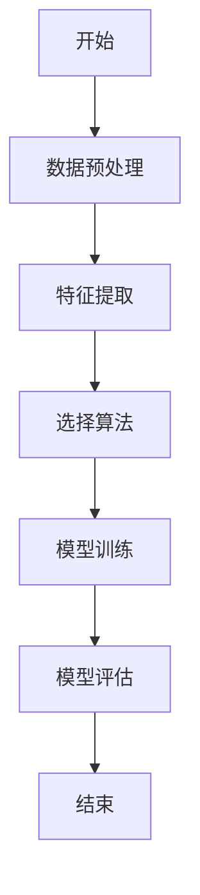
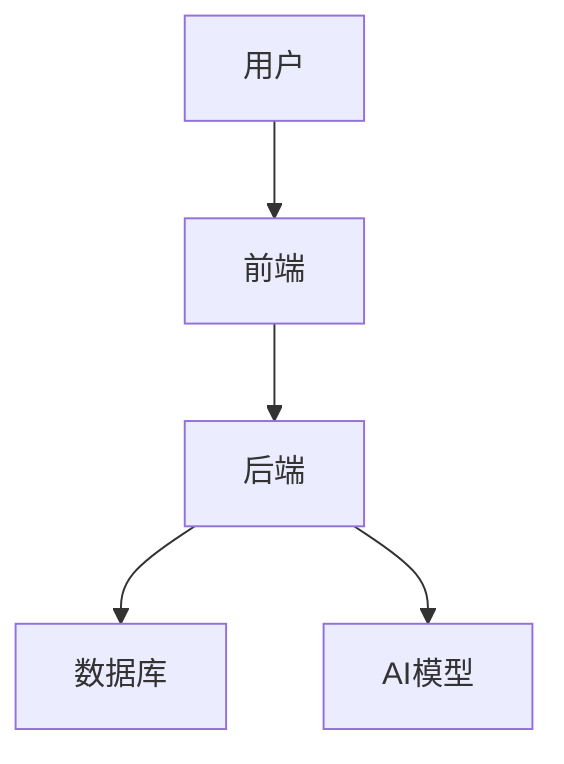

                 


# 智能银行不良资产管理优化系统

**关键词：** 智能银行，不良资产管理，优化系统，机器学习，风险管理，系统架构

**摘要：**  
本文探讨如何利用智能技术优化银行的不良资产管理流程，涵盖背景分析、核心概念、算法原理、系统架构设计和项目实战，旨在为银行提供高效的解决方案。

---

## 第1章 背景介绍

### 1.1 问题背景
#### 1.1.1 不良资产的定义与现状
- 银行不良资产的定义：逾期贷款、违约贷款等。
- 当前现状：不良资产率上升，处置效率低下。

#### 1.1.2 管理难点与挑战
- 数据分散，难以有效整合。
- 评估准确性低，风险难以控制。

#### 1.1.3 智能化管理的必要性
- 提高效率，降低成本。
- 增强决策的科学性。

### 1.2 问题描述
#### 1.2.1 识别不准确
- 传统方法依赖人工判断，存在误差。

#### 1.2.2 评估复杂
- 资产价值受多种因素影响，评估困难。

#### 1.2.3 处置效率低
- 手续繁琐，时间长，影响资金周转。

### 1.3 问题解决
#### 1.3.1 应用智能化技术
- 利用机器学习进行风险评估。

#### 1.3.2 数据驱动决策
- 通过数据分析优化管理策略。

#### 1.3.3 优化管理流程
- 设计系统化流程提高效率。

### 1.4 系统边界与外延
#### 1.4.1 系统功能边界
- 系统仅处理不良资产，不涉及其他业务。

#### 1.4.2 应用范围
- 针对个人和企业客户的不良贷款。

#### 1.4.3 系统与外部环境交互
- 与银行内部系统（如CRM）集成。

### 1.5 核心概念与组成
#### 1.5.1 智能算法
- 用于风险预测和资产评估。

#### 1.5.2 数据处理
- 整理和分析不良资产数据。

#### 1.5.3 风险评估
- 使用模型预测违约概率。

#### 1.5.4 资产处置
- 优化处置流程，提高效率。

---

## 第2章 核心概念与联系

### 2.1 核心概念原理
#### 2.1.1 智能算法的核心原理
- 使用机器学习模型进行预测和分类。

#### 2.1.2 数据处理的关键步骤
- 数据清洗、特征提取、数据建模。

#### 2.1.3 风险评估的数学模型
- 逻辑回归、支持向量机等模型。

### 2.2 概念属性特征对比
| 概念         | 特征1：准确性 | 特征2：实时性 | 特征3：可解释性 |
|--------------|---------------|---------------|----------------|
| 智能算法     | 高             | 高             | 中               |
| 传统算法     | 中             | 低             | 高               |

### 2.3 ER实体关系图
```mermaid
erd
    图表：不良资产管理系统的ER图
    class 系统用户 {
        用户ID
        用户名
        权限
    }
    class 不良资产 {
        资产ID
        账户ID
        资产状态
        资产价值
    }
    class 风险评估 {
        评估ID
        资产ID
        评估结果
        评估时间
    }
    系统用户 --> 不良资产：拥有
    不良资产 --> 风险评估：被评估
```

---

## 第3章 算法原理讲解

### 3.1 算法原理


### 3.2 Python源代码实现
```python
# 示例：使用逻辑回归模型进行风险评估
from sklearn.linear_model import LogisticRegression
from sklearn.model_selection import train_test_split
import pandas as pd

# 加载数据
data = pd.read_csv('bad_loans.csv')
X = data[['income', 'debt', 'history']]
y = data['default']

# 分割数据
X_train, X_test, y_train, y_test = train_test_split(X, y, test_size=0.2)

# 训练模型
model = LogisticRegression()
model.fit(X_train, y_train)

# 预测
predictions = model.predict(X_test)
print("预测结果：", predictions)
```

### 3.3 数学模型与公式
- 模型公式：$$ P(y=1|x) = \frac{1}{1 + e^{-(\beta_0 + \beta_1 x_1 + \cdots + \beta_n x_n)}} $$
- 示例：$ P(y=1|x) = \frac{1}{1 + e^{-(0.5x + 0.2)}} $

---

## 第4章 系统分析与架构设计

### 4.1 问题场景介绍
- 不良资产识别场景：系统实时分析客户数据，识别潜在风险。

### 4.2 系统功能设计
```mermaid
classDiagram
    class 系统用户 {
        用户ID
        用户名
        权限
    }
    class 不良资产 {
        资产ID
        账户ID
        资产状态
        资产价值
    }
    class 风险评估 {
        评估ID
        资产ID
        评估结果
        评估时间
    }
    class 系统 {
        用户管理
        资产管理
        评估管理
    }
    系统用户 --> 系统：登录
    系统 --> 不良资产：查询
    系统 --> 风险评估：评估
```

### 4.3 系统架构设计


### 4.4 系统接口设计
- 接口：/api/bad_asset/assess
  - 请求：POST，包含资产ID和账户信息。
  - 响应：评估结果。

### 4.5 系统交互流程
```mermaid
sequenceDiagram
    participant 用户
    participant 系统
    用户 -> 系统：提交资产信息
    系统 -> 系统：调用AI模型进行评估
    系统 -> 用户：返回评估结果
```

---

## 第5章 项目实战

### 5.1 环境安装
- 安装Python、Jupyter、scikit-learn、Pandas、Mermaid工具。

### 5.2 核心实现源代码
```python
# 示例代码：AI模型的实现
import numpy as np
from sklearn.svm import SVC

# 数据加载
data = np.array([[1, 0.5], [2, 1.2], [3, 1.8], [4, 2.5]])
labels = np.array([0, 1, 1, 0])

# 训练模型
model = SVC()
model.fit(data, labels)

# 预测
print(model.predict([[2.5, 1.6]]))
```

### 5.3 案例分析
- 案例：某银行处理不良贷款，系统预测违约概率，优化处置流程。

---

## 第6章 最佳实践与总结

### 6.1 最佳实践 tips
- 数据清洗是关键，确保数据质量。
- 定期更新模型，适应市场变化。

### 6.2 小结
- 系统实现智能化管理，提高效率和准确性。

### 6.3 注意事项
- 数据隐私保护，遵守相关法规。
- 系统稳定性和安全性需加强。

### 6.4 拓展阅读
- 《机器学习实战》
- 《系统架构设计》

---

## 作者

作者：AI天才研究院 & 禅与计算机程序设计艺术

---

**结束**

