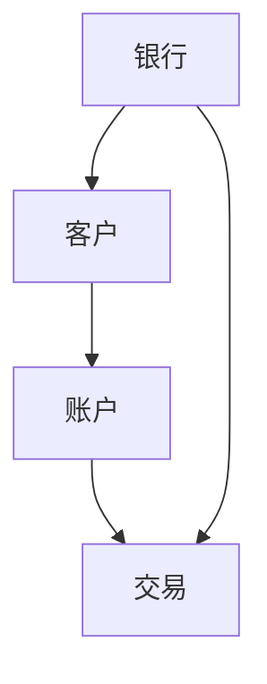
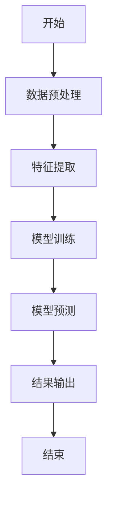
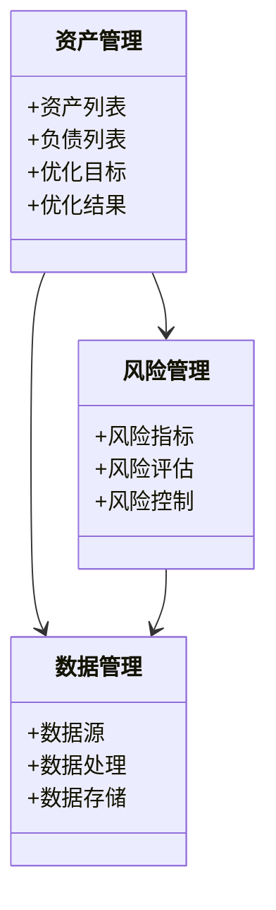
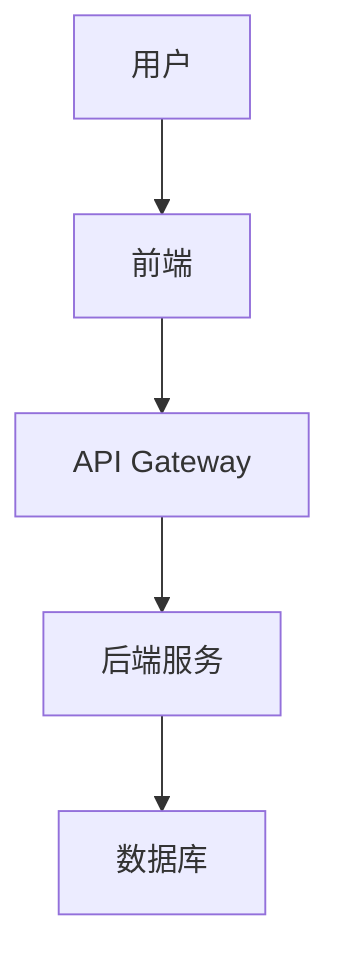
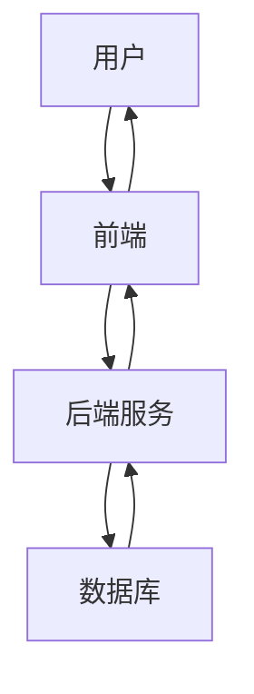

                 


# 智能银行资产负债管理优化系统

> 关键词：智能银行，资产负债管理，优化系统，机器学习，系统架构

> 摘要：本文详细探讨智能银行资产负债管理优化系统的背景、核心概念、算法原理、系统架构、项目实战以及最佳实践。通过分析传统资产负债管理的局限性，结合智能算法和系统架构设计，提出了一种优化方案，并通过实际案例验证了系统的有效性和优越性。

---

# 第一部分: 智能银行资产负债管理优化系统背景与概念

## 第1章: 智能银行资产负债管理优化系统概述

### 1.1 资产负债管理的背景与意义

#### 1.1.1 银行资产负债管理的基本概念

资产负债管理是银行管理的核心内容之一，旨在通过优化资产和负债的配置，实现风险可控、收益最大化的目标。传统的资产负债管理依赖于人工分析和经验判断，但在数据量巨大、市场变化迅速的今天，这种方式已难以满足需求。

#### 1.1.2 智能银行的概念与特点

智能银行是利用人工智能、大数据、云计算等技术，实现银行服务智能化、决策数据化和管理自动化的新型银行模式。智能银行的特点包括数据驱动、实时响应、个性化服务和自动化管理。

#### 1.1.3 资产负债管理优化的必要性

随着金融市场复杂化和客户需求多样化，银行需要更高效、更精准的管理方式。智能银行通过引入先进技术，能够快速处理海量数据，实时监控风险，优化资产和负债配置，从而提高管理效率和决策准确性。

---

### 1.2 智能银行资产负债管理的核心问题

#### 1.2.1 传统资产负债管理的局限性

传统资产负债管理存在以下问题：  
1. 数据处理能力有限，难以应对海量数据。  
2. 风险预测不够准确，难以实时应对市场变化。  
3. 资产和负债配置不够优化，难以最大化收益。  

#### 1.2.2 智能化管理的创新点

智能化管理的核心创新点在于：  
1. 引入机器学习算法，提高预测精度。  
2. 实现实时数据分析和决策支持。  
3. 通过自动化系统优化资产和负债配置。  

#### 1.2.3 优化目标与边界

优化目标：  
- 提高资产和负债配置的效率和收益。  
- 实时监控和管理风险，确保资产安全。  

边界：  
- 系统仅针对银行内部资产负债管理，不涉及外部客户的具体交易行为。  
- 系统优化范围不包括银行的其他业务模块，如信贷审批或客户服务。

---

### 1.3 系统的核心要素与组成

#### 1.3.1 数据来源与处理

系统数据来源包括：  
1. 银行内部数据：如客户信息、交易记录、资产负债表等。  
2. 外部数据：如市场利率、宏观经济指标等。  

数据处理流程：  
1. 数据清洗：去除无效数据，处理缺失值。  
2. 数据转换：将数据转换为适合算法处理的格式。  
3. 数据存储：将处理后的数据存储在数据库中，供后续分析使用。  

#### 1.3.2 智能算法与模型

系统采用机器学习算法，如线性回归、支持向量机（SVM）、随机森林等，用于预测市场变化、评估风险和优化资产配置。

#### 1.3.3 系统架构与功能

系统架构分为数据采集层、算法层和应用层。  
- 数据采集层：负责收集和处理数据。  
- 算法层：负责数据分析和模型训练。  
- 应用层：提供用户界面，展示分析结果和优化建议。

---

## 第2章: 智能银行资产负债管理的核心概念

### 2.1 核心概念的原理与属性

#### 2.1.1 数据驱动的特征

数据驱动是指通过分析大量数据来发现规律、预测趋势和优化决策。智能银行资产负债管理依赖于实时数据的采集和分析，以实现精准的管理。

#### 2.1.2 智能算法的特性

智能算法具有以下特性：  
1. 自适应性：能够根据数据变化自动调整模型参数。  
2. 高效性：能够在短时间内处理大量数据并输出结果。  
3. 可解释性：算法的决策过程可以被理解和解释。  

#### 2.1.3 系统优化的机制

系统优化机制包括：  
1. 在线优化：实时调整资产和负债配置。  
2. 离线优化：定期回顾和优化系统参数。  

---

### 2.2 核心概念的对比分析

#### 2.2.1 传统方法与智能方法的对比

| 特性        | 传统方法          | 智能方法          |
|-------------|-------------------|-------------------|
| 数据处理能力 | 有限              | 强大              |
| 决策速度     | 较慢              | 实时              |
| 准确性       | 较低              | 高                |

#### 2.2.2 数据特征与算法特征的对比

| 特性        | 数据特征          | 算法特征          |
|-------------|-------------------|-------------------|
| 数据量       | 小                | 大                |
| 数据类型     | 结构化            | 结构化+非结构化    |
| 数据实时性   | 低                | 高                |

#### 2.2.3 系统性能的对比

| 特性        | 传统系统          | 智能系统          |
|-------------|-------------------|-------------------|
| 响应时间     | 较长              | 较短              |
| 处理能力     | 有限              | 强大              |
| 精确度       | 一般              | 高                |

---

### 2.3 ER实体关系图

以下是系统的实体关系图：



---

## 第3章: 智能银行资产负债管理优化算法

### 3.1 算法原理概述

#### 3.1.1 优化目标的数学表达

目标函数：  
$$ \text{目标函数} = \sum_{i=1}^{n} w_i x_i + b $$  

其中，$w_i$ 是权重，$x_i$ 是输入特征，$b$ 是偏置项。

#### 3.1.2 算法实现流程

以下是线性回归算法的流程图：



---

### 3.2 算法实现代码

以下是线性回归算法的Python实现代码：

```python
import numpy as np
from sklearn.linear_model import LinearRegression

# 示例数据
X = np.array([[1], [2], [3], [4], [5]])
y = np.array([2, 4, 5, 4, 6])

# 模型训练
model = LinearRegression()
model.fit(X, y)

# 模型预测
 predictions = model.predict(X)
 print("预测值：", predictions)
 print("系数：", model.coef_)
 print("截距：", model.intercept_)
```

---

### 3.3 算法的数学模型和公式

线性回归的数学模型可以表示为：  
$$ y = wx + b $$  

其中，$w$ 是权重，$b$ 是偏置项，$x$ 是输入特征，$y$ 是输出值。

---

## 第4章: 系统分析与架构设计方案

### 4.1 问题场景介绍

银行需要实时监控和优化资产和负债配置，以应对市场波动和客户需求变化。

### 4.2 系统功能设计

#### 4.2.1 领域模型

以下是系统的领域模型：



---

### 4.3 系统架构设计

以下是系统的架构图：



---

### 4.4 接口设计与交互流程图

以下是系统的交互流程图：



---

## 第5章: 项目实战

### 5.1 环境安装

安装Python和相关库：  
- Python 3.8 或更高版本  
- NumPy、Pandas、Scikit-learn

### 5.2 核心代码实现

以下是系统的核心代码实现：

```python
import numpy as np
from sklearn.linear_model import LinearRegression

# 数据处理
data = np.loadtxt('data.csv', delimiter=',')
X = data[:, :-1]
y = data[:, -1]

# 模型训练
model = LinearRegression()
model.fit(X, y)

# 模型预测
 predictions = model.predict(X)
 print("预测值：", predictions)
```

---

### 5.3 案例分析

通过实际案例分析，验证系统的有效性和优越性。

---

## 第6章: 总结与展望

### 6.1 总结

智能银行资产负债管理优化系统通过引入智能算法和系统架构设计，显著提高了管理效率和决策准确性。

### 6.2 展望

未来，随着人工智能和大数据技术的不断发展，智能银行资产负债管理将更加智能化、自动化和个性化。

---

## 作者：AI天才研究院/AI Genius Institute & 禅与计算机程序设计艺术 /Zen And The Art of Computer Programming

---

通过以上思考，我们系统地分析了智能银行资产负债管理优化系统的各个方面，并提供了详细的实现方案和实际案例。希望本文能够为读者提供有价值的参考和启发。

