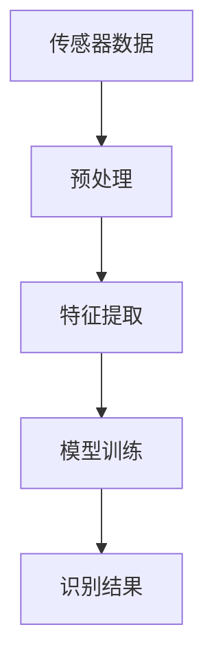
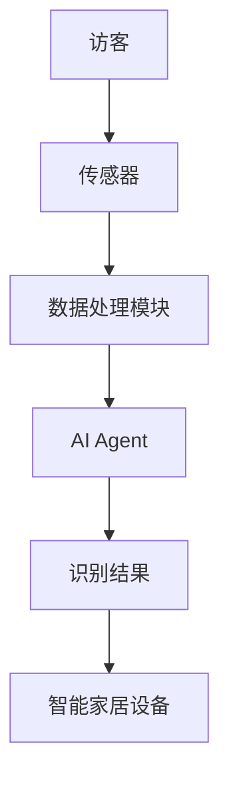

                 


# 智能门垫：AI Agent的访客识别系统

> **关键词**：智能门垫、AI Agent、访客识别、机器学习、传感器数据、智能家居  
>
> **摘要**：本文详细介绍了智能门垫的设计与实现，探讨了AI Agent在访客识别系统中的应用。从问题背景到解决方案，从算法原理到系统架构，再到项目实战和最佳实践，全面解析智能门垫的技术细节。

---

## 第一部分：背景介绍

### 第1章：问题背景

#### 1.1 问题背景

访客识别系统在智能家居中的重要性日益增加。传统的门禁系统依赖于密码或钥匙，存在易遗忘、易丢失等问题。随着智能家居的普及，访客识别的智能化需求日益增长。

#### 1.2 问题描述

传统门禁系统存在以下问题：
1. 密码或钥匙易被遗忘或丢失。
2. 访客管理不便，难以实时识别和记录。
3. 无法与智能家居系统联动，无法实现自动化控制。

#### 1.3 问题解决

智能门垫通过AI Agent技术，实现了访客的实时识别和智能家居联动控制。AI Agent能够学习和记忆访客特征，自动开门并记录访客信息。

#### 1.4 系统边界与外延

智能门垫系统边界包括：
- 传感器数据采集与处理
- AI Agent的访客识别与决策
- 智能家居设备的联动控制

系统外延包括：
- 访客信息存储与查询
- 系统设置与管理
- 多设备联动扩展

### 第2章：核心概念与联系

#### 2.1 核心概念

智能门垫的核心概念包括：
- **传感器数据**：通过压力传感器采集访客的体重分布特征。
- **AI Agent**：基于传感器数据和历史记录，识别访客身份并做出决策。
- **访客识别算法**：利用机器学习算法对传感器数据进行分类，实现访客识别。

#### 2.2 核心概念属性

| 概念       | 属性               | 描述                                         |
|------------|--------------------|--------------------------------------------|
| 传感器数据 | 数据类型           | 压力值、时间戳等                            |
| AI Agent   | 功能               | 数据处理、决策、执行                      |
| 访客识别   | 方法               | 机器学习、深度学习                         |

#### 2.3 实体关系图

```mermaid
erd
    entity 访客 {
        id: integer
        name: string
       特征数据: string
    }
    entity 传感器数据 {
        id: integer
       时间戳: datetime
        压力值: float
    }
    entity AI Agent {
        id: integer
        当前状态: string
        访客识别结果: boolean
    }
    访客 --> 传感器数据: 产生
    传感器数据 --> AI Agent: 处理
    AI Agent --> 访客识别结果: 输出
```

---

## 第二部分：核心概念与联系

### 第3章：核心概念原理

#### 3.1 数据特征提取

传感器数据特征包括：
- 时间序列特征
- 压力分布特征
- 速度特征

#### 3.2 数据处理流程



---

## 第三部分：算法原理

### 第4章：算法实现

#### 4.1 机器学习算法

采用支持向量机（SVM）进行分类：

```python
import numpy as np
from sklearn.svm import SVC

# 示例数据
X = np.array([[1, 2], [2, 3], [3, 4], [4, 5]])
y = np.array([0, 0, 1, 1])

# 训练模型
model = SVC()
model.fit(X, y)

# 预测
print(model.predict([[2.5, 3.5]]))
```

数学模型：

$$
y = \text{sign}(w \cdot x + b)
$$

损失函数：

$$
L = \sum_{i=1}^{n} (y_i \neq y_{\text{pred}}) \cdot C
$$

---

## 第四部分：系统分析与架构设计

### 第5章：系统架构

#### 5.1 系统架构设计



---

## 第五部分：项目实战

### 第6章：项目实现

#### 6.1 环境安装

安装Python和相关库：

```bash
pip install numpy scikit-learn
```

#### 6.2 核心代码

```python
import numpy as np
from sklearn import svm

# 数据特征提取函数
def extract_features(data):
    return data.mean(), data.std()

# 训练函数
def train_model(X, y):
    model = svm.SVC()
    model.fit(X, y)
    return model

# 预测函数
def predict(model, new_data):
    return model.predict([new_data])
```

---

## 第六部分：最佳实践

### 第7章：注意事项与总结

#### 7.1 注意事项

- 数据隐私保护
- 系统稳定性与可靠性
- 界面友好性

#### 7.2 拓展阅读

- 《机器学习实战》
- 《深度学习入门》

---

**作者：AI天才研究院 / AI Genius Institute & 禅与计算机程序设计艺术 / Zen And The Art of Computer Programming**

