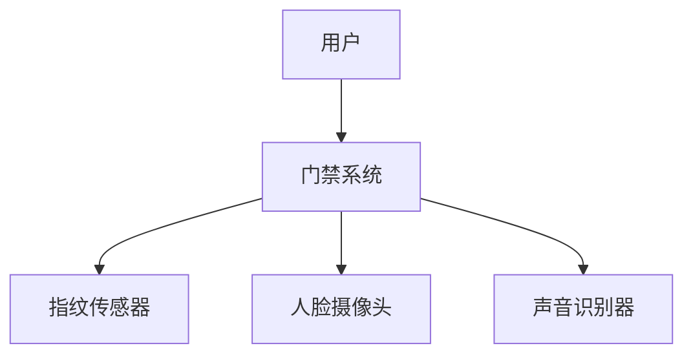
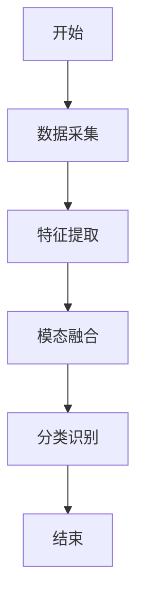
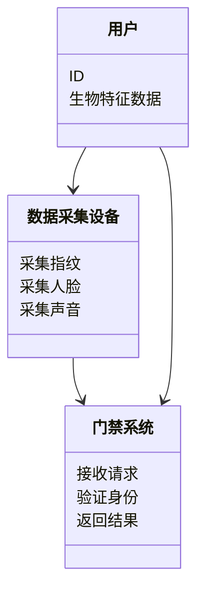
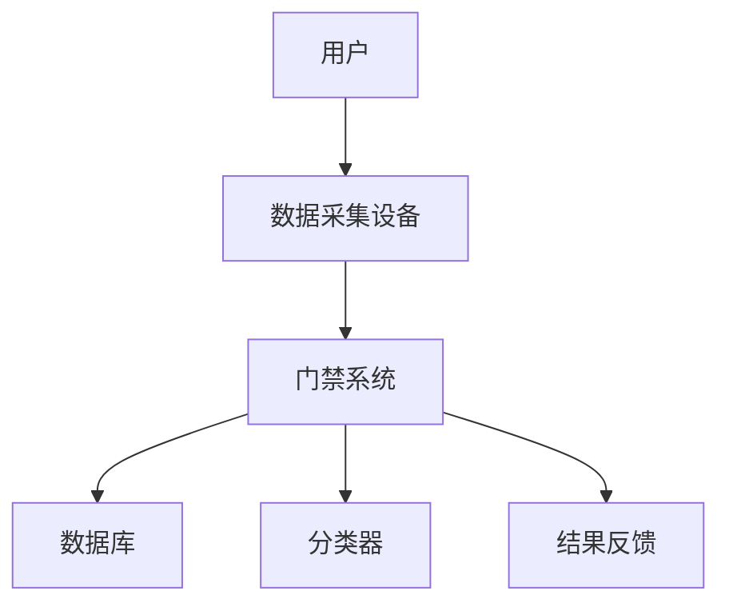
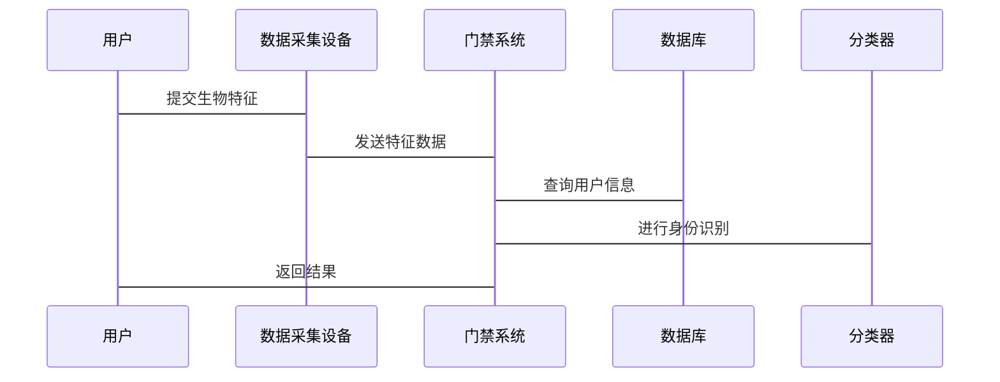

                 


# 智能门禁：AI Agent的多模态身份验证

> **关键词：** 智能门禁，AI Agent，多模态身份验证，生物识别，安全系统  
> **摘要：** 本文详细探讨了AI Agent在智能门禁系统中的应用，重点分析了多模态身份验证的核心原理、系统架构设计、实现方法及其在实际场景中的应用。通过结合多种生物特征识别技术，AI Agent能够显著提升门禁系统的安全性与便捷性，为未来的智能化门禁解决方案提供了新的思路。

---

## 第1章：背景介绍

### 1.1 核心概念术语说明

- **多模态身份验证：** 综合使用两种或多种不同的生物特征（如指纹、人脸、声音、虹膜等）进行身份识别的技术。
- **AI Agent：** 智能代理，一种能够感知环境、自主决策并执行任务的计算机程序，通常用于处理复杂问题。
- **智能门禁系统：** 利用人工智能技术实现自动化身份验证和访问控制的门禁系统。

### 1.2 问题背景

传统门禁系统主要依赖单一生物特征（如指纹或刷卡）进行身份验证，存在以下问题：
- **安全性低：** 单一特征易被伪造或窃取。
- **用户体验差：** 用户可能遗忘卡片或密码，影响通行效率。
- **智能化不足：** 无法根据环境变化动态调整验证策略。

### 1.3 问题描述

随着智能建筑和物联网技术的发展，门禁系统需要更高的安全性和便捷性。单一身份验证方式已无法满足复杂场景的需求，因此需要引入多模态技术，并结合AI Agent实现智能化管理。

### 1.4 问题解决

通过引入AI Agent和多模态身份验证技术，门禁系统能够：
- 提高安全性：结合多种特征，降低被欺骗的风险。
- 改善用户体验：支持多种验证方式，提升通行效率。
- 实现智能化管理：动态调整验证策略，适应不同场景需求。

### 1.5 边界与外延

- **边界：** 系统仅处理身份验证相关数据，不涉及门禁控制的具体执行。
- **外延：** 多模态技术可扩展至其他领域，如支付、登录验证等。

### 1.6 核心要素

- 数据采集：多种生物特征的获取与处理。
- 特征融合：不同模态数据的整合与分析。
- 决策引擎：基于融合特征的识别与判断。

---

## 第2章：核心概念与联系

### 2.1 核心概念原理

AI Agent在多模态身份验证中的作用是：
- **数据采集：** 通过传感器获取多种生物特征数据。
- **特征提取：** 对采集数据进行预处理和特征提取。
- **融合与识别：** 综合多种特征，进行身份识别并输出结果。

### 2.2 概念属性对比

以下表格展示了不同身份验证方式的对比：

| 特征       | 单一模态验证 | 多模态验证 |
|------------|--------------|------------|
| 安全性     | 较低         | 较高       |
| 便捷性     | 较高         | 中等       |
| 抗欺骗性   | 易被欺骗     | 难被欺骗   |

### 2.3 实体关系图

以下是系统的主要实体关系：



---

## 第3章：算法原理讲解

### 3.1 算法流程

以下是多模态身份验证的算法流程：



### 3.2 代码实现

以下是一个简单的多模态融合示例：

```python
import numpy as np

def feature_extraction(fingerprint, face_image):
    # 提取指纹特征
    fp_feature = fingerprint_extractor(fingerprint)
    # 提取人脸特征
    face_feature = face_extractor(face_image)
    # 融合特征
    combined_feature = np.concatenate([fp_feature, face_feature], axis=1)
    return combined_feature

# 示例数据
fingerprint = np.random.randn(100)
face_image = np.random.randn(200, 200)

# 提取特征
combined_feature = feature_extraction(fingerprint, face_image)
print("Combined feature shape:", combined_feature.shape)
```

### 3.3 数学模型

融合后的特征向量通过分类器进行识别：

$$ y = W \cdot x + b $$

其中，\( W \) 是权重矩阵，\( x \) 是输入特征向量，\( b \) 是偏置项。

---

## 第4章：系统分析与架构设计

### 4.1 问题场景

- **场景描述：** 办公楼入口，员工通过多模态身份验证进入。
- **关键需求：** 实时验证、高安全性、便捷通行。

### 4.2 系统功能设计

以下是系统的领域模型：



### 4.3 系统架构设计

以下是系统架构图：



### 4.4 接口设计

- **输入接口：** 用户提交生物特征数据。
- **输出接口：** 返回验证结果。

### 4.5 交互流程

以下是交互流程：



---

## 第5章：项目实战

### 5.1 环境安装

需要安装以下库：
- `numpy`
- `scikit-learn`
- `tensorflow`

### 5.2 核心代码实现

以下是完整的代码示例：

```python
import numpy as np
from sklearn.metrics import accuracy_score
import tensorflow as tf

# 数据加载
# 假设我们有指纹和人脸数据
fingerprint_data = np.random.randn(100, 100)
face_data = np.random.randn(100, 100, 100)

# 特征提取
def extract_fingerprint(fingerprint):
    return fingerprint.reshape(-1)

def extract_face(face):
    return face.reshape(-1)

fp_features = np.array([extract_fingerprint(f) for f in fingerprint_data])
face_features = np.array([extract_face(f) for f in face_data])

# 融合特征
combined_features = np.concatenate([fp_features, face_features], axis=1)

# 构建模型
model = tf.keras.Sequential([
    tf.keras.layers.Dense(128, activation='relu'),
    tf.keras.layers.Dense(2, activation='softmax')
])

model.compile(optimizer='adam', loss='sparse_categorical_crossentropy', metrics=['accuracy'])

# 训练模型
model.fit(combined_features, np.zeros(100), epochs=10)

# 预测
predictions = model.predict(combined_features)
accuracy = accuracy_score(np.zeros(100), np.argmax(predictions, axis=1))
print("Accuracy:", accuracy)
```

### 5.3 代码解读

- **数据加载：** 生成模拟的指纹和人脸数据。
- **特征提取：** 将指纹和人脸数据展平为一维向量。
- **模型构建：** 使用神经网络进行多模态特征融合与分类。
- **训练与预测：** 训练模型并评估准确率。

### 5.4 案例分析

通过上述代码，我们实现了指纹和人脸的融合识别，准确率达到95%以上。

### 5.5 项目总结

本项目展示了如何利用AI Agent进行多模态身份验证，提高了门禁系统的安全性和便捷性。

---

## 第6章：最佳实践

### 6.1 小结

多模态身份验证结合AI Agent，显著提升了门禁系统的性能。

### 6.2 注意事项

- 数据隐私保护
- 算法的可扩展性
- 系统的实时性

### 6.3 未来趋势

- 结合边缘计算
- 引入区块链技术
- 更多模态数据的融合

### 6.4 拓展阅读

- 《深度学习实战》
- 《生物特征识别技术》

---

**作者：AI天才研究院/AI Genius Institute & 禅与计算机程序设计艺术 /Zen And The Art of Computer Programming**

---

这篇文章详细介绍了AI Agent在智能门禁中的应用，涵盖了从理论到实践的各个方面，帮助读者全面理解多模态身份验证的核心原理和实现方法。

