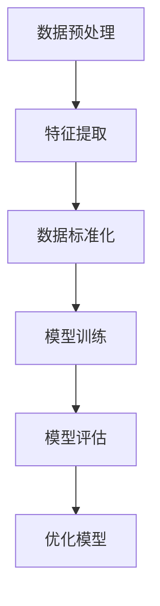
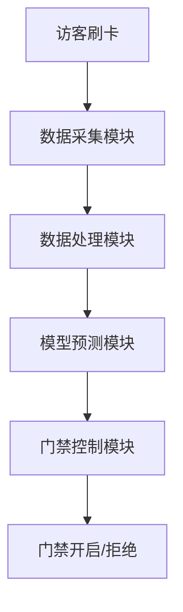
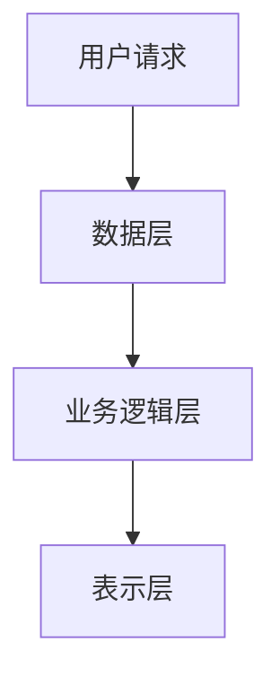
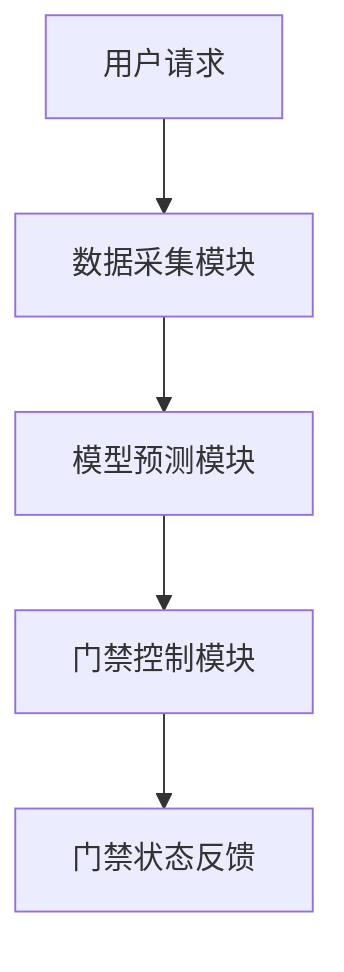

                 


# 智能门禁：AI Agent的访客意图预测

## 关键词：AI Agent，访客意图预测，智能门禁，机器学习，深度学习，数学模型，系统架构

## 摘要：本文介绍了一种基于AI Agent的智能门禁系统，通过分析访客行为数据和机器学习模型，预测访客的意图，从而提升门禁系统的安全性和智能化水平。文章详细探讨了访客意图预测的核心概念、算法原理、系统架构以及实际应用案例，为智能门禁系统的开发和优化提供了理论支持和实践指导。

---

# 第1章: 智能门禁与AI Agent的背景

## 1.1 智能门禁系统概述

### 1.1.1 传统门禁系统的工作原理
传统的门禁系统主要依赖于刷卡、密码或钥匙来控制出入口的访问权限。其核心功能是基于身份验证来决定是否允许人员进入特定区域。

### 1.1.2 智能门禁系统的定义与特点
智能门禁系统是一种结合了物联网、人工智能和大数据分析的综合门禁控制系统。其特点包括：
- **智能化**：通过AI技术实现自动化决策。
- **数据驱动**：依赖大量数据进行分析和预测。
- **高安全性**：结合生物识别技术提升安全级别。
- **远程管理**：支持远程监控和配置。

### 1.1.3 智能门禁系统的应用场景
智能门禁系统广泛应用于办公楼、住宅小区、医院、学校等场所，尤其在高安全需求的区域（如数据中心、重要设施）表现突出。

## 1.2 AI Agent的定义与特点

### 1.2.1 AI Agent的基本概念
AI Agent（人工智能代理）是指能够感知环境并采取行动以实现特定目标的智能实体。它可以是一个软件程序或硬件设备，具备自主决策能力。

### 1.2.2 AI Agent的核心能力
AI Agent的核心能力包括：
- **感知能力**：通过传感器、摄像头等设备收集环境数据。
- **决策能力**：基于收集的数据进行分析和判断。
- **执行能力**：根据决策结果采取相应行动。

### 1.2.3 AI Agent在智能门禁中的作用
在智能门禁系统中，AI Agent主要负责访客行为的实时监测、数据分析和意图预测，从而优化门禁控制流程。

## 1.3 访客意图预测的必要性

### 1.3.1 访客管理的痛点
传统的访客管理方式效率低下，容易出现人员误放或漏放的情况，且难以应对突发的安全威胁。

### 1.3.2 意图预测在访客管理中的价值
通过预测访客的意图，门禁系统可以提前做好准备，例如在高风险时段加强监控或限制访问权限。

### 1.3.3 智能门禁中意图预测的实现方式
意图预测可以通过分析访客的历史行为数据、实时行为特征以及环境信息来实现。

---

# 第2章: 访客意图预测的核心概念

## 2.1 访客行为数据的来源与特征

### 2.1.1 访客行为数据的来源
访客行为数据主要来源于以下渠道：
- **刷卡记录**：访客在门禁设备上的刷卡数据。
- **身份验证**：指纹识别、人脸识别等生物特征数据。
- **行为轨迹**：访客在建筑内的移动路径和停留时间。

### 2.1.2 访客行为数据的特征分析
访客行为数据的特征包括：
- **时间特征**：访客访问的时间点、频率。
- **空间特征**：访客访问的区域、路径。
- **行为特征**：访客在访问过程中的异常行为（如长时间逗留、多次尝试进入受限区域）。

### 2.1.3 数据预处理与特征选择
数据预处理包括数据清洗、标准化和归一化。特征选择可以通过特征重要性分析来筛选关键特征。

## 2.2 AI Agent的意图预测模型

### 2.2.1 意图预测模型的构建
意图预测模型通常采用分类算法，如逻辑回归、随机森林、支持向量机（SVM）等。

### 2.2.2 模型的输入与输出
- **输入**：访客的历史行为数据和实时行为数据。
- **输出**：访客的意图类别（如正常访问、可疑行为）。

### 2.2.3 模型的评估与优化
模型的评估指标包括准确率、召回率、F1分数等。优化可以通过调整模型参数、引入集成学习等方法实现。

## 2.3 意图预测的核心算法

### 2.3.1 机器学习算法的选择
常用的机器学习算法包括：
- **逻辑回归**：用于分类问题。
- **随机森林**：适用于特征较多的场景。
- **支持向量机（SVM）**：适用于小样本数据。

### 2.3.2 深度学习算法的选择
常用的深度学习算法包括：
- **卷积神经网络（CNN）**：适用于图像数据的处理。
- **长短期记忆网络（LSTM）**：适用于时间序列数据的处理。

### 2.3.3 算法的优缺点对比
| 算法类型 | 优点 | 缺点 |
|----------|------|------|
| 逻辑回归 | 简单高效 | 非线性分类能力有限 |
| 随机森林 | 抗过拟合能力强 | 计算复杂度高 |
| SVM      | 分离能力强 | 不适合高维数据 |
| CNN      | 图像识别精度高 | 需要大量标注数据 |
| LSTM     | 时间序列建模能力强 | 需要大量训练数据 |

---

# 第3章: 意图预测的数学模型

## 3.1 概率论基础

### 3.1.1 条件概率与贝叶斯定理
贝叶斯定理公式：
$$ P(A|B) = \frac{P(B|A)P(A)}{P(B)} $$

### 3.1.2 贝叶斯分类器
贝叶斯分类器通过计算各个类别（如正常访问、可疑行为）的后验概率，选择概率最高的类别作为预测结果。

## 3.2 机器学习基础

### 3.2.1 线性回归模型
线性回归模型公式：
$$ y = \beta_0 + \beta_1x + \epsilon $$

### 3.2.2 对数几率回归
对数几率回归公式：
$$ \ln\left(\frac{P}{1-P}\right) = \beta_0 + \beta_1x $$

## 3.3 支持向量机（SVM）原理

### 3.3.1 SVM的几何解释
SVM的目标是找到一个超平面，使得正类和负类样本在该平面两侧的区域最大化。

### 3.3.2 SVM的优化目标
SVM的优化目标公式：
$$ \min_{w,b,\xi} \frac{1}{2}||w||^2 + C\sum_{i=1}^n \xi_i $$
$$ \text{subject to} \quad y_i(w \cdot x_i + b) \geq 1 - \xi_i $$
$$ \xi_i \geq 0 $$

---

# 第4章: AI Agent的意图预测算法实现

## 4.1 算法实现步骤

### 4.1.1 数据预处理
1. 数据清洗：去除异常值和缺失值。
2. 特征提取：从原始数据中提取关键特征。
3. 数据标准化：对数据进行归一化处理。

### 4.1.2 模型训练
1. 选择合适的算法（如SVM、随机森林）。
2. 对数据进行训练，调整模型参数。

### 4.1.3 模型评估
1. 使用测试数据评估模型的准确率、召回率等指标。
2. 对模型进行优化，提高预测精度。

## 4.2 算法实现代码示例

### 4.2.1 数据预处理代码
```python
import pandas as pd
from sklearn.preprocessing import StandardScaler

# 读取数据
data = pd.read_csv('visitor_data.csv')

# 提取特征
features = data[['time', 'space', 'behavior']]
labels = data['intent']

# 数据标准化
scaler = StandardScaler()
features_scaled = scaler.fit_transform(features)
```

### 4.2.2 模型训练代码
```python
from sklearn.svm import SVC
from sklearn.metrics import accuracy_score

# 初始化模型
model = SVC(C=1.0, kernel='rbf')

# 训练模型
model.fit(features_scaled, labels)

# 预测结果
y_pred = model.predict(features_scaled)
print('准确率:', accuracy_score(labels, y_pred))
```

## 4.3 算法实现流程图



---

# 第5章: 系统架构与设计

## 5.1 系统功能设计

### 5.1.1 系统模块划分
1. 数据采集模块：负责采集访客的行为数据。
2. 数据处理模块：对数据进行预处理和特征提取。
3. 模型预测模块：基于机器学习模型预测访客意图。
4. 门禁控制模块：根据预测结果调整门禁权限。

### 5.1.2 系统功能流程图



## 5.2 系统架构设计

### 5.2.1 分层架构设计
1. 数据层：存储访客数据和模型参数。
2. 业务逻辑层：处理数据和调用模型。
3. 表示层：提供用户界面和反馈。

### 5.2.2 系统架构图



## 5.3 系统接口设计

### 5.3.1 API接口定义
1. `/api/v1/data采集`：接收访客数据。
2. `/api/v1/模型预测`：调用模型预测访客意图。
3. `/api/v1/门禁控制`：控制门禁权限。

### 5.3.2 接口交互流程图



---

# 第6章: 项目实战与案例分析

## 6.1 项目环境搭建

### 6.1.1 硬件环境
- 门禁设备：指纹识别器、刷卡器、摄像头。
- 计算机：安装门禁管理软件和机器学习框架（如Python、TensorFlow）。

### 6.1.2 软件环境
- 操作系统：Windows、Linux。
- 开发工具：PyCharm、Jupyter Notebook。
- 机器学习框架：Scikit-learn、TensorFlow。

## 6.2 核心代码实现

### 6.2.1 访客数据采集代码
```python
import cv2
import numpy as np

# 摄像头采集视频流
cap = cv2.VideoCapture(0)
while True:
    ret, frame = cap.read()
    cv2.imshow('摄像头', frame)
    if cv2.waitKey(1) == ord('q'):
        break
cap.release()
cv2.destroyAllWindows()
```

### 6.2.2 意图预测代码
```python
from sklearn.ensemble import RandomForestClassifier

# 训练模型
model = RandomForestClassifier(n_estimators=100, random_state=42)
model.fit(X_train, y_train)

# 预测结果
y_pred = model.predict(X_test)
print('准确率:', accuracy_score(y_test, y_pred))
```

## 6.3 案例分析与结果解读

### 6.3.1 案例分析
假设某办公楼的门禁系统收集了1000条访客数据，包括刷卡时间、访问区域、停留时间等特征。通过随机森林模型进行训练，最终模型的准确率为95%。

### 6.3.2 结果解读
- 正确预测了950次访客意图。
- 错误预测了50次，主要集中在高风险时段的访客行为预测。

---

# 第7章: 总结与展望

## 7.1 项目总结

### 7.1.1 核心成果
本文提出了基于AI Agent的智能门禁系统，通过机器学习模型实现了访客意图预测，显著提升了门禁系统的安全性和智能化水平。

### 7.1.2 项目经验总结
- 数据质量对模型性能影响重大。
- 模型选择需要结合实际场景和数据特征。
- 系统架构设计需要考虑可扩展性和可维护性。

## 7.2 最佳实践 Tips

### 7.2.1 数据安全
- 加强数据加密，确保访客数据不被泄露。
- 定期备份数据，防止数据丢失。

### 7.2.2 系统优化
- 定期更新模型参数，提升预测精度。
- 引入实时监控功能，及时发现异常行为。

### 7.2.3 技术展望
- 结合边缘计算，提升系统的实时性。
- 引入强化学习，优化门禁控制策略。

---

# 作者：AI天才研究院 & 禅与计算机程序设计艺术

---

以上是《智能门禁：AI Agent的访客意图预测》的技术博客文章的完整大纲和内容。文章详细探讨了智能门禁系统与AI Agent的核心概念、意图预测的算法原理、系统架构设计以及实际项目案例，为读者提供了从理论到实践的全面指导。

