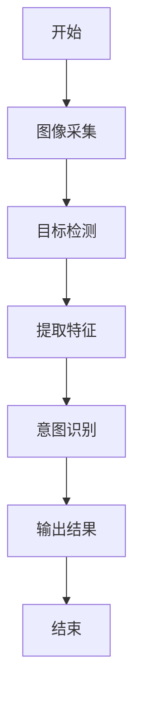
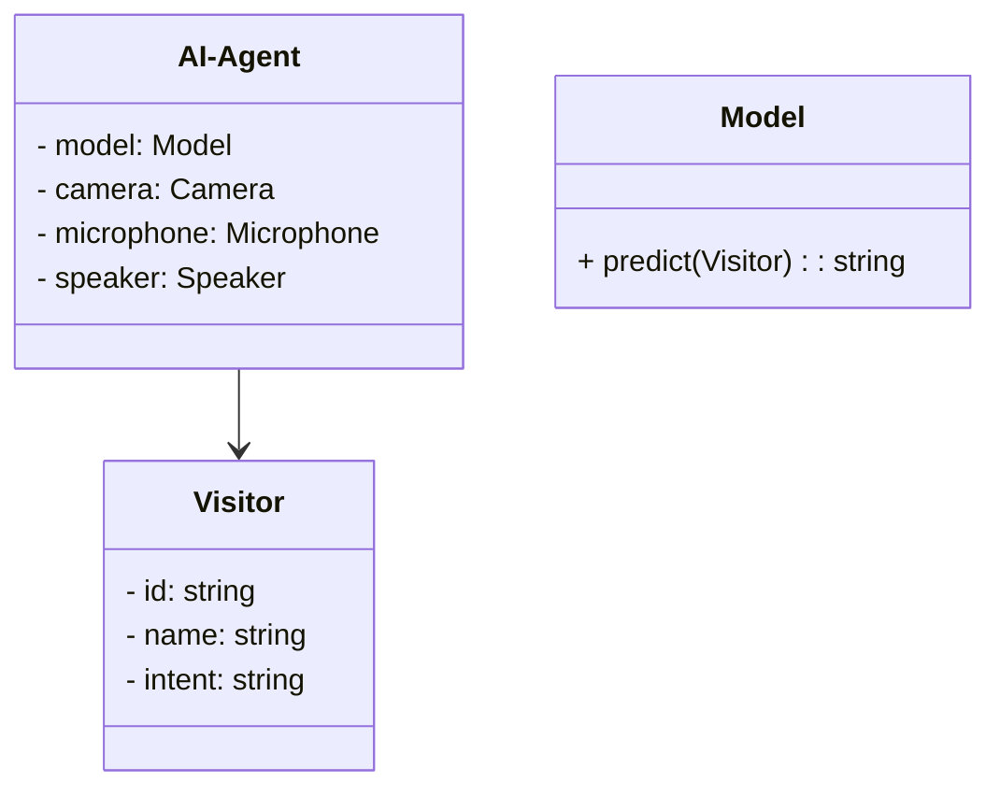
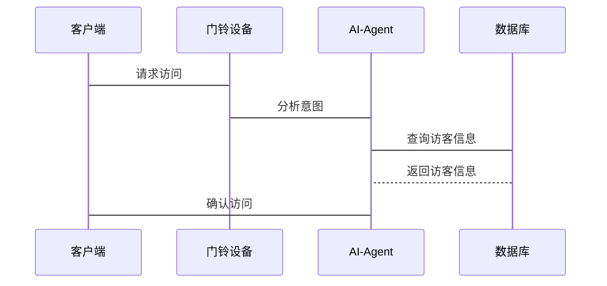

                 


---

# 智能门铃：AI Agent的访客意图识别系统

> 关键词：智能门铃，AI Agent，访客意图识别，计算机视觉，自然语言处理

> 摘要：本文深入探讨了智能门铃结合AI Agent的访客意图识别系统，从系统背景、核心概念、算法原理、系统设计到项目实战，全面分析了该系统的实现过程与技术要点。文章通过详细的算法流程、系统架构图和代码示例，详细阐述了如何利用计算机视觉和自然语言处理技术实现访客意图识别，并通过实际案例展示了系统的应用价值。

---

# 第一部分: 智能门铃与AI Agent的背景介绍

# 第1章: 智能门铃与访客意图识别的背景

## 1.1 智能门铃的发展历程

### 1.1.1 传统门铃的功能与局限性
传统的门铃系统主要依赖于机械或简单的电子装置，仅能实现声音提示的功能。这种系统功能单一，无法满足现代智能家居对智能化、个性化的需求。

### 1.1.2 智能化门铃的出现与演变
随着物联网技术的发展，智能门铃逐渐出现，开始集成摄像头、传感器等设备，能够实现视频通话、远程监控等功能。近年来，AI技术的引入使得智能门铃的功能更加智能化，能够识别访客身份、分析访客意图。

### 1.1.3 当前智能门铃的市场现状
当前市场上的智能门铃产品种类繁多，功能差异较大。高端产品已经具备人脸识别、语音交互等功能，但大多数产品在访客意图识别方面仍存在较大的改进空间。

## 1.2 AI Agent在智能门铃中的应用背景

### 1.2.1 AI Agent的基本概念与特点
AI Agent（人工智能代理）是一种能够感知环境、自主决策并执行任务的智能实体。它具备学习能力、推理能力和自适应能力，能够在复杂环境中完成多种任务。

### 1.2.2 AI Agent在智能家居中的作用
在智能家居中，AI Agent可以作为核心控制中枢，协调各种设备的工作。通过AI Agent，智能门铃能够与其他设备（如智能门锁、安防系统）联动，实现更复杂的功能。

### 1.2.3 访客意图识别的必要性与价值
访客意图识别是智能门铃的核心功能之一。通过识别访客的身份、情绪和意图，智能门铃能够提供更精准的服务，例如自动开门、语音引导、异常行为预警等。

## 1.3 本章小结
本章介绍了智能门铃的发展历程和AI Agent的基本概念，重点分析了AI Agent在智能门铃中的应用背景及其在访客意图识别中的价值。

---

# 第二部分: 智能门铃访客意图识别的核心概念与联系

# 第2章: AI Agent与访客意图识别的核心概念

## 2.1 AI Agent的核心原理

### 2.1.1 AI Agent的定义与分类
AI Agent可以分为简单反射Agent和基于模型的反射Agent。简单反射Agent基于固定的规则执行任务，而基于模型的反射Agent能够通过学习和推理优化自身行为。

### 2.1.2 AI Agent的主要功能模块
AI Agent的主要功能模块包括感知模块、推理模块、决策模块和执行模块。感知模块负责采集环境信息，推理模块负责分析信息，决策模块负责制定策略，执行模块负责执行任务。

### 2.1.3 AI Agent与智能门铃的结合
通过AI Agent，智能门铃能够实现访客识别、意图预测、行为分析等功能。AI Agent作为智能门铃的核心，能够协调其他设备完成复杂的任务。

## 2.2 访客意图识别的关键技术

### 2.2.1 计算机视觉在访客识别中的应用
计算机视觉技术在访客意图识别中的应用主要体现在图像采集、目标检测和图像识别等方面。通过摄像头采集访客图像，利用目标检测技术定位访客的位置，再通过图像识别技术识别访客的身份。

### 2.2.2 自然语言处理在意图识别中的作用
自然语言处理技术在意图识别中的作用主要体现在语音识别、语义理解等方面。通过语音识别技术捕捉访客的语音信息，再利用语义理解技术分析访客的意图。

### 2.2.3 结合AI Agent的意图识别流程
结合AI Agent的意图识别流程包括信息采集、信息处理、意图分析和结果输出四个步骤。AI Agent通过多模态信息（图像、语音等）分析访客的意图，并根据分析结果采取相应的行动。

## 2.3 核心概念对比与ER实体关系图

### 2.3.1 AI Agent与传统门铃的功能对比

| 功能 | 传统门铃 | AI Agent结合智能门铃 |
|------|----------|---------------------|
| 基本功能 | 声音提示 | 视频通话、访客识别 |
| 智能化程度 | 低 | 高 |
| 功能扩展性 | 无 | 丰富 |

### 2.3.2 访客意图识别的实体关系图
```mermaid
er
actor(AI Agent) --> association(访客意图识别) --> entity(访客信息)
```

## 2.4 本章小结
本章详细介绍了AI Agent的核心原理和访客意图识别的关键技术，通过对比分析和实体关系图，明确了智能门铃访客意图识别系统的构成和功能。

---

# 第三部分: 智能门铃访客意图识别的算法原理

# 第3章: 访客意图识别的算法流程

## 3.1 目标检测与图像识别

### 3.1.1 目标检测的基本原理
目标检测是通过计算机视觉技术，从图像中检测出目标物体的位置和类别。常用的算法包括YOLO、Faster R-CNN等。

### 3.1.2 基于深度学习的图像识别流程
图像识别流程包括图像采集、预处理、特征提取、分类器训练和模型预测。通过深度学习模型，可以实现对访客图像的精准识别。

### 3.1.3 计算机视觉在访客识别中的应用
计算机视觉在访客识别中的应用主要体现在人脸识别、姿态估计和行为分析等方面。通过这些技术，AI Agent能够准确识别访客的身份和意图。

## 3.2 意图识别的自然语言处理算法

### 3.2.1 词嵌入与序列模型
词嵌入（Word Embedding）是一种将词语映射为低维向量的技术，常用于自然语言处理任务。序列模型（如LSTM、Transformer）可以用于处理序列数据，分析访客的意图。

### 3.2.2 基于Transformer的意图识别
Transformer模型通过自注意力机制，能够捕捉文本中的长距离依赖关系，适用于复杂的意图识别任务。通过预训练的Transformer模型，可以实现对访客语音的精准分析。

### 3.2.3 模型训练与优化
模型训练包括数据准备、模型训练和模型评估三个阶段。通过数据增强、正则化等技术，可以优化模型的性能，提高意图识别的准确率。

## 3.3 算法流程图



## 3.4 数学模型与公式

### 3.4.1 概率计算公式
$$ P(y|x) = \frac{P(x|y)P(y)}{P(x)} $$
其中，$P(y|x)$表示在给定条件下$y$发生的概率。

### 3.4.2 损失函数公式
$$ \text{Loss} = -\sum_{i=1}^{n} y_i \log(p_i) + (1 - y_i) \log(1 - p_i) $$
其中，$y_i$是真实标签，$p_i$是模型预测的概率。

## 3.5 本章小结
本章详细介绍了智能门铃访客意图识别的算法流程，包括目标检测、图像识别和自然语言处理等技术，并通过流程图和数学公式展示了算法的核心原理。

---

# 第四部分: 智能门铃访客意图识别系统的架构设计

# 第4章: 系统架构设计

## 4.1 问题场景介绍
访客意图识别系统需要在复杂环境中准确识别访客的身份和意图。系统需要具备实时性、准确性和鲁棒性，能够应对各种突发情况。

## 4.2 系统功能设计

### 4.2.1 领域模型类图


### 4.2.2 系统架构图


### 4.2.3 系统接口设计
系统接口包括摄像头接口、麦克风接口、扬声器接口和网络接口。通过这些接口，AI Agent可以与外部设备和服务器进行交互。

### 4.2.4 系统交互流程图


## 4.3 本章小结
本章通过领域模型类图和系统架构图，详细设计了智能门铃访客意图识别系统的架构，并通过交互流程图展示了系统的运行流程。

---

# 第五部分: 智能门铃访客意图识别系统的项目实战

# 第5章: 项目实战

## 5.1 环境安装

### 5.1.1 安装Python
```bash
# 安装Python
sudo apt-get install python3
```

### 5.1.2 安装深度学习框架
```bash
# 安装TensorFlow
pip install tensorflow
```

### 5.1.3 安装计算机视觉库
```bash
# 安装OpenCV
pip install opencv-python
```

## 5.2 系统核心实现源代码

### 5.2.1 计算机视觉模块
```python
import cv2

def detect_faces(image):
    gray = cv2.cvtColor(image, cv2.COLOR_BGR2GRAY)
    cascade = cv2.CascadeClassifier('haarcascade_frontalface_default.xml')
    faces = cascade.detectMultiScale(gray, 1.3, 5)
    return faces
```

### 5.2.2 自然语言处理模块
```python
from transformers import pipeline

intent_classifier = pipeline("text-classification", model="snli")
def classify_intent(text):
    return intent_classifier(text)
```

## 5.3 代码解读与分析
### 5.3.1 计算机视觉模块解读
上述代码实现了人脸检测功能，通过OpenCV库加载预训练的人脸检测模型，返回检测到的人脸坐标。

### 5.3.2 自然语言处理模块解读
上述代码利用了Transformers库中的意图分类模型，能够对输入的文本进行分类，返回意图标签。

## 5.4 实际案例分析
### 5.4.1 案例1：访客身份识别
当访客按下门铃时，系统通过摄像头采集访客图像，利用计算机视觉模块进行人脸识别，确认访客身份。

### 5.4.2 案例2：意图识别与联动
当访客通过语音说明来访目的时，系统通过自然语言处理模块分析访客意图，并联动其他设备（如智能门锁）完成相应的操作。

## 5.5 本章小结
本章通过实际案例分析，展示了智能门铃访客意图识别系统的实现过程，详细解读了核心代码的功能和作用。

---

# 第六部分: 智能门铃访客意图识别系统的优化与展望

# 第6章: 系统优化与未来展望

## 6.1 系统优化建议

### 6.1.1 提高算法性能
通过模型优化、数据增强等技术，进一步提高目标检测和意图识别的准确率。

### 6.1.2 改善系统稳定性
通过冗余设计、异常处理等措施，确保系统的稳定运行，减少故障发生率。

## 6.2 未来应用展望

### 6.2.1 扩展应用场景
未来，智能门铃访客意图识别系统可以扩展到更多场景，例如酒店、办公楼等场所。

### 6.2.2 结合更多AI技术
随着AI技术的不断发展，智能门铃系统可以结合更多先进技术（如情感计算、增强现实等），实现更智能化的服务。

## 6.3 本章小结
本章提出了系统的优化建议，并展望了未来的发展方向，为智能门铃访客意图识别系统的进一步改进提供了参考。

---

# 作者：AI天才研究院/AI Genius Institute & 禅与计算机程序设计艺术 /Zen And The Art of Computer Programming

---

