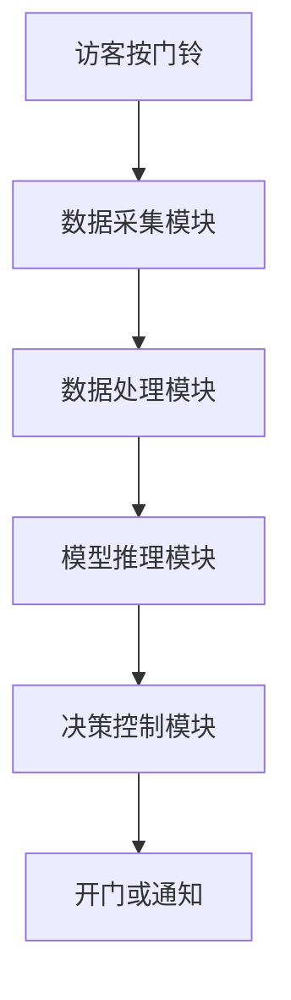

                 


# 智能门铃：AI Agent的访客身份识别

## 关键词：智能门铃，AI Agent，访客识别，身份验证，多模态识别

## 摘要：本文探讨了智能门铃结合AI Agent技术实现访客身份识别的应用。通过分析AI Agent的核心原理、访客识别算法、系统架构设计及项目实战，详细阐述了智能门铃在AI技术驱动下的访客识别流程，包括人脸识别、声纹识别和多模态识别等技术，并结合实际案例，给出了系统实现和优化建议。

---

# 第一部分：智能门铃与AI Agent的背景与基础

## 第1章：智能门铃的发展历程

### 1.1 传统门铃的局限性

#### 1.1.1 传统门铃的功能与不足
传统门铃主要用于接收访客按压按钮的信号，通过声音提醒屋主。然而，这种方式仅限于简单的信号传递，缺乏主动识别和判断能力，无法应对复杂的访客管理需求。

#### 1.1.2 智能化升级的必要性
随着智能家居的发展，访客管理需要更高效、更安全的解决方案。智能门铃通过引入AI技术，能够主动识别访客身份，提供智能化的访客管理服务。

### 1.2 AI Agent的引入

#### 1.2.1 AI Agent的基本概念
AI Agent（人工智能代理）是指能够感知环境、自主决策并执行任务的智能实体。它能够通过传感器或数据源获取信息，利用算法进行分析和推理，做出最优决策。

#### 1.2.2 AI Agent在智能门铃中的应用
AI Agent可以实时监控门铃状态，识别访客身份，并根据预设规则做出响应，如开门、报警或通知屋主。

### 1.3 智能门铃的优势与应用场景

#### 1.3.1 提高安全性
通过AI Agent识别访客身份，能够有效防止未经授权的访问，提升家庭安全。

#### 1.3.2 方便远程监控
智能门铃支持远程访问，用户可以通过手机或其他设备实时查看访客信息，实现远程监控。

#### 1.3.3 节省人力资源
AI Agent能够自动处理访客识别任务，减少人工干预，提高管理效率。

---

## 第2章：访客身份识别的核心问题

### 2.1 访客身份识别的定义

#### 2.1.1 什么是访客身份识别
访客身份识别是通过技术手段验证访客身份的过程，通常包括人脸识别、指纹识别、声纹识别等。

#### 2.1.2 访客身份识别的关键要素
- 数据采集：通过摄像头、麦克风等设备获取访客信息。
- 数据处理：对采集到的数据进行清洗、特征提取和分析。
- 决策判断：基于处理后的数据，判断访客身份是否合法。

### 2.2 访客身份识别的挑战

#### 2.2.1 数据采集的准确性
访客身份识别依赖于高质量的数据，环境光线、角度等因素可能影响识别准确性。

#### 2.2.2 环境干扰的影响
复杂环境可能导致数据噪声增加，影响识别效果。

#### 2.2.3 用户隐私的保护
访客身份识别涉及个人隐私数据，如何确保数据安全和隐私保护是重要挑战。

### 2.3 访客身份识别的解决方案

#### 2.3.1 多模态数据融合
结合人脸、声音等多种生物特征进行识别，提高准确性和可靠性。

#### 2.3.2 AI算法优化
通过深度学习等技术提升识别算法的性能，减少误识别率。

#### 2.3.3 系统架构设计
设计高效的系统架构，确保数据处理和决策的实时性。

---

# 第二部分：AI Agent的核心原理与技术实现

## 第3章：AI Agent的基本原理

### 3.1 AI Agent的定义与特点

#### 3.1.1 AI Agent的核心概念
AI Agent是一个智能实体，能够感知环境、自主决策并执行任务。它通常具有感知能力、推理能力、学习能力和执行能力。

#### 3.1.2 AI Agent的主要特点
- **自主性**：能够在没有外部干预的情况下自主运行。
- **反应性**：能够实时感知环境变化并做出反应。
- **学习能力**：能够通过数据学习和优化自身性能。

### 3.2 AI Agent的工作原理

#### 3.2.1 数据采集与处理
AI Agent通过摄像头、麦克风等设备采集访客信息，将其转化为数字信号。

#### 3.2.2 模型训练与优化
利用深度学习模型（如CNN、RNN）对数据进行训练，优化模型参数以提高识别准确率。

#### 3.2.3 推理与决策
基于训练好的模型，对实时数据进行推理，判断访客身份是否合法，并做出相应决策。

### 3.3 AI Agent在智能门铃中的应用

#### 3.3.1 实时监控与识别
AI Agent实时监控门铃状态，采集访客图像和声音，进行身份识别。

#### 3.3.2 自动化响应与反馈
识别成功后，AI Agent可以控制门锁开启或向屋主发送通知。

#### 3.3.3 数据分析与优化
通过分析历史数据，优化识别算法，提高识别效率和准确性。

---

## 第4章：访客身份识别的算法原理

### 4.1 人脸识别算法

#### 4.1.1 人脸识别的基本流程
1. 数据采集：获取访客图像。
2. 预处理：调整图像亮度、对比度等。
3. 特征提取：提取人脸特征向量。
4. 模型匹配：与预存人脸数据库进行比对，确认身份。

#### 4.1.2 基于深度学习的人脸识别模型
常用的深度学习模型包括：
- **卷积神经网络（CNN）**：用于特征提取。
- **孪生网络（Siamese Network）**：用于计算人脸相似度。

### 4.2 声纹识别算法

#### 4.2.1 声纹识别的基本原理
声纹识别通过分析声音特征（如音调、节奏、频率等）来确认身份。

#### 4.2.2 声纹识别的实现步骤
1. 数据采集：获取访客的声音。
2. 预处理：降噪、分割等。
3. 特征提取：提取声纹特征。
4. 模型匹配：与数据库中的声纹进行比对。

### 4.3 多模态识别算法

#### 4.3.1 多模态识别的优势
结合人脸和声纹等多种特征进行识别，显著提高准确性和可靠性。

#### 4.3.2 多模态识别的实现流程
1. 数据融合：将多种数据源的信息进行融合。
2. 特征提取：提取多模态特征。
3. 综合判断：基于多模态特征做出最终判断。

---

## 第三部分：系统架构设计与项目实战

## 第5章：系统架构设计

### 5.1 问题场景介绍
智能门铃系统需要实时采集访客数据，通过AI Agent进行身份识别，并根据结果做出响应。

### 5.2 系统功能设计

#### 5.2.1 系统模块划分
- 数据采集模块：负责采集访客图像和声音。
- 数据处理模块：对采集的数据进行预处理和特征提取。
- 模型推理模块：基于训练好的模型进行识别。
- 决策控制模块：根据识别结果做出相应决策。

#### 5.2.2 系统功能流程图


### 5.3 系统架构设计

#### 5.3.1 系统架构图


---

## 第6章：项目实战

### 6.1 环境配置

#### 6.1.1 开发环境
- 操作系统：Linux/Windows/MacOS
- 开发工具：PyCharm
- 依赖库：OpenCV、TensorFlow、Keras

#### 6.1.2 数据集准备
- 训练数据集：包含人脸图像和标签。
- 测试数据集：用于模型验证。

### 6.2 核心代码实现

#### 6.2.1 数据预处理代码
```python
import cv2
import numpy as np

def preprocess_image(image_path):
    image = cv2.imread(image_path)
    image = cv2.resize(image, (224, 224))
    image = image / 255.0  # 归一化
    return image
```

#### 6.2.2 模型训练代码
```python
import tensorflow as tf
from tensorflow.keras import layers, Model

def create_model():
    base_model = tf.keras.applications.MobileNetV2(weights='imagenet', include_top=False)
    x = base_model.output
    x = layers.GlobalAveragePooling2D()(x)
    x = layers.Dense(128, activation='relu')(x)
    predictions = layers.Dense(num_classes, activation='softmax')(x)
    model = Model(inputs=base_model.input, outputs=predictions)
    return model
```

---

## 第四部分：高级主题与最佳实践

## 第7章：高级主题

### 7.1 模型优化与调优

#### 7.1.1 模型优化策略
- 调整网络结构：增加或减少层数。
- 调整超参数：学习率、批量大小等。

#### 7.1.2 模型调优工具
- 使用Keras Tuner进行自动调参。

### 7.2 系统安全性

#### 7.2.1 数据安全
确保数据存储和传输的安全性，防止数据泄露。

#### 7.2.2 系统防护
部署防火墙、入侵检测系统等，保护系统免受攻击。

### 7.3 系统维护与升级

#### 7.3.1 日志监控
实时监控系统日志，及时发现和解决问题。

#### 7.3.2 定期更新
定期更新模型和系统软件，保持系统性能和安全性。

---

## 第8章：最佳实践与小结

### 8.1 最佳实践

#### 8.1.1 数据质量
确保训练数据多样化和高质量，避免过拟合。

#### 8.1.2 系统设计
合理设计系统架构，确保系统的可扩展性和可维护性。

#### 8.1.3 安全管理
严格管理用户数据，确保隐私安全。

### 8.2 项目小结

通过本文的详细讲解，我们了解了智能门铃结合AI Agent进行访客身份识别的核心原理和技术实现。从算法原理到系统架构，再到项目实战，我们为读者提供了全面的指导。希望本文能为智能门铃的设计和优化提供有价值的参考。

---

## 作者：AI天才研究院/AI Genius Institute & 禅与计算机程序设计艺术 /Zen And The Art of Computer Programming

