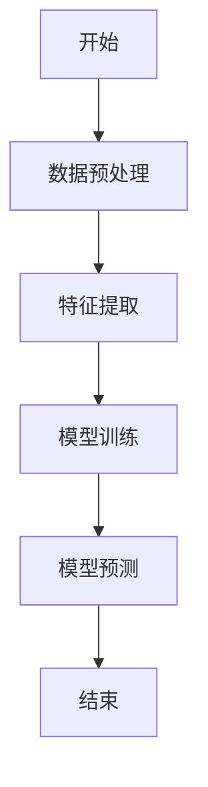
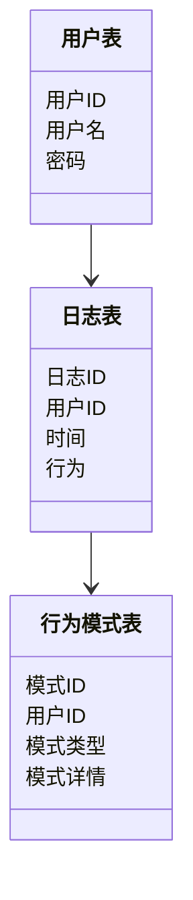
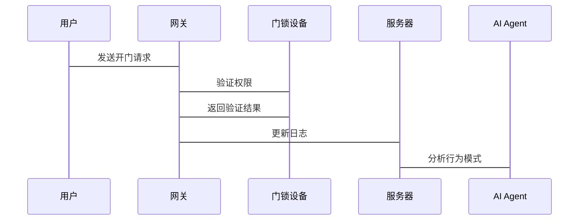

                 


# 智能门锁：AI Agent的家庭成员行为模式分析

## 关键词
智能门锁, AI Agent, 家庭成员行为模式, 数据分析, 算法原理, 系统架构, 项目实战

## 摘要
智能门锁结合AI Agent技术，通过分析家庭成员的行为模式，实现智能化管理。本文从背景介绍、核心概念、算法原理、系统架构到项目实战，全面分析智能门锁与AI Agent的结合，探讨其在家庭安全中的应用。

---

# 第一部分: 背景介绍

## 第1章: 智能门锁与AI Agent概述

### 1.1 问题背景
#### 1.1.1 智能门锁的发展历程
智能门锁经历了机械锁、电子锁到智能锁的演变，逐步融入物联网和AI技术。

#### 1.1.2 AI Agent的概念与特点
AI Agent是能够感知环境并执行任务的智能体，具有自主性、反应性、目标导向性。

#### 1.1.3 家庭成员行为模式分析的必要性
通过分析家庭成员的行为模式，智能门锁可以优化访问控制，提升家庭安全。

### 1.2 问题描述
#### 1.2.1 智能门锁的现状与挑战
传统门锁存在钥匙丢失、管理不便等问题，智能门锁通过物联网技术解决这些问题。

#### 1.2.2 家庭成员行为模式分析的目标
通过分析家庭成员的行为模式，智能门锁可以实现个性化开门权限管理。

#### 1.2.3 问题解决的意义与价值
提升家庭安全性，优化用户体验，降低管理成本。

### 1.3 问题解决
#### 1.3.1 AI Agent在智能门锁中的应用
AI Agent通过分析家庭成员的行为模式，优化访问权限管理。

#### 1.3.2 家庭成员行为模式分析的实现方式
通过传感器数据采集、日志分析和机器学习算法实现行为模式分析。

#### 1.3.3 智能门锁与AI Agent的结合
智能门锁作为硬件设备，AI Agent作为软件核心，共同实现智能化管理。

### 1.4 边界与外延
#### 1.4.1 智能门锁的边界
仅限于门锁的开启和关闭功能，不涉及其他智能家居设备。

#### 1.4.2 AI Agent的边界
仅限于家庭成员行为模式分析，不涉及其他外部数据源。

#### 1.4.3 家庭成员行为模式分析的边界
仅限于分析家庭成员的行为模式，不涉及其他隐私数据。

### 1.5 概念结构与核心要素
#### 1.5.1 智能门锁的核心要素
传感器、通信模块、控制模块。

#### 1.5.2 AI Agent的核心要素
感知环境、决策、执行任务。

#### 1.5.3 家庭成员行为模式分析的核心要素
数据采集、数据分析、行为预测。

---

## 第2章: 家庭成员行为模式分析

### 2.1 行为模式的定义
#### 2.1.1 行为模式的分类
按时段分析、按频率分析、按特征分析。

#### 2.1.2 行为模式的特征
时间规律性、空间位置性、行为习惯性。

#### 2.1.3 行为模式的分析方法
统计分析、机器学习、数据挖掘。

### 2.2 数据采集与处理
#### 2.2.1 数据采集方式
传感器采集、日志记录、用户输入。

#### 2.2.2 数据处理流程
数据清洗、数据转换、数据存储。

#### 2.2.3 数据存储与管理
数据库设计、数据索引、数据备份。

### 2.3 行为模式分析
#### 2.3.1 数据分析方法
聚类分析、分类分析、回归分析。

#### 2.3.2 数据挖掘技术
关联规则挖掘、异常检测、时间序列分析。

#### 2.3.3 行为模式的可视化
数据可视化工具、图表展示、交互式分析。

---

## 第3章: AI Agent的核心原理

### 3.1 AI Agent的基本原理
#### 3.1.1 AI Agent的定义
AI Agent是具有感知环境和自主决策能力的智能体。

#### 3.1.2 AI Agent的工作流程
感知环境、分析信息、制定策略、执行任务。

#### 3.1.3 AI Agent的核心算法
监督学习、无监督学习、强化学习。

### 3.2 AI Agent与智能门锁的结合
#### 3.2.1 AI Agent在智能门锁中的角色
数据处理、决策制定、任务执行。

#### 3.2.2 AI Agent的功能实现
用户识别、权限管理、行为分析。

#### 3.2.3 AI Agent的优化与改进
模型优化、算法改进、用户体验提升。

---

# 第二部分: 核心概念与联系

## 第4章: 核心概念与联系

### 4.1 核心概念原理
#### 4.1.1 智能门锁的核心原理
通过传感器和通信模块实现门锁的远程控制。

#### 4.1.2 AI Agent的核心原理
通过感知环境和学习算法实现智能决策。

#### 4.1.3 家庭成员行为模式分析的核心原理
通过数据采集和机器学习实现行为预测。

### 4.2 核心概念属性特征对比
| 特性       | 智能门锁       | AI Agent       | 家庭成员行为模式分析       |
|------------|---------------|----------------|---------------------------|
| 核心功能    | 开启/关闭门锁   | 感知与决策     | 行为模式分析与预测         |
| 技术基础    | 物联网         | 人工智能       | 数据分析与机器学习         |
| 应用场景    | 家庭安全       | 智能家居       | 家庭行为优化               |

### 4.3 ER实体关系图
```mermaid
er
actor(用户) -|{拥有}| 用户表: 用户ID, 用户名, 密码
用户表 --> 日志表: 记录用户行为
日志表 --> 行为模式表: 分析行为模式
```

---

## 第5章: 算法原理讲解

### 5.1 算法原理
#### 5.1.1 算法选择
基于规则的分类算法。

#### 5.1.2 算法流程
数据预处理、特征提取、模型训练、模型预测。

### 5.2 算法流程图


### 5.3 算法实现
#### 5.3.1 Python代码实现
```python
import pandas as pd
from sklearn.tree import DecisionTreeClassifier
from sklearn.model_selection import train_test_split

# 数据加载
data = pd.read_csv('user_behavior.csv')

# 特征提取
X = data[['时间', '位置', '行为']]
y = data['标签']

# 数据分割
X_train, X_test, y_train, y_test = train_test_split(X, y, test_size=0.2)

# 模型训练
model = DecisionTreeClassifier()
model.fit(X_train, y_train)

# 模型预测
y_pred = model.predict(X_test)
```

#### 5.3.2 算法原理的数学公式
$$ P(y|x) = \frac{P(x|y)P(y)}{P(x)} $$

---

## 第6章: 系统分析与架构设计方案

### 6.1 问题场景介绍
家庭成员行为模式分析的系统设计。

### 6.2 项目介绍
智能门锁与AI Agent结合的系统设计。

### 6.3 系统功能设计


### 6.4 系统架构设计


### 6.5 系统接口设计
HTTP接口：RESTful API设计。

### 6.6 系统交互流程图


---

## 第7章: 项目实战

### 7.1 环境安装
安装Python、Pandas、Scikit-learn。

### 7.2 核心实现
#### 7.2.1 代码实现
```python
import pandas as pd
from sklearn.tree import DecisionTreeClassifier
from sklearn.model_selection import train_test_split

data = pd.read_csv('user_behavior.csv')
X = data[['时间', '位置', '行为']]
y = data['标签']

X_train, X_test, y_train, y_test = train_test_split(X, y, test_size=0.2)

model = DecisionTreeClassifier()
model.fit(X_train, y_train)

y_pred = model.predict(X_test)
```

#### 7.2.2 代码解读
数据预处理、模型训练、模型预测。

### 7.3 应用解读与分析
分析家庭成员行为模式，优化访问权限。

### 7.4 案例分析
基于规则的分类算法实现行为模式分析。

### 7.5 项目小结
项目实现步骤、成果展示、经验总结。

---

## 第8章: 总结与展望

### 8.1 总结
智能门锁与AI Agent的结合，提升了家庭安全的智能化水平。

### 8.2 未来展望
进一步优化算法，拓展应用场景。

## 第9章: 最佳实践

### 9.1 实践技巧
数据预处理、模型优化、系统维护。

### 9.2 注意事项
数据隐私保护、系统稳定性、用户体验优化。

## 第10章: 拓展阅读
推荐相关领域的书籍和论文。

---

作者：AI天才研究院/AI Genius Institute & 禅与计算机程序设计艺术 /Zen And The Art of Computer Programming

