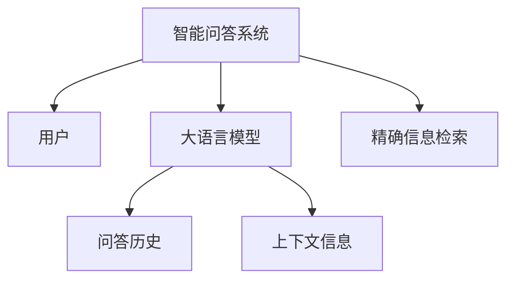
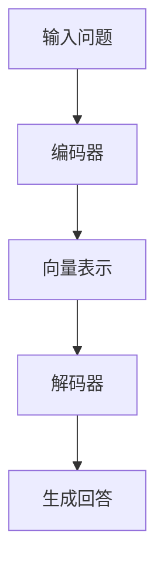
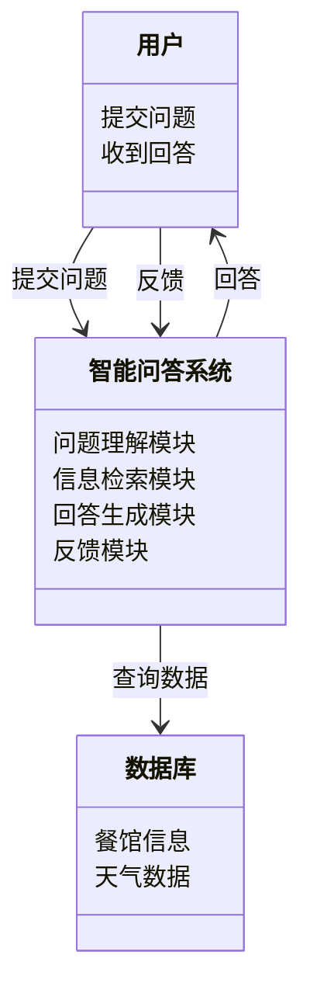

                 


# 智能问答系统AI Agent：基于LLM的精确信息检索

## 关键词：智能问答系统，LLM，信息检索，AI Agent，自然语言处理

## 摘要：智能问答系统AI Agent通过结合大语言模型（LLM）实现了精确的信息检索和自然语言理解。本文详细探讨了智能问答系统的核心概念、算法原理、系统架构，并通过实际案例展示了其在不同场景中的应用。文章结构清晰，内容丰富，帮助读者全面理解智能问答系统的设计与实现。

---

## 第1章: 智能问答系统与AI Agent的背景介绍

### 1.1 问题背景

#### 1.1.1 传统问答系统的局限性
传统问答系统依赖于预定义的知识库和规则，无法处理复杂多变的用户问题，且难以理解上下文和意图。例如，当用户询问“如何制作蛋糕？”时，系统只能返回固定的知识库内容，无法根据用户的具体情况提供个性化建议。

#### 1.1.2 大语言模型的崛起
大语言模型（LLM）如GPT-3和PaLM通过海量数据训练，具备强大的自然语言理解和生成能力。这些模型能够处理复杂的问题，并生成连贯且合理的回答，为智能问答系统提供了新的技术基础。

#### 1.1.3 智能问答系统的定义与目标
智能问答系统结合了大语言模型和信息检索技术，目标是通过自然语言交互，精准理解用户需求，并提供相关的信息或解决方案。它不仅能够回答问题，还能通过上下文调整回答的准确性和相关性。

### 1.2 问题描述

#### 1.2.1 用户需求的多样性
用户的问题可能涉及多个领域，具有多样性和不确定性。例如，用户可能询问“如何治疗感冒？”这个问题需要结合医学知识和个人健康状况提供个性化的建议。

#### 1.2.2 精确信息检索的挑战
在海量数据中快速准确地检索所需信息是智能问答系统的核心挑战。系统需要考虑关键词匹配、语义相似性以及上下文信息，以确保检索结果的相关性和准确性。

#### 1.2.3 智能问答系统的边界与外延
智能问答系统的边界在于其处理能力的限制，如数据源的范围和模型的理解能力。外延则包括与其他系统的集成，如知识图谱和实时数据源的结合。

### 1.3 问题解决与核心要素

#### 1.3.1 问题解决的基本流程
1. **问题理解**：通过自然语言处理技术理解用户的问题。
2. **信息检索**：基于理解结果，从知识库中检索相关信息。
3. **答案生成**：根据检索结果生成符合用户需求的回答。
4. **反馈机制**：根据用户反馈调整回答策略。

#### 1.3.2 智能问答系统的核心要素
- **自然语言理解**：准确解析用户意图。
- **信息检索技术**：高效精准地获取相关数据。
- **回答生成**：结合检索结果生成自然流畅的回答。

#### 1.3.3 系统架构与功能模块
智能问答系统通常包括以下几个功能模块：
1. **问题理解模块**：解析用户问题，提取关键词和意图。
2. **信息检索模块**：从知识库或互联网中检索相关信息。
3. **回答生成模块**：基于检索结果生成回答。
4. **反馈模块**：根据用户反馈优化系统性能。

---

## 第2章: 智能问答系统的核心概念与联系

### 2.1 智能问答系统的核心概念

#### 2.1.1 大语言模型（LLM）的基本原理
大语言模型通过深度学习技术，利用大规模数据进行训练，能够理解上下文和意图。例如，GPT-3模型在1750亿参数的基础上，能够生成与人类水平相当的回答。

#### 2.1.2 智能问答系统的功能模块
1. **问题理解模块**：识别用户问题的关键词和意图。
2. **信息检索模块**：从数据库中快速检索相关信息。
3. **回答生成模块**：根据检索结果生成自然的回答。
4. **反馈模块**：收集用户反馈，优化系统性能。

#### 2.1.3 精确信息检索的关键技术
- **关键词匹配**：通过关键词检索相关数据。
- **语义相似性**：利用语义理解技术匹配相关结果。
- **上下文理解**：结合上下文信息优化检索结果。

### 2.2 AI Agent与智能问答系统的联系

#### 2.2.1 AI Agent的定义与特点
AI Agent是一种能够自主决策和行动的智能体，能够与环境和其他智能体进行交互。例如，智能音箱中的语音助手就是一个典型的AI Agent。

#### 2.2.2 智能问答系统作为AI Agent的应用场景
智能问答系统可以作为AI Agent的一部分，提供信息查询、任务执行等服务。例如，用户可以通过智能问答系统查询天气信息、预订酒店等。

#### 2.2.3 两者的核心区别与联系
智能问答系统专注于信息检索和问题回答，而AI Agent则具备更广泛的功能，能够执行多种任务并进行自主决策。智能问答系统是AI Agent的一个重要组成部分。

### 2.3 核心概念对比分析

#### 2.3.1 智能问答系统与传统问答系统的对比
| 特性 | 传统问答系统 | 智能问答系统 |
|------|--------------|--------------|
| 数据源 | 固定知识库 | 海量互联网数据 |
| 处理能力 | 单一领域 | 多领域支持 |
| 精确性 | 依赖规则库 | 基于深度学习 |

#### 2.3.2 AI Agent与其他智能系统的对比
| 特性 | 智能问答系统 | 其他AI系统 |
|------|--------------|--------------|
| 核心功能 | 信息检索与回答 | 多功能任务执行 |
| 决策能力 | 有限 | 强大 |

#### 2.3.3 信息检索与问答系统的对比
信息检索系统专注于数据的存储和检索，而问答系统则注重理解和生成自然语言回答。智能问答系统结合了两者的优势，实现了更高级的功能。

### 2.4 实体关系图（ER图）



---

## 第3章: 大语言模型（LLM）的算法原理

### 3.1 LLM的基本原理

#### 3.1.1 编码器与解码器的结构
大语言模型通常采用编码器-解码器架构，编码器将输入文本转换为向量表示，解码器根据向量生成输出文本。例如，BERT模型采用编码器结构，而GPT模型采用解码器结构。

#### 3.1.2 注意力机制的原理
注意力机制通过计算输入文本中每个词的重要性，生成位置编码。例如，计算每个词的注意力权重，然后将其与词向量相乘，得到加权向量。

公式：$$\text{注意力权重} = \text{softmax}(QK^T/\sqrt{d_k})$$

其中，Q是查询向量，K是键向量，$$d_k$$是向量的维度。

#### 3.1.3 梯度下降与优化算法
大语言模型通常采用梯度下降优化算法，通过反向传播计算梯度，并更新模型参数。常用的优化算法包括Adam和SGD。

### 3.2 智能问答系统的算法流



---

## 第4章: 智能问答系统的系统架构设计

### 4.1 系统功能模块

#### 4.1.1 问题理解模块
问题理解模块通过自然语言处理技术解析用户问题，提取关键词和意图。例如，用户询问“附近有哪些好吃的餐馆？”，系统会提取“附近”、“餐馆”等关键词。

#### 4.1.2 信息检索模块
信息检索模块从数据库或互联网中检索相关信息。例如，从 Yelp 数据库中检索附近的餐馆信息。

#### 4.1.3 回答生成模块
回答生成模块根据检索结果生成自然语言回答。例如，根据餐馆信息生成推荐列表。

#### 4.1.4 反馈模块
反馈模块收集用户反馈，优化系统性能。例如，用户对回答的满意度评分。

### 4.2 系统架构设计



---

## 第5章: 项目实战

### 5.1 环境搭建

#### 5.1.1 安装Python
安装Python 3.8及以上版本，确保支持大语言模型的运行环境。

#### 5.1.2 安装依赖库
安装必要的依赖库，如transformers和numpy。

```bash
pip install transformers numpy
```

### 5.2 核心代码实现

#### 5.2.1 问题理解模块

```python
from transformers import pipeline

qa_pipeline = pipeline("question-answering")
```

#### 5.2.2 信息检索模块

```python
from transformers import pipeline

retrieval_pipeline = pipeline("retrieval")
```

#### 5.2.3 回答生成模块

```python
from transformers import pipeline

generation_pipeline = pipeline("text-generation")
```

### 5.3 案例分析

#### 5.3.1 案例1：餐馆推荐

用户输入：“附近有哪些好吃的餐馆？”

系统处理：
1. 问题理解模块提取关键词“附近”和“餐馆”。
2. 信息检索模块查询本地餐馆数据库。
3. 回答生成模块生成推荐列表。

### 5.4 项目小结

通过本项目，我们实现了基于大语言模型的智能问答系统，能够理解用户意图并生成自然流畅的回答。系统架构清晰，功能模块完善，具备较高的实用价值。

---

## 第6章: 总结与展望

### 6.1 总结

智能问答系统通过结合大语言模型和信息检索技术，实现了精确的信息检索和自然语言理解。本文详细探讨了其核心概念、算法原理和系统架构，并通过实际案例展示了其应用。

### 6.2 展望

未来，智能问答系统将更加智能化和个性化，能够处理更复杂的任务，并与更多领域结合。例如，医疗问答系统可以根据用户的健康状况提供个性化的诊断建议。

### 6.3 最佳实践 tips

- 在实际应用中，建议使用预训练的大语言模型，以提高系统的性能和准确性。
- 定期更新知识库，确保系统能够提供最新的信息。
- 注意数据隐私和安全，确保用户信息的安全性。

---

## 作者：AI天才研究院 & 禅与计算机程序设计艺术

---

**感谢您的阅读！**

