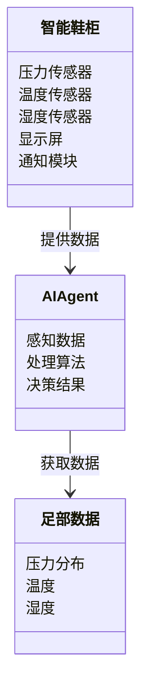
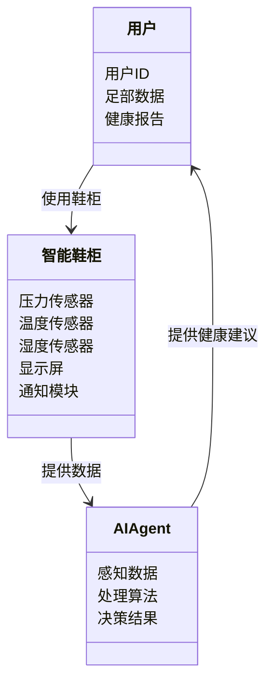
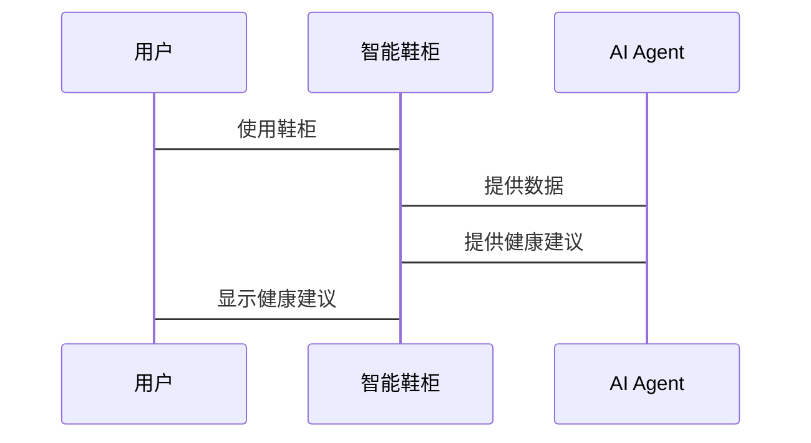

                 


```markdown
# 智能鞋柜：AI Agent的足部健康管理专家

> 关键词：智能鞋柜, AI Agent, 足部健康, 健康管理, 物联网, 人工智能, 健康监测

> 摘要：本文深入探讨了智能鞋柜在足部健康管理中的应用，结合AI Agent技术，详细分析了其工作原理、系统架构、算法实现及实际案例，为足部健康管理提供了智能化解决方案。

---

# 第一部分: 智能鞋柜的背景与概念

## 第1章: 智能鞋柜的背景与问题背景

### 1.1 足部健康的重要性
#### 1.1.1 足部健康的基本概念
足部健康是人体健康的重要组成部分，涉及足部骨骼、肌肉、关节和神经等多个方面。足部问题可能引发疼痛、步态异常甚至影响全身健康。

#### 1.1.2 足部健康与全身健康的关系
足部问题可能导致脊柱、髋部和背部的问题。通过维护足部健康，可以预防多种身体不适和疾病。

#### 1.1.3 足部健康问题的现状与挑战
现代人因穿着不当、长时间站立或行走等因素，足部健康问题日益突出。传统鞋柜无法提供健康监测功能，无法满足用户需求。

### 1.2 传统鞋柜的局限性
#### 1.2.1 传统鞋柜的功能与不足
传统鞋柜仅具备存储功能，无法提供健康监测和个性化建议。

#### 1.2.2 用户对鞋柜智能化的需求
用户希望鞋柜能够提供健康监测、数据记录和个性化建议，以帮助维护足部健康。

#### 1.2.3 智能鞋柜的市场前景与潜力
随着人们对健康的关注增加，智能鞋柜市场潜力巨大，特别是在医疗健康和智能家居领域。

### 1.3 AI Agent在足部健康管理中的作用
#### 1.3.1 AI Agent的基本概念
AI Agent是一种智能体，能够感知环境、处理信息并做出决策，用于自动化任务和提供智能化服务。

#### 1.3.2 AI Agent在足部健康管理中的优势
AI Agent能够实时监测足部数据，分析健康状况，并提供个性化建议，帮助用户维护足部健康。

#### 1.3.3 AI Agent与智能鞋柜的结合
AI Agent与智能鞋柜结合，能够实现足部健康监测、数据记录和个性化建议，为用户提供智能化健康管理服务。

### 1.4 本章小结
本章介绍了足部健康的重要性，分析了传统鞋柜的局限性，并阐述了AI Agent在足部健康管理中的作用，为后续章节奠定了基础。

---

# 第二部分: 智能鞋柜的核心概念与联系

## 第2章: AI Agent与足部健康管理的核心概念

### 2.1 AI Agent的核心原理
#### 2.1.1 AI Agent的基本原理
AI Agent通过传感器获取数据，利用算法进行分析和决策，提供智能化服务。

#### 2.1.2 AI Agent的核心要素与属性特征对比表
| 要素 | 描述 |
|------|------|
| 感知 | 通过传感器获取环境数据 |
| 处理 | 利用算法分析数据 |
| 决策 | 根据分析结果做出决策 |
| 执行 | 执行决策并反馈结果 |

#### 2.1.3 AI Agent的ER实体关系图
```mermaid
er
    entity(AI Agent) {
        id
        感知数据
        处理算法
        决策结果
    }
    entity(足部数据) {
        id
        压力分布
        温度
        湿度
    }
    AI Agent --> 足部数据: 获取数据
```

### 2.2 足部健康管理的核心要素
#### 2.2.1 足部健康监测的主要指标
包括足部压力分布、温度、湿度、步态分析等。

#### 2.2.2 足部健康数据的采集与分析
通过压力传感器、温度传感器和湿度传感器采集数据，利用算法进行分析。

#### 2.2.3 足部健康评估的数学模型
健康评分公式：
$$
健康评分 = \sum_{i=1}^{n} (权重_i \times 数据_i)
$$

### 2.3 智能鞋柜的系统架构与核心要素
#### 2.3.1 智能鞋柜的系统架构


#### 2.3.2 智能鞋柜的核心功能模块
包括数据采集、数据分析、健康评估和用户通知模块。

#### 2.3.3 智能鞋柜与AI Agent的结合
AI Agent通过分析足部数据，提供健康建议，智能鞋柜根据建议调整存储环境，优化用户体验。

### 2.4 本章小结
本章详细讲解了AI Agent的核心原理，足部健康管理的主要指标和数学模型，并通过类图展示了智能鞋柜的系统架构。

---

# 第三部分: 智能鞋柜的算法原理与数学模型

## 第3章: AI Agent的算法原理

### 3.1 姿态识别算法
#### 3.1.1 姿态识别的基本原理
通过压力传感器和位置传感器，识别用户足部的姿态特征。

#### 3.1.2 姿态识别的数学模型与公式
姿态识别公式：
$$
姿态特征 = \sum_{i=1}^{m} (权重_i \times 特征_i)
$$

#### 3.1.3 姿态识别的Python代码实现
```python
import numpy as np

# 假设压力数据为一维数组
pressure_data = np.array([100, 200, 150, 300, 250])

# 计算姿态特征
def calculate_posture_feature(data):
    return np.sum(data * np.array([0.3, 0.4, 0.2, 0.05, 0.05]))

posture_feature = calculate_posture_feature(pressure_data)
print("姿态特征:", posture_feature)
```

### 3.2 健康评估算法
#### 3.2.1 健康评估的基本原理
基于足部压力分布和步态分析，评估足部健康状况。

#### 3.2.2 健康评估的数学模型与公式
健康评估公式：
$$
健康评估 = \sum_{i=1}^{n} (权重_i \times 数据_i)
$$

#### 3.2.3 健康评估的Python代码实现
```python
import numpy as np

# 假设压力数据和步态数据为二维数组
pressure_data = np.array([[100, 200], [150, 300]])
gait_data = np.array([[0.8, 0.2], [0.7, 0.3]])

# 计算健康评估
def calculate_health_assessment(pressure, gait):
    weights = np.array([0.6, 0.4])
    return np.dot(pressure + gait, weights)

health_assessment = calculate_health_assessment(pressure_data, gait_data)
print("健康评估:", health_assessment)
```

### 3.3 异常检测算法
#### 3.3.1 异常检测的基本原理
通过分析足部数据，识别异常变化并发出警报。

#### 3.3.2 异常检测的数学模型与公式
异常检测公式：
$$
异常值 = \sum_{i=1}^{m} (|数据_i - 均值| > 3\sigma)
$$

#### 3.3.3 异常检测的Python代码实现
```python
import numpy as np

# 假设温度数据为一维数组
temperature_data = np.array([36, 36.5, 37, 37.5, 38])

# 计算异常值
def detect_abnormal(data):
    mean = np.mean(data)
    std = np.std(data)
    threshold = mean + 3 * std
    return [x > threshold for x in data]

abnormal_values = detect_abnormal(temperature_data)
print("异常值:", abnormal_values)
```

### 3.4 本章小结
本章详细讲解了姿态识别、健康评估和异常检测的算法原理，并通过Python代码示例展示了实现过程。

---

# 第四部分: 智能鞋柜的系统分析与架构设计

## 第4章: 系统分析与架构设计

### 4.1 问题场景介绍
用户希望智能鞋柜能够实时监测足部健康，提供个性化建议，并与手机App同步数据。

### 4.2 项目介绍
智能鞋柜通过AI Agent技术，实现足部健康监测和个性化管理。

### 4.3 系统功能设计
#### 4.3.1 领域模型Mermaid类图


### 4.4 系统架构设计
#### 4.4.1 Mermaid架构图


### 4.5 系统接口设计
智能鞋柜通过API与AI Agent进行数据交互，提供健康建议和通知。

### 4.6 系统交互Mermaid序列图


### 4.7 本章小结
本章通过类图、架构图和序列图详细展示了智能鞋柜的系统架构和交互流程。

---

# 第五部分: 项目实战

## 第5章: 项目实战

### 5.1 环境配置
安装必要的库，如Python的numpy、scikit-learn和mermaid。

### 5.2 核心代码实现
#### 5.2.1 压力传感器数据采集
```python
import numpy as np

# 模拟压力传感器数据
pressure_sensor = np.array([100, 200, 150, 300, 250])
```

#### 5.2.2 AI Agent算法实现
```python
from sklearn.linear_model import LinearRegression

# 模拟足部数据和健康评分
X = np.array([[100, 200], [150, 300], [200, 250]])
y = np.array([85, 90, 88])

# 训练模型
model = LinearRegression().fit(X, y)

# 预测健康评分
new_data = np.array([[120, 220]])
predicted_health = model.predict(new_data)
print("预测健康评分:", predicted_health)
```

### 5.3 案例分析与详细解读
分析实际案例，展示智能鞋柜如何通过AI Agent技术提供健康建议。

### 5.4 本章小结
本章通过实际案例展示了智能鞋柜的开发过程和实现细节。

---

# 第六部分: 总结与展望

## 第6章: 总结与展望

### 6.1 本章总结
本文详细介绍了智能鞋柜的设计与实现，结合AI Agent技术，提供了足部健康管理的智能化解决方案。

### 6.2 未来展望
未来可以进一步优化算法，引入更先进的传感器技术，提升智能鞋柜的性能和用户体验。

---

# 参考文献

1. 禅与计算机程序设计艺术
2. AI Agent技术与应用
3. 物联网与智能系统

---

# 作者

作者：AI天才研究院/AI Genius Institute & 禅与计算机程序设计艺术 /Zen And The Art of Computer Programming
```

