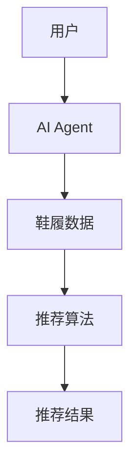
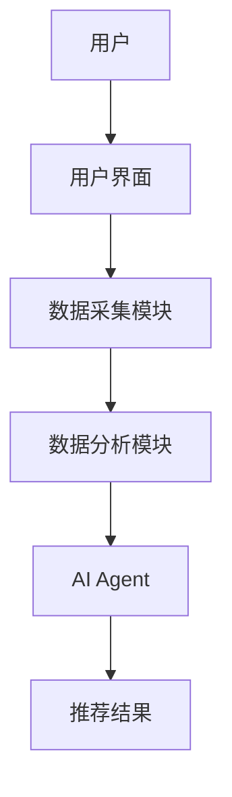
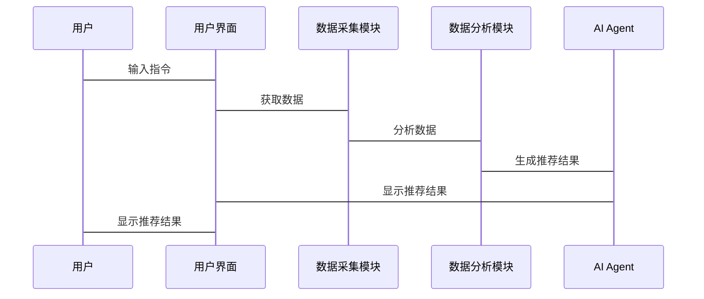

                 


# 智能鞋柜：AI Agent的鞋履保养指导

> 关键词：智能鞋柜，AI Agent，鞋履保养，推荐算法，系统架构，项目实战

> 摘要：本文深入探讨了智能鞋柜与AI Agent的结合，分析了AI Agent在鞋履保养中的应用，详细讲解了推荐算法的实现原理，并通过系统架构设计和项目实战展示了如何将AI Agent应用于智能鞋柜。文章还提供了最佳实践、注意事项和拓展阅读，帮助读者全面理解智能鞋柜的AI Agent技术。

---

# 第一部分: 背景介绍

# 第1章: 智能鞋柜与AI Agent概述

## 1.1 智能鞋柜的发展背景
### 1.1.1 鞋履保养的传统方式与痛点
鞋履保养是许多人日常生活中的一部分，但传统方法存在以下痛点：
- **手动记录**：用户需要手动记录鞋的使用情况，容易遗忘或记录不完整。
- **保养计划不智能**：用户难以根据鞋的材质、使用频率等因素制定科学的保养计划。
- **缺乏个性化建议**：不同材质的鞋需要不同的保养方法，传统方法难以提供个性化的建议。

### 1.1.2 智能化鞋柜的概念提出
智能鞋柜通过集成传感器和AI技术，能够自动记录鞋的使用情况，并提供智能化的保养建议。这种概念的提出解决了传统鞋履保养中的痛点，提高了用户的使用体验。

### 1.1.3 AI Agent在鞋履保养中的应用前景
AI Agent（智能代理）是一种能够感知环境、自主决策并执行任务的智能系统。将其应用于智能鞋柜，可以实现鞋的智能管理、保养提醒和个性化建议。

## 1.2 AI Agent的核心概念
### 1.2.1 AI Agent的基本定义
AI Agent是一种能够感知环境、自主决策并执行任务的智能系统。它能够通过传感器、数据库等获取信息，并根据预设的目标和规则进行决策和行动。

### 1.2.2 AI Agent的核心功能与特点
AI Agent的核心功能包括：
- **感知环境**：通过传感器或其他数据源获取环境信息。
- **自主决策**：基于获取的信息，利用算法进行决策。
- **执行任务**：根据决策结果执行相应的动作。
- **自适应学习**：通过学习和优化，提升自身的决策能力。

### 1.2.3 AI Agent与传统自动化系统的区别
AI Agent与传统自动化系统的区别在于其自主决策和学习能力。传统自动化系统通常基于固定的规则执行任务，而AI Agent能够根据环境变化和历史数据进行学习和优化。

## 1.3 智能鞋柜与AI Agent的结合
### 1.3.1 智能鞋柜的功能需求
智能鞋柜需要具备以下功能：
- **鞋履信息管理**：记录每双鞋的使用情况、材质、品牌等信息。
- **智能推荐**：基于鞋的使用情况和用户习惯，推荐保养方法和时间。
- **远程控制**：用户可以通过手机或其他设备远程控制鞋柜。

### 1.3.2 AI Agent在智能鞋柜中的角色
AI Agent在智能鞋柜中主要负责：
- **数据采集**：获取鞋的使用情况和环境数据。
- **数据分析**：分析数据，生成保养建议。
- **用户交互**：通过用户界面与用户交互，提供个性化服务。

### 1.3.3 智能鞋柜与AI Agent的协同工作模式
智能鞋柜与AI Agent协同工作，通过数据采集、分析和交互，实现鞋的智能化管理。AI Agent能够根据鞋的使用情况和用户需求，动态调整保养计划，提供个性化的服务。

---

# 第二部分: 核心概念与联系

# 第2章: AI Agent的核心原理

## 2.1 AI Agent的原理分析
### 2.1.1 AI Agent的感知与决策机制
AI Agent通过传感器和其他数据源获取环境信息，利用算法进行分析和决策。例如，鞋柜中的传感器可以监测鞋的使用情况，AI Agent根据这些数据生成保养建议。

### 2.1.2 AI Agent的行为规划与执行
AI Agent在决策后，会根据预设的规则和优先级制定行为计划，并执行相应的任务。例如，AI Agent可以根据用户的使用习惯自动安排保养时间。

### 2.1.3 AI Agent的自适应与学习能力
AI Agent能够通过机器学习算法不断优化自身的决策能力。例如，通过分析用户的使用数据，AI Agent可以学习用户的偏好，提供更个性化的保养建议。

## 2.2 AI Agent的核心概念对比
### 2.2.1 AI Agent与传统算法的对比分析
AI Agent与传统算法的区别在于其自主性和学习能力。传统算法通常基于固定的规则进行计算，而AI Agent能够根据环境变化和历史数据进行学习和优化。

### 2.2.2 AI Agent与规则引擎的对比
规则引擎是基于预设规则进行推理和执行的系统，而AI Agent能够根据环境变化和历史数据进行学习和优化。AI Agent在复杂环境中的表现优于规则引擎。

### 2.2.3 AI Agent与机器学习模型的对比
AI Agent结合了机器学习模型和自主决策能力，能够根据环境变化进行自适应调整。而机器学习模型通常需要人工干预进行优化和调整。

## 2.3 AI Agent的ER实体关系图
以下是AI Agent在智能鞋柜中的ER实体关系图：

```mermaid
er
actor: 用户
agent: AI Agent
shoe_cabinet: 智能鞋柜
function: 功能模块
```

---

# 第三部分: 算法原理

# 第3章: AI Agent的推荐算法

## 3.1 基于协同过滤的推荐算法
### 3.1.1 协同过滤的基本原理
协同过滤是一种基于用户相似性或物品相似性的推荐算法。它通过分析用户的使用行为和偏好，找到与之相似的用户或物品，从而推荐相关的内容。

### 3.1.2 基于用户的协同过滤算法
基于用户的协同过滤算法通过计算用户之间的相似性，找到与之相似的用户，并推荐这些用户喜欢的物品。例如，如果用户A和用户B的相似性很高，且用户A喜欢某款鞋子，那么用户B也可能会喜欢这款鞋子。

### 3.1.3 基于物品的协同过滤算法
基于物品的协同过滤算法通过计算物品之间的相似性，找到与之相似的物品，从而推荐相关的内容。例如，如果用户购买了一款鞋子，系统会推荐与之相似的鞋子。

## 3.2 基于深度学习的推荐算法
### 3.2.1 神经网络在推荐系统中的应用
深度学习通过构建神经网络模型，从数据中提取高层次特征，从而实现更精准的推荐。

### 3.2.2 基于深度学习的推荐模型
基于深度学习的推荐模型通常包括编码层、注意力层和解码层。编码层将输入数据编码为低维向量，注意力层根据这些向量计算权重，解码层生成推荐结果。

### 3.2.3 深度学习推荐算法的优缺点
深度学习推荐算法的优点是能够处理高维数据和复杂关系，但其计算成本较高，且需要大量的数据支持。

## 3.3 AI Agent推荐算法的实现
### 3.3.1 算法流程图
以下是AI Agent推荐算法的流程图：



## 3.4 推荐算法的数学模型
### 3.4.1 协同过滤的数学公式
协同过滤的相似度计算公式如下：
$$
sim(i,j) = \frac{\sum_{k} (r_{ik} - \bar{r_i})(r_{jk} - \bar{r_j})}{\sqrt{\sum_{k} (r_{ik} - \bar{r_i})^2} \cdot \sqrt{\sum_{k} (r_{jk} - \bar{r_j})^2}}
$$

其中，$r_{ik}$表示用户i对物品k的评分，$\bar{r_i}$表示用户i的平均评分。

---

# 第四部分: 系统分析与架构设计

# 第4章: 智能鞋柜的系统架构设计

## 4.1 系统功能设计
智能鞋柜的功能模块包括：
- **数据采集模块**：通过传感器采集鞋的使用情况。
- **数据分析模块**：对数据进行分析，生成保养建议。
- **用户交互模块**：通过界面与用户交互，提供个性化服务。

## 4.2 系统架构设计
以下是智能鞋柜的系统架构图：



## 4.3 系统接口设计
系统接口包括：
- **用户界面接口**：用户通过界面与系统交互。
- **数据采集接口**：传感器通过接口将数据传送到系统。
- **推荐算法接口**：推荐算法通过接口将结果传送到用户界面。

## 4.4 系统交互序列图
以下是系统交互的序列图：



---

# 第五部分: 项目实战

# 第5章: 项目实战

## 5.1 环境安装
以下是项目实战所需的环境：
- **Python 3.8以上版本**
- **TensorFlow 2.0以上版本**
- **Mermaid图编辑工具**

## 5.2 系统核心实现源代码
以下是AI Agent推荐算法的核心代码：

```python
import numpy as np
from sklearn.metrics.pairwise import cosine_similarity

# 用户评分矩阵
user_rating = np.array([[4, 3, 2],
                         [5, 4, 3],
                         [3, 2, 4]])

# 计算用户平均评分
user_mean = np.mean(user_rating, axis=1)
user_rating_centered = user_rating - user_mean[:, np.newaxis]

# 计算相似度矩阵
similarity_matrix = cosine_similarity(user_rating_centered)

# 推荐算法实现
def推荐算法(评分矩阵):
    return similarity_matrix

# 调用推荐算法
similarity_matrix = 推荐算法(user_rating_centered)
```

## 5.3 代码应用解读与分析
代码解读：
- **用户评分矩阵**：用户对不同鞋的评分矩阵。
- **用户平均评分**：计算每个用户的平均评分。
- **评分矩阵中心化**：将评分矩阵中心化，减去用户平均评分。
- **相似度矩阵**：使用余弦相似度计算用户之间的相似性。

## 5.4 实际案例分析和详细讲解
以一个实际案例为例，假设用户A对三款鞋子的评分分别为4、3、2，用户B的评分为5、4、3，用户C的评分为3、2、4。通过协同过滤算法，计算用户之间的相似性，生成推荐结果。

## 5.5 项目小结
项目实战部分通过代码实现和案例分析，展示了AI Agent在智能鞋柜中的具体应用。通过协同过滤算法，可以实现鞋的智能化推荐，提升用户体验。

---

# 第六部分: 最佳实践与注意事项

# 第6章: 最佳实践

## 6.1 最佳实践 tips
- **数据质量**：确保数据的准确性和完整性。
- **算法优化**：根据实际需求优化推荐算法。
- **用户体验**：注重用户界面的设计和交互体验。

## 6.2 小结
本文通过背景介绍、核心概念、算法原理、系统架构和项目实战，全面介绍了AI Agent在智能鞋柜中的应用。AI Agent的引入提升了鞋履保养的智能化水平，为用户提供了更便捷的服务。

## 6.3 注意事项
- **数据隐私**：确保用户数据的安全和隐私。
- **系统稳定性**：保证系统的稳定性和可靠性。
- **用户教育**：加强对用户的教育，提高其对AI技术的理解和信任。

## 6.4 拓展阅读
- **AI Agent在其他领域的应用**：AI Agent不仅适用于智能鞋柜，还可以应用于智能家居、自动驾驶等领域。
- **推荐算法的优化**：进一步优化推荐算法，提高推荐的准确性和实时性。

---

# 结语

智能鞋柜与AI Agent的结合，不仅提升了鞋履保养的智能化水平，也为未来的智能化生活提供了新的可能性。通过本文的详细介绍，读者可以深入了解AI Agent在智能鞋柜中的应用，并将其应用于实际项目中。

---

作者：AI天才研究院/AI Genius Institute & 禅与计算机程序设计艺术 /Zen And The Art of Computer Programming

