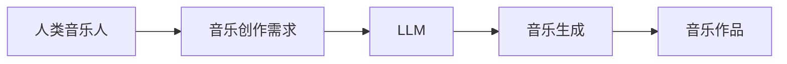
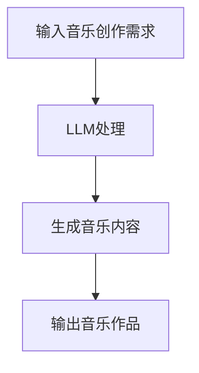
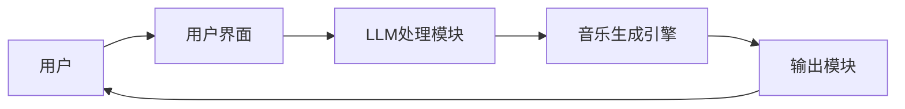

                 


# 智能音乐创作 AI Agent：LLM 在艺术创作中的应用

> 关键词：大语言模型、智能音乐创作、LLM 应用、音乐生成、AI 创作

> 摘要：本文探讨了人工智能，特别是大语言模型（LLM）在音乐创作中的应用。通过分析智能音乐创作的背景、核心概念、算法原理、系统架构以及实际案例，文章揭示了LLM在音乐生成中的潜力和挑战。文章还详细讲解了系统设计与实现，并通过具体项目展示了智能音乐创作的实际应用。最后，文章总结了最佳实践、注意事项和未来趋势，为读者提供了全面的视角。

---

## 第一部分: 智能音乐创作的背景与概念

### 第1章: 智能音乐创作的背景介绍

#### 1.1 人工智能与艺术创作的结合

- **人工智能技术的发展与艺术创作的结合**  
  随着深度学习技术的迅速发展，人工智能（AI）已经在多个领域展现了强大的能力，尤其是在艺术创作方面。音乐作为人类文化的重要组成部分，一直是技术进步的试验田。AI在音乐生成、作曲和编曲方面的应用，正在改变传统的音乐创作方式。

- **智能音乐创作的定义与范围**  
  智能音乐创作是指利用AI技术，特别是大语言模型（LLM），来辅助或完全自动化音乐创作的过程。这种创作可以涵盖歌词创作、旋律生成、编曲设计等多个方面。

- **智能音乐创作的核心问题与挑战**  
  尽管AI在音乐生成方面表现出巨大潜力，但仍然面临诸多挑战，包括如何理解人类情感、保持音乐的原创性和艺术性，以及如何解决创作过程中的版权问题。

#### 1.2 大语言模型（LLM）的基本概念

- **大语言模型的定义与特点**  
  大语言模型（LLM）是一种基于深度学习的自然语言处理模型，具有大规模的参数量和强大的上下文理解能力。其核心在于通过大量的数据训练，模型能够理解和生成人类语言。

- **LLM在艺术创作中的优势**  
  LLM在音乐创作中的优势主要体现在其强大的生成能力和灵活性。它可以快速生成大量音乐内容，并根据用户需求进行调整。

- **LLM与音乐创作的结合方式**  
  LLM通常通过文本生成来辅助音乐创作，例如生成歌词、创作音乐结构或提供旋律建议。结合其他AI技术（如生成对抗网络，GAN），还可以实现更复杂的音乐生成任务。

### 第2章: 智能音乐创作的核心概念与联系

#### 2.1 核心概念原理

- **LLM的音乐生成原理**  
  LLM通过接收音乐创作的文本描述（例如“创作一首悲伤的流行歌曲”），生成相应的歌词和旋律建议。模型的训练数据包括了大量的音乐作品和歌词，使其能够理解音乐的结构和风格。

- **音乐创作的流程与模型**  
  智能音乐创作的流程通常包括需求分析、内容生成和结果优化三个阶段。模型需要在每个阶段中发挥作用，确保生成的内容符合用户的需求。

- **智能音乐创作的创新点**  
  智能音乐创作的创新点在于其能够快速生成多样化的音乐内容，并通过与人类音乐人的协作，探索新的音乐风格和表现形式。

#### 2.2 核心概念属性特征对比表

| 特性 | 传统音乐创作 | 智能音乐创作 |
|------|--------------|--------------|
| 创作主体 | 人类音乐人 | LLM驱动的AI代理 |
| 创作工具 | 乐器、软件 | 大语言模型、AI算法 |
| 创作过程 | 线性 | 并行、迭代 |
| 创作结果 | 人类风格 | 多样化风格 |

#### 2.3 实体关系图



### 第3章: 智能音乐创作的算法原理

#### 3.1 大语言模型的音乐生成流程



#### 3.2 算法实现代码示例

```python
def generate_music(creation_request):
    model = load_pretrained_LLM()  # 加载预训练的大语言模型
    music_content = model.process_request(creation_request)  # 处理创作请求
    return music_content  # 返回生成的音乐内容
```

#### 3.3 数学模型与公式

- **概率生成模型**  
  $$ P(x|y) = \text{模型预测概率} $$
  其中，$x$ 表示生成的音乐内容，$y$ 表示输入的创作需求。

- **生成对抗网络（GAN）模型**  
  $$ G(x) = \text{生成音乐} $$
  $$ D(x) = \text{判别概率} $$
  其中，$G$ 是生成器，$D$ 是判别器。

## 第4章: 智能音乐创作的系统分析与架构设计

### 4.1 系统功能设计

- **系统架构设计**  
  系统包括用户交互界面、LLM处理模块、音乐生成引擎和输出模块。用户通过界面提交创作需求，系统生成音乐内容并返回结果。

- **系统架构图**



### 4.2 接口设计

- **输入接口**  
  接收用户的创作需求，例如JSON格式的参数。

- **输出接口**  
  返回生成的音乐内容，包括 MIDI 文件或音频文件。

### 4.3 交互流程

- **用户提交创作需求**
- **系统处理请求并生成音乐内容**
- **用户接收生成结果并进行反馈**

## 第5章: 项目实战

### 5.1 环境安装

- **安装Python和必要的库**  
  安装PyTorch、Hugging Face Transformers等库。

### 5.2 核心实现

- **加载预训练模型**  
  使用Hugging Face提供的音乐生成模型，如GPT-2或BERT。

### 5.3 案例分析

- **案例：创作一首流行歌曲**  
  用户输入“创作一首流行歌曲，主题是爱情”，系统生成歌词和旋律建议。

### 5.4 结果分析

- **生成结果评估**  
  评估生成音乐的质量、创新性和符合度。

## 第6章: 最佳实践与小结

### 6.1 总结

- **成果与经验**  
  总结智能音乐创作的成果和经验，强调技术与艺术的结合。

### 6.2 注意事项

- **版权问题**  
  提醒读者注意生成内容的版权问题。

### 6.3 未来趋势

- **AI与音乐的深度融合**  
  展望AI在音乐创作中的未来发展方向。

---

## 作者：AI天才研究院 & 禅与计算机程序设计艺术

---

**注意事项**：  
本文内容基于学术研究和理论探讨，实际应用需结合具体场景和法律规范。

