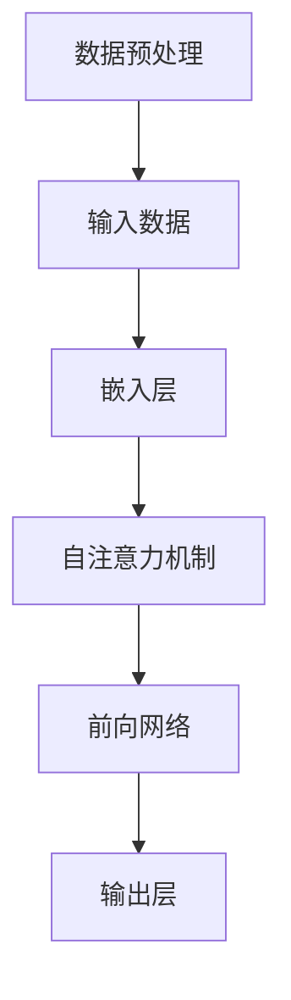
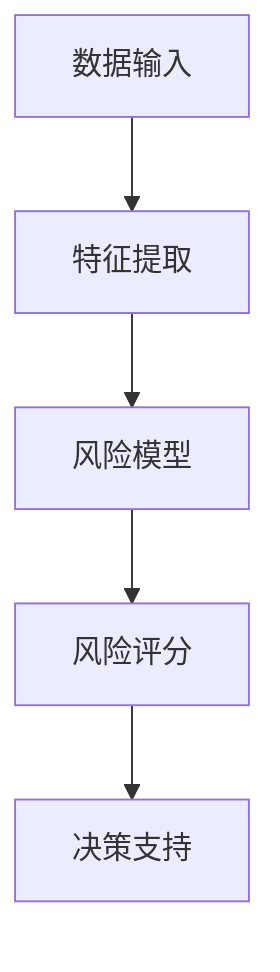
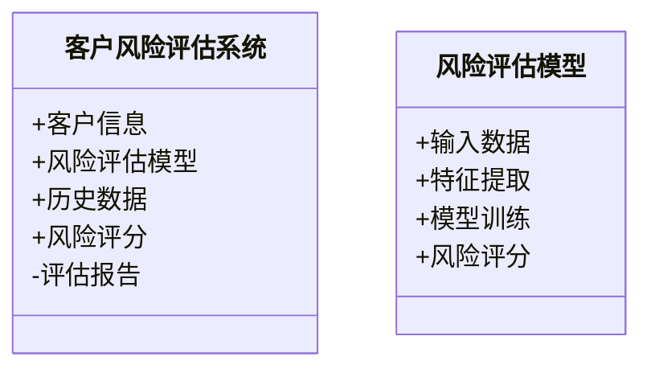
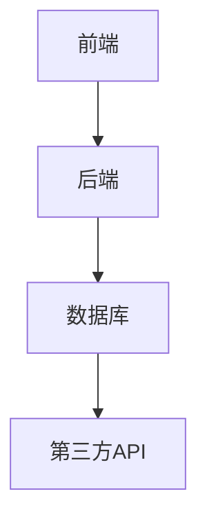
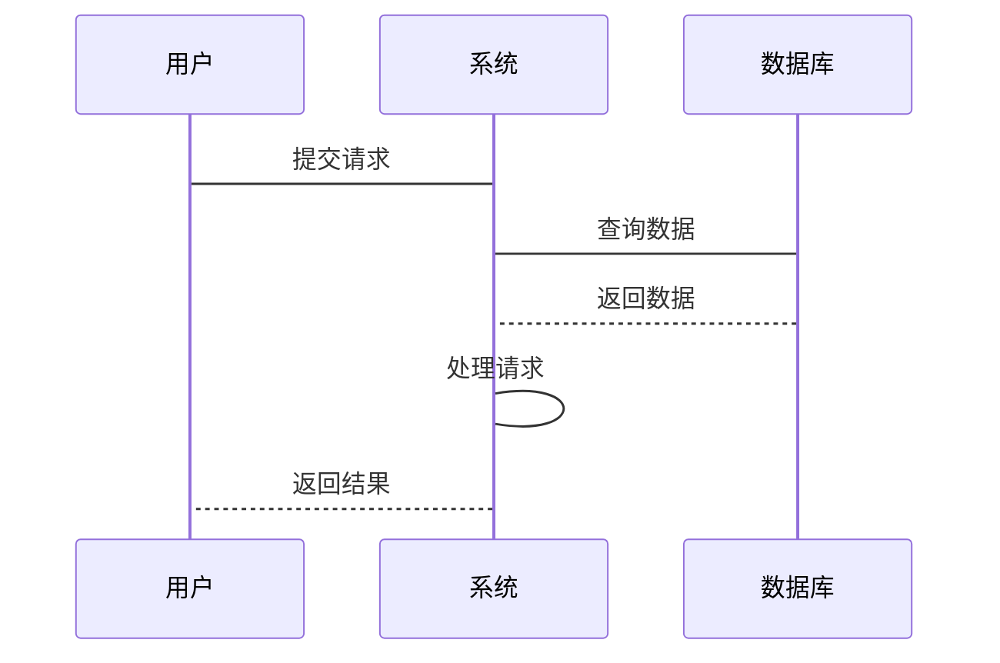

                 


# 智能风险评估 AI Agent：LLM 在保险行业中的应用

## 关键词：智能风险评估、AI Agent、LLM、保险行业、大数据分析、风险管理

## 摘要：本文深入探讨了智能风险评估AI Agent在保险行业中的应用，重点分析了大语言模型（LLM）如何通过自然语言处理技术提升风险评估的效率和准确性。文章从背景、原理、系统设计到实际应用，全面解析了LLM在保险行业的潜力与挑战，为读者提供了从理论到实践的详细指导。

---

## 第一部分：背景介绍

### 第1章：智能风险评估与AI Agent的背景介绍

#### 1.1 智能风险评估的定义与特点

##### 1.1.1 风险评估的基本概念
风险评估是通过分析潜在事件可能带来的损失，评估其对目标的影响程度，并制定相应的风险管理策略。传统风险评估依赖人工分析，效率低且易受主观因素影响。

##### 1.1.2 智能风险评估的核心要素
智能风险评估利用AI技术，结合大数据分析，通过自动化处理提高评估效率和准确性。其核心要素包括数据采集、模型训练、风险评分和决策支持。

##### 1.1.3 AI Agent在风险评估中的作用
AI Agent作为智能风险评估的核心工具，能够实时分析数据、预测风险，并提供个性化建议，帮助保险公司优化风险管理策略。

#### 1.2 大语言模型（LLM）的基本概念

##### 1.2.1 LLM的定义与技术基础
大语言模型（LLM）是基于深度学习的自然语言处理模型，能够理解和生成人类语言。其技术基础包括Transformer架构和大规模数据训练。

##### 1.2.2 LLM在保险行业的应用潜力
LLM在保险行业的应用潜力巨大，尤其是在风险评估、客户服务和欺诈检测等领域，能够显著提高效率和准确性。

##### 1.2.3 智能风险评估的创新模式
智能风险评估通过整合LLM和AI Agent，形成了全新的创新模式，将风险管理从传统的被动防御转变为智能主动管理。

---

### 第2章：LLM在保险行业中的应用背景

#### 2.1 保险行业的风险评估现状

##### 2.1.1 传统风险评估方法的局限性
传统风险评估方法依赖人工分析，存在效率低、成本高、主观性强等问题，难以应对复杂多变的市场环境。

##### 2.1.2 数据驱动的风险评估需求
随着大数据技术的发展，保险公司需要通过数据驱动的方法进行风险评估，以提高决策的科学性和准确性。

##### 2.1.3 AI技术在保险行业的应用趋势
AI技术在保险行业的应用趋势日益明显，尤其是在风险评估、客户画像和欺诈检测等领域，展现了巨大的潜力。

#### 2.2 智能风险评估的必要性

##### 2.2.1 提高风险评估效率的需求
智能风险评估能够快速处理大量数据，显著提高风险评估的效率，帮助保险公司及时应对潜在风险。

##### 2.2.2 个性化风险评估的市场需求
个性化风险评估能够满足客户的差异化需求，提升客户满意度和忠诚度，同时帮助保险公司优化业务结构。

##### 2.2.3 数字化转型对保险行业的影响
数字化转型推动了保险行业的全面变革，智能风险评估作为数字化转型的重要组成部分，正在改变传统的风险管理方式。

---

## 第二部分：智能风险评估的核心概念与联系

### 第3章：智能风险评估的核心原理

#### 3.1 AI Agent的基本原理

##### 3.1.1 AI Agent的定义与分类
AI Agent是一种能够感知环境、自主决策并执行任务的智能体，根据智能水平可分为简单反应式、基于模型的反射式和完全自主式等类型。

##### 3.1.2 基于LLM的AI Agent架构
基于LLM的AI Agent架构结合了自然语言处理和机器学习技术，能够理解复杂语言指令并执行相应的操作。

##### 3.1.3 AI Agent在风险评估中的任务分解
AI Agent在风险评估中的任务包括数据采集、风险分析、预测评估和决策支持，通过任务分解提高评估的准确性和效率。

#### 3.2 智能风险评估的数学模型

##### 3.2.1 风险评估的数学模型
风险评估的数学模型通常包括概率模型、回归分析和贝叶斯网络等方法，用于量化风险的影响和概率。

##### 3.2.2 LLM在风险评估中的应用
LLM通过自然语言处理技术，能够从大量非结构化数据中提取有用信息，结合数学模型进行风险评估。

##### 3.2.3 AI Agent与数学模型的结合
AI Agent通过调用数学模型，能够实时分析数据并生成风险评估报告，帮助保险公司制定有效的风险管理策略。

---

### 第4章：智能风险评估的核心要素

#### 4.1 核心概念与联系

##### 4.1.1 核心概念对比表格
| 概念 | 定义 | 特征 |
|------|------|------|
| AI Agent | 智能体 | 自主性、反应性、目标导向 |
| LLM | 大语言模型 | 深度学习、自然语言处理、大规模数据 |

##### 4.1.2 ER实体关系图
```mermaid
erDiagram
    actor 顾客
    actor 保险公司
    actor 风险评估系统
    risk_assessment_info <---| risk_factors
    risk_assessment_info <---| historical_data
    risk_assessment_system <-----> risk_factors
    risk_assessment_system <-----> historical_data
```

---

## 第三部分：算法原理

### 第4章：算法原理

#### 4.1 算法流程

##### 4.1.1 LLM的训练流程


##### 4.1.2 智能风险评估算法


##### 4.1.3 Python代码示例
```python
import torch
import torch.nn as nn

class RiskAssessmentModel(nn.Module):
    def __init__(self, input_dim, hidden_dim, output_dim):
        super(RiskAssessmentModel, self).__init__()
        self.fc1 = nn.Linear(input_dim, hidden_dim)
        self.fc2 = nn.Linear(hidden_dim, output_dim)
        self.relu = nn.ReLU()

    def forward(self, x):
        out = self.fc1(x)
        out = self.relu(out)
        out = self.fc2(out)
        return out

# 示例输入
input_dim = 10
hidden_dim = 20
output_dim = 1

model = RiskAssessmentModel(input_dim, hidden_dim, output_dim)
input_data = torch.randn(1, input_dim)
output = model(input_data)
print(output)
```

##### 4.1.4 数学模型和公式
$$
\text{风险评分} = \sum_{i=1}^{n} w_i x_i + b
$$
其中，$w_i$ 是权重，$x_i$ 是特征，$b$ 是偏置项。

---

## 第四部分：系统分析与架构设计

### 第5章：系统分析与架构设计

#### 5.1 保险行业的应用场景

##### 5.1.1 客户风险评估系统
客户风险评估系统通过分析客户的信用记录、消费习惯和历史数据，评估其风险等级，帮助保险公司制定个性化的保险产品。

##### 5.1.2 保险产品定价系统
保险产品定价系统通过分析市场数据和风险评估结果，优化产品定价策略，提高公司的盈利能力。

##### 5.1.3 风险预警系统
风险预警系统实时监控市场动态和客户行为，及时发现潜在风险并发出预警，帮助保险公司采取应对措施。

#### 5.2 系统功能设计

##### 5.2.1 领域模型


##### 5.2.2 系统架构


##### 5.2.3 接口设计
接口设计包括数据接口、模型调用接口和报告生成接口，确保系统的高效运行和数据的安全传输。

##### 5.2.4 交互流程


---

## 第五部分：项目实战

### 第6章：项目实战

#### 6.1 环境搭建

##### 6.1.1 安装Python和相关库
安装Python 3.8及以上版本，安装PyTorch、Transformers和Scikit-learn等库。

#### 6.2 系统核心实现

##### 6.2.1 数据预处理
```python
import pandas as pd
data = pd.read_csv('insurance_data.csv')
data = data.dropna()
```

##### 6.2.2 模型训练
```python
import torch
model = RiskAssessmentModel(input_dim, hidden_dim, output_dim)
criterion = nn.MSELoss()
optimizer = torch.optim.Adam(model.parameters(), lr=0.001)
```

##### 6.2.3 模型预测
```python
with torch.no_grad():
    output = model(input_data)
    predicted = output.round()
```

##### 6.2.4 结果分析
分析模型的预测结果，计算准确率、召回率和F1分数，优化模型参数。

#### 6.3 实际案例分析

##### 6.3.1 案例背景
分析一家保险公司客户的风险评估数据，利用智能风险评估系统进行预测。

##### 6.3.2 数据分析
使用Python代码进行数据清洗、特征工程和模型训练，生成风险评分报告。

##### 6.3.3 案例结果
展示模型的预测结果和实际数据对比，分析模型的准确性和实用性。

---

## 第六部分：总结与展望

### 第7章：总结与展望

#### 7.1 最佳实践

##### 7.1.1 系统设计建议
建议在设计智能风险评估系统时，注重数据隐私保护和模型的可解释性，确保系统的安全性和可靠性。

##### 7.1.2 代码实现注意事项
在代码实现时，要注意数据类型的转换、模型的训练和推理过程，确保代码的可读性和可维护性。

##### 7.1.3 项目部署建议
在项目部署时，建议使用云平台和容器化技术，确保系统的高可用性和扩展性。

#### 7.2 小结

智能风险评估AI Agent的应用为保险行业带来了革命性的变化，通过LLM技术的引入，显著提高了风险评估的效率和准确性，为保险公司提供了强有力的支持。

#### 7.3 展望

未来，智能风险评估AI Agent在保险行业中的应用将更加广泛和深入，随着技术的进步，模型的准确性和可解释性将不断提高，为保险行业的数字化转型和创新发展注入新的活力。

---

## 作者：AI天才研究院/AI Genius Institute & 禅与计算机程序设计艺术/Zen And The Art of Computer Programming

